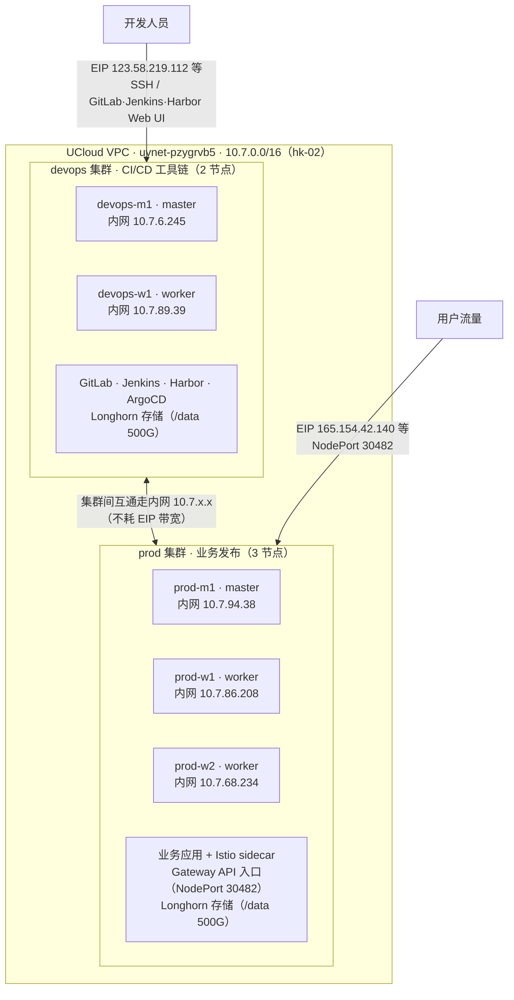
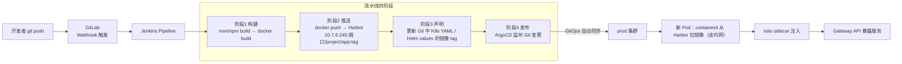

# UCloud 香港 K8s 双集群架构规划

> 生成日期：2026-09-24
> 状态：基础设施已部署完成（kubeadm 集群 ×2、Gateway API + Istio 已上线并验证）
> 目录：`/mnt/d/wsl/DevOps/Jenkins+GitLab/`

---

## 1. 总体架构

在 UCloud 香港（hk-02 可用区）同一 VPC 内构建两套相互独立、内网互通的 Kubernetes 集群：

- **devops 集群**（工具集群）：承载 CI/CD 全套工具链 —— GitLab（代码仓库）、Jenkins（构建）、Harbor（镜像仓库）、ArgoCD（GitOps 发布）
- **prod 集群**（发布集群）：承载业务应用，通过 Gateway API + Istio 对外提供服务



**网络原则：**
- 所有集群间通信（GitLab→Jenkins、Jenkins→Harbor、Harbor→prod 拉镜像、Jenkins/ArgoCD→prod API）全部走 **10.7.x.x 内网**，不消耗 EIP 带宽
- EIP 仅用于：开发人员 SSH/访问 GitLab-Jenkins-Harbor Web 界面（devops 集群）、业务对外服务（prod 集群）
- UCloud 外网防火墙（firewall-4525qkme：TCP 22/80/443 + ICMP）不过滤 VPC 内网流量，节点间 K8s 端口（6443/2379-2380/10250/179 BGP/8472 VXLAN）无需额外规则

---

## 2. 主机清单（5 台 UHost，hk-02，快杰型 O 16C/32G）

| 角色 | 主机名 | 实例 ID | 公网 IP | 内网 IP | 磁盘 |
|---|---|---|---|---|---|
| devops master | devops-m1 | uhost-1vn5a838fnb2 | 123.58.219.112 | 10.7.6.245 | 20G 系统 + 500G /data |
| devops worker | devops-w1 | uhost-1vn5adi0j608 | 118.193.45.137 | 10.7.89.39 | 20G 系统 + 500G /data |
| prod master | prod-m1 | uhost-1vn5ak92mtzm | 165.154.42.140 | 10.7.94.38 | 20G 系统 + 500G /data |
| prod worker | prod-w1 | uhost-1vn5atm6xl8e | 101.36.118.218 | 10.7.86.208 | 20G 系统 + 500G /data |
| prod worker | prod-w2 | uhost-1vn5b0mep5mv | 165.154.24.87 | 10.7.68.234 | 20G 系统 + 500G /data |

系统：Ubuntu 24.04，SSH 密钥对 `key_pair`（ID 6264dd），root 登录。
计费：按月（Month）。EIP：International 线路，5Mbps 带宽模式。

---

## 3. 集群规格

| 项 | devops 集群 | prod 集群 |
|---|---|---|
| 部署方式 | kubeadm v1.31.14 | kubeadm v1.31.14 |
| 节点 | 2（1 master + 1 worker） | 3（1 master + 2 worker） |
| Pod CIDR | **10.52.0.0/16** | **10.62.0.0/16** |
| Service CIDR | 10.96.0.0/16 | **10.63.0.0/16** |
| CNI | Calico v3.28.2 | Calico v3.28.2 |
| 运行时 | containerd 2.3.5（SystemdCgroup=true） | containerd 2.3.5（SystemdCgroup=true） |
| 其他组件 | metrics-server、ingress-nginx（baremetal） | metrics-server、ingress-nginx、**Gateway API v1.2.1 + Istio 1.24.4** |

> CIDR 互不重叠是同 VPC 双集群互通的前提，规划时已刻意错开。

**已完成验证：**
- 两集群全部节点 Ready，Calico 正常
- devops 跨节点 Pod 连通（probe pod ping 对端 Pod IP 0% loss）
- prod Gateway API 全链路：`HTTPRoute demo.example.com → demo-app`，三个节点 NodePort 30482 均 HTTP 200，Gateway Programmed=True

---

## 4. prod 集群 Gateway API + Istio 细节

| 组件 | 值 |
|---|---|
| GatewayClass | `istio`（Accepted） |
| Gateway | `demo-gateway`（ns istio-ingress，**NodePort 30482**，Programmed=True） |
| 示例应用 | ns `demo`（istio-injection=enabled），httpbin 2 副本跨 prod-w1/w2 |
| HTTPRoute | `demo-route`：Host demo.example.com → demo-app:80 |
| istiod | ns istio-system，default profile，accessLogFile=/dev/stdout |
| 注解 | Gateway 必须 `networking.istio.io/service-type: NodePort`（裸机无 LB，否则 Service 挂起） |

**部署排障经验（重要，复用时可少踩坑）：**
1. containerd 2.x 的 cgroup 配置键是 `SystemdCgroup`（**单数**），不是旧版的 `SystemdCgroups`，kubelet 1.31 强制 systemd 驱动
2. Gateway API v1 的字段是 `spec.listeners`（标准写法），不是 Istio 旧式 `spec.servers`
3. Istio 1.24 中每个 Gateway 资源会自动创建独立 deployment + Service，经典 istio-ingressgateway 不接管 Gateway API 流量
4. 裸金属环境 Gateway 必须加 NodePort 注解（见上表）

---

## 5. CI/CD 工具链规划（devops 集群，Task #6）

### 5.1 组件与存储

| 组件 | 部署方式 | 端口/暴露 | 存储 |
|---|---|---|---|
| GitLab CE | Helm/Omnibus | ingress-nginx NodePort，Host gitlab.devops.local | Longhorn PVC（代码+仓库+CI 缓存） |
| Jenkins LTS | Helm | ingress-nginx NodePort，Host jenkins.devops.local | Longhorn PVC（工作空间+缓存） |
| Harbor | Helm | ingress-nginx NodePort，Host harbor.devops.local | Longhorn PVC（镜像存储） |
| ArgoCD | Helm/YAML | NodePort，Host argocd.devops.local | 内置 |

devops 集群 2 节点各挂 500G /data → Longhorn 双副本分布式存储，为上述有状态服务提供 PVC。

### 5.2 发布流水线（目标链路）



### 5.3 集群间授权（安全要点）

- **禁止**把 prod 的 admin.conf 分发给 Jenkins/ArgoCD
- 在 prod 集群创建专用 ServiceAccount + Role（仅可操作业务 ns），生成 kubeconfig 给 Jenkins/ArgoCD，通过内网 `https://10.7.94.38:6443` 访问
- Harbor 对 prod 配置 pull secret；对 Jenkins 配置 push 凭据
- 后续可加：prod 的 containerd 配置 Harbor 为 mirror/直连 endpoint

### 5.4 日常多集群管理

```bash
# 本机合并双集群 kubeconfig（context: devops / prod）
scp root@123.58.219.112:/etc/kubernetes/admin.conf ~/.kube/devops.conf
scp root@165.154.42.140:/etc/kubernetes/admin.conf ~/.kube/prod.conf
export KUBECONFIG=~/.kube/devops.conf:~/.kube/prod.conf
# 分别 rename-context 后 flatten 到 ~/.kube/config

kubectl config use-context devops && kubectl get nodes
kubectl config use-context prod    && kubectl get nodes
```

> admin.conf 为 cluster-admin 权限，仅限管理员本机保存，绝不进 CI、不进 Git。

方案取舍：
- **kubectl context**：日常运维（已具备）
- **ArgoCD**：发布主链路（GitOps，审计友好）——推荐
- **Rancher**：可选 UI 统一管理，当前 2+3 节点规模非必需
- Karmada/OCM：跨集群调度，当前规模不需要

---

## 6. 已知边界与后续事项

| 事项 | 说明 | 状态 |
|---|---|---|
| 单 master 风险 | 两集群均为 1 master，挂了控制面不可用（数据面仍运行） | 可接受；后续可加 master |
| prod 对外入口 | 目前 NodePort 30482（HTTP, Host 路由）；HTTPS/TLS 未配 | Task #6+ 配证书 |
| EIP 带宽 5M | 用户业务流量大时需升级 | 观察 |
| Longhorn | devops/prod 均计划部署，/data 500G ×2/×3 | Task #6 |
| Harbor 高可用 | 单实例 + Longhorn PVC | 规模小可接受 |
| 监控 | 未部署 | 后续 kube-prometheus-stack |
| 备份 | GitLab/Harbor 数据、集群 etcd | 后续 velero |

---

## 7. 快速运维参考

```bash
# SSH（密钥登录 root）
ssh root@123.58.219.112   # devops-m1
ssh root@165.154.42.140   # prod-m1

# 集群内 kubectl（master 上已设置 KUBECONFIG）
export KUBECONFIG=/etc/kubernetes/admin.conf

# prod Gateway API 冒烟测试（任一 prod 节点 IP）
curl -H "Host: demo.example.com" http://10.7.94.38:30482/headers

# Istio
istioctl version            # /usr/local/bin/istioctl (1.24.4)
kubectl -n istio-system get pods

# 重置集群（如需要，危险）
# kubeadm reset && rm -rf /etc/kubernetes /var/lib/etcd
```
