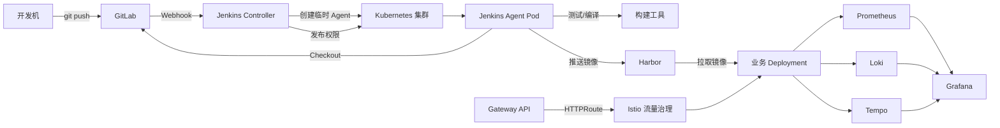
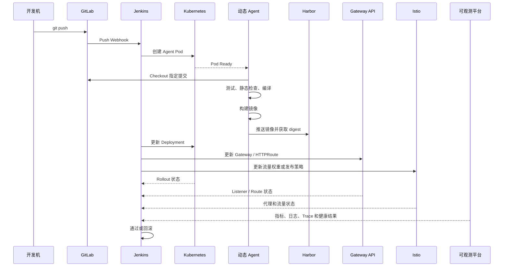

# 第一章：架构详解与 CI/CD 全流程演示

## 1.1 本章目标

完成本章后，你应能够：

- 说明 CI、持续交付和持续部署之间的区别。
- 说明 GitLab、Jenkins、Harbor、Kubernetes、Gateway API 和 Istio 的职责边界。
- 描述一次代码变更从提交到生产发布的完整链路。
- 理解代码、构建、镜像、部署和运行时流量之间的关联关系。
- 识别流水线中常见的失败阶段及排查方向。
- 在不部署完整平台的情况下，使用一个本地示例项目手工模拟 CI/CD 全流程。
- 理解为什么需要通过指标、日志和 Trace 观察变更结果，而不是只判断 Jenkins 是否成功。

## 1.2 前置条件

本章以架构理解和流程演示为主，不要求提前完成 Kubernetes、Jenkins 或 GitLab 的正式部署。建议准备以下工具：

| 工具 | 用途 |
|---|---|
| Git | 创建提交、切换分支和查看变更 |
| Docker 或兼容 OCI 的镜像构建工具 | 构建和运行示例镜像 |
| kubectl | 了解后续 Kubernetes 发布命令 |
| curl | 调用示例应用健康接口 |
| 文本编辑器 | 修改示例代码和配置 |

如果当前开发机还没有 Docker、kubectl 或 Kubernetes 集群，可以先阅读流程和配置示例，不必因为工具未安装而中断本章学习。

> 本章命令中的域名、镜像仓库地址、命名空间和凭证均使用占位符。不要把真实密码、Token、私钥或 kubeconfig 写入 Git 仓库、Jenkinsfile 或构建日志。

## 1.3 为什么需要 CI/CD

传统发布通常依赖人工完成以下工作：

1. 从代码仓库下载代码。
2. 安装依赖并执行测试。
3. 编译或打包应用。
4. 制作镜像并推送到镜像仓库。
5. 登录目标服务器或 Kubernetes 集群。
6. 修改应用版本并重启服务。
7. 观察服务是否恢复正常。
8. 发布失败时手工恢复旧版本。

人工操作的问题不只是速度慢，还包括：

- 操作步骤难以完整记录。
- 不同人员执行结果不一致。
- 测试、构建和发布环境容易产生差异。
- 发布版本与 Git 提交、镜像和运行实例难以对应。
- 失败后缺少统一的回滚和诊断机制。
- 凭证可能被写入脚本、命令历史或日志。

CI/CD 的核心目标，是将这些步骤转换为可重复、可审计、可验证的自动化流程。自动化不是简单地把命令放到 Jenkins 中执行，而是要明确：

- 什么事件可以触发流水线。
- 哪些质量检查必须通过。
- 哪个制品可以进入下一个环境。
- 谁可以批准生产发布。
- 发布后如何确认应用正常。
- 异常时如何停止流量或回滚。
- 如何通过观测数据判断变更是否真正安全。

## 1.4 CI、持续交付与持续部署

### 1.4.1 持续集成（Continuous Integration，CI）

持续集成强调开发人员频繁合并代码，并在每次提交或合并请求后自动执行验证，例如：

- 代码格式检查。
- 依赖安装。
- 单元测试。
- 静态代码分析。
- 编译和打包。
- 构建容器镜像。
- 扫描依赖和镜像漏洞。

CI 的结果通常是一个经过验证的构建产物。对于容器化应用，产物通常是推送到 Harbor 的镜像，并且应使用不可变的镜像 digest 进行追踪。

### 1.4.2 持续交付（Continuous Delivery）

持续交付是在持续集成的基础上，将经过验证的制品自动部署到开发、测试或预发布环境，并使其随时具备发布到生产环境的条件。

持续交付不一定自动发布生产环境。生产发布可以要求：

- 人工审批。
- 双人复核。
- 变更窗口检查。
- 发布前健康检查。
- 业务负责人确认。

### 1.4.3 持续部署（Continuous Deployment）

持续部署是在持续交付基础上，满足策略后自动将制品发布到生产环境，不再要求人工点击确认。

持续部署必须建立在充分的自动化保护之上，包括：

- 自动化测试。
- 制品不可变和可追溯。
- 最小权限凭证。
- 发布后健康检查。
- 逐步放量。
- 明确的失败阈值。
- 可验证的自动回滚。

三者可以简单理解为：

```text
持续集成：代码能否通过自动验证？
持续交付：制品是否已经准备好随时发布？
持续部署：制品是否在满足条件后自动进入生产？
```

## 1.5 平台组件职责边界

### 1.5.1 Git 与 GitLab

Git 负责本地和分布式版本管理，GitLab 在此基础上提供：

- 远程 Git 仓库。
- 用户、组和项目权限。
- 分支保护。
- Merge Request。
- 代码评审。
- Webhook。
- 提交状态和流水线入口。

GitLab 不负责替代 Jenkins 执行所有构建逻辑。本课程使用 GitLab 作为代码源和事件源，使用 Jenkins 编排 CI/CD 流程。

### 1.5.2 Jenkins

Jenkins 是流水线编排平台，主要负责：

- 接收 GitLab Webhook。
- 拉取指定提交的代码。
- 创建或调度构建 Agent。
- 执行测试、编译和镜像构建。
- 将镜像推送到 Harbor。
- 使用受控凭证访问 Kubernetes。
- 执行发布、健康检查和回滚。
- 保存构建日志、构建结果和发布记录。

Jenkins 不应该被当作业务运行平台，也不应该在 Controller 上长期执行普通项目构建。后续章节会使用 Kubernetes Plugin 为每次构建创建临时 Agent Pod。

### 1.5.3 Harbor

Harbor 是企业级 OCI 镜像仓库，负责：

- 保存应用镜像。
- 通过项目隔离镜像。
- 管理机器人账户。
- 控制推送和拉取权限。
- 执行镜像漏洞扫描。
- 支持镜像复制、签名或制品治理能力。

Harbor 保存的是构建产物，不负责决定何时发布应用。Jenkins 根据分支、审批和环境策略选择要发布的镜像。

### 1.5.4 Kubernetes

Kubernetes 是应用运行和发布目标平台，负责：

- 调度 Pod。
- 管理 Deployment、Service 和配置资源。
- 执行滚动更新。
- 通过探针判断应用状态。
- 提供 Service 发现和网络访问。
- 记录工作负载状态和事件。

Kubernetes 不负责替代 GitLab 的代码管理，也不负责替代 Jenkins 的发布审批流程。

### 1.5.5 Gateway API

Gateway API 用于管理集群流量入口和路由资源。常见资源包括：

- `GatewayClass`：定义由哪一种网关控制器实现 Gateway。
- `Gateway`：定义监听地址、端口、协议和证书等入口能力。
- `HTTPRoute`：定义域名、路径和后端 Service 的路由关系。

本课程不使用 Ingress 作为入口设计，而是使用 Gateway API 表达外部访问路径。流水线发布后，除了检查 Deployment，还需要检查 Gateway API 的 Listener 和 HTTPRoute 状态。

### 1.5.6 Istio

Istio 以服务网格方式提供服务间流量治理和运行时安全能力，重点包括：

- 服务间请求指标和访问日志。
- 分布式追踪上下文传播。
- mTLS。
- 超时、重试和熔断策略。
- 服务版本之间的权重路由。
- 金丝雀和蓝绿发布。

Gateway API 主要描述入口和路由资源，Istio 主要负责网格内服务通信和流量治理。两者可以协同使用，但不能把二者简单看成同一个组件。

### 1.5.7 可观测组件

本课程将变更可观测拆分为三类数据：

| 数据 | 典型问题 | 组件示例 |
|---|---|---|
| 指标 Metrics | 错误率是否升高？延迟是否变差？ | Prometheus、Grafana |
| 日志 Logs | 具体错误是什么？哪个版本输出的？ | Loki、Grafana |
| 追踪 Traces | 请求经过了哪些服务？在哪一步变慢？ | OpenTelemetry、Tempo |

Jenkins 显示绿色，只能证明流水线中的命令返回成功，不能证明业务一定健康。因此发布阶段必须结合 Kubernetes 状态、Gateway API 状态、Istio 流量状态和应用观测数据。

## 1.6 总体架构



### 1.6.1 组件调用方向

一次完整发布中，各组件的调用方向如下：

```text
开发机
  └─ git push → GitLab
                  └─ Webhook → Jenkins Controller
                                  └─ Kubernetes API → Agent Pod
                                                    ├─ GitLab：拉取代码
                                                    ├─ 构建工具：测试和编译
                                                    ├─ Harbor：推送镜像
                                                    └─ Kubernetes API：发布资源
                                                                  ├─ Gateway API：配置入口路由
                                                                  └─ Istio：配置服务流量
```

### 1.6.2 凭证流向

凭证不应该随着代码流转，而应在需要的位置短暂注入：

| 凭证 | 使用方 | 用途 |
|---|---|---|
| GitLab SSH Key 或 Token | Jenkins Agent | 拉取私有代码 |
| Harbor Robot Account | Jenkins Agent | 推送镜像 |
| Kubernetes ServiceAccount 或受限 kubeconfig | Jenkins 发布阶段 | 更新指定命名空间资源 |
| Gateway / Istio 配置权限 | Jenkins 发布阶段 | 更新路由和流量策略 |

建议为不同环境配置不同的 Kubernetes 权限。开发环境凭证不能默认拥有测试和生产环境权限，更不能直接使用集群管理员凭证。

## 1.7 从提交到发布的完整流程



### 1.7.1 阶段一：开发机提交代码

开发人员在本地创建功能分支并提交代码：

```bash
git checkout -b feature/health-endpoint
# 修改代码、测试文件和 Dockerfile

git status
git add .
git commit -m "Add health endpoint"
git push origin feature/health-endpoint
```

实际团队中应避免直接向受保护的生产分支推送。推荐通过 Merge Request 触发代码评审和校验流水线。

### 1.7.2 阶段二：GitLab 发送 Webhook

GitLab 在收到 push 或 Merge Request 事件后，向 Jenkins Webhook 地址发送请求。请求中通常包含：

- 项目地址。
- 事件类型。
- 分支或 Tag。
- 最新提交 SHA。
- 提交信息。
- 发起用户。

Webhook 只负责通知 Jenkins，不负责携带完整代码，也不应该把密码放在请求中。Jenkins 收到事件后，应根据项目和分支规则决定是否启动构建。

### 1.7.3 阶段三：Jenkins 创建构建环境

Jenkins Controller 根据流水线配置请求 Kubernetes 创建临时 Agent Pod。Agent Pod 可以包含多个容器，例如：

- `jnlp` 或 inbound-agent：与 Jenkins Controller 通信。
- `builder`：执行语言和项目构建工具。
- `image-builder`：使用 Kaniko、BuildKit 或其他 OCI 构建工具。
- `kubectl`：执行受限的 Kubernetes 发布操作。

构建完成后，临时 Pod 可以被回收，从而减少长期运行节点和环境污染。

### 1.7.4 阶段四：Checkout 与质量检查

Agent 拉取 Webhook 指定的提交，而不是不受控制地拉取默认分支最新代码。随后执行：

```text
Checkout
  → 依赖安装
  → 单元测试
  → 静态检查
  → 编译或打包
```

测试失败时应立即停止后续镜像推送和部署。不能因为“镜像能够构建”就跳过失败测试。

### 1.7.5 阶段五：构建并推送镜像

镜像 Tag 可以包含分支名、构建号和短 SHA，但发布时应优先使用 digest：

```text
harbor.example.com/demo/sample-app:build-128
harbor.example.com/demo/sample-app:git-a1b2c3d
harbor.example.com/demo/sample-app@sha256:<digest>
```

推荐保存以下映射关系：

```text
Git commit SHA
  → Jenkins build number
  → 镜像 Tag
  → 镜像 digest
  → Kubernetes Deployment revision
```

Tag 便于人阅读，digest 适合保证制品不可变。生产环境不要只依赖 `latest` 这种可变 Tag。

### 1.7.6 阶段六：发布 Kubernetes 工作负载

Jenkins 使用最小权限凭证更新目标命名空间中的 Deployment。典型发布动作包括：

1. 检查镜像 digest 是否存在。
2. 检查 Deployment 和 Service 是否符合预期。
3. 更新 Deployment 镜像。
4. 等待滚动发布完成。
5. 检查 Pod Ready 和业务健康接口。
6. 记录发布版本和结果。

如果使用 Gateway API 和 Istio，还需要：

- 检查 Gateway Listener 是否 Accepted。
- 检查 HTTPRoute 是否 Accepted、引用资源是否解析成功。
- 检查 Istio 配置是否同步到代理。
- 检查新旧版本流量权重。
- 检查 mTLS、访问成功率和错误率。

### 1.7.7 阶段七：通过观测数据验证变更

发布成功不应只看 Deployment 是否完成。至少需要观察：

- 应用 Pod 是否 Ready。
- 健康检查是否返回成功。
- HTTP 5xx 比例是否上升。
- P95/P99 延迟是否明显增加。
- 请求量和业务成功率是否正常。
- Istio 重试、超时和熔断是否异常增加。
- 新版本日志中是否出现错误。
- 异常请求是否能通过 Trace 定位到具体服务。

发布事件应带有统一字段：

```text
commit_sha
build_number
image_digest
environment
release_id
release_user
```

这样才能在 Grafana 中从一次异常请求反查到部署版本和 Git 提交。

## 1.8 分支与环境策略

本课程推荐使用以下分支策略作为实验模型：

| 分支 | 主要用途 | 默认动作 |
|---|---|---|
| `feature/*` | 功能开发 | 执行测试和静态检查，不发布生产 |
| `develop` | 集成开发 | 自动发布 `dev` 环境 |
| `release/*` | 发布候选 | 发布 `test` 或预发布环境 |
| `main` | 稳定版本 | 经过审批后发布 `prod` |

示例流程：

```text
feature/xxx
    ↓ Merge Request 校验
    ↓ 合并到 develop
    ↓ 自动构建并发布 dev
    ↓ 创建 release/*
    ↓ 发布 test 并执行验收
    ↓ 合并到 main
    ↓ 人工审批或自动策略
    ↓ 使用同一个镜像 digest 发布 prod
```

关键原则是“构建一次，逐环境晋级”。不要为开发、测试和生产分别重新构建同一份源代码，否则不同环境运行的可能不是同一个制品。

## 1.9 第一阶段手工演示

本节不依赖 Jenkins，先用本地命令理解流水线中的基本动作。示例以一个假设目录 `sample-app` 为例。

### 1.9.1 创建示例项目

```bash
mkdir sample-app
cd sample-app
git init
```

示例项目至少包含：

```text
sample-app/
├── src/
├── tests/
├── Dockerfile
├── Jenkinsfile
└── README.md
```

不同语言的源码和测试实现会在后续章节补充。本章重点是阶段关系，不要求使用固定编程语言。

### 1.9.2 模拟 Checkout

```bash
git status
git log --oneline -5
git rev-parse HEAD
```

流水线应保存当前提交 SHA：

```bash
COMMIT_SHA="$(git rev-parse HEAD)"
printf 'commit=%s\n' "$COMMIT_SHA"
```

在 Jenkins 中，这个值应作为构建元数据的一部分保存，而不是只出现在临时日志中。

### 1.9.3 模拟测试与编译

```bash
# 按项目实际语言替换以下命令
./gradlew test
./gradlew build
```

或者：

```bash
npm ci
npm test
npm run build
```

命令必须根据示例项目实际技术栈选择。不要在一个项目中同时执行不相关的构建命令。

### 1.9.4 模拟镜像构建

```bash
export REGISTRY="harbor.example.com"
export PROJECT="demo"
export IMAGE="sample-app"
export IMAGE_TAG="git-${COMMIT_SHA:0:7}"

docker build \
  --tag "${REGISTRY}/${PROJECT}/${IMAGE}:${IMAGE_TAG}" \
  .
```

构建后检查本地镜像：

```bash
docker image inspect "${REGISTRY}/${PROJECT}/${IMAGE}:${IMAGE_TAG}"
```

### 1.9.5 模拟推送 Harbor

真实环境中应使用 Jenkins Credentials 或 Harbor Robot Account 登录，不要在命令行中直接输入并保存密码：

```bash
docker login "${REGISTRY}"
docker push "${REGISTRY}/${PROJECT}/${IMAGE}:${IMAGE_TAG}"
```

推送后，应从 Harbor 获取镜像 digest，并将它写入构建结果：

```text
image=harbor.example.com/demo/sample-app
image_tag=git-a1b2c3d
image_digest=sha256:<digest>
```

### 1.9.6 模拟 Kubernetes 发布

后续章节会创建实际 Kubernetes 清单。本章只展示发布动作的结构：

```bash
kubectl -n dev set image deployment/sample-app \
  sample-app="${REGISTRY}/${PROJECT}/${IMAGE}@sha256:<digest>"

kubectl -n dev rollout status deployment/sample-app --timeout=180s
```

发布后检查：

```bash
kubectl -n dev get deployment sample-app
kubectl -n dev get pods -o wide
kubectl -n dev get events --sort-by=.lastTimestamp
```

### 1.9.7 模拟 Gateway API 与 Istio 检查

```bash
kubectl get gatewayclass
kubectl -n dev get gateway
kubectl -n dev get httproute
kubectl -n dev describe httproute sample-app
```

如果部署了 Istio，还应检查代理和流量策略：

```bash
istioctl proxy-status
kubectl -n dev get virtualservice,destinationrule
```

实际资源名称以实验环境为准。检查重点是：

- Gateway 是否具备可用 Listener。
- HTTPRoute 是否被接受。
- Route 引用的 Service 是否存在。
- Istio 代理是否同步最新配置。
- 新旧版本流量比例是否符合发布计划。

### 1.9.8 模拟业务验证

```bash
curl --fail --silent --show-error \
  -H 'Host: app.example.com' \
  "https://gateway.example.com/health"
```

只返回 HTTP 200 仍然不够，还应从监控和日志确认：

```text
发布前：错误率、P95 延迟、请求量
发布后：错误率、P95 延迟、请求量
```

如果发布后错误率或延迟超过阈值，应停止继续放量，而不是仅因为 `rollout status` 成功就判定发布成功。

## 1.10 故障场景演示

### 场景一：Webhook 没有触发 Jenkins

可能原因：

- GitLab 无法访问 Jenkins Webhook 地址。
- Gateway API 的 HTTPRoute 未被接受。
- Listener 域名或端口配置错误。
- Webhook Token 不匹配。
- Jenkins CSRF 或请求认证配置不正确。

排查顺序：

1. 查看 GitLab Webhook 最近一次请求状态。
2. 查看 Gateway 和 HTTPRoute 状态。
3. 查看网关访问日志。
4. 查看 Jenkins 系统日志。
5. 确认项目、分支和 Token 配置。

### 场景二：动态 Agent 一直 Pending

可能原因：

- 节点资源不足。
- 节点标签或污点不匹配。
- Agent 镜像无法拉取。
- ServiceAccount 无法访问 Kubernetes API。
- PVC 或 Workspace Volume 无法挂载。

排查命令：

```bash
kubectl -n cicd get pod
kubectl -n cicd describe pod <agent-pod>
kubectl -n cicd get events --sort-by=.lastTimestamp
```

### 场景三：镜像推送失败

可能原因：

- Harbor 地址无法解析。
- Jenkins 凭证错误或已过期。
- Robot Account 没有目标项目的推送权限。
- Harbor TLS 证书不被 Agent 信任。
- 镜像项目路径写错。

排查重点是网络、证书、认证和项目权限，不要直接给 Jenkins 授予 Harbor 管理员权限。

### 场景四：Deployment 发布成功但业务异常

可能原因：

- 应用启动后依赖的配置或 Secret 不正确。
- Readiness Probe 配置不合理。
- 新版本接口与旧版本不兼容。
- Istio 路由把请求发送到了错误版本。
- 数据库变更和应用版本不兼容。

排查方法：

```bash
kubectl -n dev get pods
kubectl -n dev logs deploy/sample-app --all-containers
kubectl -n dev describe pod <pod-name>
```

同时查看：

- Gateway API 路由状态。
- Istio 访问日志和代理状态。
- Prometheus 错误率与延迟。
- Loki 应用错误日志。
- Tempo 中失败请求的 Trace。

### 场景五：发布后指标恶化

当新版本错误率、延迟或业务失败率超过阈值时，应执行以下动作：

1. 停止继续增加新版本流量。
2. 保存 Jenkins 构建号和当前镜像 digest。
3. 导出相关时间窗口的指标、日志和 Trace。
4. 将 Istio 流量权重切回稳定版本，或执行 Deployment 回滚。
5. 确认 Gateway API 和 Istio 配置恢复。
6. 验证业务健康接口和关键业务流程。
7. 保留变更和回滚审计记录。

## 1.11 本章安全要求

- 不在 Git 仓库中保存密码、Token、私钥和完整 kubeconfig。
- 不在 Jenkinsfile 中硬编码 Harbor 和 Kubernetes 凭证。
- Jenkins Agent 使用非 root 用户运行时应优先纳入设计。
- 构建不可信代码时，避免共享宿主机 Docker Socket。
- 使用 Kubernetes RBAC 限制 Jenkins 只能操作目标命名空间和必要资源。
- 生产环境发布必须具备审批、审计和回滚策略。
- 镜像使用不可变 digest，避免生产环境依赖 `latest`。
- Webhook 使用认证和签名校验，不能仅依赖一个公开 URL。
- 可观测日志中不得输出密码、Token、私钥和完整请求凭证。
- 对外暴露的 Gateway Listener 应限制域名、端口和访问范围。

## 1.12 本章实验

### 实验目标

画出并解释以下链路：

```text
Git 提交
  → GitLab Webhook
  → Jenkins 构建
  → Kubernetes Agent
  → 测试与编译
  → Harbor 镜像
  → Kubernetes Deployment
  → Gateway API / Istio 流量
  → 指标、日志、Trace
```

### 实验步骤

1. 创建一个示例 Git 仓库。
2. 创建 `feature/health-endpoint` 分支并提交一次代码变更。
3. 记录提交 SHA。
4. 使用本地命令模拟测试、编译和镜像构建。
5. 写出目标 Harbor 镜像地址和镜像 Tag 规则。
6. 画出 Jenkins 需要使用的三类凭证及其权限。
7. 写出 Kubernetes 发布后的五项检查内容。
8. 设计一次“错误率升高”的故障场景和回滚动作。
9. 说明如何通过 Trace 关联一次请求、一个发布版本和一个 Git 提交。

### 验收标准

- [ ] 能区分 GitLab、Jenkins、Harbor 和 Kubernetes 的职责。
- [ ] 能说明 CI、持续交付和持续部署的区别。
- [ ] 能描述从 Git commit 到 Kubernetes Pod 的完整链路。
- [ ] 能说明为什么要保存镜像 digest。
- [ ] 能说明 Gateway API 与 Istio 在流量治理中的不同职责。
- [ ] 能列出发布后需要观察的指标、日志和 Trace。
- [ ] 能针对 Webhook、Agent、镜像推送和业务异常分别给出排查方向。
- [ ] 能设计最小权限的 GitLab、Harbor 和 Kubernetes 凭证。

## 1.13 思考题

1. Jenkins 构建成功，但应用发布后错误率升高，这次发布算成功吗？为什么？
2. 为什么生产环境不建议使用 `latest` Tag？
3. 如果测试环境和生产环境分别重新构建同一份代码，可能带来什么问题？
4. Gateway API 和 Istio 是否可以互相完全替代？
5. 为什么 Jenkins Controller 不应该承担大量业务构建任务？
6. 如何把一个发布事件与一条用户请求 Trace 关联起来？
7. 如果新版本已经部署成功，但数据库迁移不可逆，回滚应用时还需要考虑什么？
8. Webhook 触发失败时，为什么要先检查网络和路由，再修改 Jenkins Pipeline？

## 1.14 本章小结

本章建立了整套实验的共同语言和架构模型：

- GitLab 管理代码和变更事件。
- Jenkins 编排测试、构建、发布和回滚。
- Kubernetes 运行 Agent 和业务应用。
- Harbor 保存可追踪的镜像制品。
- Gateway API 管理流量入口和 HTTP 路由。
- Istio 管理服务网格内的通信、流量权重和 mTLS。
- Prometheus、Grafana、Loki、Tempo 和 OpenTelemetry 共同提供变更可观测能力。

后续章节将从 Kubernetes 环境初始化开始，逐步把本章的逻辑架构转换为可运行的实验环境。
