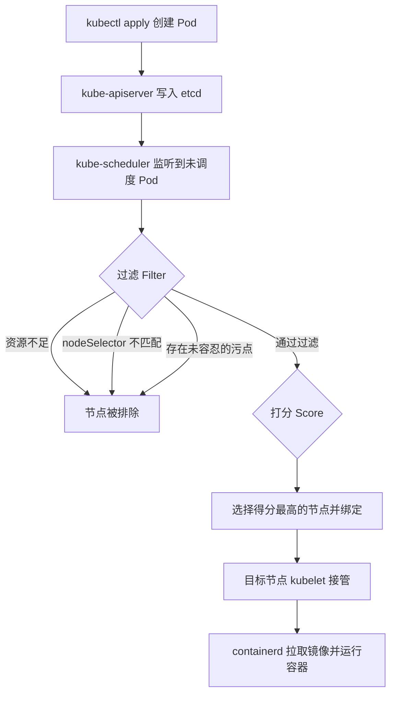
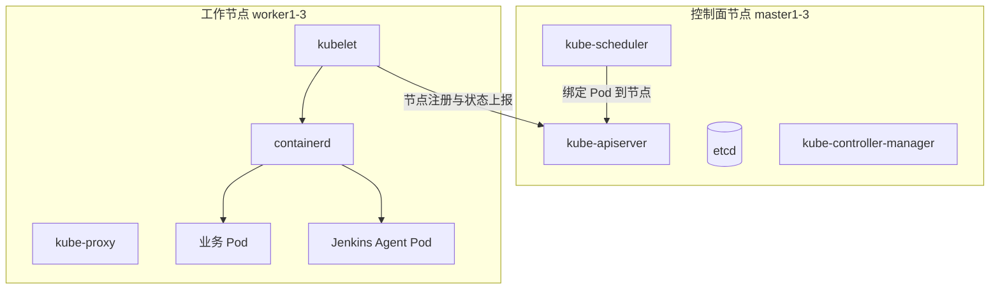
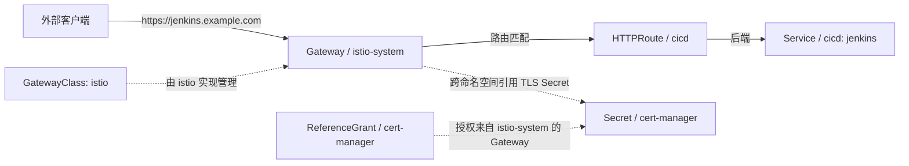

# 第二章：Kubernetes 环境初始化与节点打标签

## 2.1 本章目标

第一章建立了整套课程的整体架构模型。从本章开始，我们将把逻辑架构逐层落地为可运行的实验环境，第一步是准备一个规划良好、经过检查的 Kubernetes 集群。完成本章后，你应能够：

- 说明控制面节点和工作节点的组件构成与职责边界。
- 配置并验证 kubectl 的 kubeconfig、Context 与默认命名空间。
- 检查节点状态、资源容量（Capacity 与 Allocatable）和容器运行时。
- 使用节点标签（Labels）、污点（Taints）和容忍度（Tolerations）控制工作负载调度。
- 为 Jenkins Agent、基础设施组件和业务环境规划节点布局。
- 创建课程所需的 `cicd`、`gitlab`、`harbor`、`dev`、`test`、`prod` 六个命名空间。
- 配置默认 StorageClass，为有状态组件提供持久化能力。
- 安装 Gateway API CRD，并说明为什么本课程选择 Istio 作为 Gateway API 实现。
- 规划 Gateway、HTTPRoute、域名、证书和跨命名空间引用策略。
- 安装 Istio，比较 sidecar 与 ambient 两种数据面模式，并为业务命名空间启用注入。
- 完成基础 DNS、时间同步、镜像拉取和网络连通性检查。
- 为监控、日志、追踪和审计数据预留存储与访问路径。

## 2.2 前置条件

本章假设你已经使用 kubeadm 完成了一套 Kubernetes 集群的初始化，或将使用一套已有集群继续实验。需要准备：

| 工具 | 用途 |
|---|---|
| kubectl | 管理集群资源、查看节点和命名空间状态 |
| helm | 安装部分基础组件 |
| istioctl | 安装 Istio，并作为 Gateway API 的实现 |
| crictl | 在节点上检查 containerd 与容器状态 |
| chrony 或其他 NTP 服务 | 保持所有节点时间同步 |
| curl / dig / nslookup | 网络与 DNS 连通性验证 |
| 文本编辑器 | 编写命名空间、StorageClass、Gateway 等清单 |

如果集群尚未安装，可参考官方 kubeadm 文档完成初始化。本章不展开 `kubeadm init` 的细节，重点是从"集群已就绪"到"可以承载 CI/CD 平台"之间的环境规划与检查工作。

> 本章命令中的节点名、IP、镜像加速地址和凭证均使用占位符（如 `<NODE_IP>`、`<MIRROR_HOST>`），执行前替换为实验环境实际值。组件版本号统一采用撰写时的最新稳定版（2026-09 校验：Kubernetes v1.37.0、local-path-provisioner v0.0.37、Gateway API v1.6.2、Istio 1.31.1），使用前可在各项目 Release 页核对是否有更新。不要将 kubeconfig、证书私钥提交到 Git 仓库。

## 2.3 环境与目录说明

### 2.3.1 示例集群拓扑

本课程使用 kubeadm 部署的集群作为示例，拓扑如下：

| 节点 | 角色 | 建议配置 | 计划标签 | 计划污点 |
|---|---|---|---|---|
| master1 | 控制面 | 4C / 8G / 100G | — | `node-role.kubernetes.io/control-plane:NoSchedule`（默认） |
| master2 | 控制面 | 4C / 8G / 100G | — | 同上 |
| master3 | 控制面 | 4C / 8G / 100G | — | 同上 |
| worker1 | 工作节点 | 8C / 16G / 200G | `example.com/pool=cicd` | `dedicated=cicd:NoSchedule` |
| worker2 | 工作节点 | 8C / 16G / 200G | `example.com/pool=infra` | — |
| worker3 | 工作节点 | 8C / 16G / 200G | `example.com/pool=apps` | — |

说明：

- 标签和污点在 2.7 节统一规划和实施，表中为"目标状态"。
- 控制面污点由 kubeadm 默认添加，本课程不修改它，保证业务 Pod 不会调度到控制面。
- `dedicated=cicd:NoSchedule` 污点用于把 Jenkins 构建类负载"钉"在 worker1 上，同时阻止其他负载进入，本章实验会验证该约束。

### 2.3.2 可缩减部署

如果实验机器有限，可以缩减为 1 个控制面 + 2 个工作节点：

- 单控制面不具备高可用，etcd 只有一份，仅用于实验，不能代表生产架构。
- 两个工作节点可以合并角色：例如 worker1 同时承担 `cicd` 和 `infra`，worker2 承担 `apps`。
- 缩减后所有节点标签、污点策略照常实施，后续章节命令不需要修改，只是调度结果分布更集中。

### 2.3.3 实验目录约定

在开发机上创建实验目录，本章及后续章节的清单文件统一存放：

```bash
# 在开发机执行（普通用户即可）
mkdir -p ~/cicd-lab/manifests
cd ~/cicd-lab/manifests
```

本文档中的所有 YAML 示例都可以保存为该目录下的文件后 `kubectl apply`。课程不要求把清单文件放到集群节点上，kubectl 是声明式的，从哪里提交都一样。

## 2.4 核心原理：节点角色与调度

### 2.4.1 控制面组件职责

控制面节点运行集群的"管理大脑"：

| 组件 | 职责 |
|---|---|
| kube-apiserver | 集群唯一入口，所有 kubectl、Dashboard、Jenkins 对集群的操作都经过它 |
| etcd | 分布式键值存储，保存集群全部状态数据 |
| kube-scheduler | 为未调度的 Pod 选择节点（过滤 + 打分） |
| kube-controller-manager | 运行节点、副本、Endpoint 等控制器循环 |

在本课程中，Jenkins Controller 与 Kubernetes 的交互（创建 Agent Pod、发布应用）本质都是调用 kube-apiserver。理解"一切操作都经过 apiserver"有助于后面理解 RBAC、审计和 ServiceAccount。

### 2.4.2 工作节点组件职责

| 组件 | 职责 |
|---|---|
| kubelet | 管理节点上的 Pod 生命周期，向 apiserver 上报节点状态 |
| kube-proxy | 维护 Service 的网络规则，实现 Service 转发 |
| containerd | 容器运行时，实际拉取镜像、创建容器 |

Jenkins 动态 Agent Pod、GitLab、Harbor 和业务应用都运行在工作节点上。控制面默认的污点会阻止这些负载调度到控制面节点。

### 2.4.3 调度流程





### 2.4.4 标签与污点的分工

标签和污点都影响调度，但方向相反：

| 机制 | 作用方向 | 语义 | 典型用法 |
|---|---|---|---|
| 节点标签 + nodeSelector | Pod 主动选择节点 | "我只想运行在这类节点上" | Jenkins Agent 指定 `example.com/pool=cicd` |
| 污点 + 容忍度 | 节点排斥 Pod | "不允许不能容忍我的 Pod 进来" | `dedicated=cicd:NoSchedule` 阻止普通业务 |
| 亲和性 / 反亲和性 | 更细粒度 | 支持软偏好（preferred）、拓扑打散 | 生产环境多副本跨节点分布 |

实践建议：**标签负责"吸引"，污点负责"排斥"，两者搭配才能得到专用节点池**。只打标签时，其他负载仍然可以调度进来；只加污点时，目标负载如果没有容忍度也进不去。

## 2.5 kubectl 配置、Context 与命名空间

### 2.5.1 kubeconfig 与 Context

kubectl 通过 kubeconfig 文件连接集群。一个 kubeconfig 中可以保存多套"集群 + 用户 + 命名空间"的组合，称为 Context：

```bash
# 在开发机执行（假设管理员已将 kubeconfig 分发到 ~/.kube/config）
kubectl config get-contexts
# 预期输出：列出当前所有 context，CURRENT 列标记当前使用的一个

kubectl config current-context
# 预期输出：当前 context 名称，例如 kubernetes-admin@kubernetes
```

Context 决定了"命令发往哪个集群、以哪个身份"。后续章节会出现多套凭证（管理员 kubeconfig、Jenkins 发布凭证），届时会使用 `KUBECONFIG` 环境变量或 `--context` 参数显式切换，避免误操作。

### 2.5.2 设置默认命名空间

```bash
# 在开发机执行；只影响当前 context 的默认命名空间
kubectl config set-context --current --namespace=cicd
# 预期输出：Context "kubernetes-admin@kubernetes" modified.

kubectl config view --minify --output 'jsonpath={..namespace}'
# 预期输出：cicd
```

设置默认命名空间后，不带 `-n` 的 kubectl 命令都作用于该命名空间。实验阶段建议显式使用 `-n <namespace>`，降低误操作概率，本章示例统一显式指定。

### 2.5.3 常用命名空间操作

```bash
kubectl get namespace
# 预期输出：default、kube-system、kube-public、kube-node-lease 已存在

kubectl -n kube-system get pods -o wide
# 预期输出：coredns、etcd、kube-apiserver、kube-controller-manager、
#           kube-scheduler、kube-proxy 全部 Running（或 Completed）
```

## 2.6 节点状态、资源容量与容器运行时检查

### 2.6.1 节点状态

```bash
# 在开发机执行（需要查看权限，管理员 kubeconfig 天然满足）
kubectl get nodes -o wide
# 预期输出示意（VERSION 与 INTERNAL-IP 以实际环境为准）：
# NAME      STATUS   ROLES           AGE   VERSION   INTERNAL-IP    OS-IMAGE
# master1   Ready    control-plane   10d   v1.37.0   192.168.10.11   Ubuntu 22.04
# master2   Ready    control-plane   10d   v1.37.0   192.168.10.12   Ubuntu 22.04
# master3   Ready    control-plane   10d   v1.37.0   192.168.10.13   Ubuntu 22.04
# worker1   Ready    <none>          10d   v1.37.0   192.168.10.21   Ubuntu 22.04
# worker2   Ready    <none>          10d   v1.37.0   192.168.10.22   Ubuntu 22.04
# worker3   Ready    <none>          10d   v1.37.0   192.168.10.23   Ubuntu 22.04
```

通过标准：所有节点 `STATUS` 为 `Ready`。如果某个节点 `NotReady`，优先在对应节点上检查 `systemctl status kubelet containerd`。

### 2.6.2 Capacity 与 Allocatable

```bash
kubectl describe node worker1
```

输出中的关键片段（数值因机器而异）：

```text
Capacity:
  cpu:                8
  memory:             16266968Ki
  pods:               110
Allocatable:
  cpu:                7500m
  memory:             15214968Ki
  pods:               110
```

两者的区别：

| 字段 | 含义 | 用途 |
|---|---|---|
| Capacity | 节点的物理资源总量 | 评估机器规格 |
| Allocatable | 减去 kube/system 预留和驱逐阈值后，可供 Pod 使用的量 | 调度器实际依据的值 |

检查节点资源时要以 Allocatable 为准。规划 CI/CD 负载时注意：Jenkins Agent 构建阶段（编译、镜像构建）的内存峰值可能很高，为 worker1 预留足够余量，或通过 Pod 资源限制保护节点。

如果安装了 metrics-server，还可以查看实时用量：

```bash
kubectl top nodes
# 预期输出：每个节点的当前 CPU（m）与内存（Mi）占用
# 说明：kubeadm 默认不安装 metrics-server，可按官方文档安装后再执行
```

### 2.6.3 容器运行时检查

本课程使用 containerd。在**任意节点**上执行（需要 root 权限，只读操作，无影响）：

```bash
# 查看 containerd 服务状态
systemctl status containerd
# 预期输出：Active: active (running)

# 查看 kubeadm 与运行时的版本匹配
crictl version
# 预期输出：RuntimeVersion 等字段显示 containerd 版本

# 查看节点上正在运行的容器（kubelet 创建的系统 Pod 容器）
crictl ps
# 预期输出：列出 kube-proxy、calico/cni 等容器，STATE 为 Running
```

如果 `crictl` 报连接错误，通常是 runtime endpoint 未配置，创建以下文件后重试：

```yaml
# /etc/crictl.yaml（在节点上执行，root 权限）
runtime-endpoint: unix:///run/containerd/containerd.sock
image-endpoint: unix:///run/containerd/containerd.sock
```

## 2.7 节点标签、污点与容忍度

### 2.7.1 查看与添加节点标签

```bash
# 在开发机执行（需要节点更新权限）
# 查看现有标签
kubectl get nodes --show-labels
# 预期输出：每个节点一长串标签，其中包含 kubernetes.io/hostname 和内置节点名标签

# 为三个工作节点添加"节点池"标签
kubectl label nodes worker1 example.com/pool=cicd
kubectl label nodes worker2 example.com/pool=infra
kubectl label nodes worker3 example.com/pool=apps
# 预期输出：node/worker1 labeled 等

# 验证
kubectl get nodes -L example.com/pool
# 预期输出：
# NAME      STATUS   ROLES           AGE   VERSION   POOL
# master1   Ready    control-plane   10d   v1.37.0
# worker1   Ready    <none>          10d   v1.37.0   cicd
# worker2   Ready    <none>          10d   v1.37.0   infra
# worker3   Ready    <none>          10d   v1.37.0   apps
```

标签键使用自定义域名前缀（`example.com/`）是集群标签的惯例，避免与 Kubernetes 内置键冲突。`example.com` 是保留演示域名，实验环境可替换为自有域名。

修改或删除标签：

```bash
kubectl label nodes worker1 example.com/pool=cicd --overwrite   # 覆盖已有值
kubectl label nodes worker1 example.com/pool-                   # 删除标签（键名后加减号）
# 影响说明：标签变化立即影响后续调度决策，已运行 Pod 不受影响
```

### 2.7.2 污点与容忍度

先查看控制面默认污点：

```bash
kubectl describe node master1 | grep -A 2 Taints
# 预期输出：
# Taints:             node-role.kubernetes.io/control-plane:NoSchedule
```

三种污点效果：

| Effect | 行为 |
|---|---|
| NoSchedule | 不容忍该污点的 Pod 不能调度到该节点（硬性排斥） |
| PreferNoSchedule | 尽量不调度到该节点（软性排斥，资源紧张时仍可能调度） |
| NoExecute | 不仅不调度，已运行的不能容忍的 Pod 还会被驱逐 |

为 worker1 添加专用污点，让该节点只接收 Jenkins 相关负载：

```bash
# 在开发机执行（需要节点更新权限）
kubectl taint nodes worker1 dedicated=cicd:NoSchedule
# 预期输出：node/worker1 tainted

# 影响说明：此后所有不带对应 tolerations 的 Pod 都不会调度到 worker1，
# 已运行的 Pod 不受影响（NoSchedule 不驱逐存量 Pod）
```

对应的容忍度写法（后续章节 Jenkins 相关工作负载会使用）：

```yaml
# 同时使用 nodeSelector 和 tolerations，"吸引 + 容忍"配合
spec:
  nodeSelector:
    example.com/pool: cicd        # 只选择 cicd 节点池
  tolerations:
    - key: "dedicated"
      operator: "Equal"
      value: "cicd"
      effect: "NoSchedule"        # 容忍 worker1 的专用污点
```

删除污点（键名末尾加减号）：

```bash
kubectl taint nodes worker1 dedicated=cicd:NoSchedule-
# 预期输出：node/worker1 untainted
```

### 2.7.3 节点规划总表

结合标签与污点，本课程的节点规划如下：

| 节点池 | 标签 | 污点 | 承载内容 |
|---|---|---|---|
| cicd（worker1） | `example.com/pool=cicd` | `dedicated=cicd:NoSchedule` | Jenkins Controller、Jenkins Agent Pod（动态构建） |
| infra（worker2） | `example.com/pool=infra` | 无 | GitLab、Harbor、Prometheus、Grafana、Loki、Tempo 等基础设施 |
| apps（worker3） | `example.com/pool=apps` | 无 | dev、test、prod 命名空间的业务应用 |
| 控制面（master1-3） | — | `node-role.kubernetes.io/control-plane:NoSchedule` | 仅控制面组件 |

注意：infra 和 apps 节点池不加污点，是因为实验集群资源有限，允许负载在 Pod 无法精确匹配时仍有节点可去。生产环境通常对基础设施节点同样加污点，实现严格隔离。

## 2.8 创建课程命名空间

命名空间是本课程的基础隔离单元：Jenkins 在 `cicd`，GitLab 在 `gitlab`，Harbor 在 `harbor`，业务应用按环境分布在 `dev`、`test`、`prod`。命名空间默认提供资源名称隔离和默认的 RBAC 边界（不显式授权时，用户无法访问其他命名空间资源）；后续第十三章会在这些命名空间上叠加最小权限的 Jenkins 发布凭证。

完整清单如下：

```yaml
# ~/cicd-lab/manifests/namespaces.yaml
# 用途：创建课程所需的六个命名空间，并附带用途标签
---
apiVersion: v1
kind: Namespace
metadata:
  name: cicd
  labels:
    app.kubernetes.io/part-of: cicd-lab
    example.com/env: tooling
---
apiVersion: v1
kind: Namespace
metadata:
  name: gitlab
  labels:
    app.kubernetes.io/part-of: cicd-lab
    example.com/env: tooling
---
apiVersion: v1
kind: Namespace
metadata:
  name: harbor
  labels:
    app.kubernetes.io/part-of: cicd-lab
    example.com/env: tooling
---
apiVersion: v1
kind: Namespace
metadata:
  name: dev
  labels:
    app.kubernetes.io/part-of: cicd-lab
    example.com/env: dev
---
apiVersion: v1
kind: Namespace
metadata:
  name: test
  labels:
    app.kubernetes.io/part-of: cicd-lab
    example.com/env: test
---
apiVersion: v1
kind: Namespace
metadata:
  name: prod
  labels:
    app.kubernetes.io/part-of: cicd-lab
    example.com/env: prod
```

应用与验证：

```bash
# 在开发机执行（需要集群管理员权限）
kubectl apply -f ~/cicd-lab/manifests/namespaces.yaml
# 预期输出：namespace/cicd created 等 6 行

kubectl get ns -l app.kubernetes.io/part-of=cicd-lab
# 预期输出：6 个命名空间全部 Active
```

## 2.9 配置默认 StorageClass

Jenkins、GitLab、Harbor 和可观测组件都需要持久化存储。StorageClass 决定 PVC 被绑定到什么样的 PV。本课程实验环境使用 local-path-provisioner（基于节点本地盘、动态创建目录），生产环境可替换为 Ceph RBD、云盘 CSI 等共享块存储。

```bash
# 在开发机执行（需要集群管理员权限）
# local-path-provisioner 最新稳定版（2026-09 校验为 v0.0.37，更新版本见项目 Release 页）
kubectl apply -f \
  "https://raw.githubusercontent.com/rancher/local-path-provisioner/v0.0.37/deploy/local-path-storage.yaml"
# 预期输出：namespace/local-path-storage created 及若干 created

# 将其设为默认 StorageClass
kubectl patch storageclass local-path \
  -p '{"metadata":{"annotations":{"storageclass.kubernetes.io/is-default-class":"true"}}}'
# 预期输出：storageclass.storage.k8s.io/local-path patched

kubectl get storageclass
# 预期输出：
# NAME                   PROVISIONER                   RECLAIMPOLICY   VOLUMEBINDINGMODE      AGE
# local-path (default)   rancher.io/local-path         Delete          WaitForFirstConsumer   1m
```

要点：

- `storageclass.kubernetes.io/is-default-class: "true"` 注解标记默认 StorageClass；不指定 `storageClassName` 的 PVC 会自动使用它。
- `WaitForFirstConsumer` 表示等到第一个使用 PVC 的 Pod 调度后再在对应节点创建目录，这对本地存储是必要的（保证数据和使用者在同一节点）。
- 快速验证：创建一个测试 PVC 并观察状态。

```yaml
# ~/cicd-lab/manifests/sc-test.yaml
apiVersion: v1
kind: PersistentVolumeClaim
metadata:
  name: sc-test
  namespace: dev
spec:
  accessModes: ["ReadWriteOnce"]
  storageClassName: local-path        # 显式指定，避免环境差异
  resources:
    requests:
      storage: 128Mi
```

```bash
kubectl apply -f ~/cicd-lab/manifests/sc-test.yaml
# local-path 为 WaitForFirstConsumer 模式，此时 PVC 应为 Pending，属预期行为
kubectl -n dev delete pvc sc-test     # 实验后清理
```

## 2.10 Gateway API 与 Istio

### 2.10.1 为什么不用 Ingress

本课程入口层统一使用 Gateway API，不使用 Ingress：

| 对比项 | Ingress | Gateway API |
|---|---|---|
| 角色划分 | 注解 + 单一资源，规则复杂后可读性差 | GatewayClass / Gateway / HTTPRoute 职责分层 |
| 跨命名空间 | 支持有限，实现差异大 | HTTPRoute 可在不同命名空间，配合 ReferenceGrant 显式授权 |
| 协议与高级路由 | 依赖各实现的自定义注解 | 原生支持头部、权重、TLS 等标准字段 |
| 实现绑定 | 与具体控制器耦合较深 | 标准接口，可更换实现（Istio、Envoy Gateway 等） |

第一章 1.5.5 已介绍三种核心资源。本章负责安装 CRD 并选定实现，具体业务路由在部署各组件时逐章创建。

### 2.10.2 安装 Gateway API CRD

```bash
# 在开发机执行（需要集群管理员权限）
# Gateway API 最新稳定版（2026-09 校验为 v1.6.2，更新版本见 kubernetes-sigs/gateway-api Release 页）
kubectl apply -f \
  "https://github.com/kubernetes-sigs/gateway-api/releases/download/v1.6.2/standard-install.yaml"
# 预期输出：customresourcedefinition.apiextensions.k8s.io/gatewayclasses.gateway.networking.k8s.io created 等

kubectl get crd | grep gateway.networking.k8s.io
# 预期输出：gatewayclasses、gateways、httproutes、grpcroutes、referencegrants 等 CRD
```

注意：**必须先安装 Gateway API CRD，再安装 Istio**。Istio 安装时会检测 CRD 是否存在，存在才会自动创建 GatewayClass 并启用 Gateway API 支持，顺序颠倒会导致 Gateway 资源不被识别。

### 2.10.3 为什么选择 Istio 作为 Gateway API 实现

Gateway API 只是接口规范，需要选择一个控制器实现。常见选择：

| 实现 | 特点 | 与本课程的关系 |
|---|---|---|
| Istio | 网关与服务网格一体，GatewayClass 开箱即用 | 本课程选择 |
| Envoy Gateway | 纯网关，轻量 | 无网格需求时合适 |
| Traefik / NGINX Gateway Fabric | 各自生态 | 也可用，但无内置网格能力 |

选择 Istio 的原因：第十四章需要金丝雀权重路由，第十五章需要 mTLS 和流量级回滚观察，这些能力 Istio 原生提供。同时由 Istio 实现 Gateway API，可以只维护一套数据面，不需要再单独部署入口网关。

### 2.10.4 安装 Istio

```bash
# 在开发机执行（需要集群管理员权限）
# Istio 最新稳定版（2026-09 校验为 1.31.1，更新版本见 istio.io 官方下载说明）
curl -L https://istio.io/downloadIstio | ISTIO_VERSION=1.31.1 sh -
cd istio-1.31.1 && export PATH=$PWD/bin:$PATH

istioctl version
# 预期输出：client version 与 control plane version（此时 control plane 尚未安装则为空）

# 安装：实验环境使用 demo profile（资源占用小）；
# 生产环境使用 default profile 并按资源规划调整 values
istioctl install --set profile=demo -y
# 预期输出：✔ Istio core installed ... ✔ Installation complete

kubectl -n istio-system get pods
# 预期输出：istiod Running；demo profile 还会包含 istio-ingressgateway
```

验证 Istio 已接管 Gateway API：

```bash
kubectl get gatewayclass
# 预期输出：
# NAME    CONTROLLER                    ACCEPTED   AGE
# istio   istio.io/gateway-controller   True       1m
```

如果 `istio` GatewayClass 不存在，通常是安装 Istio 时 CRD 尚未就绪，可重新执行 `istioctl install` 修复。

### 2.10.5 sidecar 与 ambient 模式

Istio 有两种数据面模式：

| 对比项 | sidecar 模式 | ambient 模式 |
|---|---|---|
| 代理形态 | 每个业务 Pod 注入一个 sidecar 代理 | 节点级 ztunnel + 按需 waypoint 代理 |
| 资源开销 | 与 Pod 数量成正比，每 Pod 额外内存 | 节点共享，开销更低 |
| 功能成熟度 | 成熟，mTLS、权重路由、遥测完整 | 较新，部分高级策略依赖 waypoint |
| 课程选择 | 采用 | 暂不使用 |

本课程使用 sidecar 模式：教学资料更丰富，且第十四章的权重路由和流量观察直接可用。ambient 模式了解概念即可。

### 2.10.6 启用命名空间注入

```bash
# 在开发机执行（需要命名空间更新权限）
# 为三个业务环境命名空间启用 sidecar 自动注入
kubectl label namespace dev  istio-injection=enabled
kubectl label namespace test istio-injection=enabled
kubectl label namespace prod istio-injection=enabled
# 预期输出：namespace/dev labeled 等

kubectl get ns -l istio-injection=enabled
# 预期输出：dev、test、prod 三个命名空间
```

说明：

- 打了 `istio-injection=enabled` 标签后，该命名空间**新创建**的 Pod 会被自动注入 sidecar；已存在的 Pod 需要重建才会注入。
- `cicd`、`gitlab`、`harbor` 三个工具命名空间**不启用注入**：GitLab、Harbor 内部组件多为有状态服务，注入代理会增加排障复杂度，且它们的流量治理不在本课程目标内。业务命名空间（dev/test/prod）需要网格能力，才启用注入。

### 2.10.7 Gateway、HTTPRoute、域名与证书规划

域名规划（实验环境在开发机 `/etc/hosts` 或内部 DNS 中解析到任一工作节点 IP，第九章细化）：

| 域名 | 用途 | 目标 Service |
|---|---|---|
| jenkins.example.com | Jenkins Controller | cicd/jenkins |
| gitlab.example.com | GitLab | gitlab/gitlab |
| harbor.example.com | Harbor | harbor/harbor-portal 等 |
| grafana.example.com | Grafana | 可观测命名空间的 grafana 服务 |
| app.example.com | 业务应用入口 | dev/test/prod 中的业务 Service |

网关资源规划：



基础 Gateway 示例（完整业务路由随第三章部署 Jenkins 时创建，这里先建立骨架）：

```yaml
# ~/cicd-lab/manifests/gateway-base.yaml
# 用途：创建共享入口 Gateway，监听 80/443，主机名匹配课程域名
apiVersion: gateway.networking.k8s.io/v1
kind: Gateway
metadata:
  name: shared-gateway
  namespace: istio-system
spec:
  gatewayClassName: istio
  listeners:
    - name: http
      protocol: HTTP
      port: 80
      hostname: "*.example.com"     # 需要替换为实验环境实际域名
    - name: https
      protocol: HTTPS
      port: 443
      hostname: "*.example.com"
      tls:
        mode: Terminate
        certificateRefs:
          - name: wildcard-example-com-tls   # 证书 Secret
            kind: Secret
            group: ""
# 说明：certificateRefs 引用的 Secret 位于 istio-system 命名空间时可直接引用；
# 若 Secret 在其他命名空间（如 cert-manager），需要该命名空间中的 ReferenceGrant 授权
```

HTTPRoute 示例（第三章部署 Jenkins 后启用）：

```yaml
# ~/cicd-lab/manifests/httproute-jenkins.yaml
# 用途：把 jenkins.example.com 的流量路由到 cicd 命名空间的 jenkins Service
apiVersion: gateway.networking.k8s.io/v1
kind: HTTPRoute
metadata:
  name: jenkins
  namespace: cicd
spec:
  parentRefs:
    - name: shared-gateway
      namespace: istio-system     # HTTPRoute 可以引用其他命名空间的 Gateway
  hostnames:
    - jenkins.example.com
  rules:
    - matches:
        - path:
            type: PathPrefix
            value: /
      backendRefs:
        - name: jenkins
          port: 8080
```

证书方案：

- **实验环境（推荐）**：安装 cert-manager，使用自建 CA 或 Let's Encrypt（有公网域名时）签发通配符证书，自动续期。
- **纯内网实验**：手工生成自签证书并以 Secret 保存，需在客户端信任 CA。
- 无论哪种方式，**不要在 Git 中保存证书私钥**，证书以 Secret 形式存在于集群中。

### 2.10.8 跨命名空间引用：ReferenceGrant

Gateway API 的跨命名空间引用默认禁止，必须由资源所在方的 ReferenceGrant 显式授权。例如证书 Secret 存放在 `cert-manager` 命名空间时：

```yaml
# ~/cicd-lab/manifests/referencegrant-certs.yaml
# 用途：允许 istio-system 命名空间中的 Gateway 引用本命名空间（cert-manager）中的证书 Secret
apiVersion: gateway.networking.k8s.io/v1beta1
kind: ReferenceGrant
metadata:
  name: allow-gateway-certs
  namespace: cert-manager          # 与被引用资源同命名空间
spec:
  from:
    - group: gateway.networking.k8s.io
      kind: Gateway
      namespace: istio-system      # 授权来源
  to:
    - group: ""
      kind: Secret
      name: wildcard-example-com-tls   # 只授权这一个 Secret，最小化范围
```

验证跨命名空间引用是否成功：

```bash
kubectl -n istio-system describe gateway shared-gateway
# 预期输出：Status 中 Listener 的 conditions 为 Accepted=True、ResolvedRefs=True、Programmed=True
# 若 ResolvedRefs=False，优先检查 ReferenceGrant 是否存在且 to/from 匹配
```

## 2.11 基础环境检查

CI/CD 平台的大量故障源于基础环境：时间不同步导致证书校验失败、DNS 不通导致 Agent 拉不到代码、镜像拉取失败导致 Pod 卡在 ImagePullBackOff。在部署 Jenkins 之前逐项排除。

### 2.11.1 时间同步

时间偏差会影响 TLS 证书校验、etcd 一致性、Webhook 判断和日志排序：

```bash
# 在所有节点上执行（root 权限，只读检查）
timedatectl status
# 预期输出：System clock synchronized: yes
#           NTP service: active

chronyc sources -v
# 预期输出：至少一个 NTP 源状态为 ^*（当前同步源）

chronyc tracking | grep "System time"
# 预期输出：System time     : 0.0000x seconds fast/slow of NTP time（偏差在毫秒级）
```

若未同步，安装并启用 chrony，配置内网可达的 NTP 服务器（生产环境应有本地 NTP 源）。

### 2.11.2 DNS 解析

```bash
# 在开发机执行（在 default 命名空间创建临时 Pod，结束后自动删除）
kubectl run dnsutils -it --rm --restart=Never \
  --image=registry.k8s.io/e2e-test-images/jessie-dnsutils:1.7 -- \
  nslookup kubernetes.default
# 预期输出：
# Server:   10.96.0.10                     # kube-dns 的 ClusterIP
# Address:  10.96.0.10#53
# Name:    kubernetes.default.svc.cluster.local
# Address: 10.96.0.1                        # kubernetes Service 的 ClusterIP
```

通过标准：集群内 Pod 能解析 Service 域名。CoreDNS 本身的运行状态：

```bash
kubectl -n kube-system get pods -l k8s-app=kube-dns
# 预期输出：coredns Pod 全部 Running
```

### 2.11.3 镜像拉取（containerd registry mirror）

拉取镜像慢或失败是实验环境最常见的阻塞点。containerd 从 1.5 起支持 `certs.d` 目录方式的镜像源配置：

```bash
# 在所有节点上执行（root 权限；修改后需重启 containerd，重启期间节点上会短暂无法创建新容器，
# 已运行容器不受影响，建议在没有构建任务时操作）
mkdir -p /etc/containerd/certs.d/docker.io
cat > /etc/containerd/certs.d/docker.io/hosts.toml <<'EOF'
# <MIRROR_HOST> 替换为实验环境可用的镜像加速地址
server = "https://registry-1.docker.io"

[host."https://<MIRROR_HOST>"]
  capabilities = ["pull", "resolve"]
EOF

# 确认 config.toml 启用 certs.d 目录（kubeadm 集群通常已包含此段）
grep config_path /etc/containerd/config.toml
# 预期输出：config_path = "/etc/containerd/certs.d"
# 若无此行，编辑 [plugins."io.containerd.grpc.v1.cri".registry] 段添加后重启

systemctl restart containerd
systemctl status containerd --no-pager
# 预期输出：Active: active (running)
```

后续章节部署 Harbor 后，会用同样方式为 `harbor.example.com` 创建 hosts.toml（并配置证书信任），让所有节点从私有仓库拉取业务镜像。

### 2.11.4 网络连通性

```bash
# 在开发机执行
# 1. 集群内跨节点连通：在不同节点上各起一个 Pod 互 ping（可用 2.11.2 的 dnsutils Pod）
kubectl run net-testit --rm --restart=Never \
  --image=registry.k8s.io/e2e-test-images/jessie-dnsutils:1.7 -- \
  ping -c 3 <WORKER3_POD_IP>
# 预期输出：3 packets transmitted, 3 received, 0% packet loss

# 2. Pod 访问外网（拉取公共依赖、公共镜像的前置条件）
kubectl run net-test -it --rm --restart=Never \
  --image=registry.k8s.io/e2e-test-images/jessie-dnsutils:1.7 -- \
  nslookup github.com
# 预期输出：能够解析并返回公网 IP

# 3. 开发机到集群 API
kubectl cluster-info
# 预期输出：Kubernetes control plane is running at https://<API_SERVER>:6443
```

## 2.12 可观测与审计数据路径预留

第一章 1.5.7 的可观测组件需要存储和访问路径，提前规划避免后续返工。实验环境使用 local-path 动态供给，生产建议使用独立存储或对象存储：

| 组件 | 用途 | 实验容量建议 | 存储方式（实验） | 生产建议 |
|---|---|---|---|---|
| Prometheus | 指标采集与存储 | 30Gi | local-path PVC | 独立存储或远端存储（Thanos / VictoriaMetrics） |
| Grafana | 可视化 | 2Gi | local-path PVC | 使用外部数据库保存面板 |
| Loki | 日志聚合 | 50Gi | local-path PVC | 对象存储（S3 / MinIO） |
| Tempo | 分布式追踪 | 50Gi | local-path PVC | 对象存储 |
| OpenTelemetry Collector | 采集与转发 | 无状态 | 不需要 PV | 多副本部署 |
| kube-apiserver 审计 | 安全审计 | 按需 | hostPath 或集群外收集 | 集中收集到 SIEM |

访问路径预留：

- 可观测组件统一部署在一个独立命名空间（如 `observability`），本章暂不创建，部署可观测栈时创建。
- Grafana 通过 `grafana.example.com` 暴露，复用 2.10.7 的共享 Gateway。
- 审计策略：实验环境可先不开启 kube-apiserver 审计；生产环境建议开启审计策略文件并将日志输出到集群外，相关安全要求见 2.15。

## 2.13 验证命令与预期结果

按顺序执行以下检查，全部通过即完成本章环境初始化：

```bash
# 以下命令均在开发机执行，需要集群管理员权限

# 1. 节点全部 Ready，角色正确
kubectl get nodes -o wide
# 预期：6 个（或缩减后的）节点 STATUS=Ready，控制面 ROLES=control-plane

# 2. 六个课程命名空间存在
kubectl get ns -l app.kubernetes.io/part-of=cicd-lab
# 预期：cicd、gitlab、harbor、dev、test、prod 共 6 个 Active

# 3. 节点标签就位
kubectl get nodes -L example.com/pool
# 预期：worker1/2/3 分别为 cicd/infra/apps

# 4. worker1 污点就位
kubectl describe node worker1 | grep Taints
# 预期：包含 dedicated=cicd:NoSchedule

# 5. 默认 StorageClass 存在
kubectl get sc
# 预期：local-path 标记 (default)

# 6. Gateway API CRD 存在
kubectl get crd gateways.gateway.networking.k8s.io
# 预期：CRD 存在，AGE 不为空

# 7. Istio 就绪并接管 Gateway API
kubectl -n istio-system get pods
kubectl get gatewayclass
# 预期：istiod Running；GatewayClass istio ACCEPTED=True

# 8. 业务命名空间已启用注入
kubectl get ns -l istio-injection=enabled
# 预期：dev、test、prod

# 9. DNS 正常（见 2.11.2）
# 10. 时间同步正常（见 2.11.1，在各节点执行）
# 11. 镜像加速与网络连通（见 2.11.3、2.11.4）
```

## 2.14 常见问题与排查路径

### 问题一：Pod 一直 Pending，事件提示 untolerated taint

```text
Warning  FailedScheduling  ...  0/N nodes are available: N node(s) had untolerated taint {dedicated: cicd}
```

原因：目标节点有污点而 Pod 没有对应容忍度。排查：`kubectl describe pod <pod>` 看 Events；确认污点键值与 tolerations 完全一致（区分大小写）。如果是有意约束，给 Pod 加 tolerations；如果是误加污点，`kubectl taint node <node> dedicated=cicd:NoSchedule-` 移除。

### 问题二：Pod Pending，提示 node affinity/selector 不匹配

原因：`nodeSelector` 引用的标签不存在或拼写错误。排查：`kubectl get nodes -L example.com/pool` 核对标签键值；注意标签值区分大小写。

### 问题三：节点 NotReady

排查顺序：登录该节点 `systemctl status kubelet containerd` → `journalctl -u kubelet -n 50` 查看 kubelet 日志 → 检查节点与控制面网络连通（6443 端口）→ 检查容器运行时是否被误改配置后未重启。

### 问题四：镜像拉取失败（ImagePullBackOff）

排查顺序：`kubectl describe pod <pod>` 查看具体报错（超时 / 认证失败 / 不存在）→ 确认 hosts.toml 的 `<MIRROR_HOST>` 是否可达 → 确认修改后执行了 `systemctl restart containerd` → 在节点上用 `crictl pull <image>` 直接验证。

### 问题五：创建 Gateway 后无响应或被拒绝

排查顺序：`kubectl get gatewayclass` 确认 `istio` 存在且 ACCEPTED → 确认安装顺序（先 CRD 后 Istio）→ `kubectl -n istio-system describe gateway shared-gateway` 查看 conditions；`ResolvedRefs=False` 多为证书 Secret 不存在或 ReferenceGrant 缺失。

### 问题六：跨命名空间引用 Secret 被拒绝

Gateway API 默认禁止跨命名空间引用。排查：ReferenceGrant 必须位于被引用资源（Secret）所在命名空间；`from` 段匹配发起方（Gateway 的命名空间与 kind），`to` 段精确匹配目标资源。改完不需要重启，状态会自动刷新。

### 问题七：PVC 一直 Pending

排查顺序：`kubectl get sc` 确认默认 StorageClass 存在 → local-path 的 `WaitForFirstConsumer` 特性（见 2.9）：PVC 在第一个使用者 Pod 调度前保持 Pending 是**预期行为** → 若已有使用者仍 Pending，`kubectl -n <ns> describe pvc <pvc>` 查看事件。

### 问题八：CoreDNS 解析失败

排查顺序：`kubectl -n kube-system get pods -l k8s-app=kube-dns` → `kubectl -n kube-system logs <coredns-pod> --tail=50` → 检查 Pod 的 `/etc/resolv.conf` 是否指向 ClusterIP（10.96.0.10）→ 检查 CNI 插件是否全部 Running（CoreDNS 依赖网络就绪）。

## 2.15 安全注意事项

- 管理员 kubeconfig（`admin.conf`）等同集群 root 权限，文件权限保持 `600`，不得提交 Git、不得复制到 Jenkins 凭证中；第十三章会为 Jenkins 创建最小权限凭证。
- kubectl 所在开发机是集群的"钥匙"，应做好系统账号保护和磁盘加密。
- 节点 SSH 访问最小化：日常操作通过 kubectl 完成，仅排障时登录节点。
- 镜像加速地址（`<MIRROR_HOST>`）应是受信任的服务，mirror 可以看到并代理全部拉取流量。
- 污点与容忍度是调度约束，不是安全边界：不受信负载应通过 RBAC、命名空间和 Pod 安全准入控制，而不是只依赖污点。
- ReferenceGrant 应精确到具体资源名（如 2.10.8 示例），不要授权整个命名空间的 Secret。
- 证书私钥只以 Secret 形式存在于集群，不进入 Git、Jenkinsfile 或文档。
- 实验用 demo profile 的 Istio 组件资源限制宽松，不可直接用于生产。
- 开启 kube-apiserver 审计后，审计日志本身可能包含敏感操作参数，日志存储需要与普通日志同等保护。

## 2.16 本章实验

### 实验目标

1. 完成集群初始化检查清单，确认环境满足后续章节要求。
2. 使用节点标签与污点约束 Jenkins Agent 的调度，并验证约束生效。

### 实验一：集群初始化检查清单

逐项完成并勾选（命令见 2.13）：

| # | 检查项 | 命令 | 通过标准 | 结果 |
|---|---|---|---|---|
| 1 | 节点状态 | `kubectl get nodes -o wide` | 全部 Ready | ☐ |
| 2 | 系统组件 | `kubectl -n kube-system get pods` | 全部 Running/Completed | ☐ |
| 3 | 课程命名空间 | `kubectl get ns -l app.kubernetes.io/part-of=cicd-lab` | 6 个 Active | ☐ |
| 4 | 节点标签 | `kubectl get nodes -L example.com/pool` | worker1/2/3 = cicd/infra/apps | ☐ |
| 5 | worker1 污点 | `kubectl describe node worker1 \| grep Taints` | 含 dedicated=cicd:NoSchedule | ☐ |
| 6 | 默认 StorageClass | `kubectl get sc` | 存在 (default) | ☐ |
| 7 | Gateway API CRD | `kubectl get crd \| grep gateway` | 存在 | ☐ |
| 8 | Istio | `kubectl -n istio-system get pods` | istiod Running | ☐ |
| 9 | GatewayClass | `kubectl get gatewayclass` | istio ACCEPTED=True | ☐ |
| 10 | 注入标签 | `kubectl get ns -l istio-injection=enabled` | dev/test/prod | ☐ |
| 11 | 集群内 DNS | dnsutils Pod 解析 kubernetes.default | 解析成功 | ☐ |
| 12 | 时间同步 | 各节点 `timedatectl status` | synchronized: yes | ☐ |
| 13 | 镜像拉取 | `crictl pull <测试镜像>` | 拉取成功 | ☐ |

### 实验二：用标签与污点约束 Jenkins Agent 调度

前提：worker1 已打 `example.com/pool=cicd` 标签和 `dedicated=cicd:NoSchedule` 污点（2.7 节已完成）。

第一步：创建带 nodeSelector 和 tolerations 的测试 Pod（模拟未来 Jenkins Agent 的调度约束）：

```yaml
# ~/cicd-lab/manifests/agent-scheduling-test.yaml
apiVersion: v1
kind: Pod
metadata:
  name: agent-scheduling-test
  namespace: cicd
spec:
  nodeSelector:
    example.com/pool: cicd          # 只考虑 cicd 节点池
  tolerations:
    - key: "dedicated"
      operator: "Equal"
      value: "cicd"
      effect: "NoSchedule"          # 容忍专用污点
  restartPolicy: Never
  containers:
    - name: sleep
      image: registry.k8s.io/pause:3.10.2
```

```bash
# 在开发机执行
kubectl apply -f ~/cicd-lab/manifests/agent-scheduling-test.yaml
kubectl -n cicd get pod agent-scheduling-test -o wide
# 预期输出：STATUS=Running（或 Completed），NODE=worker1
```

第二步：创建不带容忍度的对照 Pod，验证污点确实在排斥未授权负载：

```yaml
# ~/cicd-lab/manifests/agent-scheduling-test-negative.yaml
# 与上一个 Pod 相同的 nodeSelector，但故意不写 tolerations
apiVersion: v1
kind: Pod
metadata:
  name: agent-scheduling-test-negative
  namespace: cicd
spec:
  nodeSelector:
    example.com/pool: cicd
  restartPolicy: Never
  containers:
    - name: sleep
      image: registry.k8s.io/pause:3.10.2
```

```bash
kubectl apply -f ~/cicd-lab/manifests/agent-scheduling-test-negative.yaml
kubectl -n cicd get pod agent-scheduling-test-negative
# 预期输出：STATUS=Pending

kubectl -n cicd describe pod agent-scheduling-test-negative | tail -5
# 预期输出（Events 关键行，具体措辞随版本略有差异）：
# Warning  FailedScheduling  ...  0/6 nodes are available:
#   1 node(s) had untolerated taint {dedicated: cicd},
#   2 node(s) had untolerated taint {node-role.kubernetes.io/control-plane: },
#   3 node(s) didn't match Pod's node affinity/selector
```

对照结果说明：唯一匹配 `example.com/pool=cicd` 的节点 worker1 因污点排斥了无容忍度的 Pod，验证"标签 + 污点"组合实现了专用节点池。

第三步：清理实验资源：

```bash
kubectl -n cicd delete pod agent-scheduling-test agent-scheduling-test-negative
# 预期输出：pod "agent-scheduling-test" deleted 等
```

### 验收标准

- [ ] 检查清单 13 项全部通过。
- [ ] 能解释 Capacity 与 Allocatable 的区别及调度依据。
- [ ] 能说明标签与污点的作用方向差异，以及为什么两者要搭配使用。
- [ ] 带 nodeSelector 和 tolerations 的 Pod 稳定调度到 worker1。
- [ ] 不带 tolerations 的对照 Pod 保持 Pending，并能在 Events 中指出污点排斥原因。
- [ ] 能说明为什么先装 Gateway API CRD 再装 Istio。
- [ ] 能列出 Gateway API 相比 Ingress 的优势及 ReferenceGrant 的作用。
- [ ] 能说明课程中哪些命名空间启用 Istio 注入、哪些不启用及原因。
- [ ] 能写出镜像加速配置的文件路径和生效条件（重启 containerd）。

## 2.17 思考题

1. 如果只给 worker1 打 `example.com/pool=cicd` 标签而不加污点，其他普通业务 Pod 会不会调度到 worker1？会带来什么问题？
2. 调度器依据 Capacity 还是 Allocatable 计算资源？为什么 8C 的节点可分配 CPU 往往小于 8000m？
3. `NoSchedule` 和 `NoExecute` 的区别是什么？如果把 worker1 的污点改成 `NoExecute`，执行时会发生什么？
4. 为什么本课程选择 Istio 作为 Gateway API 实现，而不是独立的 Ingress 控制器？什么场景下这个选择不合适？
5. Gateway 引用另一个命名空间的证书 Secret 时，ReferenceGrant 应该创建在哪个命名空间？为什么？
6. 为什么 `cicd`、`gitlab`、`harbor` 命名空间不启用 Istio 注入？如果注入会产生什么风险？
7. local-path 的 `WaitForFirstConsumer` 意味着 PVC 何时才绑定 PV？如果 Jenkins 的 PVC 因节点故障不可用，会对构建造成什么影响？
8. 时间不同步会具体影响 CI/CD 链路中的哪些环节？（提示：证书、Webhook、审计、日志排序、Trace 关联）

## 2.18 本章小结

本章完成了整套课程的集群基础：

- 检查了节点角色、资源容量和容器运行时，明确了调度器以 Allocatable 为依据。
- 用 `example.com/pool=cicd|infra|apps` 标签和 `dedicated=cicd:NoSchedule` 污点规划了专用节点池，并通过实验验证了调度约束。
- 创建了 `cicd`、`gitlab`、`harbor`、`dev`、`test`、`prod` 六个命名空间作为隔离边界。
- 配置了默认 StorageClass，为有状态组件提供持久化能力。
- 安装了 Gateway API CRD，选择 Istio 作为实现，创建了 GatewayClass 骨架，规划了域名、证书和 ReferenceGrant。
- 安装 Istio（sidecar 模式）并为业务命名空间启用注入。
- 完成了 DNS、时间同步、镜像加速和网络连通性检查，并预留了可观测与审计数据的存储路径。

环境就绪后，下一章将在 `cicd` 命名空间部署第一个核心组件：Jenkins Controller，包括持久化、Gateway 暴露访问、管理员初始化与基础健康检查。
