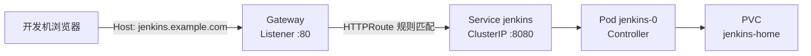
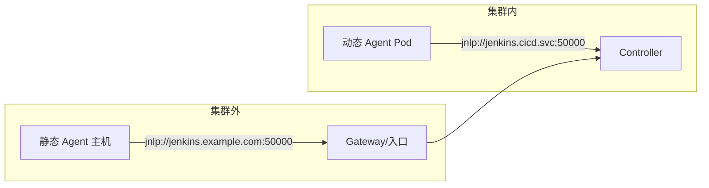

# 第三章：工具集群部署 Jenkins Controller

## 3.1 本章目标

完成本章后，你应能够：

- 说明 Jenkins Controller 的职责边界，以及为什么它不适合承担业务构建任务。
- 对比 Helm 部署与手写清单部署两种方式的适用场景。
- 理解 `JENKINS_HOME` 的持久化模型，并为实验环境规划 PVC 和备份策略。
- 通过 Service 与 Gateway API 的 Gateway、HTTPRoute 将 Jenkins 暴露为 `jenkins.example.com`。
- 完成管理员初始化、插件源配置和时区设置。
- 说明 Jenkins URL 与 Agent 通信（JNLP 50000 端口）的网络要求。
- 将容器资源限制与 JVM 参数对齐，避免 OOMKilled。
- 理解 Jenkins Controller 高可用的边界和实验环境的取舍。
- 独立完成部署、访问、持久化验证和基础健康检查。

## 3.2 前置条件

本章假设第二章已经完成，实验环境应满足以下条件：

| 条件 | 用途 | 验证方式 |
|---|---|---|
| 集群各节点 Ready | 承载 Jenkins Pod | `kubectl get nodes` 全部 Ready |
| `cicd` 命名空间已创建 | 部署目标命名空间 | `kubectl get ns cicd` |
| 默认 StorageClass 已配置 | 自动创建 PVC | `kubectl get sc` 存在 `(default)` 标记 |
| Gateway API CRD 与 Istio GatewayClass 就绪 | 暴露访问入口 | `kubectl get gatewayclass` 存在 `istio` |
| 节点已按规划打标签 | 约束 Jenkins 调度 | `example.com/pool=cicd` 节点存在 |
| Helm 3 已安装（开发机） | 安装 Jenkins chart | `helm version` 正常输出 |
| 开发机 `kubectl` 可访问集群 | 执行部署命令 | `kubectl get ns` 正常输出 |

若开发机尚未安装 Helm，可先完成以下步骤（执行位置：开发机，需要普通用户权限；安装方式以 Helm 官方文档为准）：

```bash
# 以官方文档为准，以下为常见安装方式之一
curl -fsSL https://raw.githubusercontent.com/helm/helm/main/scripts/get-helm-3 | bash
helm version   # 预期输出 version.BuildInfo{...}，版本 v3.x
```

> 本章命令中的域名、密码一律使用占位符，例如 `jenkins.example.com`、`<ADMIN_PASSWORD>`。不要把真实凭证写入文档、脚本或命令历史。

## 3.3 核心原理

### 3.3.1 Controller 的职责与边界

Jenkins Controller 是整个 CI/CD 系统的"大脑"，但它只负责编排，不负责执行：

| Controller 应该承担的工作 | Controller 不应该承担的工作 |
|---|---|
| 解析与调度流水线（Pipeline） | 编译代码、运行单元测试 |
| 管理节点（Agent）的注册与任务分发 | 构建镜像、推送制品 |
| 存储任务定义、凭证、构建历史 | 承载长时间运行的构建进程 |
| 提供 Web UI 与 REST API | 承接高 CPU / 高内存的工作负载 |
| 触发与记录发布流程 | 直接操作目标环境（应交给 Agent 执行） |

第一章 1.5.2 已经说明：构建任务必须交给 Agent。Controller 一旦被构建任务拖垮，所有流水线的调度、Webhook 接收和 UI 都会受影响。第四章会把 Controller 内置节点的 Executor 数设为 0，从机制上落实这一原则。

### 3.3.2 部署方式对比：Helm 与手写清单

| 维度 | Helm Chart 部署 | 手写清单部署 |
|---|---|---|
| 初始工作量 | 低，参数化配置即可 | 高，需自建全部资源 |
| 可维护性 | 高，升级与回滚由 Helm 管理 | 依赖人工维护多份 YAML |
| 社区维护 | jenkins/jenkins 官方 chart 持续更新 | 无 |
| 参数化能力 | values.yaml 统一收敛配置 | 需要模板工具自行实现 |
| 学习成本 | 需理解 chart 结构与字段语义 | 直接，适合理解底层资源 |
| 适用场景 | 标准生产与实验部署 | 教学与特殊定制场景 |

本课程主推 Helm 部署：配置收敛在 `jenkins-values.yaml` 中，便于版本管理和复现实验。手写清单（StatefulSet + Service + PVC + ServiceAccount）留给读者作为练习，用于验证对资源组成的理解，两者最终创建的资源是同构的。

### 3.3.3 持久化模型：JENKINS_HOME 与 PVC

Controller 的全部状态几乎都存放在 `JENKINS_HOME`（容器内 `/var/jenkins_home`）：

```text
/var/jenkins_home/
├── jobs/            # 任务定义与构建历史
├── plugins/         # 已安装插件
├── secrets/         # 凭证、密钥、初始密码（裸安装时）
├── users/           # 用户数据
├── config.xml       # 核心配置
└── ...
```

结论很直接：**Pod 可以随时销毁，PVC 不能丢**。chart 默认通过 StatefulSet 的 `volumeClaimTemplates` 自动创建 PVC。数据丢失的后果包括任务定义消失、凭证失效、用户体系重建。

备份策略分三个层次：

| 层次 | 内容 | 方式 |
|---|---|---|
| 配置层 | 系统配置、插件列表 | JCasC（Configuration as Code），配置文件进 Git |
| 任务层 | 任务定义 | Job DSL / JCasC 任务定义导出，或定期导出 XML |
| 数据层 | 构建历史、工件、凭证密钥 | 卷快照或 Velero 备份 PVC |

配置层的理想状态是"Jenkins 可重建"：拿着 Git 中的 JCasC 配置和 values 文件，能在空集群里还原出一个等价实例。数据层备份则决定构建历史能追溯多远。

### 3.3.4 访问链路：Service 与 Gateway API

实验环境不使用 Ingress，入口统一走 Gateway API（Istio 实现，第二章已安装 GatewayClass）：



关键点：

- Service 只需 `ClusterIP` 类型，不直接对集群外暴露。
- Gateway 负责监听端口与域名，HTTPRoute 负责"哪个域名路由到哪个 Service"。
- HTTPRoute 与 Service 在同一命名空间时可直接引用；跨命名空间引用需要 `ReferenceGrant`（第二章已规划）。
- TLS 证书可在 Gateway Listener 上配置，实验环境可先用 HTTP，生产环境必须 HTTPS。

### 3.3.5 Controller 与 Agent 的通信模型

Controller 与 Agent 之间的通信走 JNLP 协议，默认 TCP 50000 端口：



网络要求分两种情况：

| 场景 | Agent 访问 Controller 的地址 | 网络要求 |
|---|---|---|
| 集群内动态 Agent（第六章） | 集群内 Service DNS | 无额外要求，Service 已暴露 50000 |
| 集群外静态 Agent（第四、五章） | 外部域名 `jenkins.example.com` | 需要域名可解析、50000 端口可达，或改用 WebSocket 复用 443 |

因此 50000 端口**不需要对公网暴露**：集群内 Agent 走 Service，集群外 Agent 走内部网络。只有 Agent 分布在不受控网络（如家庭宽带）时才考虑通过入口暴露，且应优先选择 WebSocket 模式。

Jenkins URL 的设置原则：全局配置中的 Jenkins Location URL 使用浏览器可达的外部地址（`https://jenkins.example.com`），它影响 UI 跳转链接、邮件内容和 Webhook 回调地址的生成；Agent 连接地址由 Kubernetes 插件单独处理（第六章展开），两者不必相同。

### 3.3.6 资源限制与 JVM 参数对齐

JVM 堆内存必须小于容器 memory limit，否则会被 OOMKilled：

```text
容器 memory limit: 4Gi
  └── JVM 进程总占用必须 < 4Gi
        ├── 堆 (-Xmx)              → 1g（本课程示例）
        ├── Metaspace               → 数百 MB
        ├── 线程栈、Direct Buffer 等 → 预留
        └── 安全余量                 → 必须保留
```

常见错误对照：

| 错误做法 | 后果 |
|---|---|
| `-Xmx4g` 且 limit 4Gi | OOMKilled，Pod 反复重启 |
| 不设置 requests | 调度时不感知资源需求，节点超卖导致构建排队卡顿 |
| `-Xmx` 与 limit 之间无余量 | Metaspace 增长后仍会 OOMKilled |

### 3.3.7 Controller 高可用的边界

Jenkins 官方对 Controller 多副本（active-active）的支持非常有限：

| 障碍 | 说明 |
|---|---|
| `JENKINS_HOME` 文件锁 | 多实例同时读写同一目录会出现状态损坏 |
| 内存状态 | 运行中的流水线状态、队列缓存在实例内存中，无法跨实例共享 |
| 复杂度 | 需要自定义会话与队列外部化，超出官方支持范围 |

实验与中小规模环境的常见取舍是：**单副本 + PVC + 定期备份 + 快速重建**（配合 JCasC 配置即代码）。Controller 故障影响的是"新构建的启动"，已在运行的构建会在恢复后重试，因此单副本的可用性风险在多数团队可接受。真正必须高可用的是业务应用，而不是 Jenkins 本身。

## 3.4 环境与目录说明

本章在开发机上使用的目录结构：

```text
~/cicd-lab/
└── jenkins/
    ├── jenkins-values.yaml    # Helm 配置（本章核心产物）
    └── gateway-jenkins.yaml   # Gateway 与 HTTPRoute 清单
```

容器内关键路径（排障时使用）：

| 路径 | 用途 |
|---|---|
| `/var/jenkins_home` | JENKINS_HOME，全部持久化状态 |
| `/var/jenkins_home/secrets/` | 密钥与初始密码（chart 部署时密码在 Secret 中） |
| `/var/jenkins_home/plugins/` | 插件目录 |
| `/var/jenkins_home/war/` | Jenkins Web 应用本体 |

关键环境变量：

| 变量 | 示例值 | 用途 |
|---|---|---|
| `JENKINS_HOME` | `/var/jenkins_home` | 状态目录，chart 已设置 |
| `JAVA_OPTS` / JVM 参数 | `-Xmx1g -Duser.timezone=Asia/Shanghai` | 堆大小与时区 |
| `TZ` | `Asia/Shanghai` | 容器系统时区 |

## 3.5 分步骤部署操作

### 3.5.1 步骤一：添加 Helm 仓库并了解 chart

执行位置：开发机，需要集群访问权限。

```bash
# 添加 Jenkins 官方 chart 仓库
helm repo add jenkins https://charts.jenkins.io
helm repo update

# 查看可用版本，选择当前稳定版（版本号以输出为准）
helm search repo jenkins/jenkins --versions | head -n 5

# 导出完整默认 values 作为参考（遇到字段疑问时查阅）
helm show values jenkins/jenkins > jenkins-values-default.yaml
```

预期输出：`helm search` 列出 chart 各版本；`helm show values` 生成完整默认配置文件。

### 3.5.2 步骤二：编写 values 文件

执行位置：开发机。创建 `jenkins-values.yaml`，完整内容见 3.6.1。文件确定五件事：

1. Service 类型为 ClusterIP，暴露 8080（Web）与 50000（Agent 连接）。
2. 持久化 20Gi，使用默认 StorageClass。
3. 资源 requests/limits 与 JVM 参数对齐。
4. 预装课程后续章节需要的插件。
5. 通过 nodeSelector 将 Controller 固定在 cicd 节点池。

> 提醒：不同 chart 版本的字段名可能调整（例如 JVM 参数字段），以 `helm show values` 的实际输出为准。

### 3.5.3 步骤三：安装 Jenkins

执行位置：开发机，需要对 `cicd` 命名空间的部署权限。

```bash
# 安装（--wait 等待就绪；首次拉取镜像与安装插件可能需要数分钟）
helm upgrade --install jenkins jenkins/jenkins \
  --namespace cicd \
  --values jenkins-values.yaml \
  --timeout 10m

# 观察 Pod 状态，直至 Running
kubectl -n cicd get pods -w
# 预期：jenkins-0 进入 Running 且 READY 1/1
```

chart 以 StatefulSet 部署，Pod 名为 `jenkins-0`。首次启动时安装插件可能耗时较长，`kubectl -n cicd describe pod jenkins-0` 可看到就绪探针未通过属正常现象。

### 3.5.4 步骤四：创建 Gateway 与 HTTPRoute

执行位置：开发机。创建 `gateway-jenkins.yaml`（完整内容见 3.6.2）后应用：

```bash
kubectl -n cicd apply -f gateway-jenkins.yaml

# 查看 Gateway 分配的入口地址
kubectl -n cicd get gateway,httproute
# 预期：Gateway 显示 ADDRESS（IP）；HTTPRoute 显示 Accepted True
```

将入口地址写入开发机 hosts（若集群 DNS 尚未覆盖外部域名；执行位置：开发机，需要修改 hosts 的权限）：

```bash
echo "<GATEWAY_IP> jenkins.example.com" | sudo tee -a /etc/hosts
```

### 3.5.5 步骤五：管理员初始化

chart 部署**跳过了安装向导**，管理员密码已经生成在 Secret 中（执行位置：开发机）：

```bash
# 获取管理员用户名与密码（Secret 名称与 release 同名）
kubectl -n cicd get secret jenkins \
  -o jsonpath='{.data.jenkins-admin-user}' | base64 -d; echo
# 预期：admin

kubectl -n cicd get secret jenkins \
  -o jsonpath='{.data.jenkins-admin-password}' | base64 -d; echo
# 预期：<ADMIN_PASSWORD>（随机字符串，妥善保存）
```

浏览器访问 `http://jenkins.example.com`，使用 `admin` / `<ADMIN_PASSWORD>` 登录。首次登录后建议立即修改密码（用户页面 → Configure → Password），并把新密码存入团队密码管理工具。

> 注意：裸安装 Jenkins 时的 `/var/jenkins_home/secrets/initialAdminPassword` 方式不适用于 chart 部署，chart 已预设密码并跳过向导。

### 3.5.6 步骤六：插件源、时区与基础检查

**插件源**（网络受限环境）：Manage Jenkins → Plugins → Advanced settings，将 Update Site 替换为镜像源。国内常用镜像（如清华 TUNA）的地址以镜像站公告为准：

```text
默认：  https://updates.jenkins.io/update-center.json
镜像：  https://mirrors.tuna.tsinghua.edu.cn/jenkins/updates/current/update-center.json
```

替换后在 Plugins 页面执行 "Check now" 刷新索引。若集群已按第二章配置了容器镜像加速，Jenkins 主镜像的拉取已覆盖，此处处理的是插件下载。

**时区验证**：登录后系统时间应为东八区。本章 values 已通过 JVM 参数与 `TZ` 环境变量设置 `Asia/Shanghai`，验证方式：

```bash
kubectl -n cicd exec jenkins-0 -- date
# 预期：输出 CST (China Standard Time) 时间，与本地时间一致
```

**基础健康检查**：

```bash
# 1. Pod 与 Service 状态
kubectl -n cicd get pods,svc
# 预期：jenkins-0 Running；svc/jenkins 显示 8080 与 50000 两个端口

# 2. PVC 已绑定
kubectl -n cicd get pvc
# 预期：jenkins-home-jenkins-0（名称以实际输出为准）STATUS 为 Bound

# 3. Web 可达
curl -s -o /dev/null -w '%{http_code}\n' http://jenkins.example.com/login
# 预期：200

# 4. 系统日志无持续报错
kubectl -n cicd logs jenkins-0 --tail=50
# 预期：无反复出现的 ERROR
```

## 3.6 配置文件完整示例

### 3.6.1 jenkins-values.yaml

```yaml
# ============================================================
# Jenkins Controller Helm 配置（本课程实验环境）
# 安装：helm upgrade --install jenkins jenkins/jenkins -n cicd -f jenkins-values.yaml
# 字段以所用 chart 版本的 helm show values 输出为准
# ============================================================

controller:
  # ---------- 基本标识 ----------
  # Jenkins Location URL：浏览器与 Webhook 使用的外部地址
  jenkinsUrl: http://jenkins.example.com

  # ---------- 镜像与运行参数 ----------
  image:
    repository: jenkins/jenkins
    tag: "2.504.2-lts"          # 使用 LTS 版本，实验时替换为当前稳定 LTS
  # JVM 参数：堆必须小于 resources.limits.memory，预留 Metaspace 余量
  jvmArgs: "-Xmx1g -Duser.timezone=Asia/Shanghai"
  # 容器时区
  env:
    - name: TZ
      value: Asia/Shanghai

  # ---------- Service ----------
  serviceType: ClusterIP        # 只经 Gateway API 暴露，不用 LoadBalancer
  # Web 端口 8080；Agent 连接端口 50000 由 chart 默认暴露，无需修改

  # ---------- 资源：与 JVM 参数对齐 ----------
  resources:
    requests:
      cpu: "1"
      memory: 2Gi
    limits:
      cpu: "2"
      memory: 4Gi               # -Xmx1g + 余量，避免 OOMKilled

  # ---------- 持久化 ----------
  persistence:
    enabled: true
    size: 20Gi
    storageClass: ""            # 空字符串 = 使用默认 StorageClass

  # ---------- 调度：固定在 cicd 节点池（worker1） ----------
  nodeSelector:
    example.com/pool: cicd
  # worker1 按 2.7.3 规划带有 dedicated=cicd:NoSchedule 污点，必须添加容忍度：
  tolerations:
    - key: dedicated
      operator: Equal
      value: cicd
      effect: NoSchedule

  # ---------- 插件 ----------
  # 预装课程所需插件；插件的启用与详细配置在后续章节完成
  installPlugins:
    - kubernetes                    # 第六章：动态 Agent
    - workflow-aggregator           # Pipeline 全家桶
    - git                           # 代码拉取
    - gitlab-plugin                 # 第十章：Webhook 触发
    - credentials-binding           # 第十一章：凭证绑定
    - configuration-as-code         # 配置即代码
    - prometheus                    # 第四章：构建指标
    - opentelemetry                 # 第四章：构建 Trace 关联

  # ---------- 声明式配置入口（后续章节逐步填充）----------
  # JCasC: configScripts:
  #   my-config: |
  #     jenkins:
  #       ...

  # ---------- 架构原则提示 ----------
  # 本课程在第四章将内置节点 Executor 设为 0，Controller 只编排不构建

serviceAccount:
  create: true
  name: jenkins               # 第六章 Kubernetes 插件将复用此 ServiceAccount
```

### 3.6.2 gateway-jenkins.yaml

```yaml
# ============================================================
# Jenkins 的 Gateway API 入口（Istio 实现，GatewayClass 由第二章安装）
# ============================================================

# 入口网关：监听 80 端口，仅接受同命名空间路由
apiVersion: gateway.networking.k8s.io/v1
kind: Gateway
metadata:
  name: cicd-gateway
  namespace: cicd
spec:
  gatewayClassName: istio      # 第二章安装的 GatewayClass
  listeners:
    - name: http
      port: 80
      protocol: HTTP
      allowedRoutes:
        namespaces:
          from: Same          # 只允许 cicd 内的 HTTPRoute 挂载
---
# 路由：jenkins.example.com → Service jenkins:8080
apiVersion: gateway.networking.k8s.io/v1
kind: HTTPRoute
metadata:
  name: jenkins
  namespace: cicd
spec:
  parentRefs:
    - name: cicd-gateway
  hostnames:
    - jenkins.example.com     # 实验环境替换为实际域名
  rules:
    - backendRefs:
        - name: jenkins
          port: 8080
```

> 生产环境应在 Listener 上配置 TLS（引用证书 Secret，可配合 cert-manager 自动签发），并使用 HTTPS 域名。Gateway 所在命名空间与 HTTPRoute 不同时，还需配合第二章规划的 `ReferenceGrant`。

## 3.7 验证命令与预期结果

### 3.7.1 部署完整性验证

```bash
# 执行位置：开发机
# 1. 全部资源就绪
kubectl -n cicd get statefulset,svc,pvc,pod
# 预期：jenkins StatefulSet 1/1；svc/jenkins 两端口；PVC Bound；jenkins-0 Running

# 2. Gateway 与路由生效
kubectl -n cicd get gateway cicd-gateway -o wide
kubectl -n cicd get httproute jenkins -o jsonpath='{.status.parents[0].conditions}'
# 预期：Gateway 有 ADDRESS；HTTPRoute 条件 Accepted=True、ResolvedRefs=True

# 3. Web 登录页可达
curl -s -o /dev/null -w '%{http_code}\n' http://jenkins.example.com/login
# 预期：200
```

### 3.7.2 持久化验证（重启 Pod 后数据仍在）

```bash
# 执行位置：开发机；影响：Jenkins 会短暂中断约 1～2 分钟
kubectl -n cicd delete pod jenkins-0
kubectl -n cicd get pods -w
# 预期：新 jenkins-0 重新调度并 Running（PVC 被重新挂载）

# 再次登录 Web：已修改的管理员密码、已调整的设置应保持不变
```

### 3.7.3 Helm 发布验证

```bash
helm -n cicd list
# 预期：jenkins chart，STATUS 为 deployed

helm -n cicd status jenkins
# 预期：显示资源清单与 NOTES（含访问提示）
```

## 3.8 常见问题与排查路径

### 问题一：Pod 一直 Pending

```bash
kubectl -n cicd describe pod jenkins-0
```

按 Events 中的原因分流：

- `persistentvolumeclaim ... not bound`：默认 StorageClass 未配置或无可用 PV，回到第二章检查 `kubectl get sc`。
- `0/x nodes are available`：节点资源不足，或 nodeSelector 与节点标签不匹配，或缺少污点容忍。

### 问题二：ImagePullBackOff

```bash
kubectl -n cicd describe pod jenkins-0 | grep -A3 Events
```

Jenkins 主镜像拉取失败：确认第二章的 containerd 镜像加速配置生效，或改用可达的镜像仓库地址（修改 values 中 `controller.image.repository`）。

### 问题三：插件安装超时，Pod 长时间不 Ready

chart 在首次启动时安装插件，若插件更新中心不可达会持续重试：

1. 先临时绕过：将 `installPlugins` 清单暂时精简为空列表安装，事后在 UI 中手动安装。
2. 根治：按 3.5.6 配置镜像源，或确认集群出网正常。
3. 网络完全受限的环境可考虑构建预置插件的私有镜像。

### 问题四：HTTPRoute 已创建但访问不通

排查顺序：

```bash
kubectl -n cicd get gateway cicd-gateway   # ADDRESS 是否为空
kubectl -n cicd describe httproute jenkins # 条件是否 Accepted
curl -H 'Host: jenkins.example.com' http://<GATEWAY_IP>/login   # 直接用 IP + Host 头测试
```

- Gateway 无 ADDRESS：实验环境 LoadBalancer 不可用，检查 Istio 入口网关的暴露方式（第二章）。
- 用 IP + Host 头可达而域名不通：开发机 DNS/hosts 解析问题。
- 条件不是 Accepted：核对 parentRefs、hostnames 与 Gateway Listener。

### 问题五：管理员密码不正确

- 确认 Secret 名称与 release 名一致（本章 release 名为 `jenkins`）。
- 确认解码命令完整（`base64 -d`）。
- 若曾修改过密码，Secret 中仍是初始值，以修改后的为准。

### 问题六：Web 界面时间与本地差 8 小时

未生效的时区配置：确认 `jvmArgs` 中的 `-Duser.timezone=Asia/Shanghai` 与 `TZ` 环境变量都已写入（`kubectl -n cicd exec jenkins-0 -- date` 验证），修改后需要重启 Pod。

## 3.9 安全注意事项

- 管理员密码获取后立即修改默认值，并妥善保存；不把密码写入 values、脚本或文档。
- Jenkins 必须经 HTTPS 暴露到生产或共享网络；实验环境使用 HTTP 仅限内网。
- `jenkins-admin-password` 类 Secret 权限应收敛，避免无关人员读取。
- 保持 CSRF 防护开启（默认开启），Webhook 相关的跨域问题在第十章用正确方式解决，而不是关闭防护。
- 插件只从可信更新中心安装，及时更新安全补丁版本。
- 不在 Controller 上执行构建任务（第四章将把内置节点 Executor 设为 0），缩小攻击面。
- PVC 备份中包含凭证密钥，备份存储的访问控制应与 Jenkins 本身同级。
- 定期检查 Manage Jenkins → Security 页面的告警项。

## 3.10 本章实验

### 实验目标

在 `cicd` 命名空间部署 Jenkins Controller，完成 Web 访问、管理员初始化、PVC 持久化验证和基础健康检查。

### 实验步骤

1. 按 3.5.1～3.5.4 完成 chart 安装与 Gateway API 入口配置。
2. 获取管理员密码并登录，立即修改密码。
3. 记录当前 Jenkins 版本与 Kubernetes 插件版本（Manage Jenkins → Plugins），填入课程版本记录表（README 3.2）。
4. 在 System 页面确认 Jenkins URL 为 `http://jenkins.example.com`。
5. 创建一个测试凭据（Manage Jenkins → Credentials → 添加一个 Secret text，内容随意），作为持久化验证的标记。
6. 删除 `jenkins-0` Pod，等待重建后验证登录密码与测试凭据仍然存在。
7. 执行 3.7 全部验证命令并记录输出。

### 验收标准

- [ ] `jenkins-0` Pod 处于 Running，PVC 状态为 Bound。
- [ ] 通过 `http://jenkins.example.com` 可访问并登录 Jenkins。
- [ ] 管理员默认密码已修改并妥善保存。
- [ ] Gateway 显示入口地址，HTTPRoute 条件 Accepted=True。
- [ ] 删除 Pod 后，管理员密码与测试凭据均保持不变（PVC 持久化生效）。
- [ ] `kubectl -n cicd exec jenkins-0 -- date` 输出东八区时间。
- [ ] 系统日志（`kubectl -n cicd logs jenkins-0`）无持续 ERROR。
- [ ] Jenkins 与关键插件版本已记入课程版本记录表。

## 3.11 思考题

1. 为什么 Jenkins Controller 的 Service 用 ClusterIP 而不是 LoadBalancer？两种方式在安全性和运维上有什么差别？
2. `-Xmx` 设置为与容器 memory limit 相同的值会怎样？JVM 进程的内存只有堆吗？
3. Jenkins 官方为什么不支持 Controller 的 active-active 高可用？如果业务要求 Jenkins 尽量高可用，你会怎么设计？
4. `JENKINS_HOME` 中的哪些内容适合用 JCasC 管理，哪些必须靠卷备份？
5. 集群外的一台静态 Agent 要连接 Controller，50000 端口的可达性有哪几种实现方式？各自的安全影响是什么？
6. 为什么说 "Controller 可被空集群重建" 是一个有价值的目标？它对配置管理提出了什么要求？
7. 插件更新中心配置镜像源解决了什么问题？还有哪些环节可能受网络限制影响？
8. 如果 PVC 被误删除，会丢失什么？实验中如何降低这种损失？

## 3.12 本章小结

本章在第二章准备的集群上部署了 Jenkins Controller：

- Controller 只做编排不做执行，构建任务交给 Agent 的原则从部署阶段就要落实。
- Helm 部署以 `jenkins-values.yaml` 收敛配置，可维护、可复现；StatefulSet 保证 `JENKINS_HOME` 挂载在 PVC 上。
- 访问链路是 Gateway → HTTPRoute → ClusterIP Service，50000 端口只需集群内可达。
- 资源限制与 JVM 堆对齐是稳定性的前提，错配的直接后果是 OOMKilled。
- 高可用采取单副本 + 备份 + JCasC 快速重建的务实取舍。
- 预装的 Kubernetes、GitLab、Prometheus、OpenTelemetry 等插件将在后续章节逐一启用。

Jenkins 平台已经就位，但还没有任何 Agent，也没有完成初始化配置。下一章将深入 Controller/Agent 主从架构原理，完成用户、权限、凭证等基础配置，并接入第一个静态 Agent、运行第一条流水线。
