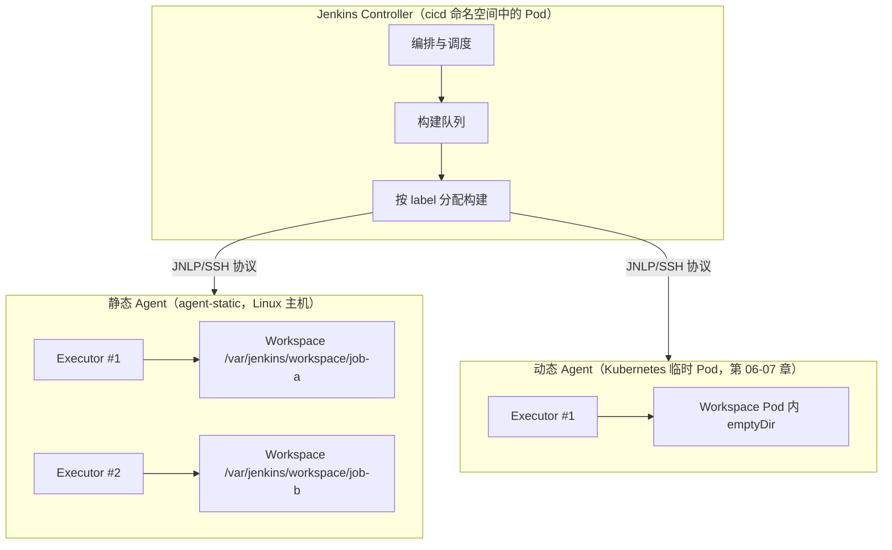
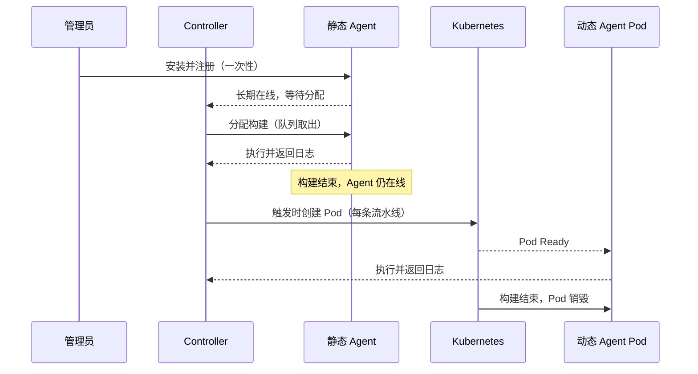

# 第四章：Jenkins 初始化与主从架构原理

## 4.1 本章目标

完成本章后，你应能够：

- 说明 Controller、Agent、Executor、Workspace 四个概念的关系和各自承担的资源。
- 解释为什么不应在 Controller 上执行业务构建任务，并完成"内置节点 0 Executor"配置。
- 从生命周期角度比较静态 Agent 与动态 Agent 的差异。
- 说明节点标签与流水线 `label` 的匹配调度规则。
- 完成 Manage Jenkins 中的系统配置、全局工具配置和插件管理的基本导览。
- 配置 Matrix Authorization Strategy，实现 admin、devops、viewer 三类角色的权限划分。
- 区分 Jenkins 全局凭证的类型与作用域，并按最小权限原则创建凭证。
- 使用 `withCredentials` 在流水线中安全使用凭证，理解日志脱敏机制。
- 定位构建日志、节点日志和 Pipeline Steps 视图。
- 说明如何用 Prometheus 指标和 OpenTelemetry Trace 观察构建与发布。
- 独立完成：创建实验凭证、接入一个最简 Inbound 静态 Agent、运行第一条流水线并记录构建观测数据。

## 4.2 前置条件

本章假设第 03 章已完成：Jenkins 已通过 Helm 部署在 `cicd` 命名空间，并且可以经 `https://jenkins.example.com` 访问，管理员初始密码已完成解锁。除此之外，建议准备：

| 工具/资源 | 用途 |
|---|---|
| Jenkins 管理员账号 | 完成系统配置、安全配置和节点管理 |
| kubectl 与集群 kubeconfig | 查看 Jenkins Pod、日志和 Service（本章仅需只读权限即可完成大部分操作） |
| 一台集群外 Linux 主机（或一个临时 Pod） | 作为最简 Inbound 静态 Agent 接入 |
| Java 运行环境（Agent 主机上） | 运行 agent.jar 建立 Inbound 连接 |
| 浏览器 | 操作 Jenkins Web UI |
| 文本编辑器 | 编写 Jenkinsfile |

> 本章所有密码、Token、私钥一律使用占位符（如 `<JENKINS_ADMIN_PASSWORD>`、`<AGENT_SECRET>`）。不要把真实凭证写入文档、Git 仓库或构建日志。

## 4.3 核心概念：Controller、Agent、Executor 与 Workspace

### 4.3.1 四个概念的关系

Jenkins 采用"控制器 + 代理"的分布式架构。四个核心概念的关系如下：



四个概念的定义与资源占用：

| 概念 | 定义 | 所在位置 | 占用的资源 |
|---|---|---|---|
| Controller | Jenkins 主控进程，负责 Web UI、配置存储、任务编排、队列调度和凭证管理 | `cicd` 命名空间中的 Jenkins Pod | 主要消耗内存和 JVM 堆；不应执行构建 |
| Agent | 注册到 Controller 的执行节点，接收构建指令并返回结果 | 静态：独立主机；动态：临时 Pod | 主机或 Pod 的 CPU、内存、磁盘 |
| Executor | Agent 上的并发执行槽位，一个 Executor 同一时刻只跑一个构建 | Agent 进程内 | 决定单节点并发构建数 |
| Workspace | 构建工作目录，存放 Checkout 的代码和构建产物 | Agent 文件系统 | 磁盘空间；随构建积累，需要清理策略 |

一次构建在四个层面分别发生的事情：

```text
Controller：接收触发（Webhook/手动）→ 入队 → 按 label 选择 Agent → 下发构建脚本
Agent：      接收指令 → 在某个空闲 Executor 上启动构建进程
Executor：   整个构建期间被占用；构建结束（无论成败）后释放
Workspace：  Checkout 代码写入此处，构建产物也产生于此；同任务下次构建默认复用
```

> 关键理解：`node('label')` 或 Declarative 的 `agent { label 'xxx' }` 选择的是 **Agent**；流水线中的并发步骤则可能占用同一 Agent 的多个 Executor。Executor 数量与 Workspace 复用是后面排查"构建互相踩踏""磁盘占满"问题的基础。

### 4.3.2 为什么不建议在 Controller 上执行构建

在第 03 章部署的 Jenkins Controller 上执行构建存在以下问题：

| 问题 | 说明 |
|---|---|
| 攻击面扩大 | Jenkinsfile 中可执行任意 Shell 命令。构建直接跑在 Controller 上，等于把宿主文件系统、JENKINS_HOME（含加密后的凭证）暴露给构建脚本 |
| 资源争抢 | 构建的 CPU/内存峰值会直接影响 Web UI 响应、Webhook 处理和调度，严重时 OOM 导致全部任务中断 |
| 稳定性耦合 | 一个失控的构建（如 fork 炸弹、占满磁盘）可能拖垮整个 Jenkins，影响所有项目 |
| 环境污染 | 构建残留的工具、缓存和进程长期堆积在 Controller 上，难以清理和审计 |
| 无法隔离 | 不同项目的构建在同一台节点上共享文件系统，私有代码和凭证泄露风险高 |

因此本课程从本章起执行一条纪律：

```text
原则：Controller 内置节点（built-in node）保持 0 个 Executor，所有构建必须发生在 Agent 上。
```

配置方法（执行位置：Jenkins Web UI；所需权限：Administer；影响：立即生效，之后任何未指定 Agent 的流水线将排队等待而非在 Controller 上运行）：

1. 进入 `Manage Jenkins` → `Nodes`（旧版本为 `Nodes and Clouds` / `Manage Nodes`）。
2. 点击 `Built-In Node`（旧称 `master` 节点）。
3. 将 `Number of executors` 设置为 `0`。
4. 保存。截图位置：该配置页面的文字描述——"Built-In Node 设置页，Executors 一栏显示为 0"。

### 4.3.3 静态 Agent 与动态 Agent 的生命周期差异

本章先从原理层面建立对比，第 05 章再做完整实操比较：

| 维度 | 静态 Agent | 动态 Agent（Kubernetes Pod，第 06-07 章） |
|---|---|---|
| 创建时机 | 人工安装并手动注册，长期在线 | 流水线触发时由 Controller 调 Kubernetes API 创建 |
| 生命周期 | 以周/月为单位，人工下线 | 以分钟为单位，构建结束即销毁 |
| Executor 数量 | 固定配置（如 2） | 随 Pod 创建，通常 1 个 |
| Workspace | 持久保留在主机磁盘，可跨构建复用缓存 | 随 Pod 销毁（除非挂 PVC），每次全新 |
| 工具链 | 手工安装维护，容易漂移 | 固化在镜像中，版本可复现（第 16 章） |
| 资源利用率 | 空闲时仍占用主机资源 | 按需占用集群资源 |
| 隔离性 | 弱：同节点多项目共享文件系统 | 强：每次构建独立 Pod |
| 适用场景 | 少量稳定任务、需要持久缓存的场景 | 大多数 CI/CD 构建（本课程主线） |



## 4.4 Jenkins 初始化导览：Manage Jenkins

（执行位置：Jenkins Web UI；所需权限：Administer；以下均为一次性初始化配置。）

### 4.4.1 系统配置（System）

进入 `Manage Jenkins` → `System`，本章需要确认的项目：

| 配置项 | 建议值 | 说明 |
|---|---|---|
| Jenkins URL | `https://jenkins.example.com/` | 必须与外部访问地址一致，影响 Webhook 回调、Agent 连接和邮件链接 |
| 执行器数量（Controller） | `0` | 见 4.3.2 原则 |
| 全局属性 → 环境变量 | 按需添加 `TZ=Asia/Shanghai` 等 | 避免构建日志时间与本地时间不一致 |
| Shell | `/bin/bash` | 默认 `/bin/sh`，显式指定可避免脚本语法差异 |

### 4.4.2 全局工具配置（Tools）

进入 `Manage Jenkins` → `Tools`（旧版本在 Global Tool Configuration）。这里可以定义 JDK、Git、Maven、Node.js 等工具的安装方式。两种思路的对比：

| 思路 | 做法 | 优点 | 缺点 |
|---|---|---|---|
| 全局工具自动安装 | 在 Tools 页配置工具版本，由 Jenkins 下载解压到 Agent | 集中管理，Agent 主机无需预装 | 依赖外网下载；不同 Agent 下载结果可能不一致；首次构建慢 |
| 工具内置在 Agent 镜像 | 工具在构建 Agent 镜像时预装（第 16 章），流水线直接调用 PATH 中的命令 | 版本完全可复现；无运行时下载；启动即用 | 换工具版本需要重新构建镜像 |

本课程采用第二种思路：**工具链固化在 Agent 镜像中**，全局工具配置仅用于声明路径（或完全不用）。理由是第 01 章强调的"可复现"原则——构建环境本身也应该是不可变的制品。本章静态 Agent 实验中，我们只在 Agent 主机上手工安装 JDK 和 Git 作为过渡。

### 4.4.3 插件管理（Plugins）

进入 `Manage Jenkins` → `Plugins` → `Available plugins`。本章实验所需的插件：

| 插件 | 用途 |
|---|---|
| Git | 流水线中 Checkout 代码（通常已随部署安装） |
| Pipeline | Declarative Pipeline 支持（核心自带） |
| Kubernetes（暂不配置） | 第 06 章动态 Agent 使用，可先安装 |
| Prometheus metrics | 4.8 节构建指标暴露 |
| OpenTelemetry | 4.9 节构建 Trace 关联 |

安装方式：勾选后点击 `Install`，建议勾选"安装后重启 Jenkins"选项放在维护窗口执行。插件升级前应先在测试环境验证，并注意记录版本（对应 README 3.2 版本策略 4.4.4 安全配置（Security）

进入 `Manage Jenkins` → `Security`，本章关注两处：

- `Authentication`：用户来源。保持"Jenkins 自己的用户数据库"，禁止允许匿名注册。
- `Authorization`：授权策略。默认可能是"任何用户可以做任何事"（Logged-in users can do a full control），必须改为 Matrix Authorization Strategy，见 4.5 节。

## 4.5 用户、角色与权限

### 4.5.1 三类角色设计

本课程的实验用户模型：

| 角色 | 典型用户 | 职责 |
|---|---|---|
| admin | 平台管理员 | 系统配置、节点管理、凭证管理、全局安全 |
| devops | 流水线开发者 | 创建/编辑 Job、读取凭证（通过流水线）、触发构建、查看日志 |
| viewer | 观察者（如测试、产品） | 只读：查看 Job、构建历史和日志 |

### 4.5.2 配置 Matrix Authorization Strategy

（执行位置：Jenkins Web UI → `Manage Jenkins` → `Security`；所需权限：Administer；影响：保存后立即生效，**注意先给自己勾上 Overall/Administer 再保存，否则会把自己锁在门外**。）

操作步骤的文字描述（截图位置：Authorization 矩阵表格整体）：

1. Authorization 选择 `Matrix Authorization Strategy`（旧版为 Matrix-based security）。
2. 点击 `Add user or group`，依次添加 `admin`、`devops`、`viewer` 三个用户（用户需先在 `Manage Jenkins` → `Users` 中创建，密码用占位符如 `<DELOPS_PASSWORD>`）。
3. 按下表勾选权限：

| 权限项 | admin | devops | viewer |
|---|---|---|---|
| Overall / Administer | ✔ | — | — |
| Overall / Read | ✔ | ✔ | ✔ |
| Overall / System Read | ✔ | — | — |
| Credentials / Create、Update、Delete | ✔ | — | — |
| Credentials / View | ✔ | ✔ | — |
| Job / Create、Configure、Build、Cancel | ✔ | ✔ | — |
| Job / Read、Discover | ✔ | ✔ | ✔ |
| Job / Workspace | ✔ | ✔ | — |
| View / Create、Configure | ✔ | ✔ | — |
| View / Read | ✔ | ✔ | ✔ |
| Run / Read、Update | ✔ | ✔ | ✔（仅 Read） |
| Node / Build、Connect、Create、Delete、Configure | ✔ | — | — |
| Node / Read | ✔ | ✔ | ✔ |

配置要点：

- devops **没有** Administer 和 Credentials 写权限：凭证由管理员统一创建，devops 只能在流水线中引用，不能查看明文。
- viewer 只有只读权限，看不到 Workspace 和凭证列表，防止源码与凭证泄露。
- 保存后用一个 devops 账号登录验证：应能建 Job、不能进系统管理页面；用 viewer 账号验证：能看构建日志、不能点 Build Now。

### 4.5.3 审计

谁在什么时候改了配置、触发/取消了哪次构建，是发布回溯（第 15 章）的输入之一。思路：

- 安装 Audit Trail 插件，将审计日志写入 `JENKINS_HOME/audit.log`（由 PVC 持久化，第 03 章）。
- 审计内容至少包含：登录成功/失败、配置变更、Job 创建与删除、构建触发与取消、凭证增删。
- 日志应随 PVC 备份策略一起备份，并定期导出到 Loki 等日志系统（可观测平台就绪后）。

## 4.6 全局凭证：类型、作用域与最小权限

### 4.6.1 凭证类型

（管理入口：Jenkins Web UI → `Manage Jenkins` → `Credentials` → `System` → `Global credentials`；所需权限：Credentials/Create。）

| 类型 | 适用场景 | 课程中的使用方 |
|---|---|---|
| Secret text | API Token，如 GitLab 访问令牌 | Jenkins 调 GitLab API、Webhook Token 校验（第 10 章） |
| Username with password | HTTP 协议登录，如 Harbor 机器人账户 | Agent 推送镜像 `docker login`（第 09、12 章） |
| SSH Username with Private Key | Git SSH 拉取私有仓库 | Agent Checkout 代码（第 08 章） |
| Secret file | 整个文件内容保密，如受限 kubeconfig | 发布阶段访问目标集群（第 13 章） |

### 4.6.2 作用域

| 作用域 | 可见范围 | 使用建议 |
|---|---|---|
| Global | 全部 Job 和 Pipeline 可引用 | 大多数构建凭证放这里 |
| System | 仅供 Jenkins 自身（如 Agent 连接、Webhook 处理）使用，Job 不能引用 | 少数系统级场景 |

课程约定：与具体项目相关的凭证用 `Global` 作用域 + 明确的 ID 命名（如 `gitlab-token`、`harbor-robot`、`kubeconfig-dev`），通过命名约定弥补 Global 作用域"人人可引用"的粗粒度，并配合 4.5 节权限矩阵限制谁能管理凭证。

### 4.6.3 最小权限原则

每类凭证只授予其用途所需的最小权限：

| 凭证 | 应有的最小权限 | 明确禁止 |
|---|---|---|
| GitLab Token | 目标项目的 `read_repository` + `api`（触发用） | 使用管理员账号 Token |
| Harbor Robot Account | 单个项目的推/拉镜像权限 | 使用 Harbor 管理员账户 |
| Kubeconfig / ServiceAccount | 仅目标命名空间的指定资源操作（第 13 章细化） | 集群管理员 kubeconfig |

### 4.6.4 在流水线中安全使用凭证

Declarative Pipeline 的 `environment` 与 `withCredentials` 都可以注入凭证，Jenkins 会自动把值在构建日志中替换为 `****`（日志脱敏）。示例（截图位置：构建日志中显示 `****` 的行）：

```groovy
pipeline {
    agent any   // 本章静态 Agent 实验中会替换为具体 label，见 4.10 节
    environment {
        // 引用 Global 凭证：Secret text 类型，ID 为 gitlab-token
        GITLAB_TOKEN = credentials('gitlab-token')
    }
    stages {
        stage('Use credentials') {
            steps {
                // 方式一：environment 注入后直接使用（日志中自动脱敏）
                sh 'echo "token length: ${#GITLAB_TOKEN}"'
                // 方式二：withCredentials 临时绑定，块结束即失效
                withCredentials([usernamePassword(
                        credentialsId: 'harbor-robot',
                        usernameVariable: 'HARBOR_USER',
                        passwordVariable: 'HARBOR_PASS')]) {
                    sh '''
                        # 只使用变量，不回显内容；echo 输出会被 Jenkins 替换为 ****
                        echo "logging in as ${HARBOR_USER}"
                        # docker login "$HARBOR_PASS" ... 实际使用在第 12 章
                    '''
                }
            }
        }
    }
}
```

纪律性要求（与第 01 章 1.11 呼应）：

- 禁止把任何密码、Token、私钥、kubeconfig 明文写入 Jenkinsfile 并提交到 Git。
- 日志脱敏不是万能的：凭证被拼接、Base64 编码或写入文件后仍可能泄露，脚本中不要对凭证做变换输出。
- 凭证 ID 使用稳定的命名约定，便于第 11 章统一封装。

## 4.7 构建日志与节点日志

| 日志 | 位置 | 用途 |
|---|---|---|
| 构建日志（Console Output） | Job → Build #N → Console Output，按构建编号归档在 Controller 的 JENKINS_HOME | 排查单次构建失败的第一入口 |
| Pipeline Steps 视图 | Build #N → Pipeline Steps | 逐条展开每个 step 的参数与耗时，定位卡在哪个步骤 |
| Agent 节点日志 | 静态 Agent：`agent.jar` 进程的标准输出（如 systemd 服务 `journalctl -u jenkins-agent`）；动态 Agent：Pod 日志 `kubectl -n cicd logs <pod>` | 排查 Agent 掉线、Executor 异常、磁盘问题 |
| Controller 日志 | `Manage Jenkins` → `System Log`，或 `kubectl -n cicd logs deploy/jenkins` | 排查调度、Webhook、插件错误 |

要点：

- 构建日志存储在 Controller（JENKINS_HOME/jobs/.../builds/#N/log），因此构建产物和日志归档会占用 Controller 的 PVC 空间——这是 4.3.2 "不在 Controller 构建"之外另一个磁盘压力来源，需配置保留策略（如保留最近 30 次构建）。
- 流水线卡住时，先看 Pipeline Steps 视图确认阻塞步骤，再切到对应 Agent 的日志看进程状态。

## 4.8 构建可观测：指标采集

只看单个构建的成败不够，平台层面需要持续采集以下数据（呼应第 01 章 1.7.7）：

| 观测维度 | 典型问题 | 采集来源 |
|---|---|---|
| 构建耗时 | 哪些 Job 越来越慢？ | Prometheus metrics 插件 |
| 队列时长/队列大小 | 构建在排队还是在执行？Agent 是否不够？ | Prometheus metrics 插件 |
| Agent 状态 | Agent 在线数、离线告警 | Prometheus metrics 插件 / 节点 API |
| 失败率 | 某类任务失败是否突增？ | 构建结果统计 |
| 发布结果 | 每次发布的版本、环境、结果 | Jenkins 构建元数据 + 部署记录（第 14-15 章细化） |

安装 Prometheus metrics 插件后，Jenkins 在 `/prometheus` 端点暴露指标（指标名以插件实际版本为准，以下为常见示例）：

```text
default_jenkins_builds_duration_milliseconds_count   # 构建耗时累计
default_jenkins_builds_duration_milliseconds_sum
default_jenkins_queue_size_value                     # 当前队列长度
default_jenkins_node_builds_value{...}               # 各节点执行中的构建数
jenkins_node_count_value                             # 节点数量（在线/离线状态）
default_jenkins_builds_last_result                   # 最近构建结果
```

（执行位置：开发机；所需权限：集群内网络可达；影响：只读。）

```bash
# 验证指标端点（若 Service 未暴露该端口，可先 kubectl -n cicd port-forward）
kubectl -n cicd port-forward svc/jenkins 9090:8080 &
curl -s http://localhost:9090/prometheus | head -n 20
# 预期输出：以 # HELP / # TYPE 开头的指标定义与指标行
```

Grafana 看板思路：用社区看板（如搜索 "Jenkins Performance and Health Overview"）做底板，重点放四个面板——队列长度趋势、构建耗时 P95、Agent 在线数、最近 24h 构建成功/失败数。数据进入 Grafana 后，第 14 章的发布验证即可把"构建事件"与"业务指标"放在同一时间轴对照。

## 4.9 构建可观测：OpenTelemetry Trace 关联

第 01 章要求一次发布能回答"哪个构建生成了当前镜像"。实现方式之一是让 Jenkins 构建本身产生 Trace，并与发布、应用请求串联。

思路：

1. 安装 OpenTelemetry 插件，在 `Manage Jenkins` → `System` → `OpenTelemetry` 中配置 OTLP 导出端点（如 `http://<OTEL_COLLECTOR>:4317`，占位符）。
2. 插件默认把每次 Pipeline 构建转为一个 Trace，每个 Stage 是一个 Span，属性中带有构建号、Job 名、结果。
3. 在发布 Stage 中把业务上下文追加进 Span 属性，使构建 Trace 与第 01 章 1.7.7 的发布事件字段对齐：

```groovy
stage('Publish') {
    steps {
        // 通过环境变量把 trace_id、commit_sha、build_number、image_digest、environment、release_id
        // 写入构建元数据（otel 插件自动为构建生成 trace，属性透传以插件文档为准）
        sh '''
            echo "trace_id=${OTEL_TRACE_ID:-unset}"
            echo "commit_sha=${GIT_COMMIT:-unset}"
            echo "build_number=${BUILD_NUMBER}"
            echo "image_digest=${IMAGE_DIGEST:-unset}"
            echo "environment=dev"
            echo "release_id=rel-${BUILD_NUMBER}"
        '''
    }
}
```

4. 在 Tempo 中按 trace_id 检索一次构建，可看到各 Stage 耗时；应用侧 Trace（同一 Collector 接入）与之共享属性后，Grafana 中即可从一次业务异常请求回溯到触发它的构建与提交（呼应第 01 章闭环图）。

> 实验环境若尚未部署 OTel Collector，可跳过导出配置，仅保留"发布事件统一字段"的约定，第 14 章统一接入。

## 4.10 分步骤操作：初始化与静态 Agent 实验

### 4.10.1 环境与目录说明

本章使用的标识约定：

| 名称 | 值 | 说明 |
|---|---|---|
| 命名空间 | `cicd` | Jenkins 所在 |
| Jenkins 地址 | `https://jenkins.example.com` | 浏览器与 Agent 都经此访问 |
| 静态 Agent 主机 | `agent-static`（示例主机名，IP 记为 `<AGENT_IP>`） | 集群外一台 Linux 主机 |
| Agent 节点名 | `agent-static` | Jenkins 中注册的节点名 |
| Agent 标签 | `static linux` | 流水线 label 匹配用 |
| Agent 工作目录 | `/var/jenkins/agent` | Workspace 根目录 |
| Controller Pod | `jenkins-0`（示例） | `kubectl -n cicd get pod` 查看 |

### 4.10.2 步骤一：安全基线与内置节点归零

1. 按 4.5.2 配置 Matrix Authorization Strategy（先给 admin 勾 Administer）。
2. 按 4.3.2 将 Built-In Node 的 Executor 设为 0。
3. 验证（执行位置：Jenkins Web UI；预期结果）：用 devops 账号确认无法访问 `Manage Jenkins`；首页节点列表中 Built-In Node 显示 0 个执行器。

### 4.10.3 步骤二：创建实验凭证

（执行位置：Jenkins Web UI → Manage Jenkins → Credentials → System → Global credentials → Add Credentials；所需权限：Credentials/Create。）

| 字段 | 凭证一（Secret text） | 凭证二（Username with password） |
|---|---|---|
| Kind | Secret text | Username with password |
| Scope | Global | Global |
| Secret | `<GITLAB_TOKEN>`（占位） | Username: `<HARBOR_ROBOT_USER>`，Password: `<HARBOR_ROBOT_PASS>` |
| ID | `gitlab-token` | `harbor-robot` |
| Description | 实验用 GitLab 访问令牌 | 实验用 Harbor 机器人账户 |

创建后 Jenkins 只保存加密值，列表中不可见明文（预期结果：列表新增两行，Secret 列显示为掩码）。

### 4.10.4 步骤三：注册并接入 Inbound 静态 Agent

Inbound 方式指 Agent 主动向 Controller 发起连接（Agent → Controller 出站方向），适合 Agent 位于 NAT 后或无法被 Controller 直接访问的场景。本章只做最简接入，SSH 方式与两种方式的完整对比在第 05 章。

（一）在 Jenkins 中新建节点（执行位置：Jenkins Web UI → Manage Jenkins → Nodes → New Node；所需权限：Node/Create；影响：新增一个长期节点条目）：

1. Node name 填 `agent-static`，选择 `Permanent agent`，确定。
2. 按下表填写：

| 字段 | 值 | 说明 |
|---|---|---|
| Remote root directory | `/var/jenkins/agent` | Agent 上的 Workspace 根目录，需有写权限 |
| Labels | `static linux` | 空格分隔的两个标签 |
| Usage | `Use this node as much as possible` | 与独占模式相对，见 4.10.6 |
| Launch method | `Launch agent by connecting it to the controller`（Inbound） | Agent 主动连入 |
| Availability | `Keep this agent online as much as possible` | 静态节点常在线 |

3. 保存后进入节点页面，可见连接说明与一个 `<AGENT_SECRET>` 形式的密钥（不同 Jenkins 版本呈现方式略有差异，均以节点页面的命令提示为准）。截图位置：节点状态页 "Run from agent command line" 一栏。

（二）在 Agent 主机上启动连接（执行位置：静态 Agent 主机 `agent-static`；所需权限：该主机上可运行 Java 的普通用户；影响：建立一条到 Controller 的长连接，首次需下载约数十 MB 的 agent.jar）：

```bash
# 1. 创建工作目录
mkdir -p /var/jenkins/agent && cd /var/jenkins/agent

# 2. 下载 agent.jar（地址以节点页面提示为准，此处为占位示例）
curl -sSfO http://jenkins.example.com/jnlpJars/agent.jar

# 3. 启动 Inbound 连接（-jnlpUrl 与 -secret 均来自节点页面）
java -jar agent.jar \
  -jnlpUrl https://jenkins.example.com/manage/computer/agent-static/jenkins-agent.jnlp \
  -secret <AGENT_SECRET> \
  -workDir /var/jenkins/agent
# 预期输出：出现 "Agent successfully connected and online" 类似日志后保持前台运行
```

（三）验证节点在线（两处）：

```bash
# 执行位置：静态 Agent 主机；预期输出：Agent 进程存在
ps -ef | grep agent.jar | grep -v grep
```

（执行位置：Jenkins Web UI → Nodes；预期结果：`agent-static` 状态由 "Not trusted / Offline" 变为在线，Executor 图标空闲；截图位置：节点列表中该行的状态灯。）

生产建议把启动命令写成 systemd 服务（`Restart agent when Jenkins restarts` 类选项按需勾选），实验环境前台运行即可。

### 4.10.5 步骤四：运行第一条流水线

（一）创建 Job（执行位置：Jenkins Web UI → New Item；所需权限：Job/Create）：

1. 名称 `first-pipeline`，类型 `Pipeline`，确定。
2. 在 Pipeline 定义中选择 `Pipeline script`，粘贴以下内容（`agent { label 'static' }` 让构建调度到 4.10.4 的节点上）：

```groovy
pipeline {
    agent {
        label 'static'   // 匹配 Labels 中含 static 的节点
    }
    environment {
        AGENT_WORKSPACE = "${WORKSPACE}"
    }
    stages {
        stage('Info') {
            steps {
                sh '''
                    echo "=== 节点与运行环境 ==="
                    echo "NODE_NAME=${NODE_NAME}"          # 当前执行构建的 Agent 名
                    echo "WORKSPACE=${AGENT_WORKSPACE}"     # 本次构建的工作目录
                    echo "JENKINS_URL=${JENKINS_URL}"
                    echo "JOB_NAME=${JOB_NAME} BUILD_NUMBER=${BUILD_NUMBER}"
                    echo "当前时间: $(date '+%F %T %Z')"
                    uname -a
                    java -version 2>&1 | head -n 1
                }
            }
        }
        stage('Workspace check') {
            steps {
                sh 'ls -la "${AGENT_WORKSPACE}"'
            }
        }
    }
    post {
        success { echo '构建成功' }
        failure  { echo '构建失败' }
        always   { echo "构建结束于 $(date '+%F %T')" }
    }
}
```

3. 保存后点击 `Build Now`。

（二）验证构建（执行位置：Jenkins Web UI；预期结果）：

- Build #1 出现在 Build History，状态为绿色成功。
- Console Output 中 `NODE_NAME=agent-static`，说明构建确实发生在 Agent 而非 Controller。
- Pipeline Steps 视图能看到 Info、Workspace check 两个 Stage 及各自步骤。

（三）制造并观察一次失败（实验要求）：

把 Info stage 中的脚本追加一行 `exit 1`（或临时加一个 `sh 'false'` 步骤），再次 `Build Now`。预期结果：

- 构建变为红色失败，Console Output 最后出现 `script returned exit code 1`。
- post 的 `failure` 块执行，输出 "构建失败"。
- 记录这次失败的构建号、失败 Stage 与日志片段，作为 4.12 实验的观测记录。完成后删掉该行恢复。

### 4.10.6 节点标签与调度规则

上一节流水线里 `label 'static'` 如何选中节点，规则如下：

- 节点可有多个标签（如 `static linux`）；流水线声明一个或多个标签。
- 单个 label：匹配"标签集合包含该值"的所有节点，如 `label 'static'` 会匹配 `agent-static`。
- 多标签 AND：`label 'static && linux'` 要求节点同时具有两个标签。
- 多标签 OR：`label 'static || docker'` 匹配任一。
- 表达式：支持 `label 'linux && !gpu'` 这类组合，用于排除性约束。
- 若无任何节点满足且无弹性供给，构建会一直在队列中等待——这是"构建卡在队列"的最常见原因（另一个原因是 4.3.2 的 0 Executor 原则生效后，`agent any` 可能找不到可用 Executor）。

Scripted 与 Declarative 的对应关系：

| 写法 | 位置 | 示例 |
|---|---|---|
| `node('label') { }` | Scripted Pipeline | `node('static') { sh 'echo hi' }` |
| `agent { label 'label' }` | Declarative Pipeline | 见 4.10.5 |
| `agent none` + stage 级 `agent` | Declarative | 不同 Stage 跑在不同节点（第 11 章使用） |

另外，节点配置中的 Usage 有两个值：`Use this node as much as possible`（共享，普通构建可调度）与 `Only build jobs with label expressions matching this node`（独占，仅显式匹配其标签的任务使用）。专用节点（如带 GPU 或专用发布工具的机器）应设为独占，避免被普通任务抢占。

## 4.11 验证命令与预期结果汇总

| 检查项 | 命令/操作 | 执行位置 | 预期结果 |
|---|---|---|---|
| Jenkins 可用 | `kubectl -n cicd get pod,svc` | master1/开发机 | jenkins Pod Running，Service 存在 |
| 内置节点归零 | Nodes → Built-In Node | Jenkins Web UI | Executors = 0 |
| 静态 Agent 在线 | Nodes 列表 | Jenkins Web UI | agent-static 绿色在线 |
| Agent 进程存活 | `ps -ef \| grep agent.jar` | agent-static | 进程存在 |
| 构建 Agent 正确 | Build 日志中 `NODE_NAME` | Jenkins Web UI | `agent-static` |
| 凭证已创建且掩码 | Global credentials 列表 | Jenkins Web UI | 两条记录，无明文 |
| devops 权限边界 | 用 devops 登录 | Jenkins Web UI | 可建 Job；Manage Jenkins 不可见 |
| viewer 权限边界 | 用 viewer 登录 | Jenkins Web UI | 可读日志；Build Now 按钮不可用 |
| 指标端点 | `curl -s localhost:9090/prometheus \| head` | 开发机（port-forward 后） | 输出指标定义 |

## 4.12 常见问题与排查路径

### 问题一：agent.jar 连接失败（Agent 一直 Offline）

```text
排查顺序：
1. Agent 主机能否解析并访问 https://jenkins.example.com（curl 验证）
2. -jnlpUrl 是否与节点页面显示完全一致（含 /manage/ 或 /computer/ 路径，随版本变化）
3. -secret 是否完整粘贴（有无换行、缺失字符）
4. Controller 端 System Log 是否有该节点的连接/拒绝记录
5. 代理或防火墙是否放行该出站长连接
```

### 问题二：构建长时间停在队列中

```text
排查顺序：
1. Nodes 页面：目标 label 的节点是否在线、Executor 是否已被占满
2. 流水线 label 表达式是否写错（无节点可匹配则永远排队）
3. 是否误用了 agent any 而所有节点 Executor 为 0
4. Manage Jenkins → System Log 查看调度器信息
```

### 问题三：权限改动后自己被锁在门外

```text
处理路径：
1. 若有其他 admin 账号，直接用其登录改回
2. 若完全锁死，需按官方文档以离线模式临时关闭授权（在服务器上修改 config.xml 后重启），
   恢复后立即重新配置——这是为什么 4.5.2 强调保存前先勾 Administer
```

### 问题四：构建日志中出现明文密码

```text
排查顺序：
1. 是否把凭证写进了 Jenkinsfile / 环境变量回显 / sh 脚本 echo
2. 是否对凭证做了变换（base64、拼接 URL）绕过了脱敏
3. 处理：立即轮换该凭证（GitLab/Harbor 侧吊销重发），再修正脚本
```

### 问题五：Workspace 磁盘占满（静态 Agent 常见）

```text
排查顺序：
1. agent-static 上 df -h 查看 /var/jenkins/agent 所在分区
2. du -sh /var/jenkins/agent/workspace/* 定位大任务
3. 处理：为 Job 配置"丢弃旧构建"与 Workspace 清理策略；动态 Agent 天然规避此问题
```

## 4.13 安全注意事项

- 授权策略必须从"登录即可全控"改为 Matrix，且保存前确认 admin 的 Administer 已勾选。
- devops 角色不授予 Credentials 写权限；viewer 不授予 Workspace 读权限。
- 凭证只以 ID 引用，明文不落 Jenkinsfile、不落 Git、不出现在 `echo` 中。
- Inbound Agent 的 `-secret` 是节点接入凭证，等同密码保管，不要写入脚本仓库或命令历史（可用 systemd EnvironmentFile 权限 600 引入）。
- Controller 保持 0 Executor，任何构建不落在 JENKINS_HOME 所在容器内。
- 审计日志开启并纳入备份，覆盖登录、配置变更与构建触发。
- 静态 Agent 主机本身要纳入基线管理：最小化安装、账号独立、及时打补丁——它拥有执行任意构建脚本的权限。

## 4.14 本章实验

### 实验目标

完成 Jenkins 初始化基线（授权矩阵、内置节点归零、实验凭证），接入一个 Inbound 静态 Agent，运行第一条流水线，并留下构建观测记录。

### 实验步骤

1. 将 Built-In Node 的 Executor 设置为 0，并记录改动前后的节点列表差异。
2. 配置 Matrix Authorization Strategy，创建 admin/devops/viewer 三个用户并按 4.5.2 矩阵授权。
3. 分别用 devops 和 viewer 登录，各尝试三项操作（建 Job、触发构建、进入系统管理），记录被拒绝的行为。
4. 创建 `gitlab-token`（Secret text）与 `harbor-robot`（Username with password）两个占位凭证。
5. 在 agent-static 主机注册节点（标签 `static linux`），用 agent.jar 完成 Inbound 接入。
6. 创建 `first-pipeline`，按 4.10.5 的 Jenkinsfile 运行构建，确认 `NODE_NAME=agent-static`。
7. 制造一次故意失败（追加 `exit 1`），记录失败构建号、失败 Stage 和日志关键行。
8. 在构建日志之外，通过节点页面记录 Agent 状态，通过构建历史记录构建耗时。
9. （可选）安装 Prometheus metrics 插件，验证 `/prometheus` 端点并查询队列大小指标。

### 验收标准

- [ ] Built-In Node 的 Executor 为 0，且流水线仍能正常在 Agent 上执行。
- [ ] devops 无法进入系统管理页面，viewer 无法触发构建。
- [ ] Global credentials 中存在 `gitlab-token` 与 `harbor-robot`，界面不可见明文。
- [ ] `agent-static` 节点在线，标签包含 `static` 和 `linux`。
- [ ] first-pipeline 构建成功，日志显示 `NODE_NAME=agent-static`。
- [ ] 故意失败的构建被正确标记为红色，且 failure 后置块执行。
- [ ] 能说出一次构建分别在 Controller、Agent、Executor、Workspace 四个层面发生了什么。
- [ ] 能解释 `label 'static'` 选中节点的匹配过程。
- [ ] 已记录至少一条构建耗时与一次失败日志。

## 4.15 思考题

1. 如果把 Controller 的 Executor 设为 4 并直接在上面构建，短期看节省了一台 Agent 主机，长期会带来哪些具体风险？
2. `agent any` 在"内置节点 0 Executor + 一个静态 Agent"的拓扑下会调度到哪里？如果它导致构建排队，你如何排查？
3. 同一 Agent 上两个 Executor 并发跑同一个 Job 的两次构建，Workspace 会发生什么？可能导致什么问题？
4. devops 角色为什么只给 Credentials/View 而不给 Update？如果给了，会出现什么越权路径？
5. 日志脱敏把密码显示为 `****`，举出一个仍然可能泄露凭证的脚本写法。
6. 静态 Agent 的 Workspace 里积累了 3 个月的历史产物，动态 Agent 为什么天然没有这个问题？代价是什么？
7. 构建 Trace 与应用请求 Trace 分开存放时，需要哪些共同字段才能在 Grafana 中把二者关联？
8. Jenkins URL 配置错误（如写成集群内 Service 地址）会首先影响本章的哪个环节？

## 4.16 本章小结

- Controller 负责编排调度，Agent 提供执行环境，Executor 是并发槽位，Workspace 是构建目录；构建负载必须与控制面分离。
- Controller 内置节点保持 0 Executor 是本课程的硬性纪律。
- 授权采用 Matrix 策略划分 admin/devops/viewer 三类角色，权限边界配合审计日志形成基本治理。
- 凭证四类型（Secret text、Username with password、SSH Private Key、Secret file）按用途选择，最小权限发放，流水线只按 ID 引用并依赖日志脱敏。
- 标签是调度的核心语言：`agent { label 'xxx' }` 的匹配规则决定了构建去向，无匹配则排队。
- Prometheus 指标与 OpenTelemetry Trace 让"构建耗时、队列、Agent 状态、失败率"从经验判断变成可观测数据。
- 本章用最简 Inbound 静态 Agent 验证了主从架构；SSH 与 Inbound 两种连接方式的完整对比、静态与动态 Agent 的实测差异，将在第 05 章展开。
