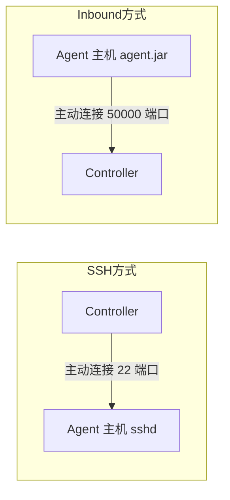
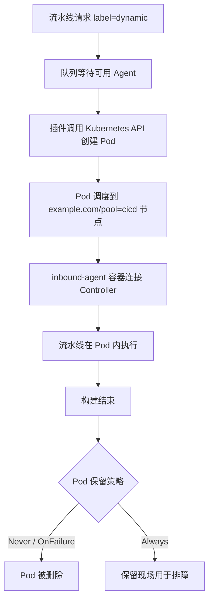

# 第五章：静态 Agent 与动态 Agent

## 5.1 本章目标

完成本章后，你应能够：

- 说明 "Slave" 旧称与当前 Controller/Agent 术语的演变过程。
- 完成静态 Agent 的安装、连接、标签和工作目录配置。
- 区分 SSH 与 Inbound Agent 两类连接方式的原理、端口要求和适用场景。
- 分析静态 Agent 的优点、缺点和适用场景。
- 描述动态 Agent 的创建、调度、销毁流程和工作区隔离机制。
- 为不同项目设计构建缓存、并发构建和资源配额策略。
- 说明 Agent 镜像中工具链版本管理的原则。
- 识别非可信代码构建时的隔离与权限控制要求。
- 根据启动速度、环境一致性、隔离性和运维成本选择 Agent 模式。
- 使用同一条流水线在静态 Agent 与动态 Agent 上执行并比较结果。

## 5.2 前置条件

本章假设第四章已经完成，实验环境应满足以下条件：

| 条件 | 用途 | 验证方式 |
|---|---|---|
| Jenkins Controller 已部署 | 管理节点配置 | 访问 `jenkins.example.com` 出现登录页 |
| Jenkins 管理员权限 | 创建节点、分配权限 | 能进入 Manage Jenkins |
| 一个已接入的静态 Agent | 本章实验 A 部分 | 节点状态为在线 |
| 静态 Agent 主机的 SSH 访问 | 部署第二种连接方式 | `ssh <user>@<agent-host>` 可登录 |
| 集群管理员权限 | 查看动态 Agent Pod 行为 | `kubectl -n cicd get pods` 可执行 |
| 静态 Agent 已安装 JDK | 运行 agent.jar | `java -version` 正常输出 |

> 本章动态 Agent 部分只讲原理和行为预期，Kubernetes 插件的详细配置在第六章完成。实验 B 部分需要在第六章之后回补。

> 本章命令中的主机名、密码、Token 均使用占位符，例如 `<AGENT_HOST>`、`<NODE_SECRET>`。不要把真实凭证写入文档、脚本或命令历史。

## 5.3 术语演变：从 Slave 到 Agent

### 5.3.1 旧称与现状

Jenkins 早期文档和界面中，执行构建的节点被称为 Slave，管理节点被称为 Master。随着社区对术语包容性的讨论，Jenkins 官方自 2.x 时代起逐步改用新术语：

| 旧术语 | 新术语 | 含义 |
|---|---|---|
| Master | Controller | 编排流水线、管理节点和凭证的 Jenkins 主实例 |
| Slave | Agent | 连接到 Controller 并执行构建任务的节点 |
| Slave 节点 | Agent 节点 / Build Agent | 同上，强调是一台机器或一个 Pod |
| JNLP Slave | inbound-agent | 通过主动连接注册的 Agent 容器镜像 |

### 5.3.2 为什么要使用新术语

- 官方文档、插件文档和社区讨论已统一使用 Controller/Agent，继续使用旧称会造成检索和理解偏差。
- Jenkins 界面中的菜单（Manage Jenkins → Nodes）、插件名称（Kubernetes plugin 的 `agent` 相关配置）都已采用新术语。
- 自动化脚本如果引用旧字段名（例如部分老版本脚本中的 `slave` 字样），在升级后可能出现兼容问题。

本课程统一使用 Controller/Agent。阅读旧文章时需要自行完成术语映射。

## 5.4 两类连接方式：SSH 与 Inbound

### 5.4.1 连接方向的本质区别

静态 Agent 与 Controller 建立连接只有两种方向：



**SSH 方式**：Controller 通过 SSH 登录 Agent 主机，在其上启动 Agent 进程。Controller 必须能网络到达 Agent 的 22 端口，并持有对应的私钥或密码凭证。

**Inbound 方式**：Agent 主机主动运行 `agent.jar`，连接 Controller 的 JNLP/TCP 50000 端口（或 WebSocket）完成注册。Agent 主机必须能网络到达 Controller，Controller 不需要能反向访问 Agent。

### 5.4.2 对比表

| 维度 | SSH Agent | Inbound Agent |
|---|---|---|
| 连接发起方 | Controller 主动连 Agent | Agent 主动连 Controller |
| 端口要求 | Agent 侧开放 22 | Controller 侧开放 50000（或 WebSocket 走 80/443） |
| 所需凭证 | Agent 主机的 SSH 私钥 | Controller 生成的节点密钥（Node Secret） |
| NAT / 防火墙适应性 | 差：Controller 必须可达 Agent | 好：Agent 只需出站访问 Controller |
| Agent 是否需要公网入口 | 是（对 Controller 可达） | 否 |
| 典型场景 | Controller 与 Agent 同内网 | Agent 在家用网络、公有云、集群内 Pod |
| 断线重连 | Controller 负责重连 | agent.jar 进程负责重连 |

第三章部署的 Jenkins 位于 Kubernetes 集群内，Controller 的 50000 端口通过集群内 Service 暴露。因此：

- 集群内的动态 Agent Pod 天然走 Inbound 方式，直接访问集群内 Service，不需要公网暴露。
- 集群外的静态 Agent 需要 DNS 解析到 `jenkins.example.com` 并能访问 50000 端口，或者改用 WebSocket 模式复用 443 端口。

### 5.4.3 如何选择

- Agent 与 Controller 在同一内网，且希望由 Controller 统一管理进程：选 SSH。
- Agent 在 NAT 后、家庭宽带或公有云 VPC：选 Inbound。
- Agent 是容器或 Pod：选 Inbound（官方 `inbound-agent` 镜像即为此设计）。

## 5.5 静态 Agent 详解

### 5.5.1 完整接入步骤（Inbound 方式）

第四章已经用最简方式接入过一个静态 Agent。本节给出完整、可长期使用的接入流程。

**步骤一：在 Jenkins 中创建节点**

操作位置：Jenkins Web UI → Manage Jenkins → Nodes → New Node。

| 配置项 | 示例值 | 说明 |
|---|---|---|
| Node name | `static-agent-1` | 全局唯一 |
| Type | Permanent Agent | 静态节点 |
| Remote root directory | `/data/jenkins-agent` | Agent 上的工作目录 |
| Labels | `static linux java` | 空格分隔多个标签 |
| Usage | Use this node as much as possible | 或仅按需使用 |
| Launch method | Launch agent via connection to Jenkins controller | Inbound 方式 |
| Availability | Keep this agent online as much as possible | 保持在线 |

保存后进入节点页面，可以看到接入命令。

**步骤二：在 Agent 主机准备目录并下载 agent.jar**

执行位置：静态 Agent 主机（`<AGENT_HOST>`），需要普通用户权限。

```bash
# 创建专用工作目录，避免使用用户家目录
sudo mkdir -p /data/jenkins-agent
sudo chown -R <agent-user>:<agent-user> /data/jenkins-agent

# 下载 agent.jar（地址来自节点页面显示的 jar 文件链接）
cd /data/jenkins-agent
curl -fLO "https://jenkins.example.com/jnlpJars/agent.jar"
```

**步骤三：启动 Agent 进程**

执行位置：静态 Agent 主机。

```bash
cd /data/jenkins-agent
java -jar agent.jar \
  -jnlpUrl "https://jenkins.example.com/computer/static-agent-1/jenkins-agent.jnlp" \
  -secret "<NODE_SECRET>" \
  -workDir "/data/jenkins-agent"
```

`<NODE_SECRET>` 来自节点页面。进程启动后输出 `Connected to Jenkins` 即接入成功。

> 直接在终端运行 agent.jar 只适合验证。长期使用应配置为 systemd 服务：

```ini
# /etc/systemd/system/jenkins-agent.service
[Unit]
Description=Jenkins Inbound Agent
After=network-online.target

[Service]
User=<agent-user>
WorkingDirectory=/data/jenkins-agent
ExecStart=/usr/bin/java -jar /data/jenkins-agent/agent.jar \
  -jnlpUrl https://jenkins.example.com/computer/static-agent-1/jenkins-agent.jnlp \
  -secret <NODE_SECRET> \
  -workDir /data/jenkins-agent
Restart=on-failure
RestartSec=10

[Install]
WantedBy=multi-user.target
```

执行位置：静态 Agent 主机，需要 root 权限。

```bash
sudo systemctl daemon-reload
sudo systemctl enable --now jenkins-agent
sudo systemctl status jenkins-agent  # 预期 Active: active (running)
```

**步骤四：验证节点在线**

Jenkins Web UI → Nodes，`static-agent-1` 不再显示叉号，Executors 数量正常。也可以在节点页面点击 "Log" 查看连接日志，应包含 `Connected to Jenkins`。

### 5.5.2 SSH 方式接入要点

操作位置：Jenkins Web UI → Nodes → New Node，Launch method 选择 `Launch agents via SSH`。

前置准备（执行位置：静态 Agent 主机）：

```bash
# 为 Jenkins 创建专用系统用户，不要复用 root
sudo useradd -m -d /home/jenkins -s /bin/bash jenkins
sudo mkdir -p /home/jenkins/.ssh
sudo bash -c 'cat <公钥内容> > /home/jenkins/.ssh/authorized_keys'
sudo chmod 700 /home/jenkins/.ssh
sudo chmod 600 /home/jenkins/.ssh/authorized_keys
sudo chown -R jenkins:jenkins /home/jenkins/.ssh
```

在 Jenkins 中配置：

| 配置项 | 示例值 |
|---|---|
| Host | `<AGENT_HOST>` |
| Credentials | SSH Username with Private Key 类型，用户 `jenkins` |
| Host Key Verification Strategy | Known hosts file 或 Non verifying（仅实验环境） |

验证方式与 Inbound 相同：节点状态在线、日志无报错。

### 5.5.3 标签规划

标签（Label）是流水线与节点之间的调度契约。规划原则：

| 原则 | 说明 | 示例 |
|---|---|---|
| 按能力命名 | 标签描述节点具备什么，而不是节点叫什么 | `java17`、`node20`、`docker` |
| 区分形态 | 静态与动态节点用不同标签，便于对比和排障 | `static`、`dynamic` |
| 最小交集 | 不要给一个节点打满所有标签，避免任务集中 | 构建机只打构建标签 |
| 大小写一致 | 标签匹配区分大小写，统一小写 | `linux` 而非 `Linux` |

示例标签方案：

```text
static-agent-1:  static linux java17 maven
static-agent-2:  static linux node20 docker
动态 Agent Pod:  dynamic linux（由 PodTemplate 生成，第六章展开）
```

流水线中通过 `agent { label 'java17' }` 或 `node('java17')` 引用。多个构建请求竞争同一标签时，任务进入 Jenkins 队列，按顺序分配给在线 Executor。

### 5.5.4 工作目录与 Executors 数量

**工作目录（Remote root directory）** 之下，每个任务会生成独立子目录：

```text
/data/jenkins-agent/
└── workspace/
    ├── <任务名>/            # 任务级工作区
    └── <任务名>@2/          # 并发执行时的第二个工作区
```

**Executors 数量**决定节点可并行执行的构建数。经验值：

- 每个 Executor 至少对应 1～2 核 CPU 和 2Gi 内存。
- CPU 密集型任务（编译、镜像构建）：Executors = CPU 核数 / 2。
- IO 等待型任务（等待外部 API、拉取依赖）：可以适当放宽。
- 宁可让任务排队，也不要把单节点 Executors 配得过高导致构建互相拖慢。

### 5.5.5 静态 Agent 的优点、缺点和适用场景

| 优点 | 缺点 |
|---|---|
| 无冷启动，接任务即执行 | 资源常驻，空闲时也占用主机 |
| 构建缓存可长期保留（.m2、npm cache） | 环境漂移：手工装的工具逐渐与文档不一致 |
| 适合超长构建（小时级编译） | 多项目共用易争抢资源、互相污染 |
| 排障简单，可直接登录主机 | 扩容慢，需要人工准备新机器 |
| 不依赖集群 API，故障域独立 | 清理困难，工作区残留会累积磁盘占用 |

**适用场景**：构建频率低但单次耗时长、需要复用大型缓存、工具链依赖宿主机特性（如特定内核模块、GPU）、以及作为 Kubernetes 集群故障时的兜底构建通道。

## 5.6 动态 Agent 原理

### 5.6.1 生命周期

动态 Agent 由 Kubernetes 插件按需创建为 Pod，构建结束后销毁：



关键行为：

- **创建**：流水线声明 `label` 后，插件按 PodTemplate 生成 Pod 清单并提交给 Kubernetes。
- **调度**：Pod 遵循普通调度规则。第二章已给 worker1 打上 `example.com/pool=cicd` 标签和污点，PodTemplate 通过 `nodeSelector` 与 `tolerations` 约束其落在专用节点。
- **注册**：Pod 内的 inbound-agent 容器通过集群内 Service 连接 Controller 50000 端口完成注册，全程不出集群。
- **销毁**：构建结束（无论成功失败）后，Pod 按保留策略删除。工作区随 `emptyDir` 一起消失。

### 5.6.2 工作区隔离

静态 Agent 上多个任务共享一台主机，工作区靠目录隔离；动态 Agent 的隔离边界是 Pod：

| 维度 | 静态 Agent | 动态 Agent |
|---|---|---|
| 隔离边界 | 文件系统目录 | 独立 Pod（独立文件系统、网络命名空间） |
| 工作区生命周期 | 持续存在，可复用 | 随 Pod 销毁 |
| 残留污染 | 可能（上次构建的文件影响本次） | 不可能（每次全新） |
| 并发安全 | 靠 Jenkins 目录命名（`@2`、`@script`） | 天然隔离 |

工作区随 Pod 消失带来的影响：

- 未提交的构建产物无法事后取回，需要归档的内容必须在流水线中显式 `archiveArtifacts`。
- 逐文件跟踪调试困难，失败现场要靠 Pod 保留策略或日志留痕。
- 这些行为差异正是实验 B 部分要观察记录的内容。

### 5.6.3 并发与资源配额

动态模式下并发数的控制手段与静态模式不同：

| 控制手段 | 静态 Agent | 动态 Agent |
|---|---|---|
| 并发上限 | 节点 Executors 数量 | 同时存在的 Agent Pod 数量（插件可配上限） |
| 资源隔离 | 进程级，弱 | 容器 requests/limits，强 |
| 集群级兜底 | 无 | 命名空间 ResourceQuota / LimitRange |

实验环境可为 `cicd` 命名空间配置兜底配额（执行位置：master1，需要集群管理员权限）：

```yaml
# cicd 命名空间的资源配额：限制动态 Agent 的总资源消耗
apiVersion: v1
kind: ResourceQuota
metadata:
  name: cicd-agents-quota
  namespace: cicd
spec:
  hard:
    requests.cpu: "8"
    requests.memory: 16Gi
    limits.cpu: "16"
    limits.memory: 32Gi
    pods: "20"
```

```bash
kubectl -n cicd apply -f resourcequota.yaml
kubectl -n cicd get resourcequota  # 预期显示 quota 名称和硬限制
```

超出配额后新 Agent Pod 会创建失败（`Forbidden: exceeded quota`），流水线在队列阶段报错，这是预期保护行为而非故障。

## 5.7 构建缓存策略

构建缓存的存放方式直接影响构建速度和一致性，三种典型策略：

| 策略 | 做法 | 优点 | 缺点 | 适用 |
|---|---|---|---|---|
| 无缓存 | 每次全量拉依赖 | 结果最干净 | 慢，外网依赖重 | 首次验证、排查缓存问题 |
| PVC 挂载缓存 | 多个 Agent Pod 共享一个 PVC 存放缓存目录 | 速度快，跨构建复用 | 并发写冲突；缓存可能过期损坏 | 常规项目 |
| 镜像预置依赖 | 把依赖打进工具镜像 | 无网络依赖，速度快 | 依赖更新需重做镜像 | 网络受限、依赖稳定 |

PVC 缓存示例（详细挂载语法在第七章 PodTemplate 中展开）：

```text
PVC: jenkins-maven-cache → 挂载到 Pod 内 /root/.m2
PVC: jenkins-npm-cache   → 挂载到 Pod 内 /root/.npm
```

注意事项：

- Maven 与 npm 的本地缓存对并发写不完全安全，高并发时按项目拆分缓存 PVC，或接受偶发损坏后自动重新下载。
- 缓存目录应定期清理（例如 Harbor 侧不涉及，直接用定时任务删除 PVC 内容），否则会无限增长。
- 缓存命中带来的加速应在实验 B 的对比记录中体现（同一流水线第二次构建明显快于第一次）。

## 5.8 Agent 镜像中工具链的版本管理

无论静态还是动态 Agent，工具链版本管理的原则一致：

- **版本固定**：JDK、Maven、Node、kubectl 等写明具体版本号（如 `17.0.x`、`20.x`），不使用浮动版本。
- **可校验**：流水线第一个阶段打印各工具版本（实验 A 的流水线即为此设计），构建设录中可追溯。
- **一镜像一用途**：按语言族拆分工具镜像（`agent-java17`、`agent-node20`），避免维护一个大而全镜像。
- **变更走流程**：升级工具版本等于变更构建环境，应通过重新构建镜像、更新 Tag、验证后替换引用，而不是登录主机手工升级。

静态 Agent 与动态 Agent 在这方面的差异：

| 维度 | 静态 Agent | 动态 Agent |
|---|---|---|
| 工具安装位置 | 主机系统目录 | 镜像内 |
| 版本一致性 | 依赖人工维护，易漂移 | 镜像 Tag 即版本，天然一致 |
| 升级方式 | 逐台登录升级 | 替换 PodTemplate 中的镜像引用 |
| 复现性 | 弱 | 强（同一 Tag 构建结果一致） |

自定义工具镜像的完整构建流程在第十六章展开，本节只需建立"版本进镜像、升级即换镜像"的意识。

## 5.9 非可信代码构建的隔离与权限控制

当流水线执行来源不受控的代码（社区贡献、第三方仓库、学生提交的作业）时，必须假设代码可能包含恶意指令。要求：

| 控制项 | 要求 | 说明 |
|---|---|---|
| 独立 Agent | 非可信任务使用专用 Agent/节点池 | 与生产构建任务物理隔离 |
| 禁止挂载 Docker Socket | 不挂载宿主机 `/var/run/docker.sock` | 挂载它等于交出节点 root 权限 |
| 最小 RBAC | Agent 的 ServiceAccount 只含必要权限 | 第六章展开配置 |
| NetworkPolicy 限制出网 | 非可信构建默认禁止访问内网 | 只放行依赖仓库和代码仓库 |
| 凭证隔离 | 非可信任务不注入生产凭证 | 流水线按需声明凭证，而非全局注入 |
| 工作区不共享 | 动态 Agent 天然满足；静态 Agent 不复用工作区 | 防止读取上一次构建的残留 |
| 日志脱敏 | 构建日志不回显凭证 | Jenkins 凭证绑定机制自动处理 |

典型错误做法及其后果：

```text
错误：给 Agent Pod 挂载 docker.sock 以便容器内执行 docker build
后果：构建代码可执行任意容器，挂载宿主机根目录，等于节点沦陷

错误：所有流水线共享一个集群管理员 kubeconfig
后果：任意一次非可信构建都能删除集群全部资源
```

正确思路：镜像构建使用 rootless 方案（BuildKit rootless、Kaniko、Podman），集群操作使用最小权限 ServiceAccount，具体在第十一章、第十三章展开。

## 5.10 静态与动态综合对比与选型建议

| 维度 | 静态 Agent | 动态 Agent |
|---|---|---|
| 启动速度 | 即时（已在线） | 有 Pod 创建冷启动（秒级到分钟级） |
| 环境一致性 | 弱，依赖人工维护 | 强，镜像即版本 |
| 隔离性 | 目录级 | Pod 级（文件系统、网络） |
| 资源利用率 | 低，空闲常驻 | 高，按需创建销毁 |
| 运维成本 | 每台主机单独维护 | 维护镜像和模板 |
| 缓存友好度 | 高 | 需额外挂载 PVC |
| 扩缩容 | 慢（准备机器） | 快（改并发上限即可） |
| 故障影响 | 单节点故障影响其队列任务 | 单 Pod 故障仅影响单次构建 |
| 适用场景 | 长构建、强缓存依赖、兜底通道 | 常规 CI、多语言项目、高并发 |

选型建议：

- 默认选动态：环境一致、隔离好、易扩容，是 Kubernetes 上 CI 的主流形态。
- 有以下特征时补充静态 Agent：单次构建超过 30 分钟且缓存收益显著；需要宿主机特殊能力；需要集群故障时的独立构建通道。
- 两者可以共存：按标签分流，重任务走静态，常规任务走动态。

## 5.11 常见问题与排查路径

### 问题一：静态 Agent 显示离线

排查顺序：

1. Agent 主机上 `systemctl status jenkins-agent`，确认进程存活。
2. 查看服务日志 `journalctl -u jenkins-agent -n 50`，关注连接拒绝或密钥错误。
3. 确认 `<AGENT_HOST>` 能解析并访问 `jenkins.example.com` 的 50000 端口（或 WebSocket 端口）。
4. Jenkins 节点页面查看 Log 标签页，比对 Node Secret 是否重新生成过（重建节点会使旧 Secret 失效）。

### 问题二：SSH 方式连接失败

1. 手工执行 `ssh -i <私钥> jenkins@<AGENT_HOST>` 验证密钥登录。
2. 检查 Jenkins 凭证类型是否为 SSH Username with Private Key，用户名是否为 Agent 主机上的系统用户。
3. 检查 Host Key Verification 策略：Known hosts 模式要求 Jenkins 侧已记录主机指纹。

### 问题三：动态 Agent Pod 一直 Pending

1. `kubectl -n cicd describe pod <agent-pod>`，查看 Events。
2. 常见原因：专用节点资源不足、标签不匹配、污点缺少容忍、超出 ResourceQuota。
3. 若为配额问题，Events 会显示 `exceeded quota`，需要降低并发或扩容配额。

### 问题四：动态 Agent 构建成功但产物丢失

- 工作区随 Pod 销毁是预期行为。
- 检查流水线是否遗漏 `archiveArtifacts`。
- 需要保留现场排障时，临时调整 Pod 保留策略（第六章展开配置项）。

### 问题五：静态 Agent 工作区磁盘持续增长

1. `du -sh /data/jenkins-agent/workspace/*` 定位大目录。
2. 确认任务是否配置了旧构建清理策略（Discard old builds）。
3. 定期删除不再运行的任务工作区，或配置脚本清理 N 天未访问的目录。

## 5.12 安全注意事项

- Agent 主机使用专用低权限用户运行 agent.jar，禁止 root 运行。
- Node Secret、SSH 私钥不写入脚本、文档和命令历史，统一放 Jenkins Credentials 或主机受保护目录。
- 不在 Agent 上保存长期有效的生产凭证；构建需要的凭证按任务注入。
- 非可信构建遵循第 5.9 节全部控制项，尤其禁止挂载 Docker Socket。
- 动态 Agent 的 ServiceAccount 权限最小化，仅允许其完成注册和构建，不授予集群范围写权限。
- 构建日志可能包含代码内容，公开日志前确认无敏感信息。
- 定期升级 Agent 主机系统和 agent.jar，修复已知漏洞。

## 5.13 本章实验

### 实验目标

同一条流水线分别在静态 Agent 和 Kubernetes 动态 Agent 上执行，从启动速度、环境一致性、工作区行为和清理效果四个维度记录差异，形成选型判断依据。

### 实验准备：统一测试流水线

以下 Jenkinsfile 在两种 Agent 上执行完全相同的检查动作：

```groovy
// 文件名：Jenkinsfile-agent-compare
// 用途：在当前 Agent 上输出环境与工具信息，用于静态/动态对比

pipeline {
    agent any   // 实验时分别改为 label 'static' 与 label 'dynamic'

    stages {
        stage('环境信息') {
            steps {
                sh 'hostname'          # 观察执行主机：静态为物理机名，动态为 Pod 名
                sh 'uname -a'          # 内核信息
                sh 'date'              # 时间戳，用于计算各阶段耗时
                sh 'pwd'               # 工作区路径
            }
        }
        stage('工具链检查') {
            steps {
                sh 'git --version || echo "git 不可用"'
                sh 'java -version 2>&1 || echo "java 不可用"'
                sh 'mvn --version 2>&1 || echo "mvn 不可用"'
                sh 'node --version 2>&1 || echo "node 不可用"'
            }
        }
        stage('工作区行为') {
            steps {
                // 写入标记文件，第二次构建时检查是否存在
                sh 'echo "build-${BUILD_NUMBER}" > workspace-marker.txt'
                sh 'cat workspace-marker.txt || echo "标记文件不存在"'
            }
        }
    }
}
```

### 实验步骤 A：静态 Agent（本章完成）

1. 确认第四章接入的静态 Agent 在线，标签包含 `static`。
2. 在 Jenkins 创建 Pipeline 任务 `compare-static`，流水线脚本使用上述 Jenkinsfile，`agent` 改为 `label 'static'`。
3. 立即连续执行两次构建。
4. 登录静态 Agent 主机，查看工作区中 `workspace-marker.txt` 的内容。
5. 记录以下数据填入对比表。

执行位置：静态 Agent 主机。

```bash
# 观察工作区标记文件：第二次构建后应为 build-2（静态工作区持久，文件被覆盖）
cat /data/jenkins-agent/workspace/compare-static/workspace-marker.txt
```

### 实验步骤 B：动态 Agent（完成第六章后回补）

> 本部分依赖第六章的 Kubernetes 插件配置。完成第六章后回到本节继续。

1. 确认动态 Agent 已可用，标签包含 `dynamic`。
2. 创建任务 `compare-dynamic`，`agent` 改为 `label 'dynamic'`，其余内容不变。
3. 连续执行两次构建。
4. 第二次构建时观察工作区阶段的输出：标记文件是否为 `build-1`（工作区随 Pod 销毁，上次的文件不存在）。
5. 构建期间另开终端观察 Pod 生命周期（执行位置：master1）：

```bash
# 观察动态 Agent Pod 的创建与销毁（构建运行时执行）
kubectl -n cicd get pods -w
# 预期：构建开始时出现新 Pod（Pending → ContainerCreating → Running），
# 构建结束后 Pod 被删除
```

6. 将数据填入对比表。

### 对比记录表模板

| 观察维度 | 静态 Agent | 动态 Agent |
|---|---|---|
| 从触发到开始执行的耗时 | | |
| 构建期间 hostname 输出 | | |
| 工具链版本是否一致、可追溯 | | |
| 第二次构建时标记文件内容 | | |
| 构建后环境清理效果 | | |
| 构建产物保留情况 | | |

### 验收标准

**A 部分（本章验收）：**

- [ ] 静态 Agent 以 systemd 服务方式稳定在线，重启主机后自动恢复连接。
- [ ] 流水线在静态 Agent 上完整执行成功，输出了主机名、工具版本和工作区路径。
- [ ] 两次构建后 `workspace-marker.txt` 体现工作区持久性（内容为最新构建号）。
- [ ] 完成对比记录表中静态 Agent 一列，并记录各阶段耗时。
- [ ] 能说明静态 Agent 在本实验中暴露的至少两个局限（如版本不可追溯、需手工清理）。

**B 部分（第六章后回补验收）：**

- [ ] 流水线在动态 Agent 上完整执行成功，hostname 为 Pod 名。
- [ ] 第二次构建时标记文件内容为 `build-1`，验证工作区随 Pod 销毁。
- [ ] 用 `kubectl get pods -w` 观察到 Pod 的完整创建、运行、销毁过程。
- [ ] 完成对比记录表全部两列，能基于数据说明静态与动态 Agent 的选型差异。

## 5.14 思考题

1. Controller 部署在 Kubernetes 集群内，一台家庭宽带主机上的静态 Agent 应该选择 SSH 还是 Inbound 方式？为什么？
2. 静态 Agent 的 Executors 配成 CPU 核数的 4 倍，可能出现什么现象？
3. 动态 Agent 工作区随 Pod 销毁，为什么说这既是优点也是缺点？
4. 为什么禁止给 Agent 挂载宿主机的 Docker Socket？攻击者拿到它之后能做什么？
5. 依赖缓存放入共享 PVC 后，两个并发构建同时写入同一 Maven 仓库，可能发生什么？如何缓解？
6. 一条流水线构建耗时 50 分钟，其中 40 分钟在下载依赖，你会优先用哪种缓存策略改造？
7. 静态 Agent 与动态 Agent 共存时，如何通过标签设计避免任务被错误调度？
8. 如果 Kubernetes 集群故障，静态 Agent 能否继续工作？需要满足哪些条件？

## 5.15 本章小结

本章围绕"执行构建的节点"展开：

- 术语上，统一使用 Controller/Agent，旧称 Slave 只在阅读旧文档时需要映射。
- 连接方式上，SSH 由 Controller 主动连接，Inbound 由 Agent 主动注册，选择依据是网络可达方向。
- 静态 Agent 即时可用、缓存友好，但环境易漂移、资源常驻；Executors 数量要与主机资源对齐。
- 动态 Agent 按需创建 Pod、构建结束销毁，隔离彻底、版本一致，但工作区不保留、需要额外缓存策略。
- 工具链版本管理的核心是"版本进镜像、升级即换镜像"。
- 非可信代码构建必须独立节点池、禁挂 Docker Socket、最小权限、限制出网。
- 选型默认动态为主，长构建与强缓存场景补充静态。

下一章将配置 Jenkins Kubernetes 插件，让 Controller 获得通过 Kubernetes API 创建动态 Agent Pod 的能力，并回补完成本章实验的 B 部分。
