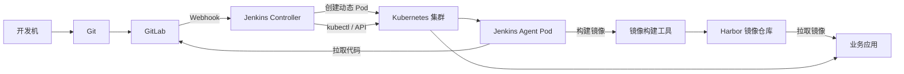
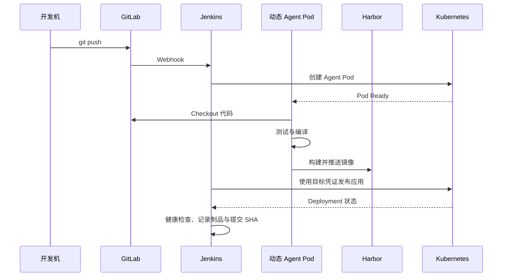
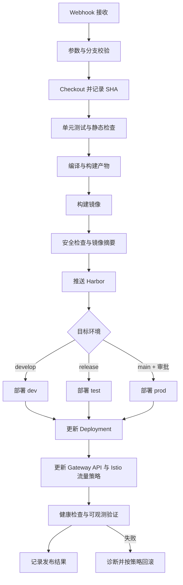
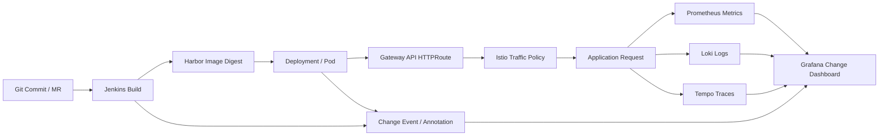

# Kubernetes CI/CD 教学：Jenkins + GitLab + Harbor

> 从零搭建一套基于 Kubernetes 的企业级 CI/CD 实验环境，完整实现：代码提交、Webhook 触发、动态构建节点、代码编译、镜像构建、制品推送、Kubernetes 自动发布、回滚与安全控制。

## 一、课程定位

本课程以一个可运行的示例项目为主线，围绕 Kubernetes、Jenkins、GitLab、Harbor 四个核心组件，逐步构建完整的持续集成与持续交付流水线。

学习过程中不只关注“命令怎么执行”，还会解释组件之间的职责边界、认证授权、网络访问、凭证传递、Pod 生命周期、镜像构建和发布回滚的原理。

## 二、学习目标

完成全部课程后，应能够：

- 理解 Kubernetes 环境在 CI/CD 中承担的角色。
- 初始化实验集群并完成节点标签、命名空间和基础权限配置。
- 部署并初始化 Jenkins，理解 Controller/Agent 主从架构。
- 使用静态 Agent 和 Kubernetes 动态 Pod Agent 执行流水线。
- 配置 Jenkins Kubernetes 插件和 `podTemplate`。
- 部署 GitLab，完成 Git 仓库、用户、项目和凭证配置。
- 配置 GitLab Webhook，解决 Jenkins 触发、CSRF 和跨域相关问题。
- 部署 Harbor，并使用外部数据库、外部 Redis 等 External 模式。
- 编写 Jenkinsfile，实现测试、编译、镜像构建、推送和 Kubernetes 发布。
- 使用 Kubernetes ServiceAccount、RBAC 和 Jenkins Credentials 安全访问集群。
- 按分支实现自动构建和发布，区分开发、测试、生产环境。
- 为流水线增加发布前检查、失败保护、健康检查和版本回滚。
- 构建定制化工具镜像，形成可复用的 CI 执行环境。

## 三、课程技术栈与版本说明

### 3.1 核心组件

| 组件 | 课程中的职责 |
|---|---|
| Kubernetes | 运行 Jenkins、GitLab、Harbor 和业务应用；提供动态 Agent 与发布目标环境 |
| Jenkins | 编排流水线、执行 CI/CD 任务、管理凭证和发布流程 |
| GitLab | 托管代码、管理分支和合并请求、发送 Webhook |
| Harbor | 保存和管理业务镜像，提供镜像访问控制和漏洞扫描能力 |
| Git | 版本管理、分支协作、提交触发流水线 |
| CoreDNS | 为集群内服务提供稳定的域名解析 |
| Gateway API | 使用 GatewayClass、Gateway、HTTPRoute 管理流量入口和路由 |
| Istio | 提供服务网格、mTLS、东西向流量治理和渐进式发布 |
| OpenTelemetry | 关联构建、发布、日志、指标和分布式追踪 |
| Prometheus / Grafana / Loki / Tempo | 分别提供指标、可视化、日志和分布式追踪能力 |

### 3.2 版本策略

正式实验前统一记录以下版本，避免由于版本差异造成配置不一致：

- Kubernetes 版本：`待实验时确定`
- Container Runtime：`containerd`
- Jenkins LTS 与 Jenkins Kubernetes Plugin 版本
- GitLab 版本
- Harbor 版本
- Helm 版本
- kubectl 版本
- 示例项目使用的语言、构建工具和基础镜像版本

> 课程中的配置应优先使用当前稳定版本的官方文档验证。涉及域名、IP、镜像仓库地址和凭证的内容，统一替换为实验环境实际值。

## 四、总体实验架构



### 4.1 实验数据流



### 4.2 推荐的实验命名空间

| 命名空间 | 用途 |
|---|---|
| `cicd` | Jenkins、Jenkins Agent 相关资源 |
| `gitlab` | GitLab 及其依赖组件 |
| `harbor` | Harbor 及其依赖组件 |
| `dev` | 开发环境业务应用 |
| `test` | 测试环境业务应用 |
| `prod` | 生产环境演示应用 |

## 五、课程目录

### 01 架构详解与 CI/CD 全流程演示

**目标：**建立从提交代码到应用上线的整体认知。

- CI、持续交付、持续部署的区别。
- GitLab、Jenkins、Harbor、Kubernetes 的职责边界。
- 从 Git commit 到镜像 digest 再到 Deployment 的追踪链。
- Jenkins Pipeline 的基本阶段和执行上下文。
- 构建一次、逐环境晋级与重复构建的差异。
- 实验最终效果演示：提交代码后自动完成构建、推送和发布。
- 常见失败点：Webhook 未到达、Agent 无法启动、镜像推送失败、Pod 拉取失败。

**阶段实验：**手工模拟一条 CI/CD 流程，画出组件调用链和凭证流向。

### 02 Kubernetes 环境初始化与节点打标签

**目标：**准备能够承载 CI/CD 组件和动态 Agent 的 Kubernetes 集群。

- 集群节点角色、控制面和工作节点职责。
- `kubectl` 配置、Context 与命名空间。
- 节点状态、资源容量和容器运行时检查。
- 节点标签、污点和容忍度的使用场景。
- 为 Jenkins Agent、基础设施组件和业务环境规划节点。
- 创建 `cicd`、`gitlab`、`harbor`、`dev`、`test`、`prod` 命名空间。
- 配置默认 StorageClass、Gateway API 实现和基础 GatewayClass。
- 规划 Gateway、HTTPRoute、域名、证书和跨命名空间引用策略。
- 配置 Istio 安装模式、网格入口和命名空间注入策略。
- 配置基础 DNS、时间同步、镜像拉取和网络连通性。
- 预留监控、日志、追踪和审计数据的存储与访问路径。

**阶段实验：**完成集群初始化检查清单，并使用节点标签约束 Jenkins Agent 调度。

### 03 工具集群部署 Jenkins Controller

**目标：**在 Kubernetes 上部署可持久化、可访问的 Jenkins。

- Jenkins Controller 的职责与不适合承担的工作。
- Helm 部署方式与清单部署方式对比。
- Jenkins 持久化目录、PVC 和备份策略。
- Jenkins Service、Gateway API Gateway / HTTPRoute 与访问地址。
- 管理员初始化、插件源和时区设置。
- Jenkins 构建指标、队列、Agent 状态和系统日志采集。
- Jenkins URL、Agent 通信方式与网络要求。
- 资源 requests/limits 与 JVM 参数。
- Jenkins Controller 高可用的边界和实验环境取舍。

**阶段实验：**部署 Jenkins，完成 Web 访问、管理员初始化、PVC 挂载和基础健康检查。

### 04 Jenkins 初始化与主从架构原理

**目标：**理解 Controller/Agent 架构，并完成 Jenkins 基础配置。

- Controller、Agent、Executor、Workspace 的关系。
- 为什么不建议在 Controller 上执行构建任务。
- 静态 Agent 与动态 Agent 的生命周期差异。
- Jenkins 节点标签与流水线 `label`。
- 全局工具配置、插件管理和系统配置。
- Jenkins 用户、角色、权限和审计。
- 全局凭证的类型、作用域和最小权限原则。
- 构建日志、节点日志和流水线可观测性。
- 采集 Jenkins 构建耗时、队列时长、Agent 状态、失败率和发布结果。
- 使用 OpenTelemetry 关联 Jenkins 构建 Trace 与发布、应用请求 Trace。

**阶段实验：**创建实验用凭证、配置一个静态 Agent，并运行第一条简单流水线；记录构建耗时、Agent 状态和失败日志。

### 05 静态 Slave 与动态 Slave

**目标：**比较不同 Agent 模式，理解资源利用率和隔离性。

- “Slave”旧称与当前 Jenkins Agent 术语。
- 静态 Agent 的安装、连接和标签配置。
- SSH、Inbound Agent 两类连接方式。
- 静态 Agent 的优点、缺点和适用场景。
- 动态 Agent 的创建、调度、销毁和工作区隔离。
- 构建缓存、并发构建和资源配额。
- Agent 镜像中工具链的版本管理。
- 非可信代码构建时的隔离与权限控制。

**阶段实验：**同一条流水线分别在静态 Agent 和 Kubernetes 动态 Agent 上执行并比较结果。

### 06 配置使用 Jenkins Kubernetes 插件

**目标：**让 Jenkins 能够通过 Kubernetes API 创建和管理 Agent Pod。

- Kubernetes Plugin 的工作原理。
- Jenkins 到 Kubernetes API 的访问路径。
- Jenkins Controller 与 Agent Pod 的通信方式。
- Kubernetes Cloud、Pod Template、Container Template 的关系。
- 集群地址、命名空间、凭证和连接测试。
- Agent Pod 的 ServiceAccount 与 RBAC。
- Pod 保留策略、超时、重试和日志保留。
- 常见问题：权限不足、镜像拉取失败、Pod Pending、连接超时。

**阶段实验：**配置 Kubernetes Cloud，成功创建一个临时 Agent Pod 并执行 Shell 命令。

### 07 动态 Agent Pod 实现

**目标：**使用动态 Pod 为不同流水线提供隔离的工具容器。

- PodTemplate 的 YAML 结构。
- JNLP / inbound-agent 容器的作用。
- 多容器 Pod：工具容器、Docker / BuildKit 容器、kubectl 容器。
- 容器间共享 Workspace 的实现方式。
- `workspaceVolume`、`emptyDir` 和 PVC 的选择。
- Pod 生命周期、容器退出和流水线失败行为。
- 动态 Pod 的资源限制与安全上下文。
- 使用 Pipeline DSL 定义 `podTemplate`。

**阶段实验：**创建包含 Git、构建工具、镜像构建工具和 kubectl 的动态 Agent Pod，完成一次完整构建。

### 08 Git、GitLab 核心配置与部署使用

**目标：**部署代码托管平台，并建立 Jenkins 所需的 GitLab 协作基础。

- Git 仓库、分支、Tag、Merge Request 的关系。
- GitLab 用户、组、项目和权限模型。
- GitLab 在 Kubernetes 上的部署方式与持久化。
- GitLab External URL、SSH 地址和 HTTP 地址。
- GitLab Runner 与 Jenkins Agent 的职责区别。
- 创建项目、添加成员、生成访问令牌。
- Jenkins 拉取 GitLab 代码的认证方式。
- 为 GitLab 添加 CoreDNS 解析。
- 集群内域名、外部域名和 `/etc/hosts` 的边界。
- GitLab Webhook 地址可达性验证。

**阶段实验：**创建 GitLab 项目，开发机完成 SSH/HTTPS 访问，Jenkins 成功 Checkout 指定分支。

### 09 打通开发机与 GitLab，部署 Harbor 并配置 External 模式

**目标：**建立开发机、GitLab、Harbor 之间的稳定访问和镜像存储能力。

- 开发机访问集群服务的网络路径。
- GitLab SSH、HTTP、Webhook 地址规划。
- Harbor 项目、用户、机器人账户和镜像权限。
- Harbor Registry、Core、Portal、JobService 等组件职责。
- Harbor 使用外部 PostgreSQL、Redis、对象存储的原因。
- External Database、External Redis、External Storage 配置项。
- Harbor HTTPS 证书、域名和 Docker 登录。
- 镜像仓库命名规范、Tag 策略和不可变 Tag。
- 配置 Kubernetes 节点和 Jenkins Agent 信任 Harbor 证书。

**阶段实验：**完成 Harbor 部署，创建项目和机器人账户，手工推送并拉取一个测试镜像。

### 10 配置 Webhook 打通 Pipeline，解决 CSRF 跨域问题

**目标：**让 GitLab push / merge request 事件能够安全触发 Jenkins。

- Webhook 的事件类型和请求内容。
- Jenkins GitLab Plugin / Generic Webhook Trigger 的使用边界。
- GitLab Webhook Token 与 Jenkins 凭证。
- Jenkins CSRF 防护、Crumb 和请求认证。
- 跨域、Gateway API Listener、HTTPRoute、反向代理 Header 和 URL 重写问题。
- Webhook 请求日志、Jenkins 系统日志和 GitLab 重试机制。
- 使用 Gateway API 和 Istio 访问日志确认 Webhook 请求是否到达、路由是否匹配。
- 将 Webhook 请求、Jenkins 构建和 GitLab 提交 SHA 关联到统一变更记录。
- 防止任意用户伪造构建事件。
- 分支过滤、重复触发和并发构建控制。
- 验证 Webhook 到达、解析和触发的完整链路。

**阶段实验：**配置 push Webhook，实现提交后自动触发 Pipeline，并定位一次故意制造的 403 / 404 问题。

### 11 PodTemplate 框架构建与流程梳理，引用全局凭证

**目标：**把动态 Agent、工具容器和凭证注入整理成可复用的流水线框架。

- Declarative Pipeline 与 Scripted Pipeline 对比。
- `podTemplate`、`node`、`container` 和 `workspace` 的关系。
- Pipeline 的初始化、Checkout、构建、镜像和发布阶段。
- `withCredentials` 的安全使用方式。
- GitLab、Harbor、Kubernetes 三类凭证的区别。
- Secret Text、Username/Password、SSH Username with Private Key、Secret File。
- 凭证作用域、最小权限和日志脱敏。
- 禁止将密码、Token、kubeconfig 写入 Jenkinsfile。
- 公共 Pipeline 代码和项目特有配置的边界。

**阶段实验：**封装一套标准 PodTemplate，在不暴露明文凭证的前提下完成代码拉取、镜像登录和集群访问。

### 12 Jenkinsfile：发布、编译与镜像构建 Stage

**目标：**编写项目级流水线，实现可复用、可审计的 CI/CD 阶段。

- Jenkinsfile 的目录位置、版本管理和评审。
- 参数化构建、环境变量和构建元数据。
- Checkout Stage：获取提交 SHA、分支和 Tag。
- Test Stage：单元测试、静态检查和测试报告。
- Compile Stage：依赖安装、代码编译和构建产物。
- Image Stage：Dockerfile、BuildKit / Kaniko / Podman 构建策略。
- 镜像 Tag 与 Git commit SHA 的对应关系。
- Push Stage：登录 Harbor、推送镜像、保存 digest。
- Publish Stage：使用 `kubectl` 或 API 更新 Deployment、Gateway API Route 和 Istio 流量策略。
- Post Stage：归档日志、通知、清理和结果记录。
- 关联构建、镜像、Deployment、Gateway API、Istio 路由和应用版本。
- 发布后采集指标、日志和分布式追踪，形成可观测发布证据。

**阶段实验：**为示例项目编写完整 Jenkinsfile，生成以提交 SHA 标识的镜像并发布到开发环境。

### 13 为项目发布定制 Kubernetes Credentials

**目标：**为不同环境建立安全、可审计、最小权限的发布凭证。

- Kubernetes ServiceAccount、Role、ClusterRole 和 RoleBinding。
- Jenkins 发布权限的最小化设计。
- 开发、测试、生产环境凭证隔离。
- 使用 Secret File 注入 kubeconfig 的方式。
- 使用 Kubernetes Token / API 证书的方式。
- `kubectl auth can-i` 验证权限。
- 限制可操作的 Namespace、Resource 和 Verb。
- 禁止在流水线中使用集群管理员 kubeconfig。
- 凭证轮换、失效、审计和紧急撤销。

**阶段实验：**创建仅能操作 `dev` 命名空间 Deployment、Service 的发布账号，并验证越权操作被拒绝。

### 14 自动发布分支代码全套流程

**目标：**根据分支策略实现从代码提交到多环境发布的自动化流程，并通过 Gateway API、Istio 和可观测数据验证变更效果。

- `feature/*`、`develop`、`release/*`、`main` 的流水线职责。
- Merge Request 校验流水线。
- `develop` 自动发布开发环境。
- `release/*` 发布测试或预发布环境。
- `main` 发布生产环境或等待人工批准。
- 分支保护、审批、合并策略和状态检查。
- 使用同一镜像逐环境晋级，避免重复构建。
- 环境变量、配置文件和 Secret 的管理。
- 使用 Gateway API HTTPRoute 管理外部入口，使用 Istio 流量策略管理服务间通信。
- 通过 Istio 权重路由实现金丝雀或蓝绿发布，并设置回滚阈值。
- 关联提交 SHA、镜像 digest、Gateway API、Istio 配置和环境状态。
- 使用 Prometheus、Grafana、Loki、Tempo 观察变更前后错误率、延迟和吞吐。
- 通过 OpenTelemetry 传播 Trace Context，将构建发布事件与应用请求关联。
- 并发构建、旧构建取消和发布互斥。

**阶段实验：**完成 feature → develop → release → main 的分支流水线，并使用 Istio 权重逐步放量，通过可观测指标决定继续放量或回滚。

### 15 流水线代码优化：回滚与保险功能

**目标：**让流水线在发布失败或线上异常时具备安全恢复能力。

- 发布前检查：镜像存在性、Deployment、配额和凭证权限。
- 发布后检查：Rollout 状态、Pod Ready、Service 可达性和业务健康接口。
- `kubectl rollout status` 与超时控制。
- 检查 Gateway API Listener、HTTPRoute Accepted / ResolvedRefs 和入口访问状态。
- 检查 Istio 配置同步、代理状态、流量权重和 mTLS 策略。
- 自动保存上一次成功发布的镜像版本。
- 手工回滚与自动回滚的适用边界。
- `kubectl rollout undo` 与基于镜像 Tag / digest 的回滚。
- 数据库变更与应用回滚的兼容性问题。
- 失败时暂停流量、保留现场和收集诊断信息。
- 生产环境人工确认、双人审批和紧急发布。
- 将变更前后错误率、P95/P99 延迟、吞吐、饱和度和业务成功率作为放量与回滚依据。
- 使用 Grafana 变更标记、日志字段和 Trace 属性记录版本、提交 SHA、构建号与发布人。
- Revert、重新构建、重新发布与 Deployment 回滚的区别。
- 防止错误版本覆盖、重复部署和并发发布。

**阶段实验：**故意发布一个不健康版本，验证流水线检测失败、保存诊断信息并回滚到上一成功版本。

### 16 自定义镜像构建特定镜像

**目标：**为不同项目构建稳定、可复现、具备安全基线的 CI 工具镜像。

- 为什么不直接依赖通用镜像。
- 基础镜像选择与版本固定。
- 安装 Git、JDK、Node.js、Maven、Gradle、kubectl、Helm 等工具。
- 多阶段构建与镜像体积控制。
- 非 root 用户、文件权限和安全上下文。
- CA 证书、时区、代理和私有仓库配置。
- 工具版本校验与 SBOM。
- 镜像漏洞扫描、签名和不可变 Tag。
- 工具镜像的构建、测试、推送和升级流程。
- 在 PodTemplate 中引用自定义工具镜像。

**阶段实验：**构建一个包含项目所需工具的 Agent 镜像，推送 Harbor，替换动态 Agent 并完成全流程验证。

## 六、整体实验设计

### 实验一：基础集群与组件可用性

**目标：**完成 Kubernetes、命名空间、存储、网络和基础 DNS 准备。

**验收标准：**

- 所有节点处于 `Ready`。
- `kubectl` 可以访问集群。
- 所需命名空间和 StorageClass 已创建。
- 集群内 Pod 可以解析并访问目标服务。
- 节点标签和资源容量符合设计。

### 实验二：部署 Jenkins 并完成初始化

**目标：**部署 Jenkins Controller，完成持久化、访问和基础权限配置。

**验收标准：**

- Jenkins 重启后配置和任务仍然存在。
- 管理员可以登录，普通用户权限符合预期。
- Jenkins 能够创建并执行简单 Pipeline。
- Jenkins Controller 不承担普通项目构建任务。

### 实验三：配置动态 Agent

**目标：**使用 Kubernetes Plugin 创建临时 Agent Pod。

**验收标准：**

- 流水线触发后能够创建 Agent Pod。
- Agent Pod 能够连接 Jenkins 并执行任务。
- 任务结束后 Pod 按策略回收。
- Agent 无法越权访问不属于它的命名空间。

### 实验四：部署 GitLab 并打通代码拉取

**目标：**完成 GitLab 项目、用户、凭证和开发机访问配置。

**验收标准：**

- 开发机可以提交并推送代码。
- Jenkins 可以通过配置的凭证拉取代码。
- GitLab 项目分支和权限符合课程约定。
- 集群内外域名解析符合访问路径设计。

### 实验五：部署 Harbor 并完成镜像流程

**目标：**完成 Harbor External 模式配置和镜像访问。

**验收标准：**

- Harbor 可登录，项目和机器人账户已创建。
- 开发机可以推送和拉取测试镜像。
- Jenkins Agent 可以安全登录 Harbor。
- Kubernetes 节点可以拉取私有镜像。

### 实验六：Webhook 自动触发 Pipeline

**目标：**实现 GitLab push 到 Jenkins Pipeline 的自动触发。

**验收标准：**

- GitLab Webhook 请求返回成功。
- Jenkins 能识别目标项目和分支。
- 重复事件不会造成无控制的重复构建。
- CSRF 防护没有被不必要地关闭。

### 实验七：完成项目 CI 流水线

**目标：**实现 Checkout、测试、编译、镜像构建和推送。

**验收标准：**

- 测试失败会阻断镜像构建和推送。
- 镜像 Tag 能映射到 Git commit SHA。
- Harbor 中可以查到构建镜像和 digest。
- Jenkins 日志不会输出敏感凭证。

### 实验八：完成 Kubernetes 自动发布

**目标：**将镜像发布到开发、测试和生产演示环境。

**验收标准：**

- Jenkins 发布账号只拥有必要权限。
- Deployment 使用指定镜像版本。
- 发布后完成 Rollout 和业务健康检查。
- 同一制品可以逐环境晋级，不重复构建。

### 实验九：分支驱动的多环境流水线

**目标：**把 Git 分支策略和环境发布策略结合起来。

**验收标准：**

- Feature 分支只执行校验，不自动发布生产。
- Develop 分支发布开发环境。
- Release 分支发布测试或预发布环境。
- Main 分支按审批策略发布生产环境。
- 每次生产发布都能追溯到提交、镜像和审批记录。

### 实验十：故障注入、回滚与恢复

**目标：**验证流水线在异常场景下的保护能力。

**故障场景：**

- GitLab Webhook 地址错误。
- Jenkins 凭证失效。
- 动态 Agent 镜像无法拉取。
- Harbor 登录或推送失败。
- Kubernetes Deployment 使用不存在的镜像。
- 应用健康检查失败。
- 新版本发布后业务响应异常。
- Gateway API 路由不匹配、Listener 未就绪或引用资源失败。
- Istio 流量规则错误、代理未注入、mTLS 不兼容或服务间请求失败。
- 指标、日志、Trace 未关联，无法定位变更影响范围。

**验收标准：**

- 流水线在正确阶段失败并给出可定位日志。
- 发布失败不会误报成功。
- 失败版本不会覆盖已验证版本记录。
- 可以回滚到最近一次成功制品。
- 回滚后完成业务健康检查并保留审计记录。
- 回滚后确认 Gateway API、Istio 流量权重和 mTLS 状态恢复。
- 回滚前后均能从指标、日志和 Trace 还原故障时间线。

### 实验十一：构建自定义 Agent 镜像

**目标：**把流水线依赖的工具固化到自定义镜像中。

**验收标准：**

- 工具版本固定并可校验。
- 镜像以非 root 用户运行。
- 镜像通过基础漏洞检查。
- Jenkins 动态 Agent 成功使用新镜像完成全流程。

## 七、最终综合实验：从零实现一条企业级流水线

### 7.1 综合实验要求

创建一个独立的示例业务项目，至少包含：

- 可运行的 HTTP 服务。
- `/health` 或等价健康检查接口。
- 自动化测试。
- Dockerfile。
- Kubernetes Deployment、Service 和配置资源。
- Jenkinsfile。
- README，说明本地运行、构建和发布方法。

### 7.2 综合流水线阶段



### 7.3 变更可观测闭环

变更可观测需要把“代码变更—流水线—制品—集群资源—流量—业务结果”串成一条可查询链路。



**可观测实施内容：**

- 统一记录 `commit_sha`、`build_number`、`image_digest`、`environment`、`release_id`。
- Jenkins 发布阶段写入变更标记，标注开始放量、完成放量和回滚时间。
- Gateway API 与 Istio 采集请求量、成功率、错误率、P95/P99 延迟和重试率。
- 应用通过 OpenTelemetry 输出 Trace，并将版本、提交 SHA、构建号和路由写入 Span 属性。
- 日志统一记录 `trace_id`、`span_id`、请求 ID 和发布版本。
- 发布完成后比较发布前后的基线和窗口期数据，决定继续放量、暂停或回滚。

### 7.4 综合实验验收中的观测证据

一次发布至少应能回答：

1. 哪个 Git 提交触发了本次发布？
2. Jenkins 的哪个构建生成了当前镜像？
3. 当前运行的镜像 digest 是什么？
4. Gateway API 和 Istio 将哪些流量导向了新版本？
5. 新版本发布后错误率、延迟和吞吐是否发生变化？
6. 异常请求能否从 Trace 关联到应用日志和发布版本？
7. 如果回滚，回滚开始、完成和恢复时间分别是什么？

### 7.5 综合验收清单

- [ ] GitLab 项目能够触发 Jenkins。
- [ ] Jenkins 使用动态 Agent 执行构建。
- [ ] 测试失败时流水线不会推送镜像。
- [ ] 镜像使用 commit SHA 或 digest 进行追踪。
- [ ] Harbor 中能看到对应项目和镜像。
- [ ] Jenkins 使用最小权限凭证访问 Kubernetes。
- [ ] 不同分支发布到约定环境。
- [ ] 生产发布具备人工审批或等价保护。
- [ ] 发布后执行健康检查。
- [ ] 发布失败能够定位并回滚。
- [ ] 凭证没有出现在 Git、Jenkinsfile 或构建日志中。
- [ ] 能够根据提交、构建号、镜像 digest 和部署记录还原一次发布。

## 八、文档编写约定

后续每一章文档统一采用以下结构：

1. 学习目标。
2. 前置条件。
3. 核心原理。
4. 架构图或流程图。
5. 环境变量与目录说明。
6. 分步骤操作。
7. 配置文件完整示例。
8. 验证命令与预期结果。
9. 常见问题与排查路径。
10. 安全注意事项。
11. 阶段实验与验收标准。
12. 思考题。

命令示例必须说明执行位置、所需权限、预期输出和可能影响；涉及密码、Token、证书和 kubeconfig 时只使用占位符，不在文档中写入真实敏感信息。

## 九、建议目录结构

```text
Jenkins+gitlab/
├── README.md
├── 01-架构详解与CICD全流程演示.md
├── 02-K8s环境初始化与打标签.md
├── 03-工具集群部署Jenkins-Controller.md
├── 04-Jenkins初始化与主从架构原理.md
├── 05-静态Agent与动态Agent.md
├── 06-配置使用Kubernetes插件.md
├── 07-动态Agent-Pod实现.md
├── 08-Git与GitLab配置部署.md
├── 09-开发机与GitLab及Harbor部署.md
├── 10-Webhook与CSRF跨域问题.md
├── 11-PodTemplate框架与全局凭证.md
├── 12-Jenkinsfile编写与CI-CD-Stages.md
├── 13-Kubernetes发布凭证与RBAC.md
├── 14-分支代码自动发布流程.md
├── 15-回滚与流水线保护机制.md
├── 16-自定义Agent镜像构建.md
├── 实验手册-综合实验.md
├── 配置清单/
│   ├── namespaces.yaml
│   ├── rbac.yaml
│   ├── jenkins-values.yaml
│   ├── pod-template.yaml
│   ├── gateway-api.yaml
│   ├── istio-traffic-policy.yaml
│   ├── observability.yaml
│   └── sample-app/
└── 附录/
    ├── 故障排查手册.md
    ├── 命令速查.md
    └── 安全检查清单.md
```

## 十、学习顺序建议

建议严格按照以下阶段推进：

- **阶段一：理解模型**：01～02。
- **阶段二：搭建平台**：03～06。
- **阶段三：接入代码与制品**：07～10。
- **阶段四：开发流水线**：11～13。
- **阶段五：实现自动交付**：14～16。
- **阶段六：综合演练**：整体实验与故障注入。

每一章完成后先通过本章验收，再进入下一章。不要在基础网络、DNS、凭证和权限尚未验证时直接调试 Jenkinsfile，否则很容易把基础设施问题误判为流水线代码问题。
