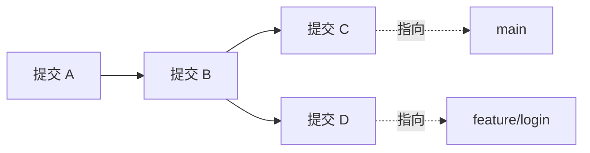
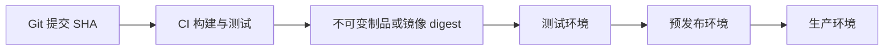
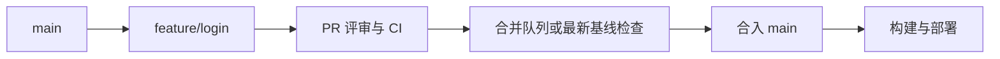
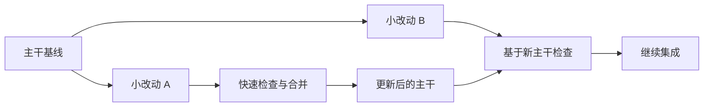
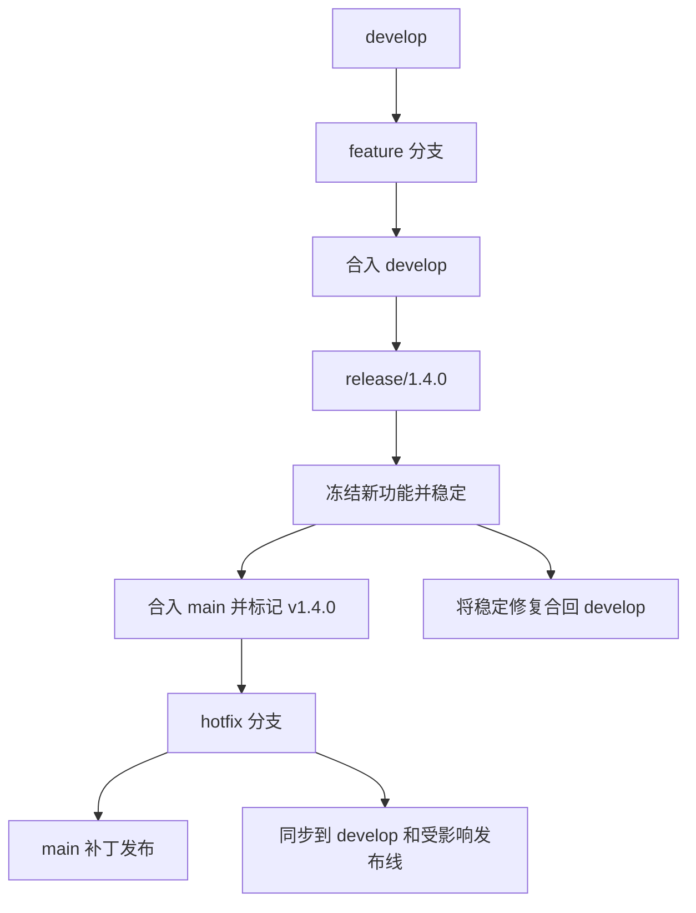
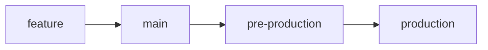
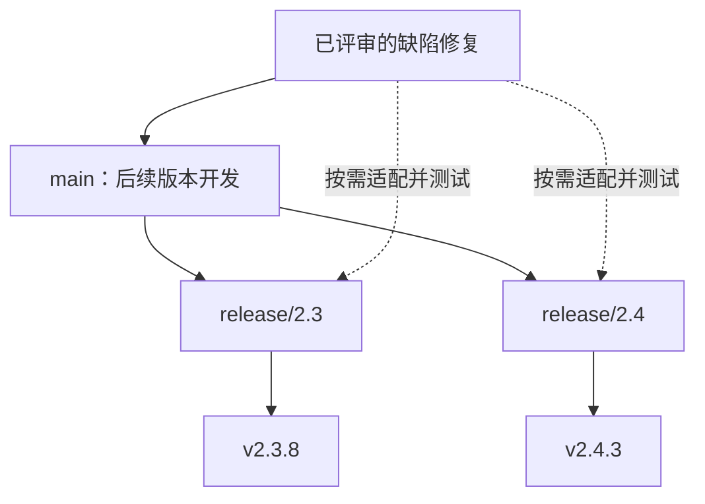
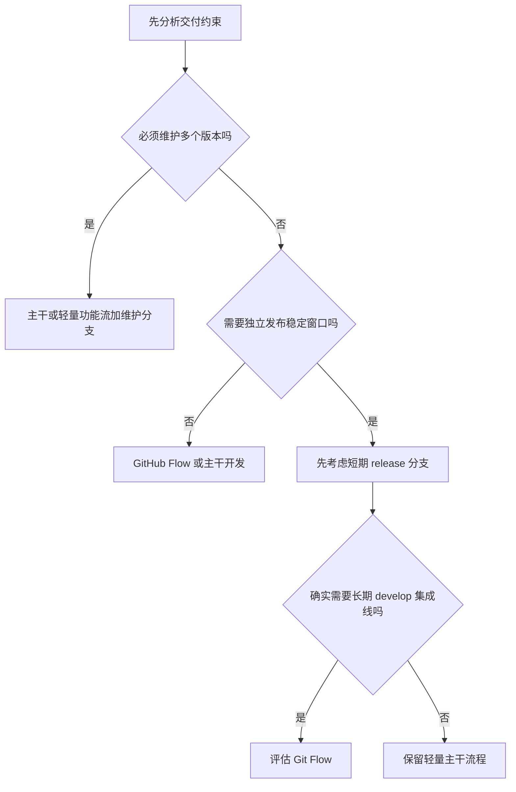

# 企业 Git 分支模型：从概念到 CI/CD 实践

> 学习目标：理解分支的本质，能根据交付方式选择分支模型，掌握日常协作、发布、紧急修复和回滚流程。
>
> 阅读顺序：先学第 1～3 节，再比较第 4～8 节，最后完成实操。不要为了“像大公司”而增加分支；分支是管理并行变化的工具，不是组织架构图。

## 1. 先理解：Git 分支到底是什么？

Git 提交（commit）记录项目快照及父提交。**分支是一个可移动的提交引用**：在分支上产生新提交，该分支引用就向前移动。创建分支并不意味着复制一份完整项目。

- `main`：常见的主分支名，没有特殊魔法，也可能叫 `master` 或 `trunk`。
- `HEAD`：通常指向当前检出的本地分支；检出某个提交或标签时可能处于 detached HEAD 状态。
- `origin`：常见的远程仓库别名，不是固定关键字。
- `origin/main`：本地保存的远程跟踪引用，表示上次获取时远端 `main` 的状态，不会实时更新。
- `tag`：标记一个特定版本的引用。发布标签应按团队规则保持不可变，不要挪动旧版本标签。



图中的实线按提交产生方向表示历史；实际 Git 提交对象记录的是指向父提交的引用。两条分支共享 A、B，随后分别增加 C、D。

### 1.1 特性分支与主干分支

| 概念 | 作用 | 常见生命周期 |
|---|---|---|
| 主干分支 | 集成团队共同成果，形成发布基线 | 长期存在 |
| 特性分支 | 隔离一个功能或小范围改动 | 尽量短，合并后清理 |
| 发布分支 | 稳定某个即将发布或需要持续维护的版本 | 按发布及支持周期存在 |
| 修复分支 | 修正缺陷，包括线上紧急问题 | 修复合入后清理 |

**特性分支并不是一种完整的分支模型。** GitHub Flow、Git Flow 和使用短分支的主干开发，都可以使用特性分支；区别是从哪里创建、向哪里合并、多久集成一次。

### 1.2 分支模型真正要回答的六个问题

1. 日常工作从哪条分支开始？
2. 开发完成后合入哪条分支？
3. 哪个提交可以发布？
4. 谁审批，哪些自动检查必须通过？
5. 线上紧急修复从哪里开始，怎样同步到后续版本？
6. 什么时候删除分支，怎样追溯已发布版本？

只规定 `feature/*`、`release/*` 等名字，却没有这些规则，不能算完整的分支管理方案。

## 2. 分清代码、制品和环境

企业交付涉及三个层次，不要混为一谈：



- **代码分支**管理变化与集成。
- **制品版本**标识真正要部署的内容，例如镜像 digest。
- **运行环境**是代码运行的位置，例如 test、staging、production。

一般优先选择：**构建一次，将同一份已验证的制品逐级部署**。环境配置通过受控配置或密钥系统注入，而不是每换环境就修改代码重新构建。

`main` 可部署，不代表每次提交都必须立即上线；部署成功，也不代表功能已经向所有用户开放。

- 持续集成（CI）：频繁集成，并自动检查。
- 持续交付：随时具备发布能力，生产发布可以保留人工批准。
- 持续部署：满足门禁后自动部署生产。
- 功能开关：控制功能是否开放，可把代码部署与业务发布分开；开关要有负责人和清理期限。

## 3. 常见模型一览

| 模型 | 长期分支 | 集成方式 | 更适合 | 主要成本 |
|---|---|---|---|---|
| GitHub Flow | 通常只有 main | 短分支通过 PR 合入 main | 单一在线版本、频繁交付 | 需要可靠 CI、主干可部署 |
| Trunk-Based Development，主干开发 | 一个主干，可有必要的维护分支 | 极短分支或受控直接提交，频繁集成 | 高频交付、多团队快速协作 | 小批量拆分、快速测试、功能隔离 |
| Git Flow | main、develop；其他分支按周期存在 | feature → develop → release → main | 明确版本周期、较长发布稳定期 | 合并方向多、容易分叉与漏同步 |
| GitLab Flow | main 加按需的环境或版本分支 | 简单功能流结合发布约束 | 需要显式发布阶段或版本维护 | 必须选定具体变体，避免规则混乱 |
| 发布／维护分支模式 | main 加 release/版本线 | 主干开发，维护线接收受控修复 | SDK、客户端、私有化、多版本产品 | 多条支持线的测试和补丁移植 |

这些不是完全互斥的分类：主干开发可以结合发布分支，GitLab Flow 也包含发布分支变体。选择的是一组适合交付约束的规则，而不是一个流行名称。

## 4. GitHub Flow：先掌握的轻量模型

### 4.1 核心规则

1. `main` 保持可部署。
2. 从最新 `main` 创建短期工作分支。
3. 提交改动并发起 Pull Request（PR）；GitLab 中通常称 Merge Request（MR）。
4. 运行自动检查、代码评审，必要时部署预览环境。
5. 按团队约定合并，验证最终合并结果并部署。
6. 确认合入后清理工作分支。



这里采用常见的“合并后部署”流程。有的团队会在合并前对候选提交进行部署验证；无论采用哪种安排，都必须明确生产制品对应哪个提交。

### 4.2 示例：新增登录功能

- `feature/login-validation` 只做输入校验，不把整个账号系统放在同一个 PR。
- PR 中说明改动目的、测试证据、兼容性和回滚方法。
- 审核通过不等于永远可合并：如果 `main` 已变化，要检查新的合并结果。
- 未完成的大功能可分批合入，通过必要的功能开关保持不可见，而不是让分支存活数周。

**优点：**规则少、发布路径短、容易追踪。

**不适合直接照搬的情况：**必须同时维护多个客户版本，却没有配套的维护分支和补丁策略。

## 5. 主干开发：重点是“频繁集成”，不是“没有分支”

主干开发（TBD）的核心是：**多数开发工作以很小的批次，频繁集成到同一主干，避免长期偏离。**

两种常见方式：

- 小团队在严格自动检查下直接向主干集成。
- 通过极短生命周期分支、快速 PR 评审和合并队列集成；企业采用这一方式并不违反主干开发。

通常追求每天至少集成一次，工作分支以小时到一天左右为目标，而不是机械地用时长给团队贴标签。



### 5.1 大功能怎么拆？

以“更换支付服务”为例：

1. 增加接口与兼容实现，但不切换流量。
2. 接入新实现，默认关闭。
3. 增加测试和必要的观测。
4. 灰度切流并验证。
5. 全量切换后删除旧实现与开关。

这是一种按需使用的渐进替换方式，不意味着所有小改动都应该增加接口和开关。

### 5.2 必备条件与失败信号

必备条件：快速且可信的 CI、可拆分任务、及时评审、主干失败优先修复、向后兼容的数据库及接口变更。

失败信号：把长期分支改名为 `short-feature`；合入大量未测试代码；为了快而取消评审；开关长期无人清理。

**与 GitHub Flow 的关系：**前者强调集成频率与小批量，后者强调以 PR 为中心的轻量协作。采用短分支的 GitHub Flow 可以同时符合主干开发。

## 6. Git Flow：区分开发集成线与正式发布线

### 6.1 分支职责

| 分支 | 从哪里创建 | 通常合向哪里 | 允许什么变化 |
|---|---|---|---|
| main | 仓库初始化 | 按需同步修复到 develop | 正式发布历史 |
| develop | 初始 main | 通过 release 进入 main | 下一版本的集成成果 |
| feature/* | develop | develop | 单项开发工作 |
| release/* | develop | main 和 develop | 发布稳定、缺陷修复、版本元数据 |
| hotfix/* | 当前生产基线，经典情况下为 main | main 和 develop；按需进入正在稳定的 release | 线上紧急修复 |



### 6.2 一次完整发布

1. 开发者从 `develop` 创建 `feature/order-export`。
2. 功能经过评审和测试后合入 `develop`。
3. 发布负责人从选定的 `develop` 提交切出 `release/1.4.0`。
4. 发布分支只接收稳定性修复，不继续加入新需求。
5. 候选版本通过验证后合入 `main`，在明确的发布提交上创建 `v1.4.0` 标签。
6. 将发布分支上的修复同步回 `develop`，防止下个版本重复出现问题。
7. 记录提交、制品和部署结果；按策略清理不再需要的分支。

如果发布合并产生了新提交，不应直接假定它与已测试候选完全一致；流水线要验证最终发布提交与制品的对应关系。

### 6.3 线上修复最容易漏在哪里？

生产 1.4.0 出问题，而 `develop` 已包含 1.5.0 的未发布功能：不能直接用 `develop` 上线。

应从当前生产基线切出修复分支，发布 1.4.1，并将修复同步到 `develop` 和其他受影响维护线。同步可以通过适当的合并或有记录的 `cherry-pick` 完成，不能把整条未发布开发线合进生产线。

**适用：**有明确发布节奏、稳定窗口，团队愿意承担双主线管理成本。

**代价：**集成反馈较晚、发布合并复杂。对于单一在线版本、每天多次部署的服务，通常没有必要完整采用 Git Flow。

## 7. GitLab Flow：按发布约束选择变体

GitLab Flow 不是必须同时拥有 `main`、`develop`、`staging`、`production`。它以简单功能分支流为基础，补充必要的发布规则。

### 7.1 环境分支变体



团队以合并到某分支表示环境晋级。这种方式直观，但要明确：

- 默认只允许约定方向晋级，不能随意在环境分支直接开发。
- 环境分支的独立提交可能造成代码漂移。
- 每个环境重新构建可能得到不同制品，削弱测试证据。
- 分支指向某提交，不代表部署一定成功；实际部署状态必须另行记录。

**更常见的简化选择：**不建立环境代码分支，用流水线审批和同一制品晋级管理环境。若采用独立 GitOps 配置仓库，其分支和配置目录治理应与应用代码模型分开讨论。

### 7.2 发布分支变体

日常开发进入 `main`，发布时切出 `release/2.3`；修复按明确规则同步到受影响版本线。这与下一节的维护分支模式可以结合。

## 8. 发布／维护分支：支持多个仍在使用的版本

适合桌面软件、移动端、SDK、企业私有化交付，以及存在长期支持（LTS）要求的产品。



明确每条支持线的：负责人、支持结束日期、允许的修复类型、必跑测试、发布审批，以及修复传播方向。

一般优先在主干修复，再向旧版回移（backport）。但如果问题只存在于旧版，或线上应急必须先处理旧版，应在维护线上修复，并检查主干是否也受影响；不要机械搬运不适用的代码。

- 旧版本尽量只接收必要修复，不接收随意的新功能。
- `cherry-pick` 会产生新提交 SHA，需要记录来源。
- “没有文本冲突”不等于兼容，依赖、接口和数据结构都可能不同。
- 不要把 `main` 整体合入旧维护线，否则可能引入未承诺的新功能。

## 9. 企业到底怎么选？



示例：

| 团队情境 | 起步建议 | 需要补齐的能力 |
|---|---|---|
| 单一版本 Web 服务 | GitHub Flow，逐步缩短分支生命周期 | CI、快速评审、回滚和灰度 |
| 高频交付平台团队 | 主干开发加合并队列 | 小批次、测试速度、兼容性治理 |
| 每月发布客户端 | 主干加短期 release 分支 | 候选版验证、渠道审批、发布记录 |
| 多客户私有化产品 | 主干加受支持版本线 | 补丁回移、支持矩阵、避免客户永久分叉 |
| 已有严格阶段式版本流程 | 可评估 Git Flow | 明确修复回流、减少长期分叉 |

团队人数不是唯一依据。合规通常要求审计、职责分离与审批，并不自动要求使用 Git Flow。

## 10. 日常 Git 操作：理解每一步再执行

> 以下假设项目已有远端 `origin` 和主分支 `main`。Git Flow 项目应按规则把开发起点替换为 `develop`。推送、合并、删除远程分支都影响团队共享状态，执行前确认权限与目标。

### 10.1 获取最新主干并创建分支

```bash
git status
git fetch origin
git switch main
git pull --ff-only origin main
git switch -c feature/123-login-validation
```

- `status`：先确认是否有未提交改动，不要盲目切分支。
- `fetch`：更新远程跟踪引用，不替你合并工作分支。
- `pull --ff-only`：只接受快进更新；本地与远端已经分叉时会失败，防止意外生成合并提交。
- 若失败，先查看 `git log --oneline --graph --decorate --all`，不要用 `reset --hard` 强行“修好”。

### 10.2 提交与发起 PR

修改文件后：

```bash
git diff
git add src/login.ts tests/login.test.ts
git diff --cached
git commit -m "feat: validate login input"
git push -u origin feature/123-login-validation
```

示例文件路径需替换为真实文件。优先明确暂存目标，避免把密钥、日志等误加入提交。随后在托管平台创建 PR，目标为 `main`，填写目的、影响、测试和回滚说明。

### 10.3 开发期间同步主干：选定一种策略

**方式 A：merge，适合共享工作分支，保留原提交历史。**

```bash
git fetch origin
git switch feature/123-login-validation
git merge origin/main
```

**方式 B：rebase，将自己的提交重放到新主干上。**

```bash
git fetch origin
git switch feature/123-login-validation
git rebase origin/main
```

Rebase 会改变被重放提交的 SHA。优先用于尚未共享的提交；若工作分支已经推送，需要先确认没有其他人依赖其历史。禁止对团队共享的 `main`、`develop`、发布维护线随意 rebase。

已经发布的个人工作分支在 rebase 后可能需要 `git push --force-with-lease`，但它仍是改写远程历史的操作，不是日常默认动作，也不能替代团队协调。不要使用裸 `--force`。

### 10.4 解决冲突

1. `git status` 确认冲突文件及当前操作。
2. 阅读双方意图，编辑 `<<<<<<<`、`=======`、`>>>>>>>` 区域。
3. 删除冲突标记，得到真正正确的代码，不是简单“全选 ours/theirs”。
4. `git add` 暂存已解决文件。
5. merge 冲突执行 `git merge --continue`；rebase 冲突执行 `git rebase --continue`，可能需要重复。
6. 重新运行相关测试。

想取消当前操作，可根据实际状态执行 `git merge --abort` 或 `git rebase --abort`。开始前保持工作区干净，避免恢复未提交改动时遇到额外困难。

### 10.5 合并后的清理

PR 在平台合入后：

```bash
git switch main
git pull --ff-only origin main
git branch -d feature/123-login-validation
git fetch --prune origin
```

`-d` 带有合并检查。Squash 合并后原提交未必属于主干祖先，可能导致 `-d` 拒绝；先检查 PR 和改动确实已进入主干，再决定是否强制删除，不要直接把 `-d` 换成 `-D` 当通用操作。

远程分支可由平台在合并后删除，或在授权后执行 `git push origin --delete 分支名`。`fetch --prune` 只清理过期远程跟踪引用，不会替你删除本地工作分支。

## 11. Merge、Squash、Rebase merge 怎么选？

| 策略 | 历史表现 | 适合 | 注意 |
|---|---|---|---|
| Merge commit | 保留分支提交与合并节点 | 需要保留开发拓扑和提交边界 | 历史可能较复杂 |
| Squash merge | 一个 PR 合成一个主干提交 | 小而独立的 PR、希望按需求回滚 | 原分支提交 SHA 不进入主干 |
| Rebase merge | 线性重放多个提交 | 每个提交都组织良好的变更 | 通常改写提交 SHA，不保留合并节点 |

普通 `git merge` 在可以快进时未必产生合并提交；要演示保留合并节点可使用 `--no-ff`。平台上的具体行为以平台配置为准。

起步建议：短分支配合 Squash merge，保持一个 PR 一个清晰目的。团队若需要保留合并拓扑，也可以统一使用 Merge commit。不要为了“线性历史好看”破坏可追溯性。

## 12. 分支如何接入 CI/CD？

### 12.1 事件与动作

| 事件 | 典型流水线动作 | 不应该默认做什么 |
|---|---|---|
| PR 创建或更新 | 格式、静态检查、单元测试、安全检查、按需集成测试 | 给不可信 PR 注入生产密钥 |
| 进入合并队列 | 验证与最新目标分支组合后的结果 | 只依赖早已过期的 PR 检查 |
| main 更新 | 验证最终提交、构建不可变制品、部署测试环境 | 默认把所有主干改动直接开放给用户 |
| 发布候选确定 | 回归、安全及兼容性验证，建立制品映射 | 混入新的大功能 |
| 发布标签或人工批准 | 校验来源与权限，晋级已验证制品 | 只凭标签名就绕过所有检查 |
| 生产部署完成 | 冒烟测试、指标观察、记录结果 | 仅看到流水线绿色就忽略运行故障 |

具体采用标签触发构建还是提交触发构建，要选定一致的策略。若标签用于晋级已有制品，应按提交 SHA 查找唯一对应制品，而不是重新构建一个未经验证的版本。

### 12.2 分支保护最低配置

- 主干、发布线禁止普通成员直接推送和强制推送。
- 必须通过 PR/MR，至少有符合团队规则的审核。
- 必需状态检查绑定正确来源，不能随意伪造同名成功状态。
- 敏感目录设置代码负责人，关键变更增加审批。
- 新提交后按规则使旧批准失效，避免“审完再偷偷改”。
- 使用合并队列或最新基线检查，避免两个独立通过的 PR 合并后一起失败。
- 发布标签限制创建、删除和改写权限；按需使用签名标签与制品签名。
- 部署生产单独设环境权限和审批，不能只依赖分支名。

### 12.3 安全与审计

外部 fork 的 PR 属于不可信代码：不应得到生产凭证，也不应在可接触内部敏感资源的执行器上任意运行。不要因为需要评论 PR 就在高权限任务中检出并执行外部代码。

建议保留这条追溯链：

```text
需求/缺陷 → PR → 审核与检查 → 提交 SHA → 构建记录 → 制品 digest → 部署记录
```

生产记录至少包括环境、部署时间、操作者或流水线身份、提交、制品、配置版本与结果。密钥不进入 Git；泄漏后先轮换凭证，删除当前文件不等于清除了历史中的秘密。

## 13. 线上故障：回滚、Revert 与 Hotfix

### 13.1 三者不是一回事

- **部署回滚**：切换到上一份可用制品，通常用于快速恢复。
- **Git revert**：增加一个反向提交，撤销某次代码变更，保留历史。
- **Hotfix**：增加修复代码，重新构建、验证并发布。

不要通过强推主干、删除历史来处理线上问题。

### 13.2 Revert 的基本做法

先从正确目标分支建立修复分支，以下 `abc1234` 只是示例 SHA：

```bash
git revert abc1234
```

普通提交和 Squash 后的提交通常可以这样撤销。撤销合并提交需要选择主父，例如 `git revert -m 1 合并提交SHA`，但必须先检查父提交关系；`-m 1` 不是所有合并都正确的固定答案。撤销合并还会影响后续重新合并的行为，需提前规划。

### 13.3 从生产基线修复

生产落后于主干时，可从确认过的生产标签切分支：

```bash
git fetch origin --tags
git switch -c hotfix/1.4.1 v1.4.0
```

完成修复、测试与审批后，合向对应发布线，建立新的版本标签和制品，并按受影响范围同步修复到主干。**不要为了修线上一个 bug，把所有尚未发布的主干功能一起上线。**

### 13.4 数据库让回滚更复杂

旧制品未必兼容新数据库结构。删除字段、不可逆数据迁移或外部副作用，不能靠切回镜像自动恢复。

优先考虑 expand-contract：先增加兼容结构，迁移数据与调用方，最后在兼容窗口结束后删除旧结构。发布前明确回滚条件，不可逆操作要有恢复或向前修复方案。

## 14. 纯本地练习：走完一次协作流程

> 本练习只操作新建的本地实验目录，不配置远端，不推送真实仓库。需要 Git 2.28+ 和 Python 3；目录已存在时换一个名字，不要覆盖已有内容。

### 14.1 创建实验仓库

```bash
mkdir git-branch-lab
cd git-branch-lab
git init -b main
git config user.name "Git Learner"
git config user.email "learner@example.test"
python3 -c 'from pathlib import Path; Path("app.txt").write_text("login=basic\n", encoding="utf-8")'
git add app.txt
git commit -m "chore: initialize demo"
```

这里的身份配置只影响实验仓库，没有使用 `--global`。

### 14.2 创建特性分支并提交

```bash
git switch -c feature/login
python3 -c 'from pathlib import Path; Path("app.txt").write_text("login=validated\n", encoding="utf-8")'
git add app.txt
git commit -m "feat: validate login"
```

切回主干，模拟另一个已经完成的独立改动：

```bash
git switch main
python3 -c 'from pathlib import Path; Path("health.txt").write_text("status=ok\n", encoding="utf-8")'
git add health.txt
git commit -m "feat: add health status"
```

### 14.3 同步并合并

```bash
git switch feature/login
git merge main
git switch main
git merge --no-ff feature/login -m "merge: login validation"
git log --oneline --graph --decorate --all
git branch -d feature/login
```

思考：为什么特性分支同步主干不等于主干已经包含特性？因为只有当前分支的引用被本次合并向前移动。

### 14.4 制造并解决一次冲突

```bash
git switch -c feature/login-message
python3 -c 'from pathlib import Path; Path("app.txt").write_text("login=friendly\n", encoding="utf-8")'
git add app.txt
git commit -m "feat: change login message"
git switch main
python3 -c 'from pathlib import Path; Path("app.txt").write_text("login=strict\n", encoding="utf-8")'
git add app.txt
git commit -m "fix: tighten login policy"
git merge feature/login-message
```

**最后一条命令预期会报告冲突，这是练习内容，不是安装失败。** 双方从同一基线修改了同一行。

假设产品决定同时表达严格校验和友好提示，解决为：

```bash
python3 -c 'from pathlib import Path; Path("app.txt").write_text("login=strict-and-friendly\n", encoding="utf-8")'
git add app.txt
git commit -m "merge: resolve login policy conflict"
git status
```

真实项目不能用写死的演示文本覆盖业务文件，要阅读双方代码并运行测试。

### 14.5 标记版本，再撤销一个坏改动

```bash
git tag -a v0.1.0 -m "First local demo release"
python3 -c 'from pathlib import Path; Path("app.txt").write_text("login=disabled\n", encoding="utf-8")'
git add app.txt
git commit -m "feat: disable login in demo"
git revert --no-edit HEAD
git log --oneline --graph --decorate --all
```

用编辑器查看 `app.txt`，应恢复为 `login=strict-and-friendly`。坏提交还在历史中，新增的 revert 提交抵消了它；`v0.1.0` 仍指向原发布提交。

## 15. 团队规则模板

以下是一套适合单一在线版本服务的起步规则，可按约束调整：

| 项目 | 约定 |
|---|---|
| 模型 | GitHub Flow，逐步采用主干开发的小批量原则 |
| 长期代码分支 | main；出现真实版本维护需求时再增加 release 线 |
| 工作分支 | feature/工单-描述、fix/工单-描述、chore/描述 |
| 开发起点与目标 | 最新 main → 工作分支 → main |
| 生命周期 | 尽量当天或短周期合入；长期未合并时主动拆分和评估 |
| 评审 | 必需审核人批准，关键目录由负责人审核 |
| 自动门禁 | 静态检查、测试、必要安全检查、最新合并结果检查 |
| 合并方式 | 默认 Squash；PR 保持单一目的 |
| 发布 | 选定主干提交与不可变制品，按环境批准晋级 |
| 线上修复 | 从实际生产基线修复，验证并同步所有受影响线 |
| 清理 | 合入且确认不再需要后清理工作分支；维护线按支持周期退出 |
| 紧急例外 | 限定授权、记录原因、保留必要验证并事后补审 |

观察指标应服务于改进：分支寿命、PR 等待时间、CI 耗时、主干失败恢复时间、发布失败率。不要用“提交数量”或“分支数量”衡量个人产出。

## 16. 常见误区与自测

### 常见误区

1. **“分支越多越专业。”** 分支越多，同步和测试矩阵通常越复杂。
2. **“主干开发就是允许所有人随便 push main。”** 主干开发可以有严格 PR 和保护规则。
3. **“main 的代码一定正在生产运行。”** 以实际部署记录为准。
4. **“PR 通过测试，合并后一定没问题。”** 基线变化和多个 PR 的组合可能造成失败。
5. **“cherry-pick 没冲突就是回移成功。”** 仍要测试语义和版本兼容。
6. **“每个客户永久维护一个分支就能解决定制。”** 容易造成补丁遗漏和维护爆炸；应先评估配置、扩展点和明确版本支持策略。
7. **“发布失败，把版本标签挪一下。”** 应创建新的可追溯版本，避免同一个版本名对应不同内容。
8. **“回滚代码就能回滚数据。”** 数据库与外部副作用需要单独方案。

### 自测题

1. GitHub Flow 与主干开发为什么可以同时成立？
2. 生产运行 2.3.7，主干已有 2.4 的未发布功能，应从哪里紧急修复？
3. 为什么 Squash 合并后删除本地分支可能被 `-d` 拒绝？
4. 为什么测试环境和生产环境优先使用同一制品？
5. Git Flow 发布分支上的修复为什么要同步回 develop？
6. 什么时候需要维护分支，什么时候只需要环境审批？

参考答案：

1. 一个强调 PR 协作流程，一个强调短周期、小批次集成，两者不冲突。
2. 从确认过的生产提交、标签或对应维护线建立修复分支，再检查其他受影响线。
3. Squash 生成新提交，原分支提交可能不是主干祖先，即便改动已合入。
4. 保证晋级的是已验证内容，减少重新构建带来的差异；环境配置仍需受控。
5. 防止修复只存在于本次发布，下个开发版本又带回原问题。
6. 多个版本需要并行接收修复时需要维护线；同一版本逐环境上线通常不需要额外代码分支。

## 总结

先把 **短分支 → PR → 自动检查 → 合并 → 不可变制品 → 受控部署** 这一条路径做好。只有真实交付约束要求独立稳定期或多版本维护时，再增加发布线或采用更复杂模型。

好的分支模型，不是拥有最多分支，而是让团队清楚知道：**改动在哪里集成、哪个版本被验证、什么正在生产运行，以及出了问题如何恢复。**
