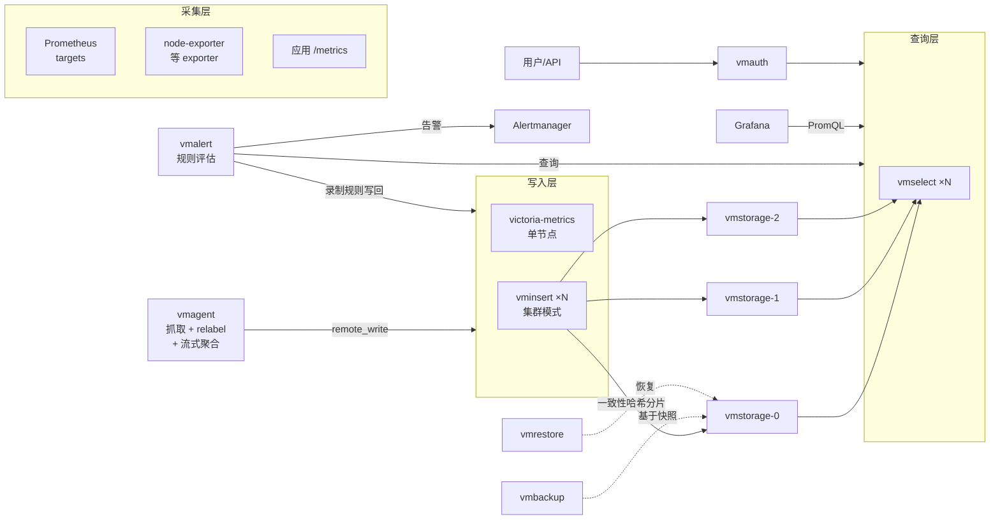
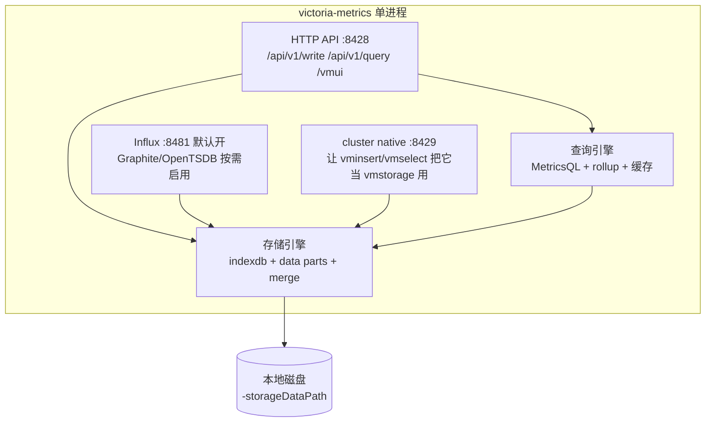
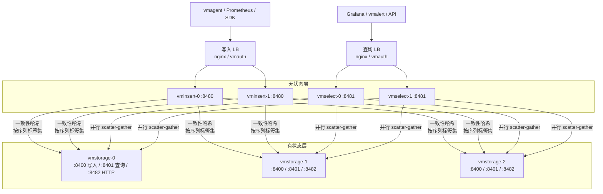
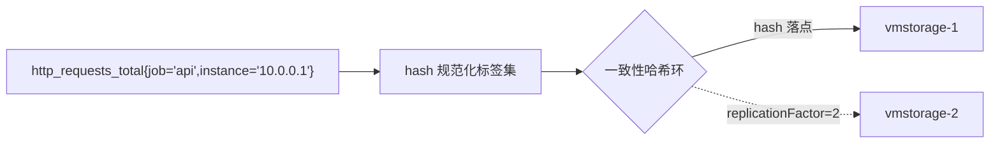

# 01 - 总体架构与设计哲学

> 学习目标：理解 VictoriaMetrics 要解决什么问题，掌握其产品家族全貌；能画出单节点与集群两种架构的数据流，理解一致性哈希分片、多租户的设计；能在 VictoriaMetrics / Thanos / Mimir 之间做出有依据的选型。

## 1. 为什么需要 VictoriaMetrics：时序数据库要解决的问题

监控数据的负载特征与 OLTP 数据库截然不同：

| 特征 | 含义 | 对存储的要求 |
|---|---|---|
| 写多读少 | 每秒持续写入海量样本，查询集中在告警评估与 Dashboard | 写入路径必须极轻：追加写、批量、少 fsync |
| 只追加不修改 | 样本一旦写入几乎不更新、很少按条删除 | 不需要事务/行锁；过期数据可整块删除 |
| 高压缩潜力 | 同一序列相邻样本的时间戳、值变化平滑 | 列式分块压缩（时间戳一列、值一列） |
| 高基数（cardinality） | 序列数 = 指标名 × 标签组合数，K8s 下 Pod 频繁重建导致序列暴涨 | 内存中索引必须高效，慢路径要可控 |
| 长期存储成本 | 合规/容量分析需要保留 1 年以上数据 | 每样本磁盘占用要压到极致 |

Prometheus 的本地存储（TSDB）为"单机、短保留、快速查询"设计，存在天然边界：

1. **不能水平扩展**：单实例的写入与存储上限受单机 CPU/磁盘约束。
2. **不适合长期存储**：本地盘保留一年以上数据成本高，且实例重启后需要重放 WAL、重建头块。
3. **高基数下内存压力大**：head block 的索引常驻内存，活跃序列多时内存消耗急剧上升。
4. **多副本靠外部方案**：HA 需要两份 Prometheus 双写，长期存储需要 Thanos/Cortex 等外挂组件。

VictoriaMetrics 的定位就是：**兼容 Prometheus 生态（remote_write 写入、PromQL 查询、Grafana 数据源），同时以更低的资源成本支撑大规模与长期存储**。官方给出的对比中，其压缩率与写入吞吐显著优于 Prometheus TSDB（具体倍数依数据特征而异，以官方 FAQ 为准）。

## 2. 产品家族全景

VictoriaMetrics 不是单个二进制，而是一组组件：

| 组件 | 职责 | 状态 | 关键端口 |
|---|---|---|---|
| `victoria-metrics` | 单节点：接收写入、存储、查询一体 | 有状态 | 8428 (HTTP API)、8429 (集群 native)、8481 (Influx，默认开启)；Graphite/OpenTSDB 需 `-graphiteListenAddr`/`-opentsdbHTTPListenAddr` 显式启用 |
| `vminsert` | 集群写入层：接收数据，按哈希分片转发给 vmstorage | 无状态 | 8480 (HTTP)、8400 (cluster native 接收端) |
| `vmstorage` | 集群存储层：持久化数据分片、维护索引、执行底层扫描 | 有状态 | 8482 (HTTP)、8400 (收 vminsert)、8401 (供 vmselect 查询) |
| `vmselect` | 集群查询层：并行查询所有 vmstorage 并合并结果 | 无状态 | 8481 (HTTP) |
| `vmagent` | 轻量采集器：抓取 Prometheus targets、remote_write 到 VM，支持流式聚合、relabeling | 无状态（可选磁盘缓冲） | 8429 (HTTP) |
| `vmalert` | 告警/录制规则执行器：周期评估规则，告警发 Alertmanager，录制结果写回 VM | 无状态 | 8880 (HTTP) |
| `vmauth` | 认证网关/反向代理/负载均衡 | 无状态 | 8427 (HTTP) |
| `vmbackup` / `vmrestore` | 基于快照的备份与恢复 | - | - |
| `vmctl` | 数据迁移工具（Prometheus / InfluxDB / CSV / remote-read） | - | - |
| `VictoriaLogs` | 日志存储与查询（LogsQL），同家族独立产品 | 有状态 | 9428 (HTTP) |

组件关系全景：



单节点模式下，victoria-metrics 一个进程同时承担图中"写入层 + 存储 + 查询层"的全部职责。

## 3. 单节点架构

### 3.1 进程内的功能划分

单节点是**一个二进制**，内部包含完整的存储引擎与查询引擎：



几个容易误解的点：

- **8429 端口的意义**：单节点会额外监听 cluster native 协议端口。这意味着你可以在不改造客户端拓扑的情况下，用真正的 vminsert/vmselect 把单节点当作一个 vmstorage 使用——常见于"先单机跑，后续平滑演进"的过渡方案。
- **所有协议最终汇入同一存储引擎**：Prometheus remote_write、Influx line protocol、Graphite、OpenTSDB、CSV 导入的数据，都会转换为统一的内部样本格式落盘，可以用同一套 PromQL/MetricsQL 查询。
- **vmui 内置**：访问 `http://<ip>:8428/vmui` 即可查询、看基数分析、看 query trace，无需额外安装。

### 3.2 适用规模与升级信号

单节点采用"纵向扩展优先"策略：加 CPU、加内存、换 NVMe 盘即可线性提升容量。官方压测中单进程可支撑非常高的写入速率（百万 samples/s 量级，取决于机器与数据特征）。

出现以下信号时应考虑集群（详见 [05-集群服务器部署](05-集群服务器部署.md)）：

1. **单机磁盘容量到顶**：retention 内数据超过单机可挂载磁盘容量。
2. **多租户需求**：需要按业务线隔离数据、独立 retention（单节点不支持多租户）。
3. **读写互相干扰**：大批量查询（如全量导出、大基数分析）拖慢写入，需要独立扩展查询层。
4. **可用性要求**：单机故障导致整体不可写/不可查，需要副本 + 无状态查询层。

反过来说，**没有上述信号就不要上集群**——集群带来三个组件的运维面、一致性哈希与 rebalancing 语义的理解成本，单机纵向扩展简单得多。

## 4. 集群架构（重点）

### 4.1 三组件分工



| 组件 | 有无状态 | 扩缩容 | 故障影响 |
|---|---|---|---|
| vminsert | 无状态 | 任意增减，客户端无感 | 单个挂掉：LB 摘除即可，无数据丢失（写入端有重试/缓冲） |
| vmstorage | 有状态 | 增加：新数据开始写入新节点；减少：需等数据过期或迁移 | 挂掉：其分片数据暂不可查（有副本时无感） |
| vmselect | 无状态 | 任意增减 | 单个挂掉：LB 摘除即可 |

### 4.2 设计哲学：三个关键决策

理解这三点，才能正确运维集群（很多事故源于对它们的误解）：

**① 零外部协调依赖。** vmstorage 之间互不通信，没有 Raft/Paxos、没有 ZooKeeper/etcd 成员管理。数据分片关系由 vminsert/vmselect 通过 `-storageNode` 静态列表 + 一致性哈希决定，不由存储层协商。带来两个结果：
- 部署极简：起 N 个 vmstorage 进程即可，无需组建"集群"；
- 没有 quorum 概念：写成功不要求多数派确认，查询可用性由 `-maxUnavailablePercent` 控制部分响应（见 3.4 节查询路径，详见 03 章）。

**② insert/select 彻底无状态。** 二者不落盘（vmselect 仅可选磁盘缓存），可以随意重启、滚动升级、水平扩展。所有持久化状态集中在 vmstorage。这是与 Cortex/Mimir（compactor、ruler、成员列表皆有状态语义）在运维体验上最大的差异。

**③ vmstorage 互不感知，各自为政。** 每个 vmstorage 是独立的单机存储引擎（与单节点同源），只存自己哈希环上的数据。节点间零流量：不迁移数据、不同步索引、不做心跳。扩缩容时不存在"集群内部 rebalance 风暴"。

### 4.3 数据如何分布：一致性哈希

写入路径上，vminsert 对每条样本执行：

1. 将序列的 `metric name + 全部 labels` 规范化（排序、去重标签）；
2. 计算哈希值；
3. 在 `-storageNode` 列表构成的一致性哈希环上定位目标 vmstorage；
4. 若配置了 `-replicationFactor=N`，同时写入环上相邻的 N-1 个不同 vmstorage。



**关键推论——rebalancing 语义**（与 Elasticsearch/Cassandra 等系统的重要区别）：

- 一致性哈希保证：增减 vmstorage 时，只有哈希环上一小段序列改变归属；
- **旧数据不迁移**：序列 A 原本存在 vmstorage-0，扩容后新样本可能路由到 vmstorage-3，但 vmstorage-0 上的历史数据原地不动；
- 因此同一条序列的数据在扩容前后可能分布在两个节点上，vmselect 查询时从所有节点收集合并，结果仍然完整正确；
- 磁盘占用不均会随 retention 周期自然收敛（老数据过期删除后，各节点按新分布重新积累）；
- **缩容是危险操作**：直接下线 vmstorage 会永久丢失其上数据，必须先等待数据自然过期或用快照迁移，详见 05 章。

### 4.4 副本机制

副本解决的是"单 vmstorage 故障期间的可用性与数据完整性"，不是备份：

| 配置项 | 位置 | 作用 |
|---|---|---|
| `-replicationFactor=N` | vminsert | 每条序列写 N 份到 N 个不同 vmstorage |
| `-dedup.minScrapeInterval=30s` | vmstorage **和** vmselect | merge 与查询时按时间窗口去重，保留一份 |
| `-replicationFactor=N` | vmselect | 声明查询结果按 N 副本去重合并 |

三处必须配套，否则查询会看到重复点。注意：vmstorage 侧的 dedup 是在后台 merge 时物理去重，vmselect 侧是查询时去重（详见 02 章 6 节与 05 章 3 节）。

## 5. 多租户

**仅集群版支持**（单节点无租户概念）。租户为两级：`accountID:projectID`，默认 `0:0`。

租户体现在 URL 路径上：

```text
写入：POST /insert/<accountID>:<projectID>/prometheus/api/v1/write
      例：POST /insert/42:7/prometheus/api/v1/write
查询：GET  /select/<accountID>:<projectID>/prometheus/api/v1/query
      例：GET  /select/42:7/prometheus/api/v1/query?query=up
```

要点：

- vminsert 收到带租户前缀的 URL 后，把租户信息编码进发往 vmstorage 的数据流；vmstorage 按租户**物理隔离存储目录**（`<storageDataPath>/<accountID>:<projectID>/...`）；
- 租户之间查询绝对隔离：42 租户无法查到 7 租户的数据；
- 每租户独立 retention：社区版为全局 `-retentionPeriod`；企业版支持按租户设置不同 retention（以官方文档为准）；
- 防失控：`-insert.maxHourlySeries` / `-insert.maxDailySeries` 可限制单租户新建序列速率（vminsert 参数）；
- 租户数量应克制（每租户独立索引与合并开销），典型做法是按业务线/环境划分十几个以内，而不是按应用实例划分。

## 6. 与其它长期存储方案对比

| 维度 | Prometheus 本地 | Thanos | Cortex / Grafana Mimir | VictoriaMetrics 集群 |
|---|---|---|---|---|
| 长期存储介质 | 本地盘 | 对象存储（S3 等，必需） | 对象存储（必需） | **本地盘/块存储（无对象存储依赖）** |
| 组件数量 | 1 | Sidecar+Store+Compactor+Query(+Receive) | Distributor+Ingester+Store-gateway+Compactor+Querier(+Ruler) | vminsert+vmstorage+vmselect（3 个） |
| 协调机制 | 无 | 对象存储上的元数据 | 成员列表（gossip/etcd）、对象存储索引 | **无：静态 storageNode 列表 + 一致性哈希** |
| 水平扩展 | 不支持 | Store 横向读扩展 | Ingester 哈希环 | vmstorage 加节点（rebalancing 语义见 4.3） |
| 历史数据处理 | 无 | 下沉对象存储 Compaction | 下沉对象存储 Compaction | 原地按 part 过期，不迁移 |
| 查询语言 | PromQL | PromQL（Query 层拼接） | PromQL | MetricsQL（兼容绝大多数 PromQL，见 03 章） |
| 资源成本 | 基线 | 中（对象存储省钱，组件多） | 中高 | **低（官方对比中 CPU/内存/磁盘占用优势明显，以自家 benchmark 为准）** |
| 运维负担 | 低 | 中高：对象存储一致性、Compactor 单点 | 高：哈希环、多组件调参 | **低：无环、无 quorum、组件各自独立** |
| 多租户 | 无 | 弱（Query 层） | 原生（租户头） | 原生（URL 路径两级租户） |

选型建议：

- **已有 S3 强诉求、组织标准是对象存储** → Thanos / Mimir 更契合；
- **中等规模、团队小、要低成本长期存储** → VictoriaMetrics 单节点起步，纵向扩展到顶再上集群；
- **大规模写入（K8s 多集群汇聚）、多租户按业务隔离、不想维护对象存储链路** → VictoriaMetrics 集群；
- 无论选哪个，**先压测再定容量**：用真实标签基数灌数据，观察内存/磁盘曲线，比任何理论公式可靠。

## 7. 版本与发布模型

- 单节点与集群组件**同版本号发布**（monorepo，一次 release 包含 victoria-metrics、vminsert、vmselect、vmstorage、vmagent、vmalert 等），本文示例统一用 `v1.110.0`，实际以 [官方 Releases](https://github.com/VictoriaMetrics/VictoriaMetrics/releases) 为准；
- 升级时保持全家桶版本一致，避免协议边界上的兼容问题；
- 社区版（开源、Apache-2.0）覆盖本文绝大部分内容；**企业版**在此基础上增加：降采样（downsampling）、多租户独立 retention、备份增强等运维功能（详见 [07 章](07-运维调优与故障排查.md)）。

## 下一步

- 数据落到 vmstorage 后发生了什么？→ [02-写入路径与存储引擎原理](02-写入路径与存储引擎原理.md)
- 查询是如何在集群中执行并合并的？MetricsQL 与 PromQL 有哪些坑？→ [03-查询路径与MetricsQL](03-查询路径与MetricsQL.md)
