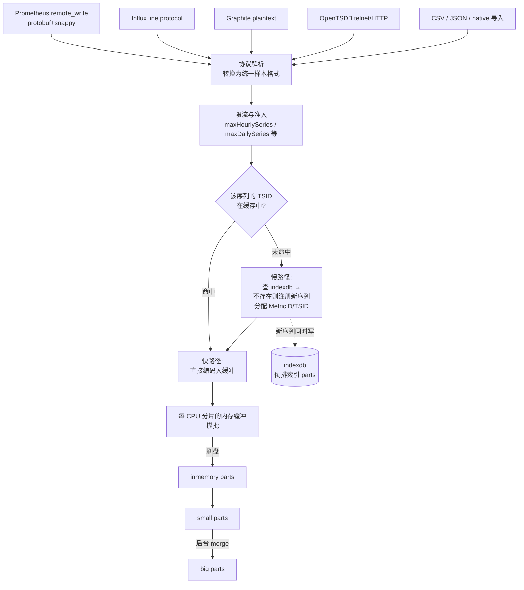
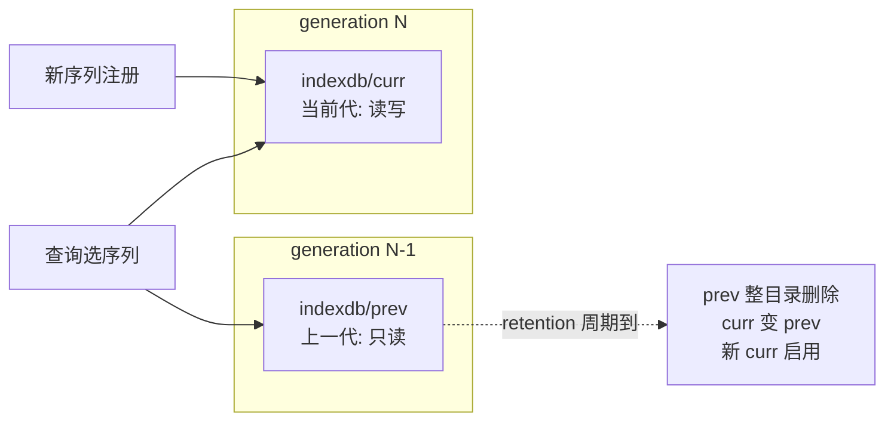
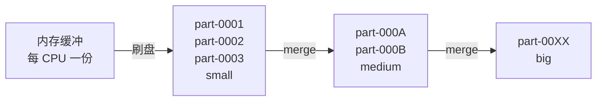
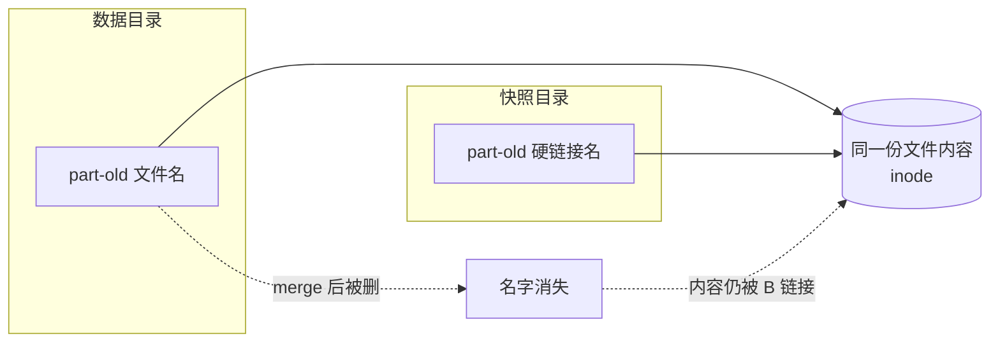

# 02 - 写入路径与存储引擎原理

> 学习目标：深入理解 VictoriaMetrics 的写入链路与存储引擎内部机制——TSID 与倒排索引、LSM-like 的 parts merge、无 WAL 设计的权衡、块级压缩原理、去重与降采样、retention 与快照；能解释"为什么 VM 快、为什么省磁盘"，并据此诊断写入性能问题。

本章以单节点/单个 vmstorage 为视角（二者存储引擎同源）。集群模式下 vminsert 只是前置的哈希分发层，样本到达 vmstorage 后走完全相同的路径。

## 0. 开始前的术语速查

本章会出现一批存储引擎术语，先混个脸熟，正文中还会随用随解释：

| 术语 | 一句话解释 |
|---|---|
| 样本（sample） | 一个数据点 = `(序列, 时间戳, 数值)`，如 `(cpu_usage{host="a"}, 10:00:00, 0.75)` |
| 时间序列（time series） | 由 `指标名 + 一组标签` 唯一确定的一条数据流，如 `http_requests_total{job="api",code="200"}`；标签变一个字就是**另一条**序列 |
| 基数（cardinality） | 序列的数量。"高基数" = 序列特别多（几百万条），内存和索引压力都来自它 |
| churn rate（翻腾率） | 序列"换血"的速度。K8s 里 Pod 每几分钟重建一次、pod 名进了标签，序列就不断"死了又生"，churn 就高 |
| TSID | Time Series ID，引擎给每条序列发的内部整数编号（身份证），数据按它排序存放 |
| 倒排索引（inverted index） | 搜索引擎的经典结构："标签 → 含这个标签的序列列表"，像书末尾的关键词索引页，让你不用翻全书就能定位 |
| WAL | Write-Ahead Log，预写日志：数据库先把操作记入日志并落盘，再改数据，保证崩溃后可恢复。VM **没有**它（第 5 节讲为什么） |
| fsync | 操作系统调用：强制把缓冲数据真正写到磁盘介质（而不是停在系统缓存里），代价高昂 |
| LSM-like | Log-Structured Merge 风格：先攒批写小块文件，后台不断把小文件合并成大文件。写快、删便宜，代价是后台合并消耗资源 |
| part | VM 磁盘上的一组数据文件（一个目录），part 内部有序、不可变（写完不再修改，只会整块删除或被 merge 成新 part） |
| merge | 后台把多个小 part 读出来合并重写成一个有序大 part 的过程 |
| block | part 内部的压缩单元：一段同序列的连续样本（最多约 8K 个）打包压缩成一个块 |
| 列存 | 时间戳放一起、数值放一起分开压缩（相对"一行一行存"的行存），同列数据相似度高、压得更狠 |
| 硬链接 | 文件系统的机制：同一个文件内容的第二个名字。删除原名不影响链接名，几乎零成本 |
| 读放大 / 写放大 | 为了完成 1 份逻辑读写，实际发生的物理 IO 是几倍。放大越小越好 |
| goroutine | Go 语言的轻量线程；VM 用 Go 编写，后台 merge 就是一组 goroutine |

## 1. 全局写入路径

一条样本从网络到磁盘经过的完整链路：



读图要点：**每条样本进来都要先回答"你属于哪条序列"这个问题**（TSID 查找），答案在内存缓存里就走快路径，不在就要去查磁盘上的索引；回答完之后，样本值和索引条目分别进入两条独立的存储流。

两条并行的数据流要分清：

| 流 | 存什么 | 结构 | 生命周期 |
|---|---|---|---|
| **数据流（data parts）** | 样本值：时间戳 + float | 按 TSID 有序的分块列存 | retention 到期整块删除 |
| **索引流（indexdb）** | 标签集 ↔ TSID 的双向映射 | 倒排索引，也是 parts 结构 | 随 retention 周期轮转换代 |

> retention（保留期）：数据保留多久，过期即删。用 `-retentionPeriod=12`（12 个月）之类的参数配置，详见第 8 节。

类比一下：数据流像**档案柜里的正文卷宗**（按编号顺序排列），索引流像**卡片目录**（"姓张的 → 编号 1024、2048…"）。查资料先翻目录拿编号，再去档案柜按编号直接取——两步都很快，但目录本身也要占地方、也要维护。

## 2. TSID：序列的内部身份证

每条唯一时间序列（metric name + label 集合确定）在引擎内部对应一个 **TSID**（Time Series ID），其中核心是全局唯一的 `MetricID`。

为什么不直接用标签串当主键？因为 `{job="api",code="200",instance="10.0.0.1"}` 这样的字符串又长又慢：比较、排序、做 map 的 key 都要逐字节处理。换成一个整数编号后，排序就是整数比较，数据文件里也不用重复存标签——**这是所有高性能时序库的共同做法**（Prometheus TSDB 内部同样有 series ID）。

数据 parts 中的样本按 TSID 排序存放，这带来两个直接后果：

- 同一序列的所有样本物理相邻，扫描一条序列 = 顺序读一段连续区域（顺序读比随机读快一到两个数量级）；
- 查询第一步永远是"标签过滤 → 得到 TSID 集合 → 按 TSID 捞数据"，索引与数据完全解耦，各自可以独立优化。

**TSID 缓存**：写入热路径上，"标签集 → TSID" 的映射缓存在内存中。已有序列的后续样本直接命中缓存，不碰索引——这是稳态写入极快的原因之一。（"稳态"指序列集合基本不变，比如服务跑起来后每 30 秒上报同一批指标。）

**慢路径与新序列注册**：缓存未命中时要查 indexdb；若序列是全新的，还需要：

1. 分配新的 MetricID；
2. 向 indexdb 写入正向索引（MetricID → TSID、MetricID → 标签集）与倒排索引（每个 label → MetricID）；
3. 把新映射加入缓存。

这条路径涉及多次索引读写与可能的磁盘访问，比快路径慢一个量级以上。

监控指标 `vm_slow_row_inserts_total` 计数的就是走慢路径的样本数——**它是 churn rate（序列翻腾率）的直接信号**。举个具体例子：K8s 里一个 Deployment 每 3 分钟滚动重建 Pod，如果 pod 名进了标签，那么每 3 分钟就诞生一批全新序列、老序列同时死亡。这些新序列全部要走慢路径注册，于是"偶发事件"变成"持续负载"：写入吞吐下降、indexdb 不断膨胀（死序列的索引不会立刻消失，见 3.2 节）。

> 高熵标签：取值种类极多、几乎每条都不同的标签，如 pod_name、container_id、request_id、user_id、trace_id。它们是基数与 churn 的头号来源，通常不该进标签（07 章 3 节讲治理）。

治理方法见第 9 节与 07 章。

## 3. indexdb：倒排索引与"换代淘汰"

### 3.1 两类索引表

先搞懂**倒排索引**是什么。假设库里有 4 条序列：

```text
编号1: http_requests_total{job="api",  env="prod"}
编号2: http_requests_total{job="web",  env="prod"}
编号3: node_cpu_seconds{job="node",    env="prod"}
编号4: node_cpu_seconds{job="node",    env="dev"}
```

"正排"是编号 → 标签（像字典正文）；**倒排**反过来，标签 → 编号列表（像书末的关键词索引页）：

```text
job="api"   → [1]          env="prod" → [1,2,3]
job="web"   → [2]          env="dev"  → [4]
job="node"  → [3,4]        __name__="http_requests_total" → [1,2]
```

查询 `http_requests_total{job="api", env="prod"}` 时：取三个倒排列表 `[1,2] ∩ [1] ∩ [1,2,3]` 求交集 → 得到编号 1 → 再去数据区按编号捞样本。**标签越多过滤越快**（列表求交是归并扫描，有序整数列表效率极高）——这与 MySQL"行存 + B+树按主键查"完全是两种思路。

indexdb 本质是一个 key-value 存储（基于 merge 型数据结构），承载两类逻辑表：

| 方向 | Key → Value | 用途 |
|---|---|---|
| 倒排 | `label=值` → MetricID 列表 | 查询时按标签过滤选序列 |
| 正向 | MetricID → TSID、MetricID → 完整标签集 | 查询命中后取回序列名与标签（画图例要显示完整标签）；写入慢路径注册 |

> 选择性（selectivity）：一个过滤条件能筛掉多少数据。`job="api"` 只命中 1 条（选择性高），`env="prod"` 命中 3 条（选择性低）。求交集时**先处理短列表**，中间结果始终最小——上面例子就是先取 `[1]` 再去交其它。

查询时的序列选择过程：把标签过滤条件逐个转成倒排列表，按选择性排序（先取小的），流式求交/并/差，得到最终 TSID 集合。`__name__`（指标名）在 VM 内部也是一个特殊标签，同样参与倒排。

### 3.2 prev/curr 双代轮转

**要解决的问题**：序列会"死"（服务下线、Pod 销毁后不再上报），它们的索引条目怎么清？逐条删除意味着要在巨大的索引里做随机查找和修改——慢且产生碎片。VM 的答案是：**不逐条删，整体换代**（像酒店换床单：不挑哪块脏了洗，到点整套换新）。

indexdb 分为两个目录（两"代"）：



用时间线走一遍（假设 retention = 3 个月，每 3 个月轮转一次）：

```text
1月1日  轮转: curr(空) 启用，旧 curr → prev
        序列 A 上报 → 注册进 curr
1月~3月 序列 A 持续上报（索引已在 curr，不重复注册）
        序列 B 只活到 2月（服务下线）→ 它的索引也躺在 curr 里
4月1日  轮转: curr → prev；新建空 curr
        序列 A 还在上报 → 在【新 curr】重新注册一份
        序列 B 死了 → 没人替它在【新 curr】注册
4月~6月 查询同时查 prev + curr（A 在两代都有，B 只在 prev）
7月1日  轮转: prev(含 B 的索引) 整个目录 rm -rf ← B 在这一刻才消失
        当前 curr → prev；再新建空 curr
```

- 每个 retention 周期轮转一次；
- 查询同时查两代（老序列的索引在 prev 里，新序列在 curr 里），所以轮转对查询透明；
- 死序列的索引**在下一次 prev 被删时**整体消失，零逐条删除开销。

这个设计的代价与含义（理解它们才能看懂磁盘占用）：

- **索引清理是粗粒度的**：上面例子中序列 B 在 2 月就死了，索引却活到 7 月——最坏约 2×retention。因此磁盘上 `indexdb` 的大小与"**历史总序列数**"（这段时间出现过的所有序列）相关，而不是"当前活跃序列数"。**高 churn 场景下 indexdb 可能比数据本身还大**：每 3 分钟换一批 Pod 名，三个月累积的死序列索引是天文数字——这就是 07 章把 churn 治理列为重点的原因；
- **retention 改小后 indexdb 不会立即缩**：要等当前轮转周期走完、旧 prev 被删；
- 好处是零删除开销、零碎片整理，符合"追加写、批量删"的负载特征。

## 4. 数据 parts：LSM-like 的 merge 结构

> LSM（Log-Structured Merge-tree）风格：数据库存储引擎的一大流派（RocksDB、LevelDB、Cassandra、HBase 都是）。核心思路：**把随机写变成顺序写**——新数据先攒在内存，定期整批顺序刷成不可变的小文件；后台线程持续把小文件归并成大文件。写入极快（全是顺序追加），代价是后台合并的 CPU/IO 开销和"一份数据可能被反复重写"的写放大。VM 的数据 parts 就是这个思路的时序定制版。

### 4.1 从内存到磁盘的三级结构

写入不直接落最终形态，而是走"小批量刷盘 + 后台持续合并"：

1. **内存缓冲**：每个 CPU 核有独立的缓冲分片（各写各的，不用抢一把锁——"锁竞争"指多个线程排队等同一把锁，是并发程序的头号性能杀手），样本按 TSID 排序攒批；
2. **inmemory parts → small parts**：缓冲攒够阈值，整批刷成磁盘上的小 part。**part 是一组文件的目录**，内部数据按 TSID 有序、压缩存放，且**不可变**——写完就再也不修改，只会被 merge 成更大的 part 后删除，或到期整目录删除；
3. **small → big parts**：后台 merge 协程持续把多个小 part 归并（多路归并排序，因为各自有序所以合并很快）成大 part，直到整个时间范围收敛为少数几个大 part。



### 4.2 为什么这个结构合理

先想清楚**不这么做会怎样**：如果每来一条样本就直接写到它的最终位置（像 B+ 树数据库那样原地更新），磁盘上到处是随机小写——机械盘直接报废，SSD 也扛不住每秒百万次的 4KB 随机写。攒批顺序写把百万次随机写变成每秒几次大块顺序写，这是吞吐差百倍的根本原因。

| 设计点 | 收益 |
|---|---|
| 批量刷盘而非逐条写 | 顺序 IO，摊薄 syscall（系统调用，用户态↔内核态切换很贵）与文件系统元数据开销 |
| part 数量有限（merge 收敛） | 查询扫描的 part 数可控——查询一条序列要检查"哪些 part 可能含它的数据"，若不清理，几年后每次查询要打开成千上万个文件，光是遍历目录就慢死 |
| merge 时顺带压缩与去重 | 数据在后台完成最终整理，不占写入热路径（写入方只管往缓冲扔，重活后台干） |
| part 自包含、不可变 | 删除（retention 到期）= 删目录；快照 = 对文件做硬链接（见 8.2），都极廉价；不可变还意味着并发读无需加锁 |

**merge 的双刃剑**：merge 要读旧 part、解压、归并、重压缩、写新 part——消耗 CPU 与磁盘带宽，且同一份数据从小到大被反复重写（这就是**写放大**：逻辑上写 1 次，物理上写了 2~3 次）。写入洪峰时 merge 队列积压（观察 `vm_active_merges` 当前正在跑的合并数、`vm_pending_rows` 排队等待合并的样本数），可能与查询争抢资源。相关调节手段：

- `-storage.maxMergeDuration`：限制单次 merge 的时长上限，超时就把任务切片让路，避免一个大 merge 长时间独占磁盘拖慢查询（默认值以 `--help` 为准）；
- 磁盘必须用 SSD/NVMe：merge 与查询对随机读延迟敏感，HDD 上 vmstorage 性能会严重劣化（机械盘随机读约 10ms，NVMe 约 0.1ms，差 100 倍）。

## 5. 无 WAL 设计：权衡的艺术

> WAL（Write-Ahead Log，预写日志）：传统数据库的保命机制——任何数据修改前，先把"我要做什么"追加写入一个日志文件并 **fsync**（强制落到磁盘介质），然后才改真正的数据。崩溃后重放日志即可恢复到一致状态。代价：每次写多一次顺序写 + 一次昂贵的 fsync；启动时要重放日志，宕机前写入越多、重启越慢。

VictoriaMetrics **没有 WAL**。样本进入内存缓冲后异步刷盘，不做每批次 fsync 的持久化承诺：

- **掉电/进程崩溃的代价**：丢失最近尚未刷盘的缓冲数据——通常是**几秒到几十秒**的样本（取决于缓冲刷盘节奏）；
- **换来的收益**：写入路径上没有 WAL 的顺序写与 fsync 开销，没有崩溃后的重放（对比 Prometheus：重启要 replay WAL，恢复时间与宕机前写入量相关，大实例可能卡几分钟；VM 重启几乎瞬时，因为磁盘上的 part 本来就不可变、无需修复）；
- **为什么对监控合理**：监控数据的价值密度低且冗余高——丢 30 秒样本，图表上是一个微小缺口，`rate()` 这类基于时间窗口计算的查询几乎无感知；而且采集端（Prometheus/vmagent）自己还有缓冲（remote write 队列/磁盘队列，见 04 章），VM 恢复后会把断连期间的数据补传回来——**实际丢数据需要"VM 崩溃 + 采集端缓冲也同时耗尽"双重故障**。用 WAL 的持久化保证换写入吞吐与恢复速度，是针对场景的正确取舍。

**这决定了 VM 不适合当业务数据库用**：计费、审计等"一个样本都不能丢"的场景，应由采集端双写（两份 VM 集群互备）或改用事务存储解决。

## 6. 压缩原理（重点）

VM 的高压缩率来自**列式分块 + 每块择优编码**，压缩在写入路径上完成（后台 merge 时进一步重压）。

原始成本先算一笔账：一个样本 = 时间戳（int64，8 字节）+ 值（float64，8 字节）= 16 字节。每秒 10 万样本、保留一年，裸存是 16B × 10万 × 3.15e7 ≈ **50TB**。而压缩后每样本常在 1~2 字节量级，即 3~6TB——**压缩不是锦上添花，是时序存储可行的前提**。

### 6.1 块结构与列存

样本按序列（TSID）组织成 **block**（压缩单元）：同一序列的连续样本打包，每个 block 最多约 8K 个样本（量级，精确值以源码/官方文档为准）。block 内**时间戳与值分开压缩**（列存）——因为两列的数据特征完全不同，混在一起压会互相拖累：

| 列 | 特征 | 编码思路 |
|---|---|---|
| 时间戳 | 严格递增，间隔近似恒定（scrape_interval） | delta 编码：只存与前一个的差值 |
| 值 | float64，相邻值高度相似 | XOR 编码：只存与前一个的差异位 |

### 6.2 三种核心编码，各配一个算例

**① delta + zigzag（时间戳）**

30s 抓取一次的时间戳序列（毫秒）：

```text
原始:      1700000000000, 1700000030000, 1700000060000, 1700000090000  (每个 8 字节)
delta:     1700000000000, 30000, 30000, 30000                          (首值全存，之后存差值)
再 delta:  1700000000000, 30000, 0, 0                                  (差值的差值，间隔恒定→全是0)
zigzag:    把有符号数映射为无符号（0→0, -1→1, 1→2, -2→3...），
           再用变长编码：小数字只占 1 字节，0 就存一个 0 字节
```

结果：除首值外每个时间戳只花约 1 字节甚至几个 bit。**抓取间隔越稳定，压得越狠**——这就是"时间戳列几乎免费"的原因。

**② XOR（数值，Gorilla 论文方案）**

相邻 float 做异或（XOR）：二进制位相同的位变 0，只有变化的位留 1。CPU 利用率序列：

```text
值:        0.7531, 0.7529, 0.7540, 0.7538
二进制特点: float64 的高位（符号+指数+大部分尾数）在相邻值间几乎不变
XOR 结果:  相邻两值异或后，绝大部分位是 0，只有尾数低位有少量 1
存储:      记录"前导零个数 + 有效位长度 + 有效位本身"，
           一个值常只需 2~10 bit（对比原始 64 bit）
```

值越平稳压得越好：恒为 1 的 `up` 指标 XOR 全零，一个 block 几千个值几乎不占空间。

**③ 专用编码**：整数值（如计数器）转整型走 zigzag；常量 block（全同值）只存一个值 + 个数。

### 6.3 每块自描述、按块择优

写入/merge 时，引擎对每个 block 把上述编码都试一遍，**选压缩后最小的一种**，编码类型记录在 block 头里。读取时先看块头再按对应算法解压——不需要全局 schema，每个块自己说明自己怎么解。

效果（定性）：

- 稳态序列（如恒为 1 的 `up`、缓慢变化的计数器）：时间戳与值都高度可压，**每样本平均可低于 1 字节**；
- 抖动大的值（如高熵 gauge、随机数般的延迟毛刺）：XOR 收益下降，但仍优于 gzip 之类的通用压缩（通用压缩不认识"时间戳递增""float 高位相似"这些领域特征）；
- 整体压缩率相对 Prometheus 本地 TSDB 有数倍优势（官方 FAQ 有对比数据，具体倍数强依赖数据特征——**用自己的真实数据压测才是唯一可信的容量依据**）。

### 6.4 压缩与查询的联动

压缩块同时是查询的 IO 单元：vmstorage 扫描时按 block 读取，先做**块级过滤**——块头里记着该块的时间戳范围和 TSID 范围，与查询条件不匹配的块**直接跳过，连解压都不做**；只有命中的块才解压。所以"数据按 TSID 有序 + 块内列存 + 块头元数据"三者共同构成查询加速：查一条序列 1 小时的数据，物理上只需读 2~3 个块，而不是扫全库。压缩不只是省磁盘，还在省 IO。

## 7. 去重与降采样

### 7.1 dedup：HA 双写场景的必需品

> HA（High Availability，高可用）双写：为了防单点故障，跑两份采集端（两份 Prometheus，或每个分片两个 vmagent）抓同一批 target，各自把数据 remote_write 到同一个 VM。**代价**：同一序列的同一时刻样本会被写入两遍。

```text
prometheus-A: cpu_usage{host="a"} @10:00:00 = 0.75 ─┐
                                                     ├─→ VM 收到两条一模一样的样本
prometheus-B: cpu_usage{host="a"} @10:00:00 = 0.75 ─┘
```

不去重的话：磁盘存两份浪费空间；查询画图时同一时间点两个值，`rate()` 等计算也可能被干扰。dedup（deduplication，去重）就是解决这个的：

```yaml
# 所有接收写入的组件（单节点 或 每个 vmstorage）
-dedup.minScrapeInterval=30s
# 集群查询层（每个 vmselect）
-dedup.minScrapeInterval=30s
```

语义：**同一序列、同一个时间窗口（窗口大小 = minScrapeInterval）内，只保留一个样本**。为什么要在两处都配——

- **vmstorage 侧**：后台 merge 时把重复样本物理删掉（省磁盘）；
- **vmselect 侧**：merge 是异步的，刚写入的重复样本可能还没被 merge 清理，查询时在结果里临时去重（保证正确性）；
- 两处值必须一致，且 **≥ 抓取间隔**：30s 抓取配 30s dedup 是安全的；配 15s 会把"每 30 秒一个的正常样本"误判成窗口内重复而删掉一半数据。

副本模式（vminsert `-replicationFactor≥2`，同一条数据主动写 2 个 vmstorage 节点）产生的是同样的重复形态，依赖同一套 dedup（见 01 章 4.4 节、05 章 3.2 节）。

### 7.2 降采样（downsampling）

> 降采样：把老数据的精度调低——原始每 30 秒一个点，三个月后只保留每 5 分钟一个点（取窗口内的平均/最大等）。看一年趋势图时根本分辨不出 30s 和 5m 的差别，但磁盘能省一个数量级。

**企业版功能**，在后台 merge 中自动进行，对查询透明：

```bash
# 形式示例：90 天后的数据降为 5 分钟粒度（具体语法以企业版官方文档为准）
-downsampling.period=90d:5m
```

**社区版替代方案**（思路都是"在数据变老之前先聚合"）：

1. **vmagent 流式聚合**：在采集端就把 `avg/max/sum by (job)` 等聚合结果作为新序列写出，明细不进库（配置见 07 章 3.2）；
2. **vmalert 录制规则**：周期计算聚合表达式（如 `avg_over_time(cpu[5m])`）把结果写回 VM 成为新序列，Dashboard 改查聚合序列；
3. **热冷双实例**：一套短 retention 高精度实例（排障下钻用）+ 一套长 retention 只收聚合数据的实例（长期趋势用），架构图见 07 章 6 节。

## 8. retention 与快照

### 8.1 retention：目录级过期

`-retentionPeriod` 接受月数（`12` = 12 个月）或时长形式（`30d`、`12w`、`1y` 等）。过期实现极其粗暴高效：

- 每个 part 目录记录其数据时间范围；
- 后台任务发现整个 part 都过期 → **直接删除目录**；
- 不需要重写/压缩存活数据，没有删除带来的 IO 放大。

配合 indexdb 的换代机制（3.2 节），数据与索引的过期都是批量操作。注意：**retention 修改需重启生效**，且缩短 retention 后磁盘不会立刻释放（等 part 过期扫描与 indexdb 轮转）。

### 8.2 快照：硬链接的秒级一致性视图

> 先解释硬链接：Linux 文件系统中，文件名只是指向"文件内容（inode）"的链接。**硬链接 = 给同一份内容再起一个名字**，两个名字完全平等；删除其中一个名字，内容不会消失，直到所有名字都删光。创建硬链接不复制数据，瞬间完成、不占额外空间。

```bash
curl -XPOST http://localhost:8428/snapshot/create
# 返回 {"snapshot":"victoria-metrics-20260918103000-xxxx"}
```

原理：对当前所有 parts 与 indexdb 文件创建**硬链接**到一个快照目录。为什么这样就能得到"一致性视图"？关键在 part 的**不可变性**（4.1 节）：

- 数据文件写完就不再修改，所以快照链接住的文件内容永远不变——不存在"备份到一半文件被改了"的问题；
- merge 是"写新 part、删旧 part"：删除只是去掉原目录里的名字，快照目录里的硬链接名字还在，内容就还在（inode 存活）；
- 于是硬链接集合天然构成某一时刻的完整一致数据视图，而创建过程只是"起名字"，秒级完成。



- 磁盘开销：创建时≈0；只有当 merge 删除原 part 后，快照持有的那份链接才实际"留住"数据（这就是快照放久了会占磁盘的原因——记得用完删除）；
- 这是 `vmbackup` 的工作基础：backup 从快照目录做增量上传（见 04 章 8 节、07 章 4 节）；
- 快照目录用 `curl -XPOST /snapshot/delete` 删除（它会把整个快照目录的名字清掉），**不要手删数据目录里的文件**。

## 9. 高基数与 churn rate 对引擎的压力

把前面机制串起来，资源消耗模型是：

| 资源 | 决定因素 | 对应指标 |
|---|---|---|
| vmstorage 内存 | **active time series**（TSID 缓存、indexdb 缓存、merge 缓冲都与活跃序列数成正比） | `vm_active_time_series`、`vm_cache_entries` |
| indexdb 磁盘 | **历史总序列数**（双代保留，见 3.2） | `vm_indexdb_*` 系列 |
| data 磁盘 | 写入速率 × retention × 每样本字节数 | `vm_rows`、`vm_free_disk_space_bytes` |
| 写入 CPU | 快路径编码 + 慢路径注册 + merge | `vm_slow_row_inserts_total`、`vm_active_merges` |

**高基数（huge cardinality）**= 某时刻活跃序列太多；**高 churn（翻腾）**= 序列集合变化太快，持续走慢路径。二者常伴生（Pod 标签爆炸既涨基数又涨 churn），但治理侧重不同：

- 诊断入口：`GET /api/v1/status/tsdb`（topN 序列与标签维度）、vmui 的 Explore cardinality 页面；
- 治理手段（在**写入端**做，别指望存储层）：
  1. vmagent relabeling 丢弃高熵标签（pod_name、container_id、trace_id 之类进标签的值都是事故源）；
  2. 流式聚合降维：明细序列在 vmagent 处聚合成 `by (job, namespace)` 粒度再写；
  3. 限制准入：`-storage.maxHourlySeries` / `-storage.maxDailySeries`（超限的新序列被丢弃并计数 `vm_rows_dropped_*`），保护存储不被单个失控应用拖垮；
  4. 完整案例演练见 07 章 3 节。

## 10. 写入性能特征小结

为什么单进程能做到很高的写入吞吐——把本章机制对应回去：

| 机制 | 消除的开销 |
|---|---|
| 无 WAL、异步刷盘 | 每批次 fsync 与日志顺序写 |
| 每 CPU 独立缓冲 | 锁竞争与伪共享 |
| TSID 缓存快路径 | 稳态写入不碰索引 |
| 批量 part + 后台 merge | 随机小 IO |
| 压缩在写入/merge 路径完成 | 读放大，且降低磁盘带宽需求 |
| 目录级 retention、硬链接快照 | 删除与备份的 IO 放大 |

推论出的运维纪律：**SSD 必配、churn 要治、dedup 三处配套、扩容靠加 vmstorage 而非单机死磕**。

## 下一步

- 查询如何借用本章的块结构与索引加速？→ [03-查询路径与MetricsQL](03-查询路径与MetricsQL.md)
- 动手部署一台单节点观察这些机制 → [04-单节点服务器部署](04-单节点服务器部署.md)
