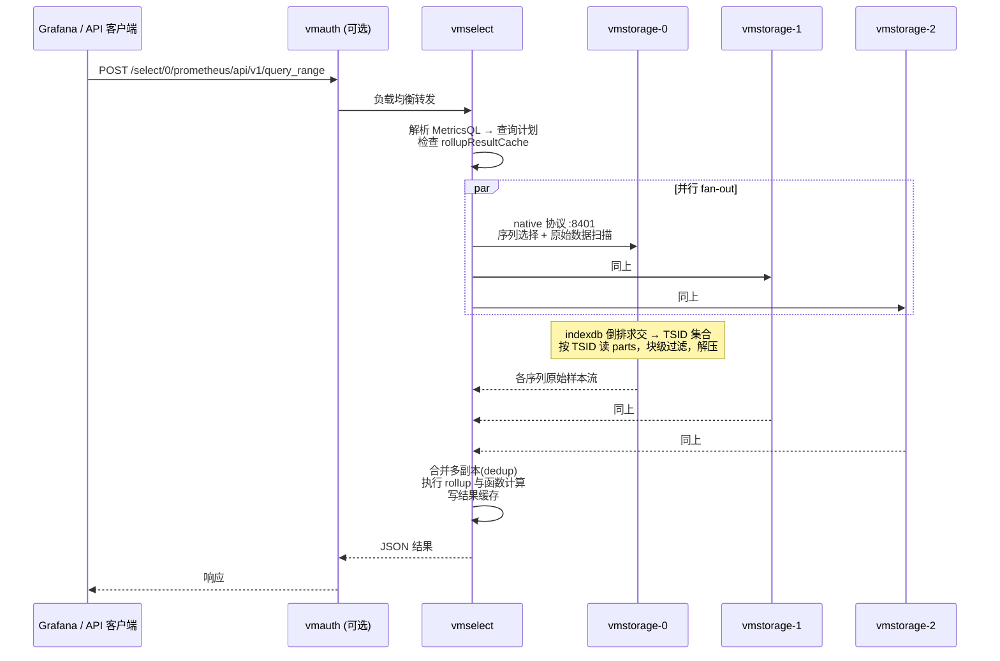
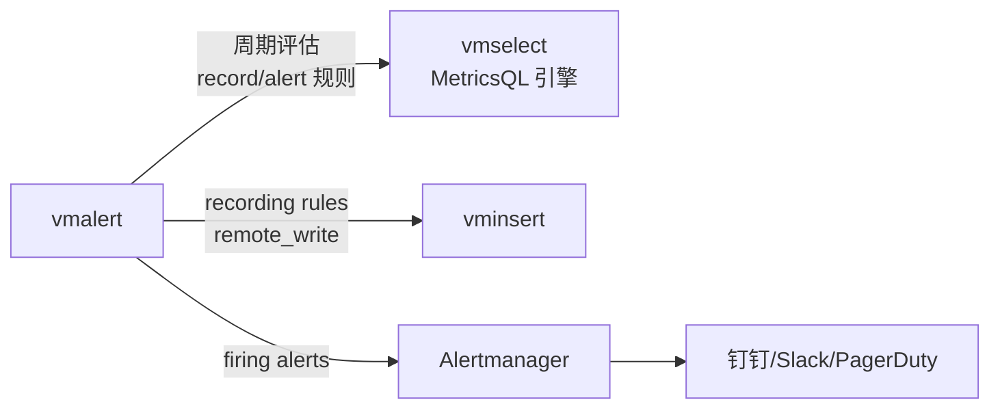

# 03 - 查询路径与 MetricsQL

> 学习目标：理解一次查询在集群中的完整执行链路（vmselect 与 vmstorage 的分工）、缓存体系为什么让 Dashboard 越看越快；掌握 MetricsQL 与 PromQL 的关键语义差异，避开从 Prometheus 迁移时最容易踩的坑；会用查询保护参数与 trace 工具定位慢查询。

## 1. 查询 API 全景

单节点（`:8428`）与集群 vmselect（`:8481/select/<accountID>:<projectID>/...`）暴露同一套 HTTP API：

| API | 用途 | 说明 |
|---|---|---|
| `GET/POST /api/v1/query` | 即时查询 | 单时间点求值 |
| `GET/POST /api/v1/query_range` | 区间查询 | Grafana 面板的主力接口，返回矩阵 |
| `/api/v1/series` | 按标签过滤列出序列 | match[] 参数，基数分析常用 |
| `/api/v1/labels`、`/api/v1/label/<name>/values` | 标签名/标签值枚举 | 自动补全数据源 |
| `/api/v1/export`、`/api/v1/export/csv`、`/api/v1/export/native` | 原始数据导出 | 导出原始样本而非 rollup 结果，做外部分析 |
| `/api/v1/status/tsdb` | 基数分析 | topN 指标名/标签对，高基数排查第一入口 |
| `/api/v1/rules`、`/api/v1/alerts` | vmalert 状态 | 规则与当前告警 |
| Graphite `/render`、`/metrics/find` | Graphite 查询协议 | 集群上由 vmselect 提供 |

**vmui**（内置 Web UI）：单节点 `http://<ip>:8428/vmui`；集群 `http://<vmselect>:8481/select/<accountID>/prometheus/vmui`。除了查询，还能：

- **Explore cardinality**：可视化 `/api/v1/status/tsdb` 结果，定位高基数标签；
- **Trace**：展示单次查询在 vmselect/vmstorage 各阶段的耗时分解；
- **Query examples**：内置常用查询模板。

```bash
# 即时查询示例（集群，租户 0:0）
curl 'http://vmselect:8481/select/0/prometheus/api/v1/query' \
  --data-urlencode 'query=sum(rate(http_requests_total[5m])) by (job)'

# 基数分析
curl 'http://vmselect:8481/select/0/prometheus/api/v1/status/tsdb'
```

## 2. 集群查询执行路径

一次 `query_range` 在集群中的完整时序：



### 2.1 分工原则：扫描靠近 vmstorage，计算靠近 vmselect

| 层 | 职责 | 为什么放这里 |
|---|---|---|
| vmstorage | 序列选择（倒排索引求交）、按 TSID 读块、块级过滤、解压、按 dedup 配置合并副本 | 数据在哪，IO 在哪做；避免把压缩块原样搬过网络 |
| vmselect | 跨节点合并、MetricsQL 函数求值（rate/quantile/聚合）、排序、结果缓存 | 计算需要全局视图（如 `sum by` 跨节点求和），且无状态层加机器就能扩计算力 |

推论：

- **vmselect 是查询瓶颈的常见位置**：大基数查询时 vmselect 要合并所有节点的序列流，CPU 与内存压力大 → 加 vmselect 副本即可水平扩展查询能力；
- vmstorage 的扫描压力取决于序列数与时间范围 → 靠治理基数（02 章 9 节）与合理的块结构解决；
- vmselect 无状态，挂掉一个，LB 摘除，用户仅感知一次失败重试。

### 2.2 部分响应与可用性

集群没有 quorum，vmselect 默认允许**部分响应**：个别 vmstorage 不可达时，用其余节点的数据返回结果（可能不完整）。

| 参数（vmselect） | 语义 |
|---|---|
| `-maxUnavailablePercent=10` | 最多允许 10% 的 vmstorage 不可达仍返回结果（默认值以 `--help` 为准） |
| `-search.denyPartialResponse` | 置 true 后，只要有 vmstorage 不可达就报错而非返回残缺结果 |

选择原则：**告警评估与账单类查询要 denyPartialResponse 吗？** 一般不——监控场景下"带缺口的结果"优于"整体不可用"；vmalert 评估时宁可用旧数据算出告警，也不要因为一个节点重启就全部评估失败。只有在"结果必须完整"的导出/审计场景才考虑拒绝部分响应。

## 3. 缓存体系

### 3.1 rollupResultCache（vmselect）

Dashboard 第二次打开明显变快，主要归功于它：

- **缓存内容**：`query_range` 的**计算结果**（每个序列每个时间点的 rollup 值），而不只是原始数据；
- **失效机制**：按数据版本失效——vmstorage 侧该查询涉及的时间范围内有新数据写入（版本推进），对应缓存条目失效重算；历史时间段（不再有新写入）的缓存长期有效；
- **时间边界**：`-search.cacheTimestampOffset`（默认约 5 分钟量级，以 `--help` 为准）——"最近 N 分钟"的结果不进缓存/总是重算，避免缓存到还在变化的实时数据；
- **`-search.latencyOffset`**：让查询整体延迟这个时间量（如 30s），使"最新点"也落在稳定区域，从而可缓存、且各面板对齐——代价是看图晚 30 秒。

### 3.2 vmstorage 侧缓存

| 缓存 | 内容 | 效果 |
|---|---|---|
| TSID 缓存 | 标签集 → TSID | 加速查询的序列选择（与写入共用，02 章 2 节） |
| indexdb 缓存 | 倒排项、MetricID→标签映射 | 高频标签过滤免磁盘 |
| 数据块缓存 | 热 block 的解压数据 | 重复扫描免解压 |

内存由 `-memory.allowedPercent` 统一约束（缓存与 merge 缓冲共享该预算）。

## 4. MetricsQL vs PromQL：差异与迁移陷阱

MetricsQL 是 PromQL 的超集：**绝大多数 PromQL 查询原样可用**，但存在语义差异与大量增强。迁移时真正会咬人的是语义差异。

### 4.1 语义差异 Top 3（迁移最容易踩的坑）

**坑 1：stale 处理不同——序列不会"5 分钟就消失"。**
Prometheus 中，序列停止上报后，5 分钟 lookback 之外的点即视为 stale，`up` 快速变 0/消失；VM 默认**更宽容**：查询时间点无新样本时，倾向沿用最后一个已知值（`keep_last_value` 语义内置），图上曲线更连续。后果：

- "服务下线后曲线还拖了一段"——通常无害甚至更好看；
- 但**依赖 stale 语义的告警行为会变**：如 `absent(up == 0)` 或"序列消失即告警"类规则，在 VM 上可能延迟触发或不触发。迁移告警规则时逐条审视对"无数据"的依赖，必要时显式用 `default` / `absent_over_time` 表达意图。

**坑 2：`increase()` 不外推。**
Prometheus 的 `increase` 会按窗口边界外推（结果常出现非整数，如 counter 增加了 10 却报 10.7）；VM 的 `increase` 返回**窗口内的实际增量**（正确处理 counter reset，不外推）。后果：迁移后同一告警阈值下数值系统性偏小/偏大，阈值需重新校准；`rate()` 同理受窗口边界处理影响，数值可能略有不同。

**坑 3：`offset`、子查询与多窗口函数的细节差异。**
MetricsQL 支持 `offset` 修饰符作用于更多位置、子查询更激进（自动优化），`WITH` 模板可组合表达式。同一查询在两系统的边缘行为（NaN 传播、空结果集语义）可能不同。迁移方法：**用 vmctl 双跑对比**——同一查询分别打 Prometheus 与 VM，diff 结果（见 07 章 vmctl 的 remote-read 模式）。

### 4.2 MetricsQL 独有函数速查

| 类别 | 函数 | 用途示例 |
|---|---|---|
| 间隙填充 | `keep_last_value`、`keep_next_value`、`default` | `sensor_value default 0`：无数据时取 0 而非断线 |
| 滚动窗口 | `range_avg`、`range_sum`、`range_first`、`range_last`、`range_linear_regression` | 滑动窗口内统计，不依赖 step 对齐 |
| 累计计算 | `running_sum`、`running_avg`、`running_max`、`running_min` | 从窗口起点累计，画"当天累计流量" |
| 平滑 | `smooth_exponential` | 指数平滑去毛刺 |
| 序列元信息 | `lag`、`lead`、`lifetime`、`scrape_interval` | `scrape_interval(node_cpu_seconds_total)`：自动推断上报间隔；`lifetime`：序列存活时长 |
| 直方图增强 | `histogram`（返回 bucket 分布）、`histogram_quantile` 增强、`histogram_share` | 分位数与分布分析 |
| 标签操作 | `label_set`、`label_del`、`label_join`、`label_replace`（增强）、`label_uppercase` 等 | 查询时改写标签，`label_set(q, "env", "prod")` 直接加标签 |
| 多参数 | `quantiles(0.5, 0.9, 0.99, metric)` | 一次算多个分位数，替代三条 PromQL |
| 时间窗口修饰 | `time_window(metric, [1h])`、`keep_last_value` 组合 | 显式控制 lookback |

`WITH` 模板示例（MetricsQL 独有，PromQL 没有）：

```promql
WITH (
    commonFilters = {job="api", env="prod"},
    hitRate = sum(rate(http_requests_total{commonFilters, code!~"5.."}[5m]))
            / sum(rate(http_requests_total{commonFilters}[5m]))
)
hitRate
```

模板在查询解析期展开，适合把重复的过滤条件与表达式抽成命名片段；vmalert 规则里也能用。

### 4.3 rollup 函数与分辨率

VM 的 rollup（`rate`、`avg_over_time`、`max_over_time` 等）在**查询时**基于原始样本计算，窗口内至少需要 2 个点。两个相关行为：

- **自动 staleness 间隔**：无数据时向前 lookback 多久（`-search.maxStalenessInterval`，默认自动推断为抓取间隔量级）——影响"最后一个点能撑多久"，与坑 1 的宽容语义配合；
- **`step` 与窗口**：`query_range` 的 step 小于数据实际间隔时，VM 不会像 Prometheus 那样制造大量重复点，而是按需填充——图上看起来更平滑，但 `increase` 类聚合的语义差异（坑 2）要牢记。

## 5. vmalert：让规则评估也走 MetricsQL



- vmalert **完全兼容 Prometheus 规则文件格式**（`groups/rules/expr/for/labels/annotations`），存量规则可直接加载——但 expr 是 MetricsQL 语义，坑 1/坑 2 同样作用于告警评估；
- 录制规则产生的新序列通过 remote_write 写回 VM（`-remoteWrite.url=http://vminsert:8480/insert/0/prometheus/api/v1/write`），后续查询与原生序列无异；
- vmalert 自身无状态：多副本并行评估会重复告警（Alertmanager 去重兜底）或重复写入录制序列（dedup 兜底），一般单副本 + 快速重启即可；
- 规则热加载：`-rule.reloadInterval` 或向 vmalert 发 SIGHUP（以 `--help` 为准）。

规则文件示例（与 Prometheus 格式一致）：

```yaml
groups:
  - name: vm-health
    interval: 30s
    rules:
      - alert: VMStorageDiskAlmostFull
        expr: vm_free_disk_space_bytes / (vm_free_disk_space_bytes + vm_data_size_bytes) < 0.15
        for: 10m
        labels:
          severity: warning
        annotations:
          summary: "{{ $labels.instance }} 磁盘剩余不足 15%"
      - record: job:http_requests:rate5m
        expr: sum(rate(http_requests_total[5m])) by (job)
```

## 6. 查询性能调优与保护

### 6.1 保护参数（防单查询打爆集群）

| 参数（vmselect / 单节点） | 保护什么 | 调优思路 |
|---|---|---|
| `-search.maxQueryDuration` | 单查询最长执行时间 | 默认量级 30s；大导出场景按需调大，但别放开 |
| `-search.maxConcurrentRequests` | 并发查询数 | 超过即快速失败，保护 vmselect 不被 Grafana 刷新风暴打满 |
| `-search.maxUniqueTimeseries` | 单查询最多返回的序列数 | **最重要的高基数护栏**：`sum by` 一个百万基数指标会在这里被拦截报错，而不是 OOM |
| `-search.maxSeries` | series API 返回上限 | 防 `/api/v1/series` 全量拉取 |
| `-search.maxPointsPerTimeseries` | 单序列返回点数上限 | 防超长 range 查询 |
| `-search.maxTagKeys/maxTagValues` | 标签枚举上限 | 防 labels API 拖垮 indexdb |

被拦截时查询返回明确错误（如 `the number of unique time series exceeds ...`），这是**提示你去治理基数**，不是调大参数硬扛。

### 6.2 慢查询定位

1. **vmui Trace**：直接在 UI 里看该查询各阶段耗时——是 vmstorage 扫描慢（序列多/磁盘慢），还是 vmselect 合并慢（结果集大/CPU 不足）；
2. `vm_slow_queries_total`（vmselect 指标）：慢查询计数，突增时结合 access log 找到具体 expr；
3. `/api/v1/status/tsdb`：确认涉事指标的基数规模；
4. 常见根因对照：

| 现象 | 大概率根因 | 处置 |
|---|---|---|
| 所有查询整体变慢 | merge 风暴抢占 vmstorage IO/CPU（写入洪峰后） | 观察 `vm_active_merges`；考虑 `-storage.maxMergeDuration` 限制；SSD 性能不足 |
| 个别查询慢，其余正常 | 高基数序列选择/合并 | 治理基数；改写查询缩小标签范围；确认 `maxUniqueTimeseries` 未误杀 |
| 重启后一段时间慢 | rollupResultCache 冷启动 | 属预期，预热后恢复 |
| Grafana 面板偶发超时 | vmselect 副本不足或并发打满 | 加 vmselect；查 `maxConcurrentRequests` 拒绝率 |

### 6.3 查询侧最佳实践

- Dashboard 变量用 `label_values` 而非全量 series 枚举；
- `rate/increase` 窗口至少 2~4 倍抓取间隔，否则点稀疏结果抖动；
- 大范围历史分析走 `/api/v1/export` 拉原始数据到外部计算，别用 `query_range` 硬扫一年；
- 高频重复查询（如大盘）依赖 rollupResultCache 即可，不必自建缓存层；
- 告警规则 expr 先在 vmui 里跑通、看 trace，再上生产。

## 下一步

- 把本章的查询端与 02 章的写入端拼成完整单机 → [04-单节点服务器部署](04-单节点服务器部署.md)
- 集群拓扑下 vmselect/vmstorage 的部署与参数 → [05-集群服务器部署](05-集群服务器部署.md)
