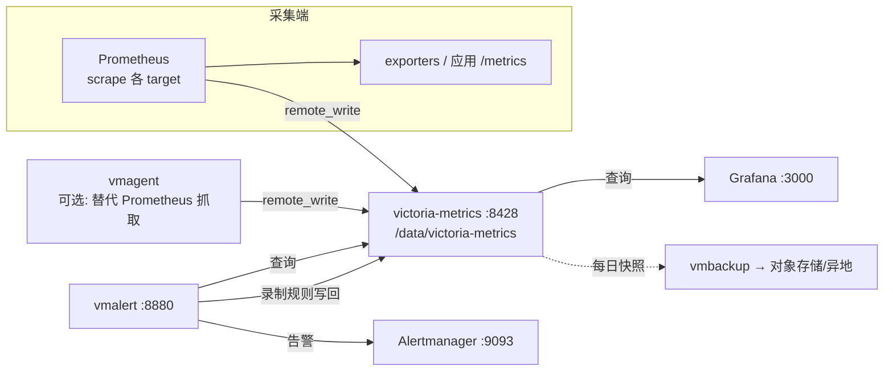

# 04 - 单节点服务器部署

> 学习目标：能在裸机（二进制/systemd）与 Docker Compose 两种形态下独立完成 VictoriaMetrics 单节点的生产级部署，理解每个关键启动参数的含义与取值依据；掌握数据接入、验证自检、备份恢复与升级流程。

约定：示例版本 `v1.110.0`（以 [官方 Releases](https://github.com/VictoriaMetrics/VictoriaMetrics/releases) 为准），数据目录 `/data/victoria-metrics`，HTTP 端口 `8428`。架构原理见 [01 章](01-总体架构与设计哲学.md)、[02 章](02-写入路径与存储引擎原理.md)。

## 1. 适用场景与容量边界

**什么时候单节点够用**（回顾 01 章 3.2 节）：

- 写入量在单机纵向扩展能力内（NVMe + 大内存的单进程可支撑很高吞吐，官方压测达百万 samples/s 量级，视数据特征而定）；
- 不需要多租户；
- retention 内数据量单机磁盘装得下；
- 可以接受"重启期间短暂不可写/不可查"（采集端 vmagent/Prometheus 有缓冲，数据不丢，只是延迟到达）。

**经验容量判断**（务必用自己数据压测校准，见 07 章 2 节）：

| 资源 | 估算依据 |
|---|---|
| 内存 | active time series × 约 1KB（经验值，以官方 FAQ 为准）+ 查询/merge 开销；`-memory.allowedPercent` 控制总预算 |
| 磁盘 | 写入速率(samples/s) × retention(秒) × 每样本字节数（压测得出，常在 1~2 字节量级）+ indexdb + 预留 20~30% merge 空间 |
| CPU | 写入编码压缩 + 后台 merge + 查询；核数越多写入并行度越高（每 CPU 独立缓冲） |

磁盘必须是 SSD/NVMe（merge 与查询对随机读敏感，02 章 4.2 节）。

## 2. 部署拓扑



最小可用组合：`Prometheus(或 vmagent) + victoria-metrics + Grafana`；加告警再上 `vmalert + Alertmanager`。

## 3. 二进制部署（Linux amd64）

### 3.1 下载与前台试跑

```bash
# 下载（版本号按需替换；也可从 GitHub Releases 页面获取）
wget https://github.com/VictoriaMetrics/VictoriaMetrics/releases/download/v1.110.0/victoria-metrics-linux-amd64-v1.110.0.tar.gz
tar xzf victoria-metrics-linux-amd64-v1.110.0.tar.gz
sudo install -m 0755 victoria-metrics-prod /usr/local/bin/victoria-metrics

# 前台试跑，验证能启动、能访问
victoria-metrics-prod \
  -storageDataPath=/data/victoria-metrics \
  -retentionPeriod=12 \
  -httpListenAddr=:8428
# 另开终端: curl http://localhost:8428/health → OK
```

生产二进制用 `victoria-metrics-prod`（官方构建的优化版本）。

### 3.2 关键启动参数

| 参数 | 示例 | 说明 |
|---|---|---|
| `-storageDataPath` | `/data/victoria-metrics` | 数据目录，独立大容量磁盘挂载点 |
| `-retentionPeriod` | `12` 或 `30d`/`12w`/`1y` | 保留期；纯数字=月数；支持 d/w/y 形式；修改需重启（02 章 8.1） |
| `-httpListenAddr` | `:8428` | 主 HTTP 端口；绑内网 IP 或配合防火墙 |
| `-memory.allowedPercent` | `80` | VM 可用内存占系统比例，控制缓存+merge 预算（默认值以 `--help` 为准） |
| `-dedup.minScrapeInterval` | `30s` | HA 双写/副本去重窗口，必须 ≥ 抓取间隔（02 章 7.1） |
| `-selfScrapeInterval` | `15s` | 自监控抓取间隔：VM 自己抓自己的 /metrics，部署后 Grafana 大盘才有数据 |
| `-search.maxUniqueTimeseries` | `1000000` | 单查询序列数护栏（03 章 6.1） |
| `-storage.minFreeDiskSpaceBytes` | `10GB` | 磁盘低于阈值时拒写保护，防止写满损坏 |
| `-httpAuth.username/-httpAuth.password` | - | 简易 HTTP 认证（生产建议用 vmauth，见 07 章 9 节） |

生产推荐命令行（单机 64G 内存、NVMe 数据盘、HA 双 Prometheus 写入场景）：

```bash
/usr/local/bin/victoria-metrics-prod \
  -storageDataPath=/data/victoria-metrics \
  -retentionPeriod=12 \
  -httpListenAddr=10.0.0.10:8428 \
  -memory.allowedPercent=80 \
  -dedup.minScrapeInterval=30s \
  -selfScrapeInterval=15s \
  -storage.minFreeDiskSpaceBytes=10GB
```

## 4. systemd 托管

`/etc/systemd/system/victoria-metrics.service`：

```ini
[Unit]
Description=VictoriaMetrics single-node
After=network-online.target
Wants=network-online.target

[Service]
Type=simple
User=victoriametrics
Group=victoriametrics
# 参数放环境文件，避免改 unit 触发 daemon-reload 的混乱
EnvironmentFile=-/etc/victoria-metrics/victoria-metrics.conf
ExecStart=/usr/local/bin/victoria-metrics-prod $ARGS
Restart=on-failure
RestartSec=5
LimitNOFILE=65536
# 数据目录权限
ReadWritePaths=/data/victoria-metrics
# 日志走 journald（VM 日志输出到 stderr）
StandardOutput=journal
StandardError=journal
SyslogIdentifier=victoria-metrics

[Install]
WantedBy=multi-user.target
```

`/etc/victoria-metrics/victoria-metrics.conf`：

```ini
ARGS="-storageDataPath=/data/victoria-metrics -retentionPeriod=12 -httpListenAddr=:8428 -memory.allowedPercent=80 -dedup.minScrapeInterval=30s -selfScrapeInterval=15s"
```

启用与日常操作：

```bash
sudo useradd -r -s /sbin/nologin victoriametrics
sudo mkdir -p /data/victoria-metrics && sudo chown victoriametrics:victoriametrics /data/victoria-metrics
sudo systemctl daemon-reload
sudo systemctl enable --now victoria-metrics

sudo systemctl status victoria-metrics     # 运行状态
sudo journalctl -u victoria-metrics -f     # 跟踪日志
sudo journalctl -u victoria-metrics --since "1 hour ago" | grep -i error
sudo systemctl restart victoria-metrics    # 重启（无 WAL，秒级恢复，02 章 5 节）
```

## 5. Docker 与 Docker Compose 部署

### 5.1 单容器快速起

```bash
docker run -d --name victoriametrics \
  -p 8428:8428 \
  -v /data/victoria-metrics:/victoria-metrics-data \
  --restart=unless-stopped \
  victoriametrics/victoria-metrics:v1.110.0 \
  -storageDataPath=/victoria-metrics-data \
  -retentionPeriod=12 \
  -dedup.minScrapeInterval=30s \
  -selfScrapeInterval=15s
```

容器内默认数据目录是 `/victoria-metrics-data`，`-storageDataPath` 要与挂载点对应。

### 5.2 完整 Compose：全家桶

一套含采集、存储、告警、可视化的完整环境。目录结构：

```text
vm-stack/
├── docker-compose.yml
├── prometheus.yml          # 抓取配置（Prometheus 与 vmagent 共用风格）
├── rules.yml               # vmalert 告警规则
└── grafana/provisioning/datasources/vm.yml
```

`docker-compose.yml`：

```yaml
services:
  victoria-metrics:
    image: victoriametrics/victoria-metrics:v1.110.0
    container_name: victoriametrics
    ports:
      - "8428:8428"
    volumes:
      - vmdata:/victoria-metrics-data
    command:
      - "-storageDataPath=/victoria-metrics-data"
      - "-retentionPeriod=12"                       # 12 个月
      - "-dedup.minScrapeInterval=30s"              # Prometheus 与 vmagent 双写去重
      - "-selfScrapeInterval=15s"                   # 自监控
      - "-memory.allowedPercent=80"
    restart: unless-stopped

  prometheus:
    image: prom/prometheus:v2.53.0
    container_name: prometheus
    ports:
      - "9090:9090"
    volumes:
      - ./prometheus.yml:/etc/prometheus/prometheus.yml:ro
    command:
      - "--config.file=/etc/prometheus/prometheus.yml"
      - "--storage.tsdb.retention.time=7d"          # 本地只留 7 天，长期数据在 VM
    restart: unless-stopped

  vmagent:
    image: victoriametrics/vmagent:v1.110.0
    container_name: vmagent
    ports:
      - "8429:8429"
    volumes:
      - ./prometheus.yml:/vmagent/prometheus.yml:ro
      - vmagentdata:/vmagentdata                    # remote write 断连时的磁盘缓冲
    command:
      - "-promscrape.config=/vmagent/prometheus.yml"
      - "-remoteWrite.url=http://victoria-metrics:8428/api/v1/write"
      - "-remoteWrite.tmpDataPath=/vmagentdata"
      - "-remoteWrite.maxDiskUsagePerURL=1GB"
    restart: unless-stopped

  vmalert:
    image: victoriametrics/vmalert:v1.110.0
    container_name: vmalert
    ports:
      - "8880:8880"
    volumes:
      - ./rules.yml:/etc/vmalert/rules.yml:ro
    command:
      - "-datasource.url=http://victoria-metrics:8428"
      - "-remoteWrite.url=http://victoria-metrics:8428/api/v1/write"
      - "-remoteRead.url=http://victoria-metrics:8428"
      - "-rule=/etc/vmalert/rules.yml"
      - "-evaluationInterval=30s"
      # - "-notifier.url=http://alertmanager:9093"  # 部署 Alertmanager 后打开
    restart: unless-stopped

  grafana:
    image: grafana/grafana:11.1.0
    container_name: grafana
    ports:
      - "3000:3000"
    volumes:
      - ./grafana/provisioning:/etc/grafana/provisioning:ro
      - grafanadata:/var/lib/grafana
    environment:
      - GF_SECURITY_ADMIN_PASSWORD=admin
    restart: unless-stopped

volumes:
  vmdata:
  vmagentdata:
  grafanadata:
```

`prometheus.yml`（同时被 Prometheus 与 vmagent 使用；二者双写演示 dedup，生产二选一即可）：

```yaml
global:
  scrape_interval: 30s

remote_write:
  - url: http://victoria-metrics:8428/api/v1/write
    queue_config:
      max_samples_per_send: 10000
      capacity: 20000
      max_shards: 30

scrape_configs:
  - job_name: victoriametrics
    static_configs:
      - targets: ["victoria-metrics:8428"]
  - job_name: vmagent
    static_configs:
      - targets: ["vmagent:8429"]
  - job_name: node
    static_configs:
      - targets: ["node-exporter:9100"]
```

`rules.yml`：

```yaml
groups:
  - name: vm-health
    interval: 30s
    rules:
      - alert: VMDown
        expr: up{job="victoriametrics"} == 0
        for: 2m
        labels: {severity: critical}
        annotations:
          summary: "VictoriaMetrics 实例 {{ $labels.instance }} 失联"
      - alert: VMDiskWillFullIn4h
        expr: predict_linear(vm_free_disk_space_bytes[1h], 4*3600) < 0
        for: 10m
        labels: {severity: warning}
        annotations:
          summary: "{{ $labels.instance }} 磁盘预计 4 小时内写满"
```

`grafana/provisioning/datasources/vm.yml`：

```yaml
apiVersion: 1
datasources:
  - name: VictoriaMetrics
    type: prometheus
    access: proxy
    url: http://victoria-metrics:8428
    isDefault: true
    jsonData:
      timeInterval: 30s
```

启动与验证：

```bash
docker compose up -d
docker compose ps          # 全部 healthy/Up
docker compose logs -f victoria-metrics
```

**讲解要点**：

- Prometheus 与 vmagent 抓取同一批 target 并双写，是 HA 演示：VM 侧 `-dedup.minScrapeInterval=30s` 保证 merge 后只留一份；
- vmagent 的 `-remoteWrite.tmpDataPath` + `-remoteWrite.maxDiskUsagePerURL` 给磁盘缓冲（persistentqueue）：VM 重启/网络中断期间数据先落 vmagent 本地盘，恢复后补传——这是"VM 重启不丢数据"的完整链路（02 章 5 节：VM 自身无 WAL，靠采集端缓冲兜底）；
- Grafana datasource 类型选 Prometheus：VM 完全兼容其 API（03 章 1 节）。

## 6. 数据接入方式汇总

| 方式 | 入口 | 典型场景 |
|---|---|---|
| Prometheus remote_write | `POST :8428/api/v1/write` | 存量 Prometheus 平滑接入（最常用） |
| vmagent | 同上 | 替代 Prometheus 抓取；需要流式聚合/relabel 时 |
| Influx line protocol | TCP/UDP `:8481`（`-influxListenAddr`）；HTTP `:8428/write` | IoT/telegraf 生态，一行文本一样本 |
| Graphite plaintext | TCP/UDP `:8480`（`-graphiteListenAddr`） | 存量 Graphite 应用直写 |
| OpenTSDB | HTTP：`-opentsdbHTTPListenAddr=:8482` 启用后 `POST :8482/api/put`；telnet：`-opentsdbListenAddr=:4242` | 存量 OpenTSDB 应用迁移过渡 |
| CSV 导入 | `POST /api/v1/import/csv` | 批量历史数据、离线分析结果回灌 |
| JSON lines | `POST /api/v1/import` | 自定义格式逐行导入 |
| native 协议 | `POST /api/v1/import/native` | VM 之间迁移/备份恢复（vmctl 使用），最高效 |
| Prometheus 文本格式 | `POST /api/v1/import/prometheus` | 手工灌测试数据（见下） |

手工写入验证数据：

```bash
# 用 Prometheus 文本格式写两条样本
curl -XPOST 'http://localhost:8428/api/v1/import/prometheus' \
  --data-binary 'vm_test_metric{instance="demo"} 42
vm_test_metric{instance="demo"} 43'

# 立刻查回
curl 'http://localhost:8428/api/v1/query' --data-urlencode 'query=vm_test_metric'
```

Prometheus remote_write 的队列调优（写入端 `prometheus.yml`）：出现 `remote write queue full`/延迟时按序调整 `queue_config`——先加大 `max_samples_per_send`（单批样本数，万级），再加 `capacity`（队列容量）与 `max_shards`（并行分片），同时确认 VM 侧不是瓶颈（07 章 7 节）。

## 7. 验证与自检清单

```bash
# 1. 健康检查
curl http://localhost:8428/health            # → OK
curl http://localhost:8428/-/healthy         # 200

# 2. 自身指标（也是 Grafana 大盘数据源）
curl -s http://localhost:8428/metrics | grep -E '^vm_(rows|active_time_series|slow_row_inserts)'

# 3. 数据写入验证
curl 'http://localhost:8428/api/v1/query' --data-urlencode 'query=up'

# 4. 基数概览
curl -s 'http://localhost:8428/api/v1/status/tsdb' | head -50
```

| 指标 | 健康形态 | 异常信号 |
|---|---|---|
| `vm_rows` | 随 retention 增长后趋稳 | 暴涨不收敛 → churn（07 章 3 节） |
| `vm_active_time_series` | 平稳 | 阶梯式暴涨 → 高基数事件 |
| `vm_slow_row_inserts_total` | 增速缓慢 | 持续高增速 → 新序列注册风暴，写入将变慢 |
| 进程 RSS | < `-memory.allowedPercent` 预算 | 逼近上限 → 加内存或降基数 |
| `vm_free_disk_space_bytes` | 按预期速率下降 | 骤降 → merge 风暴或数据暴涨 |

浏览器打开 `http://<ip>:8428/vmui`：跑一条 `up`，切到 Explore cardinality 看基数分布——这两步通，部署即成功。

## 8. 备份与恢复（重点实操）

原理回顾（02 章 8.2）：快照 = 对 parts 做硬链接，秒级、一致性；vmbackup 基于快照目录做**增量**上传（按文件差异，重复块不重传）。

### 8.1 手动备份一次

```bash
# 1. 创建快照（记录返回的 snapshot 名）
SNAP=$(curl -sXPOST http://localhost:8428/snapshot/create | grep -o 'victoria-metrics-[^"]*')
echo "$SNAP"   # 例: victoria-metrics-20260918103000-8A3B1C2D

# 2. vmbackup 上传到 S3（快照目录路径 = storageDataPath/snapshots/<SNAP>）
vmbackup-prod \
  -storageDataPath=/data/victoria-metrics/snapshots/$SNAP \
  -dstPath=s3://my-bucket/victoria-metrics/prod \
  -credsFilePath=/etc/vm/aws-credentials.ini

# 增量：第二次起加 -originPath 指向已有备份作为差异基线
vmbackup-prod \
  -storageDataPath=/data/victoria-metrics/snapshots/$SNAP \
  -dstPath=s3://my-bucket/victoria-metrics/prod \
  -originPath=s3://my-bucket/victoria-metrics/prod \
  -credsFilePath=/etc/vm/aws-credentials.ini

# 3. 删除快照释放硬链接占用
curl -sXPOST http://localhost:8428/snapshot/delete --data-urlencode "snapshot=$SNAP"
```

也支持本地/NFS 目标：`-dstPath=file:///backup/vm/prod`。

### 8.2 恢复

```bash
# 1. 停服务
sudo systemctl stop victoria-metrics

# 2. 清空/移走旧数据目录（保留现场以便回滚）
sudo mv /data/victoria-metrics /data/victoria-metrics.broken

# 3. vmrestore 从备份恢复
vmrestore-prod \
  -storageDataPath=/data/victoria-metrics \
  -srcPath=s3://my-bucket/victoria-metrics/prod \
  -credsFilePath=/etc/vm/aws-credentials.ini

# 4. 修正属主并启动
sudo chown -R victoriametrics:victoriametrics /data/victoria-metrics
sudo systemctl start victoria-metrics

# 5. 验证
curl 'http://localhost:8428/api/v1/query' --data-urlencode 'query=count({__name__!=""})'
```

### 8.3 cron 定时备份脚本

`/usr/local/bin/vm-backup.sh`：

```bash
#!/usr/bin/env bash
set -euo pipefail

VM_URL="http://localhost:8428"
DST="s3://my-bucket/victoria-metrics/prod"
DATA_PATH="/data/victoria-metrics"
CREDS="/etc/vm/aws-credentials.ini"
LOG_TAG="vm-backup"

SNAP=$(curl -sfXPOST "$VM_URL/snapshot/create" | grep -o 'victoria-metrics-[^"]*')
logger -t "$LOG_TAG" "snapshot created: $SNAP"

# 首次全量，之后增量（originPath 指向同一 dst）
vmbackup-prod \
  -storageDataPath="$DATA_PATH/snapshots/$SNAP" \
  -dstPath="$DST" \
  -originPath="$DST" \
  -credsFilePath="$CREDS" \
  && logger -t "$LOG_TAG" "backup ok: $SNAP" \
  || { logger -t "$LOG_TAG" "backup FAILED: $SNAP"; }

curl -sfXPOST "$VM_URL/snapshot/delete" --data-urlencode "snapshot=$SNAP"
logger -t "$LOG_TAG" "snapshot deleted: $SNAP"
```

```bash
sudo chmod +x /usr/local/bin/vm-backup.sh
# crontab: 每日 03:00 备份
echo '0 3 * * * root /usr/local/bin/vm-backup.sh' | sudo tee /etc/cron.d/vm-backup
```

**纪律**：备份不演练等于没有备份——每季度在隔离机器上跑一次完整恢复流程（8.2），验证备份可用性。副本（HA 双写）防的是组件故障，**防不了误删与数据损坏**，备份不可省（07 章 4 节）。

## 9. 升级流程

数据格式**向后兼容**（新版能读旧版数据），同版本线内升级无需迁移：

```bash
# 二进制升级
sudo systemctl stop victoria-metrics
sudo cp /usr/local/bin/victoria-metrics-prod /usr/local/bin/victoria-metrics-prod.bak  # 留回滚
sudo install -m 0755 victoria-metrics-prod.new /usr/local/bin/victoria-metrics-prod
sudo systemctl start victoria-metrics
journalctl -u victoria-metrics -f   # 观察启动：无 WAL 重放，秒级就绪

# Docker 升级
docker compose pull victoria-metrics && docker compose up -d victoria-metrics
```

**升级纪律**：

1. 升级前做快照备份（8.1）——这是回滚的前提；
2. **降级不保证兼容**：新版可能写入旧版不识别的数据结构，降级前必须恢复到升级前的快照（07 章 11 节）；
3. 关注 Release Notes 中的 storage 格式变更与 flag 废弃说明；
4. 全家桶（vmagent/vmalert）与存储同版本发布，建议一起升（01 章 7 节）。

## 10. 常见部署问题速查

| 现象 | 排查 | 处置 |
|---|---|---|
| 启动即退出，日志 `cannot open storageDataPath` | 目录不存在/属主不对 | `mkdir -p` + `chown`；systemd 加 `ReadWritePaths` |
| 端口被占用 `address already in use` | `ss -lntp \| grep 8428` | 改 `-httpListenAddr` 或停冲突进程 |
| retention 没生效 | 参数格式：`12`（月）vs `12w`/`30d`/`1y` | 改对格式后重启；缩短后磁盘不立即释放（02 章 8.1） |
| 写入端 remote_write 报 4xx | URL 错（应为 `/api/v1/write`）、租户路径（单节点无租户） | 核对 URL；单节点不要带 `/insert/...` 前缀 |
| 写入端报 5xx/连接拒绝 | VM 宕机或磁盘保护触发 | 看 VM 日志与 `vm_free_disk_space_bytes`；`-storage.minFreeDiskSpaceBytes` 触发时先清磁盘 |
| 内存 OOM 被 kernel 杀 | RSS 超预算：基数过高或 `-memory.allowedPercent` 过大 | 调低 percent；治基数（07 章 3 节）；加内存 |
| 磁盘满 | merge 临时空间 + indexdb 膨胀 + 数据增长 | 扩盘；缩短 retention；治理高基数；检查快照目录是否忘删 |
| 查询 429/被拒 | 并发或序列数保护触发 | 看错误信息对应 03 章 6.1 参数；治本靠基数治理 |
| Grafana 无数据 | datasource URL、scrape job 未配 `-selfScrapeInterval` | 配 self-scrape 或让 vmagent 抓 VM 的 /metrics |

## 下一步

- 规模到顶、需要多租户或独立扩展查询 → [05-集群服务器部署](05-集群服务器部署.md)
- 巡检、容量规划与故障案例 → [07-运维调优与故障排查](07-运维调优与故障排查.md)
