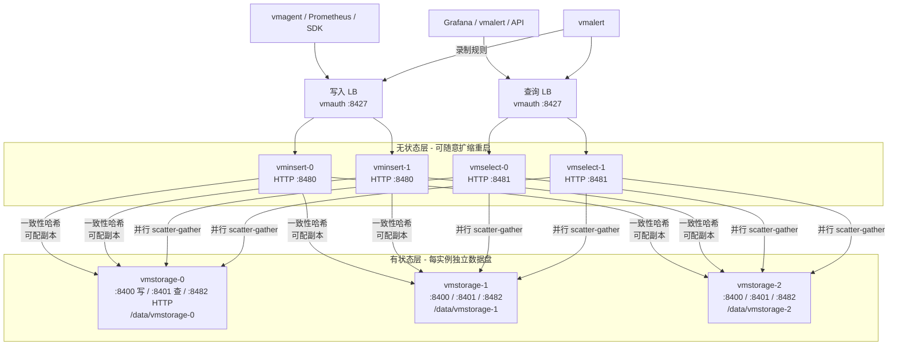

# 05 - 集群服务器部署

> 学习目标：能在裸机/虚拟机与 Docker Compose 两种形态下独立部署 VictoriaMetrics 集群；深入理解一致性哈希分片的 rebalancing 语义、副本三件套配置、多租户落地；掌握扩缩容、滚动升级、备份与故障处置的完整实操。K8s 部署见 [06 章](06-K8s部署实战.md)。

约定：版本 `v1.110.0`（以官方 Releases 为准）。端口事实（必须牢记）：

| 组件 | HTTP | cluster native |
|---|---|---|
| vminsert | `:8480` | `:8400`（作为接收端时的 `-vminsertAddr`） |
| vmselect | `:8481` | 通过 `:8401` 查 vmstorage |
| vmstorage | `:8482` | `:8400` 收 vminsert 数据（`-vminsertAddr`）、`:8401` 供 vmselect 查询（`-vmselectAddr`） |

## 1. 集群拓扑与数据流



链路端口速记：**写入走 8480→8400，查询走 8481→8401，HTTP 管理面 8480/8481/8482**。

## 2. 机器规划与容量估算

### 2.1 参考拓扑（日写入百万 samples/s 量级）

| 角色 | 数量 | 规格建议 | 说明 |
|---|---|---|---|
| vminsert | 2 | 4C8G | 无状态，2 个即可 HA；写入量再大横向加 |
| vmselect | 2 | 8C16G | 无状态；查询重（大基数分析多）时优先加这里 |
| vmstorage | 3 | 8C32G + NVMe 2TB | 副本=2 时 3 节点是最小可用集；每实例独立数据目录 |
| vmauth (LB) | 2 | 2C2G | 也可用 nginx/云 LB 替代 |

部署形态：

- vmstorage **独占机器或独占磁盘**，SSD/NVMe 必配（merge 与扫描对随机 IO 敏感，02 章 4.2）；
- vminsert/vmselect 无状态，可混部（与 vmstorage 分机，避免争抢 IO）；
- 每块数据盘一个 vmstorage 实例（一机多盘 = 多实例，各自 `-storageDataPath`），比 RAID 更契合"节点独立、无 rebalance"的设计。

### 2.2 容量估算方法论

| 资源 | 估算公式（经验，务必压测校准） |
|---|---|
| vmstorage 内存 | active time series × 约 1KB（官方 Cluster README 经验值）+ merge/缓存开销；受 `-memory.allowedPercent` 约束 |
| vmstorage 磁盘 | 写入速率 × retention 秒数 × 每样本字节数（1~2 字节量级，压测得出）+ indexdb（与历史总序列数相关，02 章 3.2）+ **20~30% merge 临时空间** |
| vminsert CPU | 与写入速率成正比（协议解析+哈希），无存储开销 |
| vmselect | 内存与并发查询的结果集大小相关；大基数查询是主要压力源（03 章 6 节） |

**先压测再采购**：用 vmagent 以真实标签基数灌数据 1~2 周，观察 `vm_rows`、RSS、磁盘增速曲线外推，比任何公式可靠（07 章 2 节）。

## 3. 部署前必须理解的三个机制

### 3.1 一致性哈希与 rebalancing 语义（01 章 4.3 回顾）

- vminsert 按序列标签集哈希到 `-storageNode` 环；
- **增减 vmstorage 只改变新数据归属，旧数据不迁移**；
- 扩容后各节点磁盘不均，随 retention 自然收敛；
- **缩容 = 危险操作**：直接下线会永久丢该节点数据。安全缩容只有两条路：
  1. 从 `-storageNode` 摘除该节点 → 停止写入 → **等待其上数据全部过期**（≥ retention 时长）→ 下线；
  2. 用快照 + vmrestore 把数据迁到新节点（操作复杂，一般选路径 1）。

### 3.2 副本三件套（必须配套，缺一处就出重复点或丢副本）

| 参数 | 配在哪 | 作用 |
|---|---|---|
| `-replicationFactor=2` | **每个 vminsert** | 每条序列写 2 份到 2 个不同 vmstorage |
| `-dedup.minScrapeInterval=30s` | **每个 vmstorage** | merge 时物理去重（省磁盘，02 章 7.1） |
| `-dedup.minScrapeInterval=30s` + `-replicationFactor=2` | **每个 vmselect** | 查询合并时去重（merge 未完成前的正确性） |

注意语义边界：副本防的是**单 vmstorage 故障期间不丢可用性**；它不是备份（防不了误删），也不能让你随便缩容（3.1）。副本数 ≤ vmstorage 数，且 3 节点 + 副本 2 时，任意 1 节点故障数据完整；2 节点故障则部分序列缺一份。

### 3.3 部分响应

- vmselect `-maxUnavailablePercent`（默认值以 `--help` 为准）：允许多少比例 vmstorage 不可达仍返回结果；
- 默认行为是"尽力而为"：一个 vmstorage 挂掉，查询照常返回（缺该节点分片的数据，有副本时基本无感）；
- `-search.denyPartialResponse=true`：宁报错不返回残缺结果，仅用于导出/审计类必须完整的场景（03 章 2.2）。

## 4. 多租户落地

URL 规则（仅集群支持，01 章 5 节）：

```text
写入:  POST http://vminsert:8480/insert/<accountID>:<projectID>/prometheus/api/v1/write
查询:  GET  http://vmselect:8481/select/<accountID>:<projectID>/prometheus/api/v1/query
默认租户: 0:0（URL 不带租户段时 vminsert/vmselect 使用 -defaultAccountID/-defaultProjectID）
```

按业务线分租户的落地示例：

| 业务线 | 租户 | retention（企业版可按租户配） |
|---|---|---|
| 基础设施 | 1:0 | 12 个月 |
| 业务 A | 2:0 | 6 个月 |
| 业务 B | 3:0 | 6 个月 |
| CI 压测（可丢） | 99:0 | 1 个月 |

```yaml
# vmagent 按业务线写入不同租户：每个 remoteWrite.url 带租户段
remoteWrite:
  - url: http://vminsert:8480/insert/1:0/prometheus/api/v1/write
    label: infra
  - url: http://vminsert:8480/insert/2:0/prometheus/api/v1/write
    label: business-a
```

防失控（配在 vminsert）：

```bash
-insert.maxHourlySeries=1000000   # 单租户每小时新序列上限，超限丢弃并计数
-insert.maxDailySeries=5000000    # 每日上限
```

租户纪律：租户数克制在业务线粒度（十几个以内）；**租户写错的典型事故**是"数据查不到了"——写入端带了 `2:0`、Grafana datasource 还指着 `0:0`，数据其实都在，改对 URL 即可（速查见第 10 节）。

## 5. Docker Compose 完整实战

目录结构：

```text
vm-cluster/
├── docker-compose.yml
├── vmauth.yaml          # 统一入口路由
├── prometheus.yml       # vmagent 抓取配置
└── rules.yml            # vmalert 规则
```

`docker-compose.yml`（3 vmstorage + 2 vminsert + 2 vmselect + vmauth + vmagent + Grafana，副本=2，dedup=30s）：

```yaml
services:
  # ---------- 存储层：每实例独立 volume ----------
  vmstorage-0: &vmstorage
    image: victoriametrics/vmstorage:v1.110.0
    ports:
      - "8482"      # HTTP
      - "8400"      # 收 vminsert
      - "8401"      # 供 vmselect
    volumes:
      - storage-0:/storage
    command:
      - "-storageDataPath=/storage"
      - "-retentionPeriod=12"
      - "-dedup.minScrapeInterval=30s"        # 副本去重(存储侧)
      - "-vminsertAddr=:8400"
      - "-vmselectAddr=:8401"
      - "-memory.allowedPercent=80"
    restart: unless-stopped

  vmstorage-1:
    <<: *vmstorage
    volumes: [storage-1:/storage]

  vmstorage-2:
    <<: *vmstorage
    volumes: [storage-2:/storage]

  # ---------- 写入层：无状态 ----------
  vminsert-0: &vminsert
    image: victoriametrics/vminsert:v1.110.0
    ports: ["8480"]
    command:
      # storageNode 列表：所有 vminsert/vmselect 必须完全一致（DNS 名，勿用 IP）
      - "-storageNode=vmstorage-0:8400"
      - "-storageNode=vmstorage-1:8400"
      - "-storageNode=vmstorage-2:8400"
      - "-replicationFactor=2"                 # 副本
      - "-maxInsertRequestSize=64MB"
      - "-insert.maxHourlySeries=2000000"      # 租户准入保护
    restart: unless-stopped

  vminsert-1:
    <<: *vminsert

  # ---------- 查询层：无状态 ----------
  vmselect-0: &vmselect
    image: victoriametrics/vmselect:v1.110.0
    ports: ["8481"]
    command:
      - "-storageNode=vmstorage-0:8401"
      - "-storageNode=vmstorage-1:8401"
      - "-storageNode=vmstorage-2:8401"
      - "-dedup.minScrapeInterval=30s"         # 副本去重(查询侧)
      - "-replicationFactor=2"
      - "-search.maxQueryDuration=60s"
      - "-search.maxUniqueTimeseries=1000000"
    restart: unless-stopped

  vmselect-1:
    <<: *vmselect

  # ---------- 统一入口：vmauth ----------
  vmauth:
    image: victoriametrics/vmauth:v1.110.0
    ports:
      - "8427:8427"
    volumes:
      - ./vmauth.yaml:/vmauth.yaml:ro
    command: ["-auth.config=/vmauth.yaml"]
    restart: unless-stopped

  # ---------- 采集与告警 ----------
  vmagent:
    image: victoriametrics/vmagent:v1.110.0
    ports: ["8429"]
    volumes:
      - ./prometheus.yml:/vmagent/prometheus.yml:ro
      - agentdata:/vmagentdata
    command:
      - "-promscrape.config=/vmagent/prometheus.yml"
      - "-remoteWrite.url=http://vmauth:8427/insert/0/prometheus/api/v1/write"
      - "-remoteWrite.tmpDataPath=/vmagentdata"   # 断连磁盘缓冲(04 章 5.2)
      - "-remoteWrite.maxDiskUsagePerURL=4GB"
    restart: unless-stopped

  vmalert:
    image: victoriametrics/vmalert:v1.110.0
    ports: ["8880"]
    volumes:
      - ./rules.yml:/etc/vmalert/rules.yml:ro
    command:
      - "-datasource.url=http://vmauth:8427/select/0/prometheus"
      - "-remoteWrite.url=http://vmauth:8427/insert/0/prometheus/api/v1/write"
      - "-rule=/etc/vmalert/rules.yml"
      - "-evaluationInterval=30s"
    restart: unless-stopped

  grafana:
    image: grafana/grafana:11.1.0
    ports: ["3000:3000"]
    environment: [GF_SECURITY_ADMIN_PASSWORD=admin]
    restart: unless-stopped

volumes:
  storage-0:
  storage-1:
  storage-2:
  agentdata:
```

`vmauth.yaml`（路由 + 负载：/insert 打到两个 vminsert，/select 打到两个 vmselect）：

```yaml
unauthorized_user:
  url_map:
    - src_paths: ["/insert/.*"]
      url_prefix:
        - http://vminsert-0:8480
        - http://vminsert-1:8480
    - src_paths: ["/select/.*"]
      url_prefix:
        - http://vmselect-0:8481
        - http://vmselect-1:8481
```

讲解要点：

- `-storageNode` 列表**所有 vminsert/vmselect 完全一致且顺序稳定**：用 Docker DNS 名（K8s 用 StatefulSet headless DNS），用 IP 会在重建后哈希环漂移；
- YAML 锚点（`&vmstorage`/`<<:`）只是少敲字，生产建议展开写，避免隐式继承踩坑；
- vmagent 的 remoteWrite.url 指向 vmauth，天然获得负载均衡与后续加认证的能力（06/07 章 VMAuth）。

## 6. 裸机 / systemd 部署要点

vmstorage 完整 unit（`/etc/systemd/system/vmstorage.service`）：

```ini
[Unit]
Description=VictoriaMetrics vmstorage
After=network-online.target
Wants=network-online.target

[Service]
Type=simple
User=victoriametrics
EnvironmentFile=-/etc/victoria-metrics/vmstorage.conf
ExecStart=/usr/local/bin/vmstorage-prod $ARGS
Restart=on-failure
RestartSec=5
LimitNOFILE=65536
ReadWritePaths=/data/vmstorage-0
StandardOutput=journal
StandardError=journal
SyslogIdentifier=vmstorage

[Install]
WantedBy=multi-user.target
```

`/etc/victoria-metrics/vmstorage.conf`：

```ini
ARGS="-storageDataPath=/data/vmstorage-0 -retentionPeriod=12 -dedup.minScrapeInterval=30s -vminsertAddr=:8400 -vmselectAddr=:8401 -httpListenAddr=:8482 -memory.allowedPercent=80"
```

vminsert/vmselect 的 unit 骨架相同，差异只在二进制与 `ARGS`（参照第 5 节 command 逐条搬入）。要点：

- **启动顺序**：vmstorage 先起（vminsert/vmselect 连不上 storageNode 会重试，但先起存储可避免启动期报错噪音）；
- 一机多盘多实例：复制 unit 改 `Instance`（`vmstorage@0/1` 模板 unit），每实例独立 `-storageDataPath` 与端口（8400/8401/8482 依次 +10 偏移）；
- 防火墙端口矩阵：

| 方向 | 端口 | 说明 |
|---|---|---|
| vmagent/Prometheus → vminsert | 8480/tcp | 写入（经 LB 则只放 LB） |
| vminsert → vmstorage | 8400/tcp | cluster native 写入 |
| vmselect → vmstorage | 8401/tcp | cluster native 查询 |
| Grafana/vmalert → vmselect | 8481/tcp | 查询（经 LB 则只放 LB） |
| 运维 → 全部 | 8480/8481/8482/tcp | /health、/metrics（限内网/跳板机） |
| vmauth 对外 | 8427/tcp | 统一入口 |

## 7. 验证与压测

```bash
# 1. 每个 vmstorage 健康
for i in 0 1 2; do curl -s http://vmstorage-$i:8482/health; done   # → OK

# 2. 经 vminsert 写测试数据（默认租户 0:0）
curl -XPOST 'http://vminsert-0:8480/insert/0/prometheus/api/v1/import/prometheus' \
  --data-binary 'cluster_test_metric{instance="demo"} 42'

# 3. 经 vmselect 查回（数据应落在哈希环上某节点，查询自动聚合）
curl 'http://vmselect-0:8481/select/0/prometheus/api/v1/query' \
  --data-urlencode 'query=cluster_test_metric'

# 4. 确认分片：每个 vmstorage 上查本地行数
for i in 0 1 2; do
  echo -n "vmstorage-$i rows: "
  curl -s http://vmstorage-$i:8482/metrics | grep '^vm_rows ' | awk '{print $2}'
done

# 5. 链路健康：vmagent 侧观察
curl -s http://vmagent:8429/metrics | grep -E 'vmagent_remotewrite_(sent_rows|pending_data_bytes)'
```

压测思路（官方推荐）：用 vmagent 抓取真实规模 target（或生成合成负载）持续灌入，观察——写入速率（`vm_rows_received_total` 增速）、vmstorage RSS 与 `vm_active_time_series`、磁盘增速、`vm_slow_row_inserts_total`（churn 信号）、查询 P99（vmselect trace）。跑满一个 retention 周期的 1/10 以上再下容量结论（07 章 2 节）。

## 8. 扩缩容与升级实操

### 8.1 扩容 vmstorage（加 vmstorage-3）

```bash
# 1. 新节点起实例（空数据目录即可）
# 2. 更新【所有】vminsert 与 vmselect 的 -storageNode 列表，加入新节点
#    列表必须完全一致；建议 DNS 名（vmstorage-3.vm.internal:8400/8401）
# 3. 滚动重启 vminsert（逐个，写入端有缓冲不断流），再滚动重启 vmselect
# 4. 验证：新节点 vm_rows 开始增长；旧节点磁盘增速放缓
# 5. 观察数天：新数据按新环分布，旧数据原地（01 章 4.3 rebalancing 语义）
```

**不要**在业务高峰做；**不要**只改部分 vminsert 的列表（哈希环不一致会导致同序列数据分裂到不同节点，查询仍能合并但分布混乱）。

### 8.2 缩容/下线 vmstorage

关键认知：`-storageNode` 列表同时决定**写入路由**（vminsert）与**查询范围**（vmselect）。若直接从两边摘除节点，其上历史数据立即不可查——等于丢数据。安全下线顺序：

```bash
# 1. 仅从【所有 vminsert】的 -storageNode 摘除该节点，滚动重启 vminsert
#    → 新数据不再写入它；vmselect 列表保持不变，历史数据仍可查
# 2. 等待 ≥ retention 时长，其上数据全部自然过期（vm_rows 归零）
# 3. 从【所有 vmselect】摘除该节点，滚动重启 vmselect
# 4. 停止进程、回收机器
# 急需释放机器时：快照 + vmbackup/vmrestore 把数据迁到扩容的新节点（8.4），再走步骤 3~4
```

### 8.3 滚动升级

顺序：**vmstorage 逐个 → vminsert → vmselect**（存储先行，协议向后兼容）。

```bash
# 每个 vmstorage: 停 → 换二进制/镜像 → 起 → curl :8482/health → 观察 1~2 分钟 → 下一个
# vminsert/vmselect: 无状态，LB 摘除后随意升
# 升级前: 快照备份(8.4)；降级: 必须恢复升级前快照(数据格式不向后兼容, 07 章 11 节)
```

### 8.4 集群备份

每个 vmstorage **独立**执行快照 + vmbackup（与 04 章 8 节流程完全相同，`-storageDataPath` 指向各自数据目录）：

```bash
# 在 vmstorage-i 上
SNAP=$(curl -sXPOST http://localhost:8482/snapshot/create | grep -o 'vmstorage-[^"]*')
vmbackup-prod -storageDataPath=/data/vmstorage-i/snapshots/$SNAP \
  -dstPath=s3://my-bucket/vm-cluster/vmstorage-$i -originPath=s3://my-bucket/vm-cluster/vmstorage-$i \
  -credsFilePath=/etc/vm/aws-credentials.ini
curl -sXPOST http://localhost:8482/snapshot/delete --data-urlencode "snapshot=$SNAP"
```

**集群备份没有全局一致性点**：各节点快照时刻不同，恢复出的集群里，跨节点时间线可能有分钟级错位。含义与应对：

- 对监控数据（追加型、按时间查询）影响极小：缺的是"备份窗口内新写入的几十秒数据"，恢复后由采集端补写即可；
- RPO ≈ 备份间隔 + 采集端缓冲（vmagent persistentqueue 会补传宕机窗口数据）；
- 恢复：每个 vmstorage 用 vmrestore 恢复各自目录后启动，再按 8.1 重建 vminsert/vmselect 列表。

## 9. 组件级参数速查

| 组件 | 参数 | 用途 |
|---|---|---|
| vminsert | `-storageNode`（可多次） | 哈希环节点列表（8400 端口） |
| | `-replicationFactor=N` | 副本数（3.2） |
| | `-maxInsertRequestSize` | 单请求体上限，大批量导入时调大 |
| | `-insert.maxHourlySeries` / `-insert.maxDailySeries` | 租户准入保护（4 节） |
| vmstorage | `-storageDataPath` | 数据目录（独立盘） |
| | `-retentionPeriod` | 保留期（02 章 8.1） |
| | `-dedup.minScrapeInterval` | merge 去重（3.2） |
| | `-vminsertAddr` / `-vmselectAddr` | native 监听（8400/8401） |
| | `-memory.allowedPercent` | 内存预算 |
| | `-storage.maxMergeDuration` | 限制单次 merge 时长，写入洪峰期保查询（02 章 4.2） |
| vmselect | `-storageNode`（可多次） | 哈希环节点列表（8401 端口） |
| | `-dedup.minScrapeInterval` + `-replicationFactor` | 查询侧副本去重（3.2） |
| | `-maxUnavailablePercent` | 部分响应阈值（3.3） |
| | `-search.maxQueryDuration` / `-search.maxConcurrentRequests` / `-search.maxUniqueTimeseries` | 查询保护（03 章 6.1） |
| | `-search.latencyOffset` / `-search.cacheTimestampOffset` | 缓存与新鲜度权衡（03 章 3.1） |

不确定默认值的参数一律 `./vmstorage-prod --help | grep <flag>` 核对。

## 10. 故障场景速查表

| 场景 | 表现 | 处置 |
|---|---|---|
| 单 vmstorage 挂（有副本） | 查询/写入基本无感（数据在另一副本） | 尽快拉起；观察 `-maxUnavailablePercent` 未触发即可 |
| 单 vmstorage 挂（无副本） | 该分片历史暂不可查（部分响应）；新数据哈希环变化写入其它节点 | 拉起后自动恢复可查；环变化导致的数据分裂属预期（3.1） |
| vminsert 全挂 | 写入端 remote_write 失败 | vmagent persistentqueue 缓冲（`-remoteWrite.tmpDataPath`），恢复后补传；Prometheus 端同样有 WAL 缓冲 |
| vmselect 全挂 | 查询/告警评估中断，**写入不受影响** | LB 健康检查 + 多副本避免；恢复后缓存冷启动期慢属预期（03 章 6.2） |
| 磁盘不均衡 | 某 vmstorage 明显更满 | 历史扩容/缩容的正常残留（3.1），等 retention 收敛；骤增则查该节点是否承接了大基数租户 |
| "数据不见了" | 查询返回空 | 十有八九是**租户不一致**：写入 URL 的 accountID 与查询 URL 不同（4 节）；核对两端路径 |
| 查询超时 | vmselect 报 context deadline | trace 定位（03 章 6.2）；确认 vmstorage 是否在 merge 风暴；加 vmselect 副本 |
| 写入 4xx | vminsert 拒绝 | 请求体超 `-maxInsertRequestSize`；租户准入超限（看 `vm_rows_dropped_*`） |
| vmstorage 启动报 storage 锁 | 上次未正常退出 | 检查是否有残留进程持有数据目录；勿手删 lock 文件前先确认进程已死 |

## 下一步

- 在 Kubernetes 上以 Operator/CRD 方式部署同构集群 → [06-K8s部署实战](06-K8s部署实战.md)
- 集群上线后的巡检、容量与故障案例 → [07-运维调优与故障排查](07-运维调优与故障排查.md)
