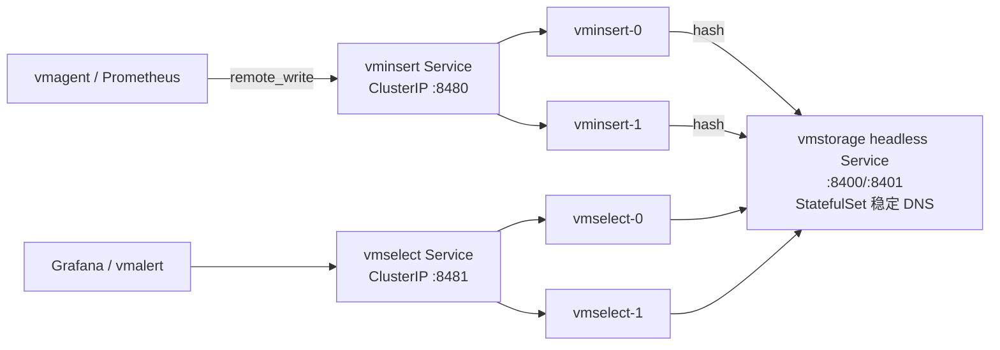

# 06 - K8s 部署实战

> 学习目标：掌握用官方 victoria-metrics-operator 在 Kubernetes 上部署完整监控栈——VMSingle/VMCluster 存储、VMAgent 采集、VMAlert 告警、VMAuth 入口；深入理解 StatefulSet + PVC 的存储层设计与扩缩容语义；能完成与 kube-prometheus-stack 的共存迁移、备份与日常运维。

约定：Operator Helm chart `victoria-metrics-k8s-operator`（示例版本 `v0.51.0`），VM 组件示例版本 `v1.110.0`（均以官方 Releases 为准），命名空间统一 `monitoring`。裸机/Docker 集群部署见 [05 章](05-集群服务器部署.md)，本章机制与其同构。

## 1. 三条部署路线对比

| 路线 | 方式 | 优点 | 缺点 | 适用 |
|---|---|---|---|---|
| **官方 Operator + CRD（本章主线，推荐）** | Helm 装 operator，用 VMSingle/VMCluster/VMAgent 等 CR 声明式管理 | 滚动升级、PVC/StatefulSet 编排、采集配置 CRD 化、与 VM 版本演进同步 | 多一层 CRD 学习成本 | 生产环境 |
| 社区 Helm chart 直装 | `victoria-metrics-cluster` / `victoria-metrics-single` chart，values 渲染原生 Deployment/StatefulSet | 无 operator，结构透明 | 采集配置仍需手写；升级/扩容手工操作多 | 想完全掌控 YAML 的团队 |
| 手写 YAML | 自己写 StatefulSet/Deployment/Service | 无依赖 | 全部自担 | 特殊环境/学习 |

Operator 的价值不只是"帮你生成 YAML"：它接管 vmstorage StatefulSet 的滚动升级、PVC 生命周期、把 VMAgent/VMServiceScrape 等采集 CR **渲染成 Prometheus 风格的 scrape 配置**下发，并且默认能**兼容转换 prometheus-operator 的 CRD**（ServiceMonitor、PodMonitor、PrometheusRule、Probe 等，由 `controller.prometheus_converter.enabled` 等 values 开关控制，字段以 chart values 为准）——已有 kube-prometheus-stack 的集群可平滑共存。

## 2. Operator 安装

```bash
helm repo add vm https://victoriametrics.github.io/helm-charts/
helm repo update

helm install vmoperator vm/victoria-metrics-k8s-operator \
  --namespace monitoring --create-namespace \
  --version 0.51.0 \
  --set operator.prometheus_converter.enabled=true   # 兼容转换 prometheus-operator CRD（默认值以 chart 为准）

kubectl -n monitoring get pods -l app.kubernetes.io/name=victoria-metrics-operator
kubectl get crd | grep victoriametrics    # 应列出 vmclusters/vmagents/vmalerts/vmusers 等
```

Operator 管理的 CRD 全景：

| CRD | 对应组件/职责 |
|---|---|
| `VMSingle` | 单节点存储（StatefulSet，1 副本 + PVC） |
| `VMCluster` | 集群：vminsert/vmselect/vmstorage 三组 StatefulSet |
| `VMAgent` | 采集器（Deployment 或 StatefulSet） |
| `VMAlert` | 规则评估器 |
| `VMAlertmanager` | Alertmanager 实例 |
| `VMAlertmanagerConfig` | Alertmanager 路由配置 CRD |
| `VMAuth` / `VMUser` | 认证网关 / 用户与路由规则 |
| `VMRule` | 告警/录制规则（对应 PrometheusRule） |
| `VMServiceScrape` | 按 Service/Endpoints 发现抓取（对应 ServiceMonitor） |
| `VMPodScrape` | 按 Pod 发现抓取（对应 PodMonitor） |
| `VMNodeScrape` | 抓取节点级指标（node-exporter DaemonSet 场景，对应 Probe/Node 抓取） |
| `VMStaticScrape` | 静态 target 抓取 |
| `VMScrapeConfig` | 直接注入原生 Prometheus scrape_config 片段 |

## 3. 单节点上 K8s：VMSingle

小规模集群/测试环境的完整 CR：

```yaml
apiVersion: operator.victoriametrics.com/v1beta1
kind: VMSingle
metadata:
  name: main
  namespace: monitoring
spec:
  image:
    repository: victoriametrics/victoria-metrics
    tag: v1.110.0
  retentionPeriod: "12"                 # 月数；也支持 30d/12w/1y 形式
  storage:
    volumeClaimTemplate:
      spec:
        storageClassName: local-nvme    # 换成你的高性能 storageClass
        accessModes: ["ReadWriteOnce"]
        resources:
          requests:
            storage: 200Gi
  resources:
    requests:
      cpu: "1"
      memory: 2Gi
    limits:
      cpu: "4"
      memory: 8Gi
  extraArgs:
    dedup.minScrapeInterval: "30s"
    selfScrapeInterval: "15s"
    memory.allowedPercent: "80"
  nodeSelector:
    node-role/monitoring: "true"
---
# Service（operator 也会生成，显式声明便于控制）
apiVersion: v1
kind: Service
metadata:
  name: vmsingle-main
  namespace: monitoring
spec:
  selector:
    app.kubernetes.io/name: vmsingle
    app.kubernetes.io/instance: vmsingle-main
  ports:
    - name: http
      port: 8428
      targetPort: 8428
```

适用边界与 04 章 1 节相同：无多租户、纵向扩展优先；到顶后迁 VMCluster（用 vmctl 迁历史数据，07 章 5 节）。

## 4. 集群上 K8s：VMCluster（重点）

### 4.1 完整 CR

```yaml
apiVersion: operator.victoriametrics.com/v1beta1
kind: VMCluster
metadata:
  name: prod
  namespace: monitoring
spec:
  retentionPeriod: "12"

  vmstorage:
    replicaCount: 3
    image:
      repository: victoriametrics/vmstorage
      tag: v1.110.0
    storage:
      volumeClaimTemplate:
        spec:
          storageClassName: local-nvme     # 本地盘或高性能云盘，见 5 节
          accessModes: ["ReadWriteOnce"]
          resources:
            requests:
              storage: 500Gi
    resources:
      requests: {cpu: "2", memory: 8Gi}
      limits:   {cpu: "4", memory: 16Gi}
    extraArgs:
      dedup.minScrapeInterval: "30s"       # 副本去重(存储侧, 05 章 3.2)
      memory.allowedPercent: "80"
    affinity:                              # 每节点最多一个 vmstorage
      podAntiAffinity:
        requiredDuringSchedulingIgnoredDuringExecution:
          - labelSelector:
              matchLabels:
                app.kubernetes.io/name: vmstorage
                app.kubernetes.io/instance: vmstorage-prod
            topologyKey: kubernetes.io/hostname

  vminsert:
    replicaCount: 2
    image:
      repository: victoriametrics/vminsert
      tag: v1.110.0
    resources:
      requests: {cpu: "1", memory: 1Gi}
      limits:   {cpu: "2", memory: 2Gi}
    extraArgs:
      replicationFactor: "2"               # 副本(写入侧)
      insert.maxHourlySeries: "2000000"    # 租户准入保护

  vmselect:
    replicaCount: 2
    image:
      repository: victoriametrics/vmselect
      tag: v1.110.0
    resources:
      requests: {cpu: "2", memory: 4Gi}
      limits:   {cpu: "4", memory: 8Gi}
    extraArgs:
      dedup.minScrapeInterval: "30s"       # 副本去重(查询侧)
      replicationFactor: "2"
      search.maxQueryDuration: "60s"
      search.maxUniqueTimeseries: "1000000"
```

要点（字段以 CRD 定义为准）：

- 三组参数通过 `extraArgs` 透传 flag，与 05 章 9 节速查表一一对应；
- operator 自动完成 `-storageNode` 列表的生成与同步（vmstorage 扩缩容后，operator 更新 vminsert/vmselect 的节点列表并滚动重启）——这是 operator 相对手写 YAML 的核心省心点；
- 副本三件套（replicationFactor ×2 + dedup 两侧）与裸机集群完全一致，漏配即出重复点（05 章 3.2）。

### 4.2 Service 暴露



- **vmstorage**：headless Service，每个 Pod 获得稳定 DNS（`vmstorage-prod-0.vmstorage-prod.monitoring.svc`）——`-storageNode` 必须用这种稳定名，Pod 重建 IP 变化不影响哈希环（05 章 5 节）；
- **vminsert/vmselect**：普通 ClusterIP Service 即可（无状态，随便轮询）；集群外访问走 Ingress/vmauth（9 节）。

## 5. 存储层深入：StatefulSet 与 PVC

### 5.1 PVC 与实例一一绑定

vmstorage 是 StatefulSet：`vmstorage-prod-0/1/2` 各绑定独立 PVC（`storage-vmstorage-prod-0/1/2`）。数据分片与 PVC 强绑定意味着：

- **绝对禁止 emptyDir/无持久化卷**：Pod 漂移即丢该分片数据；
- PVC 必须随 Pod 调度回**同一份存储**：本地盘（LocalPV）场景 Pod 被钉在原节点（volume topology）；网络盘场景可漂移但要保证 IOPS；
- **删除 VMCluster CR 或缩容 replicaCount 时，operator 默认可能保留 PVC**（防误删），确认数据无用后再手工删 PVC；反之缩容前必须完成 05 章 8.2 的"摘写入 → 等过期"流程，否则丢数据。

### 5.2 storageClass 选型

| 方案 | 性能 | 故障域 | 适用 |
|---|---|---|---|
| LocalPV（本地 NVMe） | 最优（无网络跳） | Pod 钉死在节点；节点故障=分片不可用（副本兜底） | 自建机房/裸金属，追求极致性能 |
| 云盘（EBS/云 SSD） | 良（网络附加） | 可随 Pod 漂移；AZ 故障域 | 云托管 K8s，运维简单 |
| 网络分布式存储（Ceph 等） | 取决于实现 | 存储层自身冗余 | 已有成熟存储平台 |

底线：随机读写 IOPS 与延迟必须达标（merge + 查询扫描，02 章 4.2）；上线前用 fio 压 storageClass，再用真实数据压 vmstorage。

### 5.3 扩容语义回顾

`replicaCount: 3 → 4`：operator 创建 `vmstorage-prod-3` + 新 PVC，并把新节点加入 vminsert/vmselect 的 `-storageNode` 滚动重启。**新数据哈希到新 Pod，旧数据留在原 PVC**（05 章 3.1）——磁盘不均随 retention 收敛，属预期，不要试图"搬 PVC 里的数据"。

## 6. 采集层：VMAgent 实操

### 6.1 VMAgent CR

```yaml
apiVersion: operator.victoriametrics.com/v1beta1
kind: VMAgent
metadata:
  name: main
  namespace: monitoring
spec:
  image:
    repository: victoriametrics/vmagent
    tag: v1.110.0
  scrapeInterval: 30s
  remoteWrite:
    url: http://vminsert-prod.monitoring.svc:8480/insert/0/prometheus/api/v1/write
    # 经 vmauth 时换成 http://vmauth-main.monitoring.svc:8427/insert/...；磁盘缓冲（断连补传，04 章 5.2）：
  extraArgs:
    remoteWrite.tmpDataPath: /vmagent-tmp
    remoteWrite.maxDiskUsagePerURL: 4GB
    promscrape.streamParse: "true"       # 大 target 集流式解析省内存
  volumes:
    - name: tmp
      persistentVolumeClaim:
        claimName: vmagent-tmp           # 预先创建的 PVC；StatefulSet 模式用 volumeClaimTemplate
  volumeMounts:
    - name: tmp
      mountPath: /vmagent-tmp
  serviceScrapeSelector: {}              # 选择所有 VMServiceScrape（空=全选）
  podScrapeSelector: {}
  ruleSelector: {}                       # 关联的 VMRule（如需 agent 侧聚合规则）
  resources:
    requests: {cpu: 500m, memory: 1Gi}
    limits:   {cpu: "2", memory: 4Gi}
  inlineScrapeConfig: |
    - job_name: vmstorage
      static_configs:
        - targets:
          - vmstorage-prod-0.vmstorage-prod.monitoring.svc:8482
          - vmstorage-prod-1.vmstorage-prod.monitoring.svc:8482
          - vmstorage-prod-2.vmstorage-prod.monitoring.svc:8482
```

**Deployment vs StatefulSet 取舍**（operator 两种都支持）：

| | Deployment | StatefulSet |
|---|---|---|
| 分片抓取 | 需手工配 `-promscrape.cluster.*` 成员参数 | operator 自动分片（每个副本抓一部分 target） |
| 磁盘缓冲 | 共享 PVC 或无缓冲 | 每副本独立 PVC，缓冲可靠 |
| 适用 | 小规模、target 少 | 大规模生产（推荐） |

### 6.2 服务发现 CR 示例

VMServiceScrape（抓 Service 背后的 Endpoints，对应 ServiceMonitor）：

```yaml
apiVersion: operator.victoriametrics.com/v1beta1
kind: VMServiceScrape
metadata:
  name: api-app
  namespace: monitoring
spec:
  selector:
    matchLabels:
      app: api            # 匹配目标 Service 的 label
  namespaceSelector:
    matchNames: ["prod"]
  endpoints:
    - port: metrics       # Service 端口名
      path: /metrics
      interval: 30s
```

VMPodScrape（直接抓 Pod，适合无 Service 的 sidecar/exporter）：

```yaml
apiVersion: operator.victoriametrics.com/v1beta1
kind: VMPodScrape
metadata:
  name: app-pods
  namespace: monitoring
spec:
  selector:
    matchLabels:
      app: batch-worker
  podMetricsEndpoints:
    - port: metrics
      path: /metrics
```

VMNodeScrape（节点级指标，node-exporter DaemonSet 标配）：

```yaml
apiVersion: operator.victoriametrics.com/v1beta1
kind: VMNodeScrape
metadata:
  name: node-exporter
  namespace: monitoring
spec:
  port: metrics           # DaemonSet Pod 端口名
  path: /metrics
  interval: 30s
  # node-exporter 以 hostNetwork DaemonSet 部署时自动发现每节点
```

VMStaticScrape（集群外固定 target，如物理机/云产品）：

```yaml
apiVersion: operator.victoriametrics.com/v1beta1
kind: VMStaticScrape
metadata:
  name: infra-nodes
  namespace: monitoring
spec:
  targetEndpoints:
    - targets: ["10.0.0.5:9100", "10.0.0.6:9100"]
      labels:
        job: node
```

**发现原理**：operator watch 这些 CR，把它们渲染成 Prometheus 风格的 `scrape_configs`（kubernetes_sd_configs + relabel），生成 Secret 挂给 vmagent；改 CR → Secret 更新 → vmagent 热加载。排错第一步：`kubectl -n monitoring get secret vmagent-main -o jsonpath='{.data.scrape\.yaml\.gz}' | base64 -d | gunzip` 看渲染结果（Secret 名以实际为准），确认 selector/label 是否匹配。

## 7. 告警与可视化

### 7.1 VMAlert + VMRule + Alertmanager

```yaml
apiVersion: operator.victoriametrics.com/v1beta1
kind: VMAlert
metadata:
  name: main
  namespace: monitoring
spec:
  image:
    repository: victoriametrics/vmalert
    tag: v1.110.0
  datasource:
    url: http://vmselect-prod.monitoring.svc:8481/select/0/prometheus
  remoteWrite:
    url: http://vminsert-prod.monitoring.svc:8480/insert/0/prometheus/api/v1/write
  remoteRead:
    url: http://vmselect-prod.monitoring.svc:8481/select/0/prometheus
  evaluationInterval: 30s
  notifier:
    url: http://alertmanager-operated.monitoring.svc:9093
  ruleSelector: {}          # 选择所有 VMRule
---
apiVersion: operator.victoriametrics.com/v1beta1
kind: VMRule
metadata:
  name: vmstorage-disk
  namespace: monitoring
spec:
  groups:
    - name: vm-health
      interval: 30s
      rules:
        - alert: VMStorageDiskAlmostFull
          expr: |
            vm_free_disk_space_bytes{job="vmstorage"}
              / (vm_free_disk_space_bytes{job="vmstorage"} + vm_data_size_bytes{job="vmstorage"}) < 0.15
          for: 10m
          labels:
            severity: warning
          annotations:
            summary: "vmstorage {{ $labels.instance }} 磁盘剩余不足 15%"
```

Alertmanager 可用 `VMAlertmanager` CR 部署，或复用 kube-prometheus-stack 的实例（notifier.url 指过去即可）。

### 7.2 Grafana

- 部署：kube-prometheus-stack 自带的 Grafana，或独立 `helm install grafana grafana/grafana`；
- Datasource：类型 Prometheus，URL `http://vmselect-prod.monitoring.svc:8481/select/0/prometheus`（租户按需改路径）；
- 官方 Dashboard ID（Grafana.com 直接导入）：

| ID | 内容 |
|---|---|
| `10229` | VictoriaMetrics 单节点 |
| `11176` | VictoriaMetrics 集群（vmstorage/vminsert/vmselect 全景） |
| `12683` | vmagent |

导入后数据源选上面配置的 VM datasource，`job` 标签由 6.1 的 inlineScrapeConfig/VMServiceScrape 提供——**VM 自监控闭环**：vmagent 抓 vmstorage/vmselect/vminsert 的 /metrics → 写入 VM → VMAlert 用这些指标告警 → Grafana 展示。

## 8. 与 kube-prometheus-stack 共存迁移

三步走（存量 Prometheus 不动，先双轨）：

**① Prometheus 双写 remote_write 到 VM**（values 片段）：

```yaml
prometheus:
  prometheusSpec:
    remoteWrite:
      - url: http://vminsert-prod.monitoring.svc:8480/insert/0/prometheus/api/v1/write
        queue_config:
          max_samples_per_send: 10000
          capacity: 20000
          max_shards: 30
    # 本地 TSDB retention 可缩短（长期数据在 VM）：
    retention: 7d
```

**② 历史数据迁移**：`vmctl prometheus` 模式从 Prometheus remote-read 拉历史灌入 VM（完整命令见 07 章 5 节）；或接受"历史从双写日开始"。

**③ 切换查询面**：Grafana datasource 与 vmalert 指向 vmselect；Prometheus 保留抓取（或直接由 VMAgent 接管——它兼容 ServiceMonitor/PodMonitor 转换，见 2 节）；稳定运行后缩容 Prometheus 存储。

注意 MetricsQL 语义差异（03 章 4.1）：切换告警前，把 VMRule/PrometheusRule 里依赖 stale 语义与 increase 外推的规则逐条核对。

## 9. 安全与多租户：VMAuth + VMUser

VM 组件自身无认证，K8s 内任何 Pod 都能直连写入/查询——**入口必须收口**：对外只暴露 vmauth，NetworkPolicy 限制 vminsert/vmselect/vmstorage 仅接受 vmauth 与集群内组件访问。

```yaml
apiVersion: operator.victoriametrics.com/v1beta1
kind: VMAuth
metadata:
  name: main
  namespace: monitoring
spec:
  image:
    repository: victoriametrics/vmauth
    tag: v1.110.0
  selectAllUsers: true        # 关联所有 VMUser
  serviceSpec:
    useAsDefault: false
    spec:
      type: ClusterIP
      ports: [{name: http, port: 8427}]
---
apiVersion: operator.victoriametrics.com/v1beta1
kind: VMUser
metadata:
  name: team-a
  namespace: monitoring
spec:
  userName: team-a
  password: "S3cret-change-me"      # 生产建议用 passwordRef 引 Secret
  targetRefs:
    - kind: VMCluster
      name: prod
      roles: [insert, select]       # 允许写入与查询；细分可分别给
```

多租户：给不同业务线发不同 VMUser，URL 中强制租户前缀（`/insert/2:0/...`、`/select/2:0/...`），配合 NetworkPolicy 实现租户隔离（租户机制本身见 01 章 5 节、05 章 4 节）。

NetworkPolicy 骨架：

```yaml
apiVersion: networking.k8s.io/v1
kind: NetworkPolicy
metadata:
  name: vmstorage-allow
  namespace: monitoring
spec:
  podSelector:
    matchLabels:
      app.kubernetes.io/name: vmstorage
  policyTypes: [Ingress]
  ingress:
    - from:
        - podSelector:
            matchLabels:
              app.kubernetes.io/name: vminsert
      ports: [{protocol: TCP, port: 8400}]
    - from:
        - podSelector:
            matchLabels:
              app.kubernetes.io/name: vmselect
      ports: [{protocol: TCP, port: 8401}]
```

## 10. 升级、扩缩容与备份

### 10.1 升级

1. 升级 operator：`helm upgrade vmoperator vm/victoria-metrics-k8s-operator --version <new>`（operator 向后兼容旧 CR；看 release notes 的 CRD 变更）；
2. 升级 VM 组件：改 CR 中各组 `image.tag` → operator 按 **vmstorage 逐个 → vminsert → vmselect** 滚动重启（与 05 章 8.3 顺序一致）；
3. 升级前快照备份（10.3）；降级需恢复快照（数据格式不向后兼容，07 章 11 节）。

### 10.2 扩缩容

```bash
# 扩容 vmstorage：改 CR，operator 接管 StatefulSet 与 storageNode 同步
kubectl -n monitoring patch vmcluster prod --type merge \
  -p '{"spec":{"vmstorage":{"replicaCount":4}}}'
kubectl -n monitoring rollout status statefulset/vmstorage-prod
# 缩容：先走 05 章 8.2 流程（摘写入→等数据过期），再减 replicaCount
```

### 10.3 备份：CronJob + vmbackup

原理与裸机相同（快照=硬链接，04 章 8 节）；K8s 下用 CronJob 对每个 vmstorage PVC 执行。关键约束：**vmbackup 必须能访问 vmstorage 的数据目录**——常见做法是 CronJob 挂载与 vmstorage 相同的 PVC（LocalPV 场景需调度到同节点）或对每个 vmstorage Pod 做 sidecar/exec。示例（每 vmstorage 一个 CronJob，挂载其 PVC）：

```yaml
apiVersion: batch/v1
kind: CronJob
metadata:
  name: vmbackup-storage-0
  namespace: monitoring
spec:
  schedule: "0 3 * * *"
  concurrencyPolicy: Forbid
  jobTemplate:
    spec:
      template:
        spec:
          restartPolicy: OnFailure
          nodeSelector:                     # LocalPV: 钉到 vmstorage-0 所在节点
            kubernetes.io/hostname: node-3
          containers:
            - name: vmbackup
              image: victoriametrics/vmbackup:v1.110.0
              args:
                - -storageDataPath=/storage/snapshots/latest   # 先调快照 API 再备份，见下
                - -dstPath=s3://my-bucket/vm-cluster/vmstorage-0
                - -originPath=s3://my-bucket/vm-cluster/vmstorage-0   # 增量基线
                - -credsFilePath=/etc/vm/aws-credentials.ini
              volumeMounts:
                - {name: storage, mountPath: /storage}
                - {name: creds, mountPath: /etc/vm, readOnly: true}
          volumes:
            - name: storage
              persistentVolumeClaim:
                claimName: storage-vmstorage-prod-0
            - name: creds
              secret:
                secretName: vmbackup-creds
```

实操顺序：先 `kubectl exec` 或 initContainer 调 vmstorage 的 `/snapshot/create` 生成快照目录，vmbackup 指向该快照路径，完成后调 `/snapshot/delete`（脚本化进 initContainer/entrypoint 更稳）。恢复用 vmrestore 挂载同一 PVC 写回（完整流程 04 章 8.2）。集群各节点备份无全局一致点，含义见 05 章 8.4。

## 11. 排错速查表

| 现象 | 排查 | 处置 |
|---|---|---|
| CR 创建了但没生成 StatefulSet/Deployment | `kubectl -n monitoring logs deploy/vmoperator` 看 reconcile 错误；CR status 字段 | 常见：CRD 版本不符、字段拼写（`kubectl explain vmcluster.spec`）；operator 未 watch 该 namespace（values 的 namespace 限制） |
| vmstorage Pod Pending，PVC Pending | `kubectl describe pvc` 看事件 | storageClass 不存在/无 provisioner；LocalPV 需节点有对应 label 与磁盘；容量超配额 |
| vmagent 抓不到 target | vmagent UI `http://vmagent:8429/targets`；渲染后的 scrape Secret（6.2） | selector/label 不匹配；namespaceSelector 漏了目标 ns；端口名写错（endpoints 用**端口名**不是数字） |
| remote_write 失败 | vmagent 指标 `vmagent_remotewrite_errors_total`、日志 | vminsert Service DNS/端口（8480 不是 8428）；租户路径；NetworkPolicy 拦截 |
| 查询 404/空结果 | 核对租户：写入与查询 URL 的 accountID:projectID 必须一致 | 05 章 4 节租户纪律；Grafana datasource URL 带对租户段 |
| Grafana 面板大量 "No data" 但 vmui 有数据 | datasource URL 错（少了 `/select/<tenant>/prometheus`）或 timeInterval 与 scrapeInterval 不匹配 | 改 datasource；jsonData.timeInterval 设为抓取间隔 |
| operator 升级后 CR 不生效 | operator 日志看 CRD schema 校验失败 | helm upgrade 时 CRD 不会自动升（Helm 机制），手工 `kubectl apply` 新 CRD |
| vmstorage OOMKilled | `vm_active_time_series` 暴涨？limits 太小？ | 调大 memory limits + `memory.allowedPercent` 匹配（limits 的 80% 左右）；治基数（07 章 3 节） |

## 下一步

- 集群/单节点通用的巡检、容量规划、迁移与故障案例 → [07-运维调优与故障排查](07-运维调优与故障排查.md)
- 查询语义与慢查询定位 → [03-查询路径与MetricsQL](03-查询路径与MetricsQL.md)
