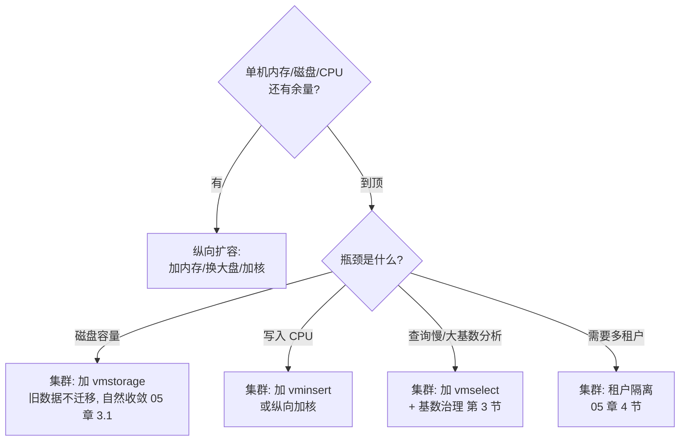
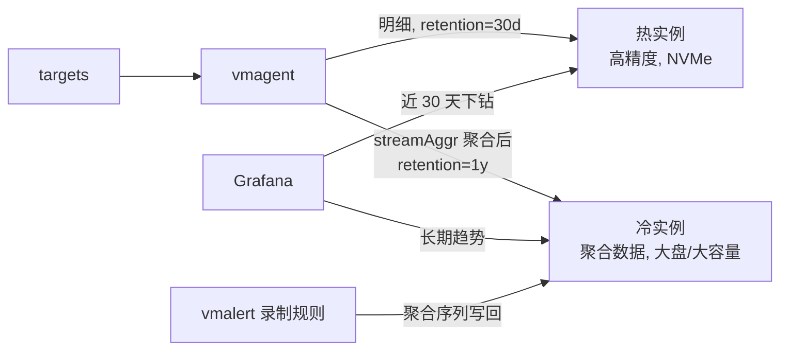

# 07 - 运维调优与故障排查

> 学习目标：建立 VictoriaMetrics 的日常运维能力——健康巡检、容量规划、高基数治理、备份恢复、数据迁移、降采样与分层存储、参数调优；通过 5 个完整故障案例（现象→定位→根因→修复）掌握排障方法论；理解安全加固与升级策略。

本章对单节点与集群通用（差异处会注明组件）。前置知识：02 章存储引擎、03 章查询路径、05 章集群机制。

## 1. 日常健康巡检

### 1.1 巡检清单

| 检查项 | 命令/入口 | 正常形态 | 异常形态 → 处置 |
|---|---|---|---|
| 进程存活 | `curl :8428/health`（单节点）/ `:8482/health`（vmstorage） | `OK` | 无响应 → systemctl/docker 拉起，看日志找崩溃原因 |
| 总行数 | `vm_rows` | 随 retention 增长后趋稳 | 陡增不收敛 → churn 或基数事件（第 3 节） |
| 活跃序列 | `vm_active_time_series` | 平稳（日周期波动正常） | 阶梯暴涨 → 高基数事件（第 3 节）；内存规划核心输入（第 2 节） |
| 慢路径写入 | `vm_slow_row_inserts_total` | 增速缓慢 | 持续高速 → 新序列注册风暴，将拖慢写入（02 章 2 节） |
| merge 压力 | `vm_active_merges`、`vm_pending_rows` | 低水位波动 | 持续高位 → 写入洪峰或磁盘慢；观察是否影响查询（案例 3） |
| 缓存规模 | `vm_cache_entries{type=...}` | 稳定 | 骤降 → 重启/内存压力；骤增 → 序列数暴涨 |
| 磁盘余量 | `vm_free_disk_space_bytes` | 按预期斜率下降 | 斜率变陡 → 数据暴涨；< 15% → 告警处置（案例 1） |
| 写入积压（采集端） | `vmagent_remotewrite_pending_data_bytes`（persistentqueue） | 接近 0 | 持续 > 0 → remote write 断流（案例 4） |
| 写入错误 | `vmagent_remotewrite_errors_total`、`vm_rows_dropped_total` | 不增长 | 增长 → 看错误类型（4xx 配置问题 / 5xx 存储问题 / 准入超限） |
| 查询慢 | `vm_slow_queries_total`（vmselect/单节点） | 偶发 | 突增 → trace 定位（03 章 6.2） |
| 内存 | 进程 RSS vs `-memory.allowedPercent` 预算 | RSS 在预算内 | 逼近上限 → OOM 风险（案例 2） |
| 时钟 | `node_timex_offset_seconds` / NTP | 偏移毫秒级 | 偏移大 → 数据时间戳错乱、dedup 误判 |

### 1.2 巡检自动化

用 vmalert 规则替代人肉巡检（第 10 节有完整规则包）；Grafana 官方大盘（单节点 10229 / 集群 11176 / vmagent 12683，见 06 章 7.2）作为日常看板。前提：`-selfScrapeInterval=15s`（单节点自抓）或 vmagent 抓取各组件 `/metrics`。

## 2. 容量规划方法论

### 2.1 三个公式

| 资源 | 公式 | 说明 |
|---|---|---|
| **内存** | `active_time_series × ~1KB + 查询/merge 开销` | 每序列约 1KB 是官方经验值（Cluster README），**必须用自己数据压测校准**；`-memory.allowedPercent` 是总预算 |
| **磁盘（数据）** | `写入速率(samples/s) × retention(秒) × 每样本字节数` | 每样本字节数压测得出（常见 1~2 字节量级，02 章 6.3）；indexdb 另计（与**历史总序列数**相关，02 章 3.2） |
| **磁盘（余量）** | `上述总量 × (1 + 20%~30%)` | merge 需要临时空间生成新 part；写满会触发保护甚至损坏 |

CPU：写入路径（编码压缩 + merge）与查询路径（rollup 计算）都吃 CPU；核数提升写入并行度（每 CPU 独立缓冲，02 章 4.1）。定性上 4~8 核起步，压测看 `vm_cpu_seconds_total` 分布再调。

### 2.2 从现有 Prometheus 规模推算（示例演算）

已知某 Prometheus：抓取间隔 30s，稳态 `scrape_samples_scraped` 合计 ≈ 300 万样本/次，本地 TSDB 磁盘 30 天占用 500GB。

```text
写入速率 = 300万 / 30s = 10万 samples/s
active series ≈ 300万 / 每次每序列1点 ≈ 300万（30s 间隔下二者同量级）
  → 实际用 Prometheus 的 prometheus_tsdb_head_series 读数更准

内存估算 = 300万 × 1KB ≈ 3GB（引擎开销）→ 配 8~16GB 余量充足
数据磁盘 = 10万/s × 90天(7.78e6 s) × 1.5字节 ≈ 1.1TB
  + indexdb（历史序列数 × 若干百字节，高 churn 时显著）
  + 25% merge 余量 → 规划 1.6TB NVMe
retention 12 个月 → 数据部分 ×4 ≈ 4.4TB + 余量 → 5~6TB
```

对比 Prometheus 自身 30 天 500GB（≈16.7GB/天），VM 估算 ≈12GB/天——压缩优势量级正确，但**最终以压测为准**：用 vmagent 把真实流量灌入测试实例跑一周，读 `vm_rows` 增速与 RSS 曲线外推，比公式可信得多。

### 2.3 扩容决策树



## 3. 高基数与 churn rate 治理（重点）

### 3.1 诊断

```bash
# topN 指标与标签维度（第一入口）
curl -s 'http://vm:8428/api/v1/status/tsdb' | jq '.data.topN' 

# 某指标的序列数
curl -s 'http://vm:8428/api/v1/query' --data-urlencode 'count({__name__="http_requests_total"})'

# 某标签的取值基数
curl -s 'http://vm:8428/api/v1/label/pod/values' | jq '.data | length'
```

vmui → Explore cardinality 页面可视化同样的数据。区分两个问题：

- **基数高（cardinality）**：某时刻活跃序列多 → 吃内存；
- **翻腾快（churn rate）**：序列集合变化快，持续走慢路径注册 → 吃 CPU、膨胀 indexdb（02 章 2/3.2 节），信号是 `vm_slow_row_inserts_total` 高速增长 + 短生命周期序列多。

### 3.2 治理手段（都在写入端做）

**手段 1：vmagent relabeling 丢弃高熵标签**

```yaml
# prometheus.yml：抓取时丢弃
scrape_configs:
  - job_name: kubernetes-pods
    kubernetes_sd_configs: [{role: pod}]
    relabel_configs:
      # 常见事故标签：pod 模板哈希、容器 ID、trace/span id、user id 进了标签
      - action: labeldrop
        regex: 'pod_template_hash|container_id|controller_revision_hash'
# 写入前二次过滤
metric_relabel_configs:
  - action: drop
    source_labels: [__name__]
    regex: 'expensive_debug_.*'
```

**手段 2：流式聚合降维**（vmagent `-remoteWrite.streamAggr.config`）

把明细序列在采集端聚合后再写，存储端只收聚合结果：

```yaml
# stream-aggr.yaml
- interval: 30s
  outputs: [avg, max, sum, count]
  by: [job, namespace, node]        # 聚合维度：保留分析需要的，丢掉高熵的
  match: '{__name__=~"container_cpu_.*|container_memory_.*"}'
  keep_input: false                  # true 则明细与聚合并存（过渡期用）
```

```bash
vmagent-prod -promscrape.config=prometheus.yml \
  -remoteWrite.url=http://vm:8428/api/v1/write \
  -remoteWrite.streamAggr.config=stream-aggr.yaml
```

效果：每 Pod 一条的 `container_cpu_usage_seconds_total`（万级序列）→ 每 (job, namespace, node) 一组 avg/max/sum/count（百级序列），基数降两个量级。**代价**：丢失按 Pod 下钻能力——聚合维度选择要和 Dashboard/告警需求对齐。

**手段 3：准入限制保护存储**

```bash
-storage.maxHourlySeries=500000    # 单节点/vmstorage：每小时新序列上限
-storage.maxDailySeries=2000000
# 集群写入侧（按租户）: vminsert 的 -insert.maxHourlySeries / -insert.maxDailySeries
```

超限后新序列被丢弃并计数（`vm_rows_dropped_total{reason="maxHourlySeriesExceeded"}`）——这是保险丝：宁可丢失控应用的新序列，不能拖垮整个存储。配告警盯 `vm_rows_dropped_total`。

### 3.3 完整案例：某服务 pod_name 标签爆炸

**现象**：`vm_active_time_series` 三天从 200 万涨到 900 万，vmstorage RSS 逼近 limits，查询变慢。

**定位**：

```bash
curl -s 'http://vm:8428/api/v1/status/tsdb' | jq '.data.topN[0].seriesCountByLabelName'
# → pod 标签以 650 万序列居首，且集中在 job="batch-worker"
curl -s 'http://vm:8428/api/v1/query' --data-urlencode 'count(count by (pod) (container_cpu_usage_seconds_total{job="batch-worker"}))'
# → 620 万个不同 pod 值
```

**根因**：批处理服务每次任务起新 Pod，`pod` 标签进了所有容器指标 → 典型高基数 + 高 churn 伴生（Pod 生命周期分钟级，`vm_slow_row_inserts_total` 同步暴涨证实）。

**修复**：

1. 立即止血：vminsert 加 `-insert.maxHourlySeries` 限制该增长（丢新序列保存储）；
2. vmagent relabel：对 `job="batch-worker"` 用 `label_replace`/`labeldrop` 把 `pod` 换成稳定的 `workload`（如 Deployment/Job 名）；
3. 上流式聚合：按 (job, namespace, workload) 聚合 avg/max，Pod 明细不再入库；
4. 复盘：把"标签准入规范"写进 CI——新服务接入监控前评审标签集；用 `status/tsdb` 做周巡检。

一周后 `vm_active_time_series` 回落至 250 万，RSS 降 60%。注意：**旧序列的 indexdb 占用要等换代轮转才释放**（02 章 3.2），磁盘不会立刻回落。

## 4. 备份恢复体系

### 4.1 原则

- **副本 ≠ 备份**：replicationFactor 防节点故障，防不了误删/数据损坏/整机房事故；
- **备份必须演练**：每季度在隔离环境完整恢复一次（04 章 8.2 流程），验证备份可用性；
- RPO ≈ 备份间隔 + 采集端 persistentqueue 补传能力；RTO ≈ vmrestore 传输时间 + 启动。

### 4.2 vmbackup 增量原理与命令

快照（硬链接，02 章 8.2）→ vmbackup 对快照目录**按文件做差异上传**：part 文件不可变，已上传过的文件不重传，`-originPath` 指向已有备份作为基线。

```bash
# 首次全量
vmbackup-prod -storageDataPath=/data/victoria-metrics/snapshots/$SNAP \
  -dstPath=s3://bucket/vm/prod -credsFilePath=/etc/vm/creds.ini

# 之后增量（同一 dstPath + originPath）
vmbackup-prod -storageDataPath=/data/victoria-metrics/snapshots/$SNAP \
  -dstPath=s3://bucket/vm/prod -originPath=s3://bucket/vm/prod \
  -credsFilePath=/etc/vm/creds.ini

# 恢复（停服务 → 移走旧目录 → 恢复 → 起服务）
vmrestore-prod -storageDataPath=/data/victoria-metrics \
  -srcPath=s3://bucket/vm/prod -credsFilePath=/etc/vm/creds.ini
```

支持 `s3://`、`gs://`、`file://` 等目标。集群下每 vmstorage 独立备份（无全局一致点，含义见 05 章 8.4）；K8s 下用 CronJob（06 章 10.3）。04 章 8.3 有完整 cron 脚本。

### 4.3 误删数据与 delete_series

VM 提供 `POST /api/v1/admin/tsdb/delete_series?match[]={...}`：

- 语义：标记匹配的序列为已删除，数据在**后台 merge 时物理清除**——调用后查询立即不可见，磁盘释放有延迟；
- 代价：delete 是重操作（触发相关 part 重写），大批量删除等于一次强制 merge 风暴，**不要在业务高峰用**；
- 典型场景：误把高熵标签灌入后清理（配合第 3 节治理，先断源再删）；删错无法撤销——删除前快照。

## 5. 数据迁移：vmctl

vmctl 支持多种源，常用模式：

```bash
# ① prometheus 模式：经 remote-read 拉 Prometheus 历史数据灌入 VM（迁移主力）
vmctl-prod prometheus \
  -prometheus-addr=http://prometheus:9090 \
  -remote-write-addr=http://vm:8428/api/v1/write \
  -remote-write-tmp-dir=/tmp/vmctl \
  -s=2026-01-01T00:00:00Z -e=2026-09-01T00:00:00Z   # 时间范围
  # 可加 --label 给迁入数据统一打标

# ② remote-read 模式：任意 remote-read 兼容源（Thanos/Cortex/Mimir → VM）
vmctl-prod remote-read \
  -remote-read-src-addr=http://thanos-query:9090/api/v1/read \
  -remote-write-addr=http://vm:8428/api/v1/write

# ③ influx 模式
vmctl-prod influx -influx-addr=http://influxdb:8086 -influx-db=metrics \
  -remote-write-addr=http://vm:8428/api/v1/write

# ④ csv 模式
vmctl-prod csv -csv.separator=, -csv.time-column=0 -remote-write-addr=http://vm:8428/api/v1/write < data.csv

# 迁入集群指定租户：-remote-write-addr 带上租户段
#   http://vminsert:8480/insert/2:0/prometheus/api/v1/write
# 迁移期建议双写过渡：Prometheus 继续 remote_write 新数据，vmctl 补历史，
#   重叠区间靠 dedup 收敛（02 章 7.1）
```

vmctl 自动按批控速（有 `-remote-write-workers` 等并发参数，以 `--help` 为准）；迁移完成后用 `count(vm_rows)` 与源端样本数对账。

## 6. 降采样与分层存储

### 6.1 企业版 downsampling

```bash
# 形式示例（语法以企业版官方文档为准）：90 天后降为 5m 粒度，180 天后 1h
-downsampling.period=90d:5m,180d:1h
```

后台 merge 中执行，查询透明；企业版另有多租户独立 retention（01 章 5 节）。

### 6.2 社区版替代：热冷双实例



- 热实例：全量明细，短 retention（30 天），满足下钻排障；
- 冷实例：只收 vmagent 流式聚合（3.2 手段 2）或 vmalert 录制规则产出的聚合序列，长 retention（1 年+），磁盘成本极低；
- Grafana 配两个 datasource，按面板时间范围选择；也可在冷实例上按业务分租户。

## 7. 性能调优参数手册

原则：**默认值能跑就不要动**；每个参数都写清"什么时候需要动它"。默认值一律以 `--help` 输出为准。

### 7.1 单节点 / vmstorage

| 参数 | 什么时候动它 |
|---|---|
| `-memory.allowedPercent` | 独占机器：调到 80~90 充分利用内存做缓存；混部：调低防挤占邻居 |
| `-storage.maxMergeDuration` | merge 抢占查询导致周期性慢查询时调小（把大 merge 切片，02 章 4.2）；写入洪峰期 merge 积压时可反向调大提升合并效率 |
| `-search.maxUniqueTimeseries` | 大基数合法查询被误杀时调大；先治理基数（第 3 节）再考虑 |
| `-storage.minFreeDiskSpaceBytes` | 共享磁盘环境防写满；独占盘可留默认 |
| `-retentionPeriod` | 容量与需求变化时；改后重启生效，缩短不会立即释放磁盘（02 章 8.1） |
| `-dedup.minScrapeInterval` | HA 双写/副本场景必配，≥ 抓取间隔（02 章 7.1） |

### 7.2 vminsert

| 参数 | 什么时候动它 |
|---|---|
| `-replicationFactor` | 需要单节点故障不丢可用性时设 2；vmstorage 数 ≥ 副本数 |
| `-maxInsertRequestSize` | 大批量导入（vmctl/CSV）报 4xx 时调大 |
| `-insert.maxHourlySeries` / `-insert.maxDailySeries` | 多租户共享集群时给每个失控风险源上保险丝（3.3） |

### 7.3 vmselect

| 参数 | 什么时候动它 |
|---|---|
| `-search.maxQueryDuration` | 大导出/年度分析被超时杀时按需调大；日常别放开 |
| `-search.maxConcurrentRequests` | Grafana 刷新风暴打满时调低保护；副本足够时可调高 |
| `-search.latencyOffset` | 想让"最新点"稳定可缓存、面板间对齐：设 30s 级；代价是数据晚 30s |
| `-search.cacheTimestampOffset` | 对实时性要求高于缓存命中时调小 |
| `-dedup.minScrapeInterval` + `-replicationFactor` | 与 vminsert/vmstorage 三处配套（05 章 3.2） |
| `-maxUnavailablePercent` | 大集群容忍更多节点故障时调高；导出场景配 `-search.denyPartialResponse` |

### 7.4 vmagent / 写入端队列（prometheus.yml queue_config）

调优逻辑（按序）：

1. 先看 `vmagent_remotewrite_pending_data_bytes` 是否持续 > 0（积压信号）；
2. 加大 `max_samples_per_send`（单批样本，万级）——减少请求次数；
3. 加大 `capacity`（队列容量）——容忍突发；
4. 加 `max_shards`（并行分片）——提升发送并发；确认 `min_shards` 不要过高浪费；
5. 仍积压 → 瓶颈在存储端（看 vmstorage merge/磁盘）或网络，不是队列参数问题。

```yaml
remote_write:
  - url: http://vm:8428/api/v1/write
    queue_config:
      max_samples_per_send: 10000
      capacity: 20000
      min_shards: 1
      max_shards: 30
```

## 8. 故障案例集

每个案例按 **现象 → 定位 → 根因 → 修复** 展开。方法论共性：先分清**写入侧还是查询侧**、**存储资源问题还是数据形态问题**，再动手。

### 案例 1：磁盘写满

**现象**：写入端 remote_write 报 5xx；vmstorage 日志出现磁盘保护信息；`vm_free_disk_space_bytes` 接近 0。

**定位**：

```bash
du -sh /data/victoria-metrics/{data,indexdb,snapshots,metadata} 2>/dev/null
curl -s :8482/metrics | grep -E 'vm_(rows|data_size_bytes|indexdb_size_bytes)'
```

看占用大头：data（正常增长）、indexdb（高基数/高 churn 膨胀，02 章 3.2）、snapshots（备份脚本忘删快照——常见人为事故）。

**根因**（三选一常见）：容量规划时低估 indexdb；某应用标签失控；快照堆积。

**修复**：紧急释放 → 删除遗忘的快照（`/snapshot/delete`）；治本 → 基数治理（第 3 节）或扩盘。注意：**缩短 retention 需重启才生效，且不会立即释放**（等 part 过期扫描）；`-storage.minFreeDiskSpaceBytes` 触发拒写是保护而非故障，清出空间自动恢复。预防：磁盘 80% 告警 + `predict_linear` 预测 4 小时写满告警（第 10 节规则包）。

### 案例 2：内存 OOM

**现象**：vmstorage 被 kernel OOM kill（`dmesg | grep -i oom`）或 K8s OOMKilled，重启后短暂正常再次被杀。

**定位**：

```bash
curl -s :8428/api/v1/status/tsdb | jq '.data.topN'      # 谁贡献了基数
curl -s :8482/metrics | grep vm_active_time_series       # 对照内存曲线
```

RSS 增长与 `vm_active_time_series` 增长同步 → 基数问题；不同步 → 可能是超大查询（vmselect 侧）或 merge 缓冲。

**根因**：某服务上线把请求路径/user_id 写进标签，active series 一周翻 4 倍，超出内存预算（2.1 公式）。

**修复**：止血 → `-storage.maxHourlySeries` 准入限制 + relabel drop 掉 offending 标签；观察 RSS 回落（缓存收缩需要时间）；治本 → 流式聚合 + 标签准入评审。K8s 下同时把 memory limits 与 `-memory.allowedPercent` 对齐（limits 的 ~80%，06 章 11 节）。**教训**：内存告警阈值设在 85% 而非 OOM 后。

### 案例 3：查询变慢

**现象**：Grafana 面板加载从 2s 变 20s+，偶发超时；写入正常。

**定位**（03 章 6.2 流程）：

```bash
# vmselect: 慢查询计数与当前并发
curl -s :8481/metrics | grep -E 'vm_slow_queries|vm_concurrent_queries'
# vmstorage: merge 是否在风暴
curl -s :8482/metrics | grep -E 'vm_active_merges|vm_pending_rows'
# vmui Trace 页跑一条慢查询看耗时分解
```

三种典型耗时分布：vmstorage 扫描慢（序列多/磁盘 IO 高）→ 基数或磁盘问题；vmselect 合并慢（结果集巨大）→ 大基数查询；两者都慢且 `vm_active_merges` 高位 → merge 风暴抢占资源（写入洪峰后常见）。

**根因**：本案例为 merge 风暴——凌晨批量任务灌入大量新序列，merge 与查询争抢 IO。

**修复**：`-storage.maxMergeDuration` 限制单次 merge 时长错峰；批量任务错峰写入；vmselect 加副本分担。长期：批量任务数据走独立租户/实例隔离。**区分预期与非预期**：重启后缓存冷启动导致的慢（rollupResultCache 重建）属预期，预热后自愈，不要乱调参数。

### 案例 4：vmagent remote write 积压断流

**现象**：Grafana 出现数据空洞；vmagent `vmagent_remotewrite_pending_data_bytes` 持续爬升，最终日志报发送失败。

**定位**：

```bash
curl -s :8429/metrics | grep -E 'vmagent_remotewrite_(pending_data_bytes|errors_total|retries_count)'
# errors_total 按 label 看错误类型: 连接失败/4xx/5xx/限流
curl -sf http://vminsert:8480/health   # 存储端存活?
kubectl -n monitoring get events | grep -i dns   # K8s: Service DNS 解析?
```

排查顺序：网络/DNS（Service 名、端口 8480 而非 8428，06 章 11 节）→ 存储端过载（vminsert 报 5xx/限流，看其日志与 vmstorage 健康）→ 队列参数（7.4）。

**根因**：本案例为集群升级期间 vminsert Service 端点短暂为空 + DNS 缓存，vmagent 重试风暴。

**修复**：升级用滚动方式保证端点不全空（05 章 8.3）；确认 `-remoteWrite.tmpDataPath` 有足够磁盘（`-remoteWrite.maxDiskUsagePerURL`）让积压落盘而非丢内存；恢复后 persistentqueue 自动补传，数据空洞自愈。**验证补传完成**：pending_data_bytes 归零 + Grafana 空洞填平。

### 案例 5：升级后查询结果与 Prometheus 对不上

**现象**：双跑对比（Prometheus 与 VM 收同样数据），`increase(http_requests_total[1h])` 两边数值系统性偏差 ~5%；个别告警在 VM 上不触发。

**定位**：把同一查询在两端执行并 diff（vmctl remote-read 模式可对账，第 5 节）；检查涉事序列的上报间隔与窗口关系。

**根因**：MetricsQL 语义差异（03 章 4.1）——`increase` 不外推（VM 返回窗口内实际增量，Prometheus 按边界外推）；告警不触发是 stale 处理差异（VM 沿用最后值，序列"消失"更慢）。

**修复**：这不是 bug，不要"修"引擎——**校准规则**：increase/rate 类告警阈值按 VM 语义重新标定（一般偏小，阈值下调或用 `rate × 窗口` 显式表达）；依赖"序列消失"的告警改用 `absent_over_time(metric[10m])` 或 `default` 显式表达意图；团队内沉淀"PromQL→MetricsQL 迁移检查清单"。**教训**：迁移必须双跑对账一个周期再切告警。

## 9. 安全加固

VM 组件自身**无认证无加密**，安全边界必须外置：

| 层 | 手段 |
|---|---|
| 入口认证 | **vmauth**（:8427）统一收口：BasicAuth/bearer token + URL 路由（06 章 9 节 VMUser/VMAuth CRD；裸机配置见 05 章 5 节）；简易场景可用组件自带 `-httpAuth.username/-httpAuth.password` |
| 网络隔离 | 防火墙/安全组只放通 05 章 6 节端口矩阵中的必要方向；管理端口（8480/8481/8482）限内网/跳板机；K8s 用 NetworkPolicy（06 章 9 节骨架） |
| 传输加密 | 各组件支持 TLS 相关 flag（`-tls`、`-tlsCertFile`、`-tlsKeyFile` 等，细节以官方文档为准）；更常见做法是 TLS 终结在 vmauth/Ingress/云 LB |
| 租户隔离 | 多租户 accountID:projectID 物理隔离（01 章 5 节）；按业务线发不同 vmauth 用户并绑定租户路径 |
| 凭据管理 | S3 凭据、vmauth 密码进 Secret/KMS，不落盘明文；vmbackup 的 `-credsFilePath` 指向受控文件 |
| 数据面 | 监控数据可能含敏感信息（URL 路径、用户维度标签）——第 3 节的 labeldrop 同时是隐私治理手段 |

## 10. 告警规则包（可直接使用）

`vm-health-rules.yml`（vmalert `-rule=` 加载；指标名以实际暴露为准，导入后在 vmui 逐条验证）：

```yaml
groups:
  - name: victoriametrics-health
    interval: 30s
    rules:
      - alert: VMComponentDown
        expr: up{job=~"victoriametrics|vmstorage|vminsert|vmselect|vmagent"} == 0
        for: 2m
        labels: {severity: critical}
        annotations:
          summary: "{{ $labels.job }}/{{ $labels.instance }} 失联超过 2 分钟"

      - alert: VMStorageDiskWillFullIn4h
        expr: predict_linear(vm_free_disk_space_bytes[1h], 4*3600) < 0
        for: 10m
        labels: {severity: warning}
        annotations:
          summary: "{{ $labels.instance }} 磁盘预计 4 小时内写满"

      - alert: VMStorageDiskLow
        expr: vm_free_disk_space_bytes / (vm_free_disk_space_bytes + vm_data_size_bytes) < 0.15
        for: 10m
        labels: {severity: warning}
        annotations:
          summary: "{{ $labels.instance }} 磁盘剩余不足 15%"

      - alert: VMAgentRemoteWriteBacklog
        expr: vmagent_remotewrite_pending_data_bytes > 10e6
        for: 10m
        labels: {severity: critical}
        annotations:
          summary: "vmagent {{ $labels.instance }} remote write 积压超 10MB 已 10 分钟（断流风险）"

      - alert: VMAgentRemoteWriteErrors
        expr: increase(vmagent_remotewrite_errors_total[5m]) > 0
        for: 5m
        labels: {severity: warning}
        annotations:
          summary: "vmagent {{ $labels.instance }} 持续出现 remote write 错误"

      - alert: VMRowsDroppedByLimit
        expr: increase(vm_rows_dropped_total[5m]) > 0
        for: 1m
        labels: {severity: critical}
        annotations:
          summary: "{{ $labels.instance }} 因准入限制丢弃数据（reason={{ $labels.reason }}），有应用标签失控"

      - alert: VMSlowRowInsertsHigh
        expr: rate(vm_slow_row_inserts_total[15m]) > 10000
        for: 15m
        labels: {severity: warning}
        annotations:
          summary: "{{ $labels.instance }} 慢路径写入持续过高（churn 风暴），检查新序列来源"

      - alert: VMMergeStorm
        expr: vm_pending_rows{type="storage/small"} > 5e8
        for: 30m
        labels: {severity: warning}
        annotations:
          summary: "{{ $labels.instance }} merge 积压持续 30 分钟，写入洪峰或磁盘性能不足"

      - alert: VMMemoryHigh
        expr: process_resident_memory_bytes{job=~"vmstorage|victoriametrics"} / on(instance) vm_machine_memory_bytes > 0.9
        for: 15m
        labels: {severity: warning}
        annotations:
          summary: "{{ $labels.instance }} 内存使用超 90%，OOM 风险"

      - alert: VMClockSkew
        expr: abs(node_timex_offset_seconds{job="node"}) > 0.5
        for: 10m
        labels: {severity: warning}
        annotations:
          summary: "{{ $labels.instance }} 时钟偏移超 500ms，将影响数据时间戳与 dedup"
```

阈值（10000、5e8、10e6 等）是**起点不是标准**：按自己集群规模跑一周基线后校准。

## 11. 升级策略与版本管理

| 事项 | 建议 |
|---|---|
| 版本选择 | 跟官方稳定版本线；不追新 release（等 1~2 周看 issue）；全家桶同版本（01 章 7 节） |
| 升级前 | 快照 + vmbackup（第 4 节）——**这是回滚的唯一依据** |
| 灰度顺序 | 先 vmagent/vmalert（无状态、影响面小）→ vmselect/vminsert → 最后 vmstorage 逐个滚动（05 章 8.3） |
| 升级中验证 | 每步：`/health` → 写入验证（import 测试数据查回）→ 查询对比（关键 Dashboard 无数值漂移） |
| 回滚预案 | 二进制降级 = 恢复升级前快照后启旧版（**数据格式不向后兼容**，直接换旧二进制读新数据有损坏风险）；所以升级前备份是硬纪律 |
| Release Notes | 重点读：storage 格式变更、flag 废弃/改名、默认值变化、MetricsQL 语义调整 |

## 下一步

- 回看原理：[02-写入路径与存储引擎原理](02-写入路径与存储引擎原理.md)、[03-查询路径与MetricsQL](03-查询路径与MetricsQL.md)
- 部署实操：[04-单节点](04-单节点服务器部署.md)、[05-集群](05-集群服务器部署.md)、[06-K8s](06-K8s部署实战.md)
- 官方资源：[docs.victoriametrics.com](https://docs.victoriametrics.com) / [FAQ](https://docs.victoriametrics.com/faq/) / [Cluster README](https://docs.victoriametrics.com/cluster-victoriametrics/)
