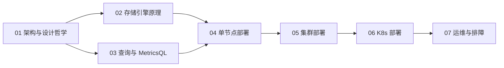

# VictoriaMetrics 深入教学

> 学习目标：系统理解 VictoriaMetrics 的架构设计与工作原理，能够独立完成单节点、集群在服务器（裸机/Docker）与 Kubernetes 上的部署，并具备容量规划、性能调优与故障排查能力。
>
> 适用读者：有 Prometheus / Grafana 使用经验，希望把监控存储升级为长期、大规模、低成本方案的 DevOps / SRE 工程师。

## 文档目录

| 章节 | 主题 | 内容概要 |
|---|---|---|
| [01](01-总体架构与设计哲学.md) | 总体架构与设计哲学 | 产品家族全景、单节点 vs 集群架构、数据分片与多租户、与 Thanos / Mimir 选型对比 |
| [02](02-写入路径与存储引擎原理.md) | 写入路径与存储引擎原理 | TSID 与倒排索引、LSM-like merge、无 WAL 设计、压缩原理、去重/降采样、retention 与快照 |
| [03](03-查询路径与MetricsQL.md) | 查询路径与 MetricsQL | 集群查询执行链路、缓存体系、MetricsQL 与 PromQL 差异及迁移陷阱、查询保护与调优 |
| [04](04-单节点服务器部署.md) | 单节点服务器部署 | 二进制/systemd/Docker Compose 部署、启动参数、数据接入、备份恢复、升级 |
| [05](05-集群服务器部署.md) | 集群服务器部署 | 集群拓扑规划、vminsert/vmselect/vmstorage 参数实战、副本与多租户、扩缩容、故障场景 |
| [06](06-K8s部署实战.md) | K8s 部署实战 | victoria-metrics-operator、VMSingle/VMCluster/VMAgent/VMAlert CRD、存储层设计、备份 CronJob |
| [07](07-运维调优与故障排查.md) | 运维调优与故障排查 | 健康巡检、容量规划、高基数治理、vmctl 迁移、调优参数手册、故障案例集 |

## 学习路径建议

- **先学原理再动手**：01～03 章建立心智模型（数据怎么存、怎么查、组件怎么分工），04～06 章的部署参数才有依据。
- **按部署形态取用**：只部署单机可直接看 01 → 04 → 07；上集群看 01 → 02 → 05 → 07；K8s 环境看 01 → 06 → 07。
- **贯穿全程的两条主线**：`active time series`（决定内存）与写入速率 × retention（决定磁盘），是容量规划、调优和排障的共同基础。

## 版本与约定

- 文档示例统一使用 VictoriaMetrics `v1.110.0` 系列版本；实际部署请以 [官方 Releases](https://github.com/VictoriaMetrics/VictoriaMetrics/releases) 为准。
- 单节点与集群组件（vminsert/vmselect/vmstorage）使用同一版本号发布，升级时保持一致。
- 端口约定：单节点 HTTP `8428`；集群 vminsert `8480`、vmselect `8481`、vmstorage `8482`（native：`8400` 写入 / `8401` 查询）；vmauth `8427`。
- 涉及企业版（Enterprise）的功能会在文中明确标注。

## 官方资源

- 文档：https://docs.victoriametrics.com
- 源码与 Issue：https://github.com/VictoriaMetrics/VictoriaMetrics
- Helm Charts：https://github.com/VictoriaMetrics/helm-charts
- MetricsQL 语法：https://docs.victoriametrics.com/metricsql/
