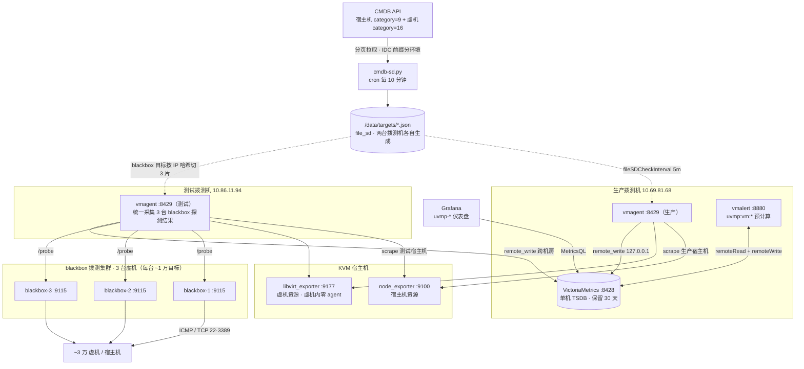

# 大规模虚拟化监控（VictoriaMetrics 方案）

面向 ~3 万台 KVM 虚机 + 宿主机的统一监控：拨测（ICMP/TCP）、宿主机资源、虚机资源（宿主机侧
libvirt 采集，虚机内零 agent）、CMDB 业务标签注入、Grafana 可视化。

## 架构总览



> 图中「blackbox 拨测集群」已实施：bb1 与测试 vmagent 同机，bb2/bb3 为新增虚机，
> vmagent 按 hashmod 3 分片把目标分给三台探针（踩坑记录 #1）。

## 组件部署位置

| 机器 | 组件 | 端口 | 职责 |
|---|---|---|---|
| 生产拨测机 10.69.81.68 | victoria-metrics | 8428 | 单机 TSDB，全环境数据统一存储，保留 30 天 |
| | vmagent | 8429 | 抓取生产宿主机 exporter，remote_write 到本机 VM |
| | vmalert | 8880 | 规则引擎：预计算 `uvmp:vm:*` 录制序列，加速 Grafana 查询 |
| 测试拨测机 10.86.11.94 | vmagent | 8429 | 抓取测试宿主机 exporter + 拨测，remote_write 跨机房到生产 VM |
| | blackbox_exporter | 9115 | ICMP/TCP 探针（需 CAP_NET_RAW）；3 台集群 bb1=10.86.11.94（本机）/bb2=10.86.11.74/bb3=10.86.11.75，vmagent hashmod 分片 |
| 所有 KVM 宿主机 | node_exporter | 9100 | 宿主机自身 CPU/内存/磁盘/网卡 |
| | libvirt_exporter | 9177 | 从 libvirtd 采每台虚机(domain)的指标，虚机内零 agent |

## 数据流

### 1. 目标发现（CMDB → file_sd）

```
CMDB API ──(cron 每 10 分钟)──► cmdb-sd.py ──► /data/targets/*.json
```

- `cmdb-sd.py` 分页拉取宿主机（category=9，上线 + 一级业务 uvmp）与全部虚机（category=16）
- 按 IDC 前缀分类：`TEST*` → testing，其余非空 IDC → production
- 生成 6 个 file_sd 文件：`production-node.json`、`production-libvirt.json`、`testing-node.json`、
  `testing-libvirt.json`、`blackbox-icmp.json`、`blackbox-tcp.json`，每条目标携带
  idc/biz1/biz2/owner/status/os/host_ip 业务标签
- API Key 通过 `/etc/vmagent/cmdb-sd.env`（0600, root）注入，不落明文
- 原子写入（tmpfile + `os.replace`），vmagent 每 5 分钟检测文件变更（`fileSDCheckInterval=5m`）

### 2. 拨测（仅测试拨测机）

```
vmagent ──/probe?module=icmp────────► blackbox bb1/bb2/bb3 ──ICMP──► 虚机/宿主机（hashmod 3 分片）
vmagent ──/probe?module=tcp_connect─► blackbox bb1/bb2/bb3 ──TCP───► 虚机 22(SSH)/3389(RDP)
```

- vmagent relabel 把目标 IP 塞进 `__param_target`，按 hashmod 3 分片把抓取地址改写为对应 blackbox（bb1/bb2/bb3）的 :9115
- 拨测覆盖全环境目标（file_sd 里 production+testing 混装，不做 keep 过滤，Grafana 按 `environment` 标签区分）
- Linux 虚机探 22(SSH)，Windows 虚机探 3389(RDP)，由 `os` 标签决定
- 拨测指标 `probe_success` 经 `uvmp:vm_info` 录制规则注入 CMDB 业务标签
- blackbox 已扩为 3 台集群分摊目标（hashmod 各扛 1/3，避开踩坑 #1），测试 vmagent 统一采集上报；分片在 vmagent relabel 侧做，cmdb-sd.py / file_sd 不动

### 3. 资源采集

```
生产 vmagent ──► 生产宿主机 :9100 / :9177 ──► remote_write ──► 127.0.0.1:8428
测试 vmagent ──► 测试宿主机 :9100 / :9177 ──► remote_write ──► 10.69.81.68:8428（跨机房）
```

- node_exporter → 宿主机指标；libvirt_exporter → 每虚机 CPU/内存/磁盘/网卡指标
- `host_ip` 标签是虚机指标与宿主机指标的关联键（虚机↔宿主机聚合）
- 虚机指标按虚机 IP 打 `vm_ip` 标签（domain 名 IP 转横杠 → metric_relabel 还原）

### 4. 存储与预计算

```
vmagent ──► VictoriaMetrics :8428 ◄── vmalert (读+写, :8880)
                                     └─ recording rules 每 1m 预 join 业务标签
```

- `rules/vm-noise-neighbor.yml` 的 `uvmp-vm-enrich` 组把 blackbox 的 CMDB 标签
  join 到 libvirt 指标上，生成 `uvmp:vm:cpu_percent`、`uvmp:vm:memory_used_percent`、
  `uvmp:vm:disk_*`、`uvmp:vm:net_*`、`uvmp:vm:vcpus` 等录制序列，Grafana 面板
  直接查询，免去每次运行时扫全量 blackbox 序列 join 的开销
- 2026-09 指标扩充（同组追加 14 条录制规则，指标名均已库中验证）：
  `disk_*_iops` / `disk_*_await_ms`（小随机 IO 型噪声邻居）、`vcpu_wait`
  （受害者视角的 CPU 剥夺）、`memory_rss/max`（气球回收后真实内存）、
  `swap_in/out`（虚机换页）、`net_*_drops/errs`（网络质量）、
  `disk_capacity_bytes`（thin provisioning 容量承诺）——对应虚机看板新增
  IOPS/延迟、vCPU 与内存详情、网络质量三个分区，宿主机看板新增磁盘 I/O 质量、
  内存压力、网络质量、系统健康四个分区（util/await/IOPS、超卖/OOM、丢包重传、
  inode/fd/ECC/时钟偏移/采集器异常）
- 存储目录 `/data/vm`，保留 30 天；vmagent 暂存队列 `/data/vmagent-queue`

### 5. 可视化

Grafana 数据源指向 `VictoriaMetrics :8428`，五个仪表盘：

- `uvmp-host-ping.json` — 宿主机 ICMP/TCP 拨测
- `uvmp-vm-ping.json` — 虚机 ICMP/TCP 拨测
- `uvmp-host-resource.json` — 宿主机资源
- `uvmp-vm-resource.json` — 虚机资源（查 `uvmp:vm:*` 录制序列）
- `uvmp-victoriametrics-selfmon.json` — 组件自监控（查 `self-monitoring` job 自身指标：vmagent
  抓取/远程写入、VM 存储引擎/缓存、vmalert 规则求值、blackbox 探针分片健康；按 `scrape_source`
  变量切环境，活跃抓取 worker 面板直接盯踩坑 #5 的 EMFILE 风险）

## 文件索引

| 文件 | 说明 |
|---|---|
| `prometheus.yml` | vmagent/Prometheus 通用抓取配置（早期单机版，已被环境拆分方案取代） |
| `prometheus-production.yml` | 生产拨测机 vmagent 抓取配置（node/libvirt/自监控） |
| `prometheus-testing.yml` | 测试拨测机 vmagent 抓取配置（blackbox 拨测 + node/libvirt/自监控） |
| `blackbox.yml` | blackbox_exporter 探针模块配置（icmp / tcp_connect） |
| `cmdb-sd.py` | CMDB → file_sd 生成脚本（cron 每 10 分钟） |
| `rules/vm-noise-neighbor.yml` | vmalert recording rules（资源预计算 + 业务标签 join） |
| `ansible/hosts.ini` | 全量清单（VM 存储/vmagent/vmalert/blackbox/宿主机角色组） |
| `ansible/blackbox.ini` | 拨测专用清单（只含 blackbox_probe + vmagent_testing） |
| `ansible/deploy-vm.yml` | 部署 VM 三件套 + cmdb-sd cron 链路 |
| `ansible/deploy-host-exporters.yml` | 部署宿主机 node_exporter + libvirt_exporter |
| `ansible/deploy-blackbox.yml` | 部署拨测机 blackbox_exporter |
| `grafana/uvmp-*.json` | 五个 Grafana 仪表盘（含 `uvmp-victoriametrics-selfmon.json` 组件自监控） |

## 部署顺序

```bash
cd ansible
export CMDB_API_KEY='...'   # 控制端注入，cmdb-sd.py 运行时读取

# 1. 宿主机 exporters（虚机内零 agent，一切从宿主机侧采）
ansible-playbook -i hosts.ini deploy-host-exporters.yml

# 2. 生产拨测机: VM 存储 + vmagent + vmalert + cmdb-sd cron
ansible-playbook -i hosts.ini deploy-vm.yml --limit vm_storage:vmagent_production:vmalert

# 3. 测试拨测机: vmagent + blackbox + cmdb-sd cron
ansible-playbook -i hosts.ini deploy-vm.yml --limit vmagent_testing
ansible-playbook -i blackbox.ini deploy-blackbox.yml

# 4. Grafana 导入 grafana/uvmp-*.json，数据源指向 http://10.69.81.68:8428
```

## 设计要点

- **虚机零 agent**：一切从宿主机侧采集（libvirt），3 万虚机无需逐台装 agent，装机/重装不丢监控
- **标签即资产**：CMDB 的 idc/biz/owner/status 在采集链路源头注入，虚机指标可按业务聚合
- **单存储双环境**：测试/生产 vmagent 都 remote_write 到同一台 VM（8428），`environment`/
  `scrape_source` 标签区分，Grafana 一套面板看全环境
- **录制规则减负**：blackbox(3 万序列) × libvirt 的 join 放到 vmalert 预计算，面板查询秒回
- **原子 file_sd**：cmdb-sd.py 原子写 + vmagent 5 分钟检测，CMDB 变更 15 分钟内自动生效

## 踩坑记录

### 1. blackbox 单机拨测端口不足

**现象**：单台 blackbox_exporter 拨测 ~3 万目标时报错端口不足，探测大量失败。

**原因**：ICMP/TCP 探测 3 万目标 × 30s 间隔，单机并发探测 + 连接回收把本地资源（临时端口等）耗尽，单台 blackbox 扛不住这个目标量级。

**已实施（2026-09）**：blackbox_exporter 扩到 3 台虚机（bb1=10.86.11.94 与 vmagent 同机、bb2/bb3 新增），
prometheus-testing.yml 拆 6 个拨测 job（icmp/tcp × bb1-3），relabel hashmod 3 按 IP 分片各拨 1/3，
每台 ~1 万目标：TCP 拨测 ~333 连接/s，TIME_WAIT 稳态 ≈ 333×60s ≈ 2 万端口，占默认
临时端口范围（28232 个）约七成——够用但不宽裕，建议探针机内核开启
`net.ipv4.tcp_tw_reuse=1` 留出余量；ICMP 走 raw socket 不占用临时端口。
分片 job 名为 blackbox-icmp/tcp-bb1/2/3，但 relabel 把入库 `job` 标签统一改回
`blackbox-icmp`/`blackbox-tcp`（分片归属看 `probe_source=bbN`），vmalert 规则与
Grafana 面板共 33 处 job 精确匹配选择器零改动、历史数据不断裂。
分片选了 relabel 侧方案：目标清单与探针拓扑解耦，cmdb-sd.py / file_sd 未动，后续扩容只改 yml。

### 2. libvirt_exporter NOWAIT flag bug 导致采集不到某些指标

**现象**：部分运行中虚机的 `libvirt_domain_block_stats_*` / `interface_stats_*` /
`memory_stats_*` / `vcpu_*` 指标采不到或时有时无，抓取偶发报错；同宿主机其他虚机正常。

**根因**（inovex/prometheus-libvirt-exporter v2.3.1，上游至今未修）：

`pkg/exporter/prometheus-libvirt-exporter.go` 的 `connectGetAllDomainStats()` 调
libvirt 的 `ConnectGetAllDomainStats(domains, statsType, flags)` 时，把第三个参数
flags 硬编码为 `ConnectGetAllDomainsStatsNowait`（值 536870912 = 1<<29）：

```go
// v2.3.1 原始代码（bug 版）
data.DomainStatsRecord, data.err = l.ConnectGetAllDomainStats(
    []libvirt.Domain{domain.libvirtDomain}, uint32(flag),
    uint32(libvirt.ConnectGetAllDomainsStatsNowait))
```

NOWAIT 的 libvirt 语义是：**不等待任何锁，凡当下拿不到统计的 domain 一律静默跳过、
不出现在返回数组里**。虚机正在迁移/快照/备份、monitor 忙时锁拿不到，libvirtd 就直接
把它从结果里丢掉——返回空数组。而 exporter 四处消费点里三处直接 `data[0]` 不判空
（仅 block 主路径有 `len(data)==0` 检查），空数组触发 index out of range。表现为
「某些虚机某些指标随机消失、虚机越忙越采不到」。

**修复**：fork 到 [pro12221/prometheus-libvirt-exporter](https://github.com/pro12221/prometheus-libvirt-exporter)
的 `fix/remove-nowait-flag` 分支（commit `0862365`，2026-09-11）：flags 传 0，
让 libvirtd 等锁、正常返回运行中虚机的 block/interface/memory/vcpu 统计：

```go
// 修复后：flags=0（等待锁），不再静默跳过
data.DomainStatsRecord, data.err = l.ConnectGetAllDomainStats(
    []libvirt.Domain{domain.libvirtDomain}, uint32(flag), 0)
```

去掉 NOWAIT 后调用可能阻塞等锁，但 exporter 每处调用本就包在
`go connectGetAllDomainStats(...) + select + time.After(timeout)` 里，
最坏退化成单虚机超时（`libvirt_domain_timed_out`），不会拖垮整次抓取。

**教训**：
- 部署后必须逐宿主机验证指标真的吐出来了：
  ```bash
  curl -s localhost:9177/metrics | grep -E 'libvirt_domain_(info_cpu_time|interface_stats|block_stats)'
  ```
- 面板与规则只依赖验证过的指标（`rules/vm-noise-neighbor.yml` 全部基于已验证指标）
- upstream release 不可迷信：采集器 bug 在虚机「忙」时才显形，验收要在有负载/有迁移的宿主机上做

### 3. 高基数指标直接查询极慢 → 录制规则预计算

**现象**：Grafana 面板运行时做 `and on(vm_ip) label_replace(probe_success{type="vm"}...)` 之类的 join，
每次查询都要扫全量 ~3 万条 blackbox 虚机序列，面板加载极慢。

**原因**：拨测 + libvirt 两类指标基数都高（3 万虚机 × 多网卡/多磁盘），运行时 join 计算量大，
且每个面板重复计算同样的 join。

**应对**：把 join 挪到 vmalert recording rules 预计算（`rules/vm-noise-neighbor.yml` 的
`uvmp-vm-enrich` 组），每 1m 生成带 CMDB 业务标签的 `uvmp:vm:*` 录制序列，
面板直接查预计算结果，查询从扫全量序列降到点查，秒级返回。

### 4. node-exporter job 漏写端口改写，全量宿主机实际抓的是 80 端口

**现象**：宿主机资源面板（CPU/内存/磁盘/网卡）自上线起一直无数据。目标数量正常——
`count(up{job="node-exporter"})` = 1908（生产 1837 + 测试 71），但
`sum(up{job="node-exporter"})` = 0，1908 个目标全部抓取失败。测试机 vmagent journal 刷屏：

```
cannot scrape target "10.x.x.x" (job="node-exporter"): dial tcp4 10.x.x.x:80: connect: connection refused
```

（个别宿主机 80 端口恰好跑着 nginx，返回 404，报错形态不同、结果一样。）

**原因**：cmdb-sd.py 生成的 file_sd 目标是**裸 IP**。node-exporter job 的 relabel 只把
`__address__` 复制成 `instance` 标签，没有补端口——vmagent 对不带端口的目标默认抓
**80 端口**。libvirt-vm job 一直有 `replacement: ${1}:9177` 改写所以正常，
node-exporter 恰好漏了 `:9100`。结果：30 天库里 `count(node_cpu_seconds_total)` = 0，
宿主机指标从未入过库。

**修复**（2026-09）：`prometheus-testing.yml` / `prometheus-production.yml` 的
node-exporter job 在 instance relabel 之后补上端口改写：

```yaml
- source_labels: [__address__]
  target_label: __address__
  regex: (.*)        # 缺省即 (.*)，${1} = 整个 IP
  replacement: ${1}:9100
```

**教训**：
- file_sd 给裸 IP 时**每个 job 都得自己补端口**：relabel 漏写不会让配置报错，vmagent
  照常启动、目标照常出现在 `/api/v1/targets`，只是永远连不上 80。
- 目标数量正常 ≠ 采集正常：验收要看 `sum(up{job=...})`，不是 target 个数；
  面板无数据先翻 journal 看实际拨的端口，别急着查网络。

### 5. vmagent LimitNOFILE=65536 低于目标数，抓取器周期性全崩

**现象**：Grafana 数据每 10 分钟周期性断流；vmagent journal 报 EMFILE
（`too many open files`），HTTP accept（tcplistener.go:114）与 file_sd 重载
（config.go:1133）同时出错，抓取器数量在 66134 ↔ 0 之间反复横跳。

**原因**：vmagent **每个活跃抓取器持有 1 个 fd**，file_sd 全量目标 6.6 万+（66,134）
超过 vmagent unit 的 `LimitNOFILE=65536`。cmdb-sd 每 10 分钟刷新 targets.json，
vmagent 检测到变更后重建抓取器池，批量开 fd 撞上限 → EMFILE → 抓取器全崩 →
下一轮重建再撞，如此循环。

**已实施**（2026-09）：服务器端先手工调大 fd 上限并重启 vmagent
（`vmagent_scrapers_active` 稳定在 66084，数据恢复）；`deploy-vm.yml` 的 vmagent unit
同步改为 262144：

```ini
# 全量目标 6.6 万+，每个活跃 scraper 持有 1 个 fd；65536 上限曾触发 EMFILE，
# 抓取器每 10 分钟周期性全崩（2026-09 踩坑），262144 留 4 倍余量
LimitNOFILE=262144
```

victoria-metrics / vmalert unit 保持 65536 不动（各自连接数远低于此）。

**教训**：
- vmagent 的 fd 需求 ≈ 活跃目标数，LimitNOFILE 按「目标数 × 4」留余量；
  目标从 3 万扩到 6.6 万时，unit 参数要跟着盘点，别等 EMFILE 才想起来。
- EMFILE 的症状是「数据断流 + HTTP API 间歇报错 + file_sd 跳过重载」的组合，
  不只影响抓取本身，排障时别只盯抓取链路。

### 6. blackbox_exporter icmp.go:178 ERROR 刷屏（内核禁用非特权 ping socket）

**现象**：三台探针机 blackbox_exporter journal 每秒数百条刷
`level=ERROR ... icmp.go:178 "Unable to do unprivileged listen on socket, will attempt privileged"
err="socket: permission denied"`，但拨测全部正常（`sum(up{job="blackbox-icmp"})` ≈ 3.3 万全 1）。

**原因**：blackbox_exporter 的 ICMP 探测先走**非特权 ping socket**（udp4，内核代发
Echo），该路径受 `net.ipv4.ping_group_range` 门控；内核默认 `"1 0"` = 所有 group
全禁，于是每条探测先吃一次 EPERM、再回退特权 raw socket。unit 已用
`AmbientCapabilities=CAP_NET_RAW` 授过权，raw 路径走得通、探测不失败——纯粹是
日志噪音，但真实故障会被淹没。

**修复**（2026-09）：`deploy-blackbox.yml` 新增 sysctl 任务（跟在 tcp_tw_reuse 之后）：

```yaml
- name: 放开非特权 ICMP ping socket（消除 icmp.go:178 报错刷屏）
  ansible.builtin.sysctl:
    name: net.ipv4.ping_group_range
    value: "0 2147483647"
    sysctl_set: true
    reload: true
```

放开后非特权路径直接成功，日志恢复干净。

**教训**：
- ERROR 级日志 ≠ 探测失败：`up=1` 时先分辨是「回退路径噪音」还是真故障，刷屏会埋掉真问题。
- 非特权 ping socket 按 gid 门控（ping_group_range），特权 raw socket 按 capability
  门控（CAP_NET_RAW），blackbox_exporter 两条都试——想日志干净就得让第一条也通。

### 7. 自监控组件 instance 显示 127.0.0.1，实例清单无法区分机器

**现象**：自监控看板「组件实例清单」7 个实例里 5 个显示 `127.0.0.1:端口`——两台 vmagent
都是 `127.0.0.1:8429` 分不清是哪台，只有 bb2/bb3 远端探针显示真实 IP。

**原因**：self-monitoring job 抓本机组件走 loopback，`instance` 标签默认 = `__address__`
= `127.0.0.1:port`。

**修复**（2026-09）：两份抓取配置的 self-monitoring job 增加 relabel，把 127.0.0.1 目标的
instance 改写为本机真实 IP:port（生产 → `10.69.81.68`，测试 → `10.86.11.94`）；regex 只匹配
`127.0.0.1`，bb2/bb3 保持真实 IP 不动。只改入库标签，抓取仍走 loopback。

**教训**：
- `instance` 默认等于 `__address__`，凡 loopback 抓本机组件的 job 都要显式 relabel 成
  可区分的真实 IP
- 改 `instance` = 切换时间序列：旧序列停止写入，instant 查询 5 分钟后看不到，历史随
  保留期自然过期；改前先确认没有查询按旧值过滤（本仓库已核对为 0 处）

### 8. 环境拆分丢了 metric_relabel_configs，虚机资源看板全空

**现象**：虚机资源看板（uvmp-vm-resource）全空。库里 `uvmp:vm:*` 录制序列 0 条，但
`uvmp:vm_info`（31088 条）与 `vm:*` 组（无 join）产出正常；vmalert 规则全部 healthy、0 错误。

**原因**：`prometheus.yml` 拆分为 production/testing 两份配置时，libvirt-vm job 的
`metric_relabel_configs` 没跟着迁移，`domain`(10-89-132-21) → `vm_ip`(10.89.132.21) 的
标签转换丢失。入库 libvirt 序列全部没有 `vm_ip` 标签，`uvmp-vm-enrich` 组 8 条规则里
6 条 `on(vm_ip)` join 落空、产出 0 样本——**录制规则产出为空不报错**，规则状态照样
healthy，只能靠 count 各环节序列数发现断点。

**修复**（2026-09）：把三条 metric_relabel 规则迁回两份环境配置的 libvirt-vm job
（vm_ip 转换 / 高基数标签 labeldrop / info 空序列 drop）。排障中另发现
`/etc/vmalert/rules/` 残留旧文件 `uvmp_rules.yml`，与 `vm-noise-neighbor.yml` 同名
规则组各加载一份、重复求值（copy 目录不会删目标端多余文件），deploy-vm.yml 已加
清理任务。2026-09-23 复盘再补一刀：「启动 vmalert」任务 `state: started` 对运行中
服务是 no-op——磁盘上的残留文件即使删了，进程不重启就继续按启动时的清单加载，
曾出现进程自 09-20 起重复求值磁盘上已不存在的文件；该任务已改 `state: restarted`。

**教训**：
- 配置拆分/重构要逐 job 对比新旧两段 relabel（`relabel_configs` +
  `metric_relabel_configs` 都要过）；功能段丢失不会让服务报错，只在下游 join 断链
- 排障顺序：沿数据链 count 每一环的产物（原始序列 → 录制序列 → 看板查询），空在哪环
  断在哪环；「规则 healthy」≠「规则有产出」，要看
  `vmalert_recording_rules_last_evaluation_samples`

### 待排查：生产宿主机未部署 exporters（1837 台 node/libvirt 全 connection refused）

生产 vmagent（10.69.81.68）抓 node-exporter 与 libvirt-vm 均 1837/1837 失败，测试
71/71 正常。2026-09-23 复查定性：

- 配置已正确：vmagent 实际抓的就是 `:9100`/`:9177`（targets API 核实），本机
  self-monitoring 3/3 up
- 错误形态 1833/1837 为 `connection refused`——宿主机可达（收到 RST），只是 9100/9177
  无进程监听 → **生产宿主机没部署 node_exporter / libvirt_exporter**
- blackbox ICMP：生产宿主机 1833/1837 存活，主机与网络本身无问题
- 待办：从能 SSH 到生产宿主机的控制端跑 `ansible-playbook -i hosts.ini
  deploy-host-exporters.yml`（当前控制环境到生产宿主机 22 端口不通，无法直接部署）
