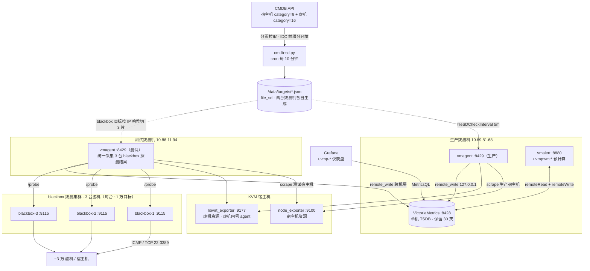

# 大规模虚拟化监控（VictoriaMetrics 方案）

面向 ~3 万台 KVM 虚机 + 宿主机的统一监控：拨测（ICMP/TCP）、宿主机资源、虚机资源（宿主机侧
libvirt 采集，虚机内零 agent）、CMDB 业务标签注入、Grafana 可视化。

## 架构总览



> 图中「blackbox 拨测集群」为优化目标形态：当前单台 blackbox 部署在测试拨测机本机
> （127.0.0.1:9115），扩容方案见踩坑记录 #1；其余部分为当前已部署形态。

## 组件部署位置

| 机器 | 组件 | 端口 | 职责 |
|---|---|---|---|
| 生产拨测机 10.69.81.68 | victoria-metrics | 8428 | 单机 TSDB，全环境数据统一存储，保留 30 天 |
| | vmagent | 8429 | 抓取生产宿主机 exporter，remote_write 到本机 VM |
| | vmalert | 8880 | 规则引擎：预计算 `uvmp:vm:*` 录制序列，加速 Grafana 查询 |
| 测试拨测机 10.86.11.94 | vmagent | 8429 | 抓取测试宿主机 exporter + 拨测，remote_write 跨机房到生产 VM |
| | blackbox_exporter | 9115 | ICMP/TCP 探针（需 CAP_NET_RAW）；当前单机，优化目标为 3 台虚机集群（踩坑 #1） |
| 所有 KVM 宿主机 | node_exporter | 9100 | 宿主机自身 CPU/内存/磁盘/网卡 |
| | libvirt_exporter | 9177 | 从 libvirtd 采每台虚机(domain)的指标，虚机内零 agent |

## 数据流

### 1. 目标发现（CMDB → file_sd）

```
CMDB API ──(cron 每 10 分钟)──► cmdb-sd.py ──► /data/targets/*.json
```

- `cmdb-sd.py` 分页拉取宿主机（category=9，上线 + 一级业务 uvmp）与全部虚机（category=16）
- 按 IDC 前缀分类：`TEST*` → testing，其余非空 IDC → production
- 生成 6 个 file_sd 文件：`production-node.json`、`production-libvirt.json`、`testing-node.json`、
  `testing-libvirt.json`、`blackbox-icmp.json`、`blackbox-tcp.json`，每条目标携带
  idc/biz1/biz2/owner/status/os/host_ip 业务标签
- API Key 通过 `/etc/vmagent/cmdb-sd.env`（0600, root）注入，不落明文
- 原子写入（tmpfile + `os.replace`），vmagent 每 5 分钟检测文件变更（`fileSDCheckInterval=5m`）

### 2. 拨测（仅测试拨测机）

```
vmagent ──/probe?module=icmp────────► blackbox_exporter ──ICMP──► 虚机/宿主机
vmagent ──/probe?module=tcp_connect─► blackbox_exporter ──TCP───► 虚机 22(SSH)/3389(RDP)
```

- vmagent relabel 把目标 IP 塞进 `__param_target`，抓取地址改写为 `127.0.0.1:9115`
- `environment=testing` keep 规则保证只拨测测试环境目标（防 file_sd 混入其他环境误拨）
- Linux 虚机探 22(SSH)，Windows 虚机探 3389(RDP)，由 `os` 标签决定
- 拨测指标 `probe_success` 经 `uvmp:vm_info` 录制规则注入 CMDB 业务标签
- 优化目标：blackbox 扩为 3 台虚机集群分摊目标，测试 vmagent 统一采集上报（踩坑记录 #1）

### 3. 资源采集

```
生产 vmagent ──► 生产宿主机 :9100 / :9177 ──► remote_write ──► 127.0.0.1:8428
测试 vmagent ──► 测试宿主机 :9100 / :9177 ──► remote_write ──► 10.69.81.68:8428（跨机房）
```

- node_exporter → 宿主机指标；libvirt_exporter → 每虚机 CPU/内存/磁盘/网卡指标
- `host_ip` 标签是虚机指标与宿主机指标的关联键（虚机↔宿主机聚合）
- 虚机指标按虚机 IP 打 `vm_ip` 标签（domain 名 IP 转横杠 → metric_relabel 还原）

### 4. 存储与预计算

```
vmagent ──► VictoriaMetrics :8428 ◄── vmalert (读+写, :8880)
                                     └─ recording rules 每 1m 预 join 业务标签
```

- `rules/vm-noise-neighbor.yml` 的 `uvmp-vm-enrich` 组把 blackbox 的 CMDB 标签
  join 到 libvirt 指标上，生成 `uvmp:vm:cpu_percent`、`uvmp:vm:memory_used_percent`、
  `uvmp:vm:disk_*`、`uvmp:vm:net_*`、`uvmp:vm:vcpus` 等录制序列，Grafana 面板
  直接查询，免去每次运行时扫全量 blackbox 序列 join 的开销
- 存储目录 `/data/vm`，保留 30 天；vmagent 暂存队列 `/data/vmagent-queue`

### 5. 可视化

Grafana 数据源指向 `VictoriaMetrics :8428`，四个仪表盘：

- `uvmp-host-ping.json` — 宿主机 ICMP/TCP 拨测
- `uvmp-vm-ping.json` — 虚机 ICMP/TCP 拨测
- `uvmp-host-resource.json` — 宿主机资源
- `uvmp-vm-resource.json` — 虚机资源（查 `uvmp:vm:*` 录制序列）

## 文件索引

| 文件 | 说明 |
|---|---|
| `prometheus.yml` | vmagent/Prometheus 通用抓取配置（早期单机版，已被环境拆分方案取代） |
| `prometheus-production.yml` | 生产拨测机 vmagent 抓取配置（node/libvirt/自监控） |
| `prometheus-testing.yml` | 测试拨测机 vmagent 抓取配置（blackbox 拨测 + node/libvirt/自监控） |
| `blackbox.yml` | blackbox_exporter 探针模块配置（icmp / tcp_connect） |
| `cmdb-sd.py` | CMDB → file_sd 生成脚本（cron 每 10 分钟） |
| `rules/vm-noise-neighbor.yml` | vmalert recording rules（资源预计算 + 业务标签 join） |
| `ansible/hosts.ini` | 全量清单（VM 存储/vmagent/vmalert/blackbox/宿主机角色组） |
| `ansible/blackbox.ini` | 拨测专用清单（只含 blackbox_probe + vmagent_testing） |
| `ansible/deploy-vm.yml` | 部署 VM 三件套 + cmdb-sd cron 链路 |
| `ansible/deploy-host-exporters.yml` | 部署宿主机 node_exporter + libvirt_exporter |
| `ansible/deploy-blackbox.yml` | 部署拨测机 blackbox_exporter |
| `grafana/uvmp-*.json` | 四个 Grafana 仪表盘 |

## 部署顺序

```bash
cd ansible
export CMDB_API_KEY='...'   # 控制端注入，cmdb-sd.py 运行时读取

# 1. 宿主机 exporters（虚机内零 agent，一切从宿主机侧采）
ansible-playbook -i hosts.ini deploy-host-exporters.yml

# 2. 生产拨测机: VM 存储 + vmagent + vmalert + cmdb-sd cron
ansible-playbook -i hosts.ini deploy-vm.yml --limit vm_storage:vmagent_production:vmalert

# 3. 测试拨测机: vmagent + blackbox + cmdb-sd cron
ansible-playbook -i hosts.ini deploy-vm.yml --limit vmagent_testing
ansible-playbook -i blackbox.ini deploy-blackbox.yml

# 4. Grafana 导入 grafana/uvmp-*.json，数据源指向 http://10.69.81.68:8428
```

## 设计要点

- **虚机零 agent**：一切从宿主机侧采集（libvirt），3 万虚机无需逐台装 agent，装机/重装不丢监控
- **标签即资产**：CMDB 的 idc/biz/owner/status 在采集链路源头注入，虚机指标可按业务聚合
- **单存储双环境**：测试/生产 vmagent 都 remote_write 到同一台 VM（8428），`environment`/
  `scrape_source` 标签区分，Grafana 一套面板看全环境
- **录制规则减负**：blackbox(3 万序列) × libvirt 的 join 放到 vmalert 预计算，面板查询秒回
- **原子 file_sd**：cmdb-sd.py 原子写 + vmagent 5 分钟检测，CMDB 变更 15 分钟内自动生效

## 踩坑记录

### 1. blackbox 单机拨测端口不足

**现象**：单台 blackbox_exporter 拨测 ~3 万目标时报错端口不足，探测大量失败。

**原因**：ICMP/TCP 探测 3 万目标 × 30s 间隔，单机并发探测 + 连接回收把本地资源（临时端口等）耗尽，单台 blackbox 扛不住这个目标量级。

**后续优化**：blackbox_exporter 横向扩到 3 份、分摊到 3 台虚机（每台 ~1 万目标），
测试环境 vmagent 统一采集三台 blackbox 的探测结果，集中 remote_write 上报到 VM。
目标拆分可在 cmdb-sd.py 侧按 IP 哈希切三份 file_sd，或 vmagent relabel 分组指向不同 blackbox 实例。

### 2. libvirt_exporter NOWAIT flag bug 导致采集不到某些指标

**现象**：部分运行中虚机的 `libvirt_domain_block_stats_*` / `interface_stats_*` /
`memory_stats_*` / `vcpu_*` 指标采不到或时有时无，抓取偶发报错；同宿主机其他虚机正常。

**根因**（inovex/prometheus-libvirt-exporter v2.3.1，上游至今未修）：

`pkg/exporter/prometheus-libvirt-exporter.go` 的 `connectGetAllDomainStats()` 调
libvirt 的 `ConnectGetAllDomainStats(domains, statsType, flags)` 时，把第三个参数
flags 硬编码为 `ConnectGetAllDomainsStatsNowait`（值 536870912 = 1<<29）：

```go
// v2.3.1 原始代码（bug 版）
data.DomainStatsRecord, data.err = l.ConnectGetAllDomainStats(
    []libvirt.Domain{domain.libvirtDomain}, uint32(flag),
    uint32(libvirt.ConnectGetAllDomainsStatsNowait))
```

NOWAIT 的 libvirt 语义是：**不等待任何锁，凡当下拿不到统计的 domain 一律静默跳过、
不出现在返回数组里**。虚机正在迁移/快照/备份、monitor 忙时锁拿不到，libvirtd 就直接
把它从结果里丢掉——返回空数组。而 exporter 四处消费点里三处直接 `data[0]` 不判空
（仅 block 主路径有 `len(data)==0` 检查），空数组触发 index out of range。表现为
「某些虚机某些指标随机消失、虚机越忙越采不到」。

**修复**：fork 到 [pro12221/prometheus-libvirt-exporter](https://github.com/pro12221/prometheus-libvirt-exporter)
的 `fix/remove-nowait-flag` 分支（commit `0862365`，2026-09-11）：flags 传 0，
让 libvirtd 等锁、正常返回运行中虚机的 block/interface/memory/vcpu 统计：

```go
// 修复后：flags=0（等待锁），不再静默跳过
data.DomainStatsRecord, data.err = l.ConnectGetAllDomainStats(
    []libvirt.Domain{domain.libvirtDomain}, uint32(flag), 0)
```

去掉 NOWAIT 后调用可能阻塞等锁，但 exporter 每处调用本就包在
`go connectGetAllDomainStats(...) + select + time.After(timeout)` 里，
最坏退化成单虚机超时（`libvirt_domain_timed_out`），不会拖垮整次抓取。

**教训**：
- 部署后必须逐宿主机验证指标真的吐出来了：
  ```bash
  curl -s localhost:9177/metrics | grep -E 'libvirt_domain_(info_cpu_time|interface_stats|block_stats)'
  ```
- 面板与规则只依赖验证过的指标（`rules/vm-noise-neighbor.yml` 全部基于已验证指标）
- upstream release 不可迷信：采集器 bug 在虚机「忙」时才显形，验收要在有负载/有迁移的宿主机上做

### 3. 高基数指标直接查询极慢 → 录制规则预计算

**现象**：Grafana 面板运行时做 `and on(vm_ip) label_replace(probe_success{type="vm"}...)` 之类的 join，
每次查询都要扫全量 ~3 万条 blackbox 虚机序列，面板加载极慢。

**原因**：拨测 + libvirt 两类指标基数都高（3 万虚机 × 多网卡/多磁盘），运行时 join 计算量大，
且每个面板重复计算同样的 join。

**应对**：把 join 挪到 vmalert recording rules 预计算（`rules/vm-noise-neighbor.yml` 的
`uvmp-vm-enrich` 组），每 1m 生成带 CMDB 业务标签的 `uvmp:vm:*` 录制序列，
面板直接查预计算结果，查询从扫全量序列降到点查，秒级返回。
